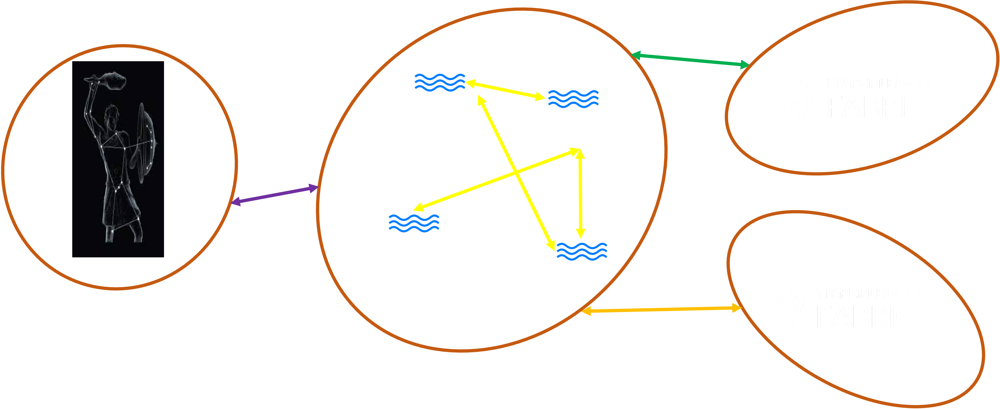

# Deployment

The Fabric Token SDK and the Fabric Smart Client form an Application Layer stack to build token-based distributed applications.

The stack can run as: 
- A standalone network node
- Embedded in an already existing Application



Either way, the token-sdk and smart client stacks must be initialized. 
Here are the steps you need to keep in mind:
1. Create a smart client node; 
2. Install the application SDKs you need;
3. Start the node;

```go
/*
Copyright IBM Corp. All Rights Reserved.

SPDX-License-Identifier: Apache-2.0
*/

package main

import (
	fscnode "github.com/hyperledger-labs/fabric-smart-client/node"
	fsdk "github.com/hyperledger-labs/fabric-smart-client/platform/fabric/sdk"
	tsdk "github.com/hyperledger-labs/fabric-token-sdk/token/sdk" 
	
	// The Token SDK must be further customized with `blank imports`. 
	// Here are the required imports:
	// - Token Drivers: Import all the token drivers your application must support
	_ "github.com/hyperledger-labs/fabric-token-sdk/token/core/zkatdlog/nogh/driver"
	// - DB Drivers: Import all the db drivers your application must support
	_ "github.com/hyperledger-labs/fabric-token-sdk/token/services/db/sql/driver/unity"
	// - Network Drivers: Import all the network drivers your application must support
	_ "github.com/hyperledger-labs/fabric-token-sdk/token/services/network/fabric"
	// The DB driver `unity` uses an SQL database, therefore we need to import the one we want to use.
	// In this case, it is sqlite
	_ "modernc.org/sqlite"
)

func main() {
	// 1. Create a smart client node;
	n := fscnode.New()
	// 2. Install the application SDKs you need;
	// In this case, we install the Fabric SDK (from the smart client), and the Token SDK (from the token sdk)
	n.InstallSDK(fsdk.NewSDK(n))
	n.InstallSDK(tsdk.NewSDK(n))
	// 3. Start the node;
	// If the boostrap is successful then this callback function is invoked. 
	n.Execute(func() error {
		// At this point, it is possible to access any service, provided by the installed SDKs, 
		// for further initializations.
		return nil
	})
}
```

## HSM Support

In order to use a hardware HSM for x.509 identities, you have to build the application with
`CGO_ENABLED=1 go build -tags pkcs11` and configure the PKCS11 settings in the configuration
file (see [core-token.md](../core-token.md)).
