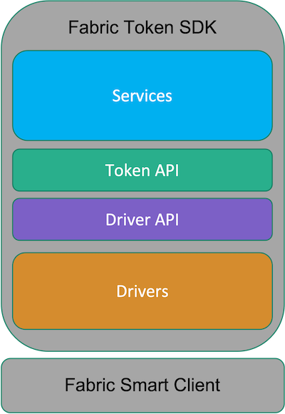
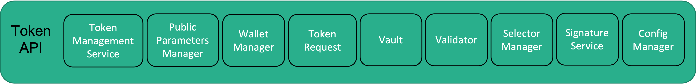

# The Fabric Token SDK

The scope of the Fabric Token SDK is to deliver a set of API and services that let developers create token-based distributed application on Hyperledger Fabric.
The `Fabric Token SDK` has the following characteristics;
- It adopts the UTXO model. In the UTXO model, a direct acyclic graph reflects the movements of the assets. Nodes are token transactions. Edges are transaction outputs. Each new token transaction consumes some the UTXOs and create new ones.
- Wallets contain a set of `secret keys` and keep track of the list of unspent outputs `owned` those keys.
- It supports different privacy levels: from a plain instantiation, where everything is in the clear on the ledger, to Zero Knowledge-based instantiations that will obfuscate the ledger while enforcing the required invariants.
- It can be easily extended to support different token exchange implementations (e.g., with different privacy levels, or cryptographic algorithms) by adopting a highly modular architecture.
- It allows the developers to write their own services on top of the Token SDK to deliver customised services for their token-based applications.

For the driver implementation supporting privacy via Zero Knowledge, we will follow 
a simplified version of the blueprint described in the paper 
[Privacy-preserving auditable token payments in a permissioned blockchain system]('https://eprint.iacr.org/2019/1058.pdf') 
by Androulaki et al.

## The Token SDK Stack

This is the Fabric Token SDK stack: 

It consists of the following layers:
- `Services` (light-blue boxes): Services offer pre-packaged token-related functionalities,
like `Token Transaction` assembling, Token Selectors, and so on.
They are built of top of the `Token API` abstraction. Therefore, they are independent of the underlying token technology.
- `Token API`: This API offers a useful abstraction to deal with tokens in an implementation-independent way. 
- `Driver API`: This API takes the burden of translating calls of the Token API into API calls that are implementation-specific.
- `Driver Implementations`: This is the lowest level of the Token SDK. A driver implementation is responsible for 
  defining the representation of tokens on the ledger, what it means to perform certain token actions,
  and when a token transaction is valid, among other things.
  
The Fabric Token SDK is built on top of the Fabric Smart Client stack. 
The Smart Client allows the Token SDK to: 
- Orchestrate very complex token-related business processes;
- Store the tokens inside the Vault to easy lookup and manipulation;
- To listen to events from Fabric related to token transaction, and so on.

In the next Sections, we will explore in more details each layer of the Token SDK stack.
Let us first start with the `Token API` and the `Driver API`. These are layers that are blockchain agnostic.

The `Services` will be treated at the end. It is at `service layer` that we will describe the integration with Fabric.
In particular, we will focus our attention on the lifecycle of a `Fabric Token Transaction`.

## Token API

The `Token API` offers a useful abstraction to deal with tokens in an implementation and blockchain independent way.

Let us start with defining the tokens that the Token SDK handles.
A token consists of the following triplet:
- `Owner`: The owner of the token; Each driver implementation can interpreter this field as needed. It can be a public-key, a script, 
  anything the underlying specific driver supports.
- `Type`: The *denomination* of the token; 
  This is a string whose value can be application specific. Examples are: 
  The denomination of a digital currency or unique identifiers.
- `Quantity`: The amount stored by this token. It is a positive number
  encoded as a string containing a number in base 16. The string starts with the prefix `0x`.

These tokens are `fungible` with the respect to the same type. In particular,
tokens with the same denomination can be merged and split, if not otherwise forbidden.

Let us now focus on the building blocks the Token API consists of:

- `Token Management Service`: The Token Management Service (TMS, for short) is the entry point of the Token SDK
  and gives access to the other building blocks.
- `Public Parameters Manager`: Each TMS is associated to some public parameters that contain all information needed
  to operate the token infrastructure.
  Even though, parts of the public parameters are driver-specific, we can identify the following common information:
  - `MaxTokenValue`: It is the maximum quantity that a token can contain
  - `TokenDataHiding`: When true it means that the content of the tokens is hidden
  - `GraphHiding`:  When true it means that the tokens are untraceable 

  The Public Parameters Manager offers API to manage the public parameters. Here are some examples:
  - Access the public parameters;
  - Manipulate the public parameters (Set an Auditor, Add an Issuer, and so on...);
 
- `Wallet Manager`: A Wallet consists of a long-term identity and all its derivation (if any).
  Examples of long-term identities are:
  - An `X509 Certificate` for an ECDSA signing public-key
  - An `Idemix Credential`. In this case, the wallet will contain also all pseudonyms derived from the credential.

  All operations that require a signature refer to wallets to identify the signing and verification keys.
  There are wallets for `Token Issuers`, `Owners`, and `Auditors`.
  Depending on the nature of the wallet additional information can be extracted like:
  - An Issuer Wallet gives access to the list of issued tokens
  - A Token Owner Wallet gives access to the list of owned tokens 
  
  The Wallet Manager offers API to manage wallets.
- `Token Request`: The Token Request is a container of token actions (issue, transfer, and redeem) that must be 
  performed atomically.
  The Token Request offers API to add actions or inspect actions already present in the container.
  More information in the Section [Token Request](#token-request).
  
- `Validator`: The validator is the component that sets the validation rules for a Token Request. The rules depend on the
type of tokens supported (fungible, non-fungible, and so on), and on the specific driver implementation.
  A Validator validates Token Requests with the respect to:
  - A given Anchor (e.g., Fabric TxID), and
  - The Ledger. Notice that, in certain implementations, the ledger might not be needed.

  Even though, certain validation rules are driver specific, we can identify the following general validation rules.
  A token request should:
  - Well-formed, and 
  - Satisfies the constraints of the payment system. Namely:
    - Only the rightful owner can transfer a token,
    - No token can be created out of the blue,
    - Audited(able)
    - Etc. (Each implementation can enforce additional requirements, if needed)

The tuple `(network, channel, namespace, public parameters)` uniquely identifies a TMS, where:
- `network` is the identifier of the Fabric network of reference;
- `channel` is the channel inside the Fabric network;
- `namespace` is the namespace inside the channel where the tokens are stored.
- `public parameters` contain all information needed to operate the specific token infrastructure.

### Token Request

Let us spend a few more words on the Token Request that is the core of the Token API.
The Token Request is a `container` of token actions (issue, transfer, and redeem) that must be performed atomically.
Looking ahead, parties interacting to assemble a token transaction are, under the hood, assembling a Token Request that it is
later marshalled into the format required by the target Blockchain.

This is the anatomy of a Token Request:

It consists of three parts:
- `Anchor`: It is used to bind the Actions to a given Transaction. In Fabric, the anchor is the Transaction ID.
- `Actions`: It is a collection of `Token Action`:
  - `Issues`, to create new Tokens;
  - `Transfers`, to manipulate Tokens (e.g., transfer ownership or redeem)
  
  The actions in the collection are independent.
  In addition, actions comes with a set of `Witnesses` that attest the will of the `Issuers` and/or the `Token Owners` 
  to perform a certain operation.

- `Metadata`: It is a collection of `Token Metadata`, one entry for each Token Action.
  Parties, assembling a token request, exchange metadata that contain secret information used by 
  the parties to check the content of the token actions. This is particularly relevant when using ZK-based drivers.
  Notice that, no metadata is stored on the ledger.

As we mentioned earlier, a Token Request is itself agnostic to the details of the specific Blockchain. 
Indeed, a Token Request must be translated to the Transaction format of the target Blockchain to become meaningful.
A service called `Token Request Translator` translates the token requests. 
The Token Request Translator does not belong to the Token API. It is offered as a service on top of the Token API.

## Driver API

The Driver API defines the contracts any implementation should respect to be compatible with the Token API.
It has a finer granularity than the Token API to accommodate better the difference between the various token technologies.

## Services

In this Section, we will see how to leverage the Token API to build a token infrastructure on top of Fabric.
This is the most flexible part of the Token SDK stack because new services can be built as needed by the applications.

To build our Fabric token infrastructure, we will need the following building blocks (or services):
- `Token Chaincode`
- `Token Chaincode-Based Transaction`
- `Token Selector`
- `Token Vault`
- `Auditing`
