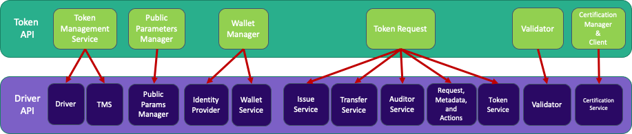

# Driver API

The Driver API defines the contracts any implementation should respect to be compatible with the Token API.
It has a finer granularity than the Token API to accommodate better the differences between 
the various token technologies.

Here is a pictorial representation of the dependencies among the various building blocks.

To be continued..