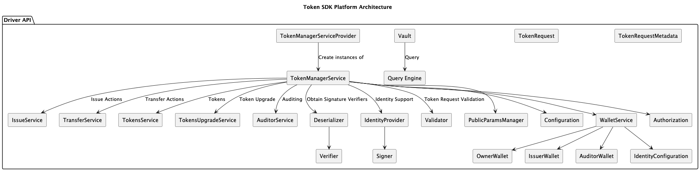

# Driver API

The **Driver API** serves as the interface bridging the generic Token API with specific token implementations. It defines the protocols for token creation, transfer, and management within a given system.

Each driver must implement the `driver.Driver` and `driver.ValidatorDriver` interfaces, fulfilling three primary objectives:
1.  **Public Parameters**: Through `driver.PPReader` (embedded in both), facilitates the retrieval of driver-specific public parameters from bytes.
2.  **Token Management Service (TMS)**: Through `driver.Driver`, provides a mechanism to instantiate a new TMS tailored to the driver.
3.  **Validation**: Through `driver.ValidatorDriver`, provides a mechanism to instantiate a new validator from public parameters.

The `Token Management Service` interface, implemented by the driver, functions as the core execution engine. It is required to implement the following services:
*   `Identity Service`: Manages identities and wallets.
*   `Issue Service`: Orchestrates the issuance of new tokens.
*   `Transfer Service`: Manages the transfer of token ownership.
*   `Token Service`: Provides general token management utilities.
*   `Auditor Service`: Enables auditing capabilities.
*   `Validation Service`: Validates token transactions.
*   `Vault`: Provides secure access to token storage.

Currently, the Fabric Token SDK offers two reference driver implementations: `FabToken` and `ZKATDLog` (Zero-Knowledge Authenticated Token based on Discrete Logarithm).

The `Driver API` architecture is illustrated below:

## Serialization

The Driver API recommends to use the `protobuf` protocol to serialize public parameters and token requests.
The relative protobuf messages are [`here`](https://github.com/hyperledger-labs/fabric-token-sdk/tree/main/token/driver/protos).
This guarantees backward and forward compatibility.

The message for the public parameters carries:
- A token driver identifier to be able to understand which driver generated these parameters.
- The lower-level representation of the public parameters. Each driver must decide how to encode these bytes.

The message for the token requests consists of:
- Serialization of the issue actions.
- Serialization of the transfer actions.
- Signatures of the parties involved in the above actions.
- Auditor Signatures, if required by the driver.

## Drivers

The Token SDK comes equipped with two `Drivers` implementing the `Driver API`:

- [`FabToken`](./drivers/fabtoken.md): FabToken is a straightforward implementation of the Driver API.
  It prioritizes simplicity over privacy, storing all token transaction details openly on the ledger for anyone with access to view ownership and activity.
- [`DLOG w/o Graph Hiding`](./drivers/dlogwogh.md): The `Zero Knowledge Asset Transfer DLog` (zkat-dlog, for short) driver supports privacy using Zero Knowledge Proofs.
  We follow a simplified version of the blueprint described in the paper
  [`Privacy-preserving auditable token payments in a permissioned blockchain system`](https://eprint.iacr.org/2019/1058)
