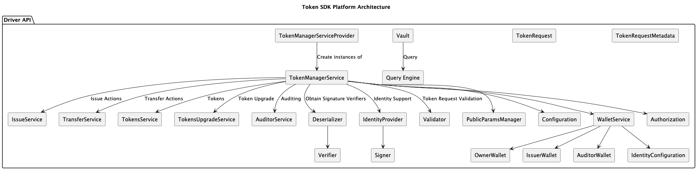

# Driver API

The **Driver API** serves as the interface bridging the generic Token API with specific token implementations. It defines the protocols for token creation, transfer, and management within a given system.

Each driver must implement the `driver.Driver` interface, fulfilling two primary objectives:
1.  **Public Parameters**: Facilitates the retrieval of driver-specific public parameters.
2.  **Token Management Service (TMS)**: Provides a mechanism to instantiate a new TMS tailored to the driver.

The `Token Management Service` interface, implemented by the driver, functions as the core execution engine. It provides access to several specialized services that handle different aspects of the token lifecycle:
*   **Issue Service**: Orchestrates the issuance of new tokens, allowing authorized parties to create tokens and assign them to recipients.
*   **Transfer Service**: Manages the transfer of token ownership, enabling the movement of tokens from one party to another while ensuring the integrity of the transaction.
*   **Tokens Service**: Provides general token management utilities, such as de-obfuscating token outputs to reveal their details (type, value, owner) and extracting recipient identities.
*   **Tokens Upgrade Service**: Handles the process of upgrading tokens from one version or format to another, ensuring continuity and consistency during transitions.
*   **Auditor Service**: Enables auditing capabilities, allowing authorized auditors to inspect transaction details and ensure compliance with regulatory requirements.
*   **Certification Service**: Manages token certifications, providing mechanisms for certifying tokens and verifying their authenticity.
*   **Deserializer**: Responsible for deserializing identity data into signature verifiers, which are used to validate transaction signatures.
*   **Identity Provider**: Manages identity-related concepts, including the registration and retrieval of signature signers and verifiers, as well as audit information for various parties.
*   **Validator**: Performs rigorous validation of token transactions, ensuring they adhere to the driver's rules and maintain the ledger's integrity.
*   **Public Parameters Manager**: Manages the driver's public parameters, including their retrieval, updates, and distribution across the network.
*   **Configuration**: Provides access to driver-specific configuration settings, allowing the TMS to adapt its behavior based on the environment.
*   **Wallet Service**: Handles the management of different types of wallets (issuer, owner, auditor, certifier), facilitating identity lookup and signature generation.
*   **Authorization**: Checks the relationships between tokens and wallets, determining if a party has the necessary permissions to perform certain actions (e.g., spending, auditing, issuing).

Currently, the Fabric Token SDK offers two reference driver implementations: `FabToken` and `ZKATDLog` (Zero-Knowledge Authenticated Token based on Discrete Logarithm).

The `Driver API` architecture is illustrated below:

## Serialization

The Driver API recommends to use the `protobuf` protocol to serialize public parameters and token requests.
The relative protobuf messages are [`here`](https://github.com/hyperledger-labs/fabric-token-sdk/tree/main/token/driver/protos).
This guarantees backward and forward compatibility.

The message for the public parameters carries:
- A token driver identifier to be able to understand which driver generated these parameters.
- The lower-level representation of the public parameters. Each driver must decide how to encode these bytes.

The message for the token requests consists of:
- Serialization of the issue actions.
- Serialization of the transfer actions.
- Signatures of the parties involved in the above actions.
- Auditor Signatures, if required by the driver.

## Drivers

The Token SDK comes equipped with two `Drivers` implementing the `Driver API`:

- [`FabToken`](./drivers/fabtoken.md): FabToken is a straightforward implementation of the Driver API.
  It prioritizes simplicity over privacy, storing all token transaction details openly on the ledger for anyone with access to view ownership and activity.
- [`DLOG w/o Graph Hiding`](./drivers/dlogwogh.md): The `Zero Knowledge Asset Transfer DLog` (zkat-dlog, for short) driver supports privacy using Zero Knowledge Proofs.
  We follow a simplified version of the blueprint described in the paper
  [`Privacy-preserving auditable token payments in a permissioned blockchain system`](https://eprint.iacr.org/2019/1058)
