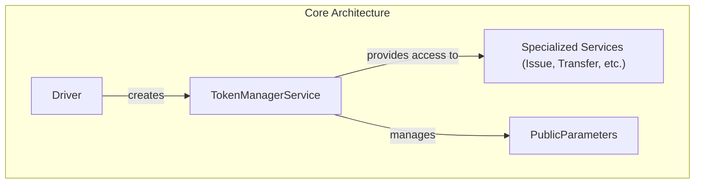
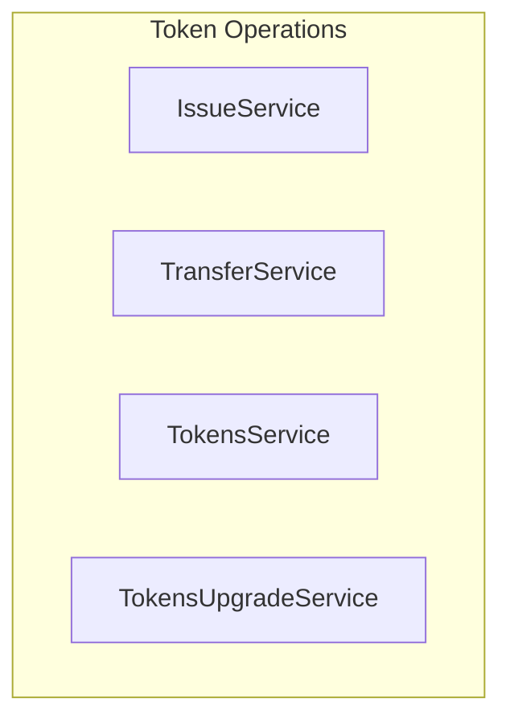
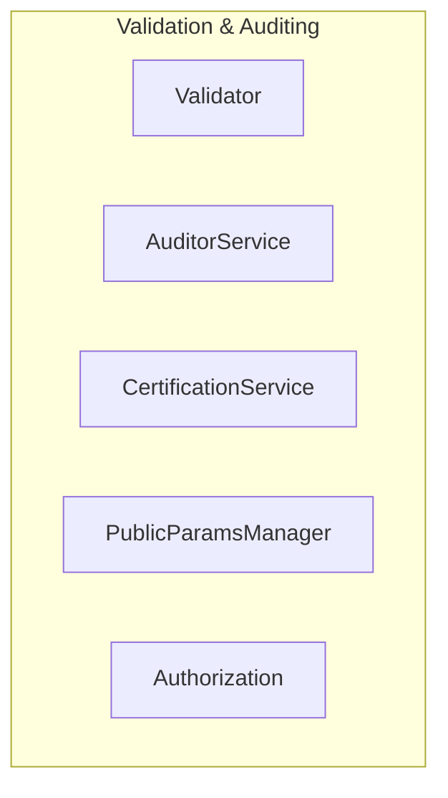
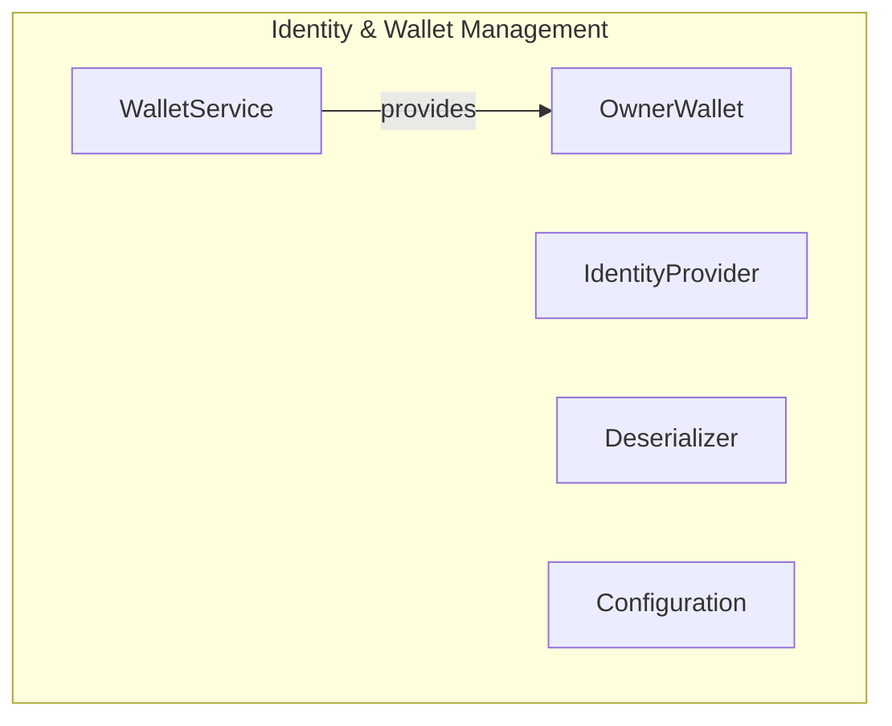

# Driver API

The **Driver API** serves as the interface bridging the generic Token API with specific token implementations. It defines the protocols for token creation, transfer, and management within a given system.

Each driver must implement the `driver.Driver` interface, fulfilling three primary objectives:
1.  **Public Parameters Discovery**: Decodes raw bytes into driver-specific public parameters.
2.  **TMS Instantiation**: Provides a mechanism to instantiate a new `TokenManagementService` (TMS) tailored to the driver and its public parameters.
3.  **Default Validation**: Returns a default `Validator` instance configured with the driver's public parameters.

## Core Architecture

The `Token Management Service` interface, implemented by the driver, functions as the core execution engine for a specific TMS instance (defined by its network, channel, and namespace).


```mermaid
graph TD
    subgraph "Core Architecture"
        Driver -- creates --> TokenManagerService
        TokenManagerService -- "provides access to" --> SpecializedServices["Specialized Services (Issue, Transfer, etc.)"]
        TokenManagerService -- "manages" --> PublicParameters
    end
```

It provides access to several specialized services that handle different aspects of the token lifecycle.

## Token Operations

The lifecycle of a token (issuance, transfer, upgrade) is managed by the following services:


```mermaid
graph TD
    subgraph "Token Operations"
        IssueService
        TransferService
        TokensService
        TokensUpgradeService
    end
```

*   **Issue Service**: Orchestrates the issuance of new tokens. It generates `IssueAction` and `IssueMetadata`, allowing authorized parties to create tokens and assign them to recipients. It also handles the verification and deserialization of issuance actions.
*   **Transfer Service**: Manages the transfer of token ownership. It generates `TransferAction` and `TransferMetadata`, enabling the movement of tokens from one party to another while ensuring transaction integrity. It also handles the verification and deserialization of transfer actions.
*   **Tokens Service**: Provides general token management utilities, such as de-obfuscating token outputs to reveal their details (type, value, owner, format) and extracting recipient identities. It also reports the token formats supported by the driver.
*   **Tokens Upgrade Service**: Manages the token upgrade lifecycle (e.g., from FabToken to ZKAT-DLog). It generates upgrade challenges, produces zero-knowledge proofs for tokens being upgraded, and verifies these proofs.

## Validation & Auditing

The driver provides mechanisms to ensure that token transactions are valid and compliant with the system's rules.


```mermaid
graph TD
    subgraph "Validation & Auditing"
        Validator
        AuditorService
        CertificationService
        PublicParamsManager
        Authorization
    end
```

*   **Validator**: Performs rigorous validation of token transactions. It unmarshals actions from a token request and verifies the request against the ledger state and a provided anchor.
*   **Auditor Service**: Enables auditing capabilities, allowing authorized auditors to inspect token requests and their associated metadata against a provided anchor to ensure compliance.
*   **Certification Service**: Manages token certifications, providing mechanisms for certifying tokens on the ledger and verifying their authenticity.
*   **Public Parameters Manager**: Manages the TMS instance's public parameters, providing access to the parameters themselves, their hash, and facilitating the generation of certifier key pairs.
*   **Authorization**: Checks the relationships between tokens and wallets. It determines if a token belongs to a known owner wallet, if the service has auditor privileges, and verifies if an issuer authorized a specific token.

## Identity & Wallet Management

The management of cryptographic identities and wallets is handled by the following services:


```mermaid
graph TD
    subgraph "Identity & Wallet Management"
        WalletService -- provides --> OwnerWallet
        IdentityProvider
        Deserializer
        Configuration
    end
```

*   **Wallet Service**: Handles the management of different types of wallets (issuer, owner, auditor, certifier). It facilitates wallet lookup, identity registration, and provides access to wallet-specific functionalities like balance calculation and token listing.
*   **Identity Provider**: Acts as a central registry for identities and their cryptographic materials. It manages the registration and retrieval of signature signers and verifiers, audit information, and enrollment IDs.
*   **Deserializer**: Responsible for converting serialized identity data into cryptographic verifiers and extract recipient identities. It also provides matchers for audit information.
*   **Configuration**: Provides access to TMS-specific configuration settings (e.g., paths, identifiers), allowing the services to adapt their behavior based on the environment.

Currently, the Fabric Token SDK offers two reference driver implementations: `FabToken` and `ZKAT-DLog` (Zero-Knowledge Authenticated Token based on Discrete Logarithm).

## Serialization

The Driver API relies on the **Protocol Buffers (Protobuf)** protocol for all serialized data structures. This ensures consistent communication between nodes and the ledger while guaranteeing backward and forward compatibility.

### Public Parameters
Public parameters are wrapped in a generic envelope that carries:
- **Identifier**: A unique string identifying the driver and version (e.g., `zkatdlognogh/v1`).
- **Raw Bytes**: The driver-specific serialization of the parameters, which only the corresponding driver can decode.

### Token Requests
A `TokenRequest` is the primary structure submitted to the ledger. It consists of:
- **Actions**: A list of serialized `IssueAction` or `TransferAction` objects.
- **Signatures**: Digital signatures from the parties authorizing the actions (owners, issuers).
- **Auditing**: A dedicated section for auditor signatures and their identities.
- **Metadata**: (Sent via transient data) Contains cleartext information required by participants and auditors to process the transaction.

## Protocol Versions and Signature Security

The Token SDK supports multiple protocol versions for token request signatures, providing a migration path for security improvements while maintaining backward compatibility.

**Supported Protocol Versions**:
- **Protocol V1**: Original implementation (legacy)
- **Protocol V2**: Enhanced security implementation (recommended)

### Protocol V1 (Legacy)

**Implementation**: [`token/driver/request.go:marshalToMessageToSignV1`](../token/driver/request.go)

**Signature Message Construction**:
```
SignatureMessage = ASN.1(TokenRequest) || Anchor
```

**Characteristics**:
- Simple concatenation of ASN.1-encoded request and anchor
- No delimiter or length prefix between components
- Maintained for backward compatibility with existing deployments

**Security Limitations**:
- **Boundary Ambiguity**: Lack of delimiter creates potential for hash collision attacks
- **No Input Validation**: Anchor parameter not validated for size or content
- **Binary Data in Logs**: Error messages may expose sensitive data

**Status**: ⚠️ **DEPRECATED** - Use Protocol V2 for new deployments

### Protocol V2 (Recommended)

**Implementation**: [`token/driver/request.go:marshalToMessageToSignV2`](../token/driver/request.go)

**Signature Message Construction**:
```go
type SignatureMessage struct {
    Request []byte  // ASN.1-encoded TokenRequest
    Anchor  []byte  // Transaction anchor/ID
}
SignatureMessage = ASN.1(SignatureMessage)
```

**Security Improvements**:

1. **Structured Format**: Uses ASN.1 structure with explicit field boundaries
    - Prevents boundary ambiguity attacks
    - Ensures unique mapping from (Request, Anchor) to signature message
    - Maintains ASN.1 consistency throughout the protocol

2. **Input Validation with Typed Errors**:
    - Anchor must be non-empty (`ErrAnchorEmpty`)
    - Anchor size limited to `MaxAnchorSize` (128 bytes) to prevent DoS (`ErrAnchorTooLarge`)
    - Unsupported versions rejected with `ErrUnsupportedVersion`
    - Validation occurs before signature generation

3. **Secure Error Handling**:
    - Binary data hex-encoded in error messages
    - Prevents sensitive data exposure in logs
    - Compatible with log aggregation systems

4. **Comprehensive Documentation**:
    - Security properties clearly documented
    - Migration guidance provided
    - Attack scenarios explained

**Security Properties**:
- **Collision Resistance**: Different (Request, Anchor) pairs always produce different signature messages
- **Deterministic**: Same input always produces same output
- **Tamper-Evident**: Any modification to Request or Anchor changes the signature message
- **DoS Protection**: Input validation prevents resource exhaustion attacks

### Migration Guide

**For New Deployments**:
- Use Protocol V2 by default
- Configure validators to require minimum version 2
- Benefit from enhanced security properties

**For Existing Deployments**:

1. **Phase 1: Deploy V2 Support**
   ```go
   // Deploy code supporting both V1 and V2
   // V1 requests continue to work
   // V2 requests are accepted
   ```

2. **Phase 2: Monitor Usage**
   ```go
   // V1 usage triggers deprecation warnings
   // Monitor logs for V1 activity
   // Plan migration timeline
   ```

3. **Phase 3: Migrate Applications**
   ```go
   // Update applications to use V2
   // Test thoroughly in staging
   // Roll out gradually
   ```

4. **Phase 4: Enforce V2**
   ```go
   // Configure validators with minimum version 2
   // V1 requests rejected
   // V1 support maintained for historical validation
   ```

**Backward Compatibility**:
- V1 requests continue to validate correctly
- Historical transactions remain valid
- Regression tests ensure V1 compatibility
- No breaking changes to existing deployments


## Drivers

The Token SDK comes equipped with two reference drivers:

- [**FabToken**](./drivers/fabtoken.md): A straightforward implementation prioritizing simplicity. It stores token transaction details (type, value, owner) in cleartext on the ledger, using X.509 certificates for identities.
- [**DLOG w/o Graph Hiding (NOGH)**](./drivers/dlogwogh.md): A privacy-preserving driver using Zero-Knowledge Proofs (ZKP) to hide token types and values via Pedersen commitments. It leverages Idemix for owner anonymity while revealing the spending graph.

## Observability

All drivers are instrumented with a shared metrics layer that records call counts, durations, and error rates for every driver service method. See [**Driver Metrics**](./drivers/metrics.md) for the approach and the full list of available Prometheus metrics.
