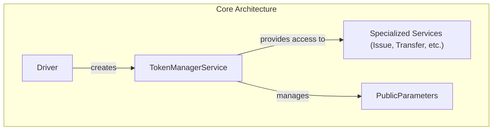
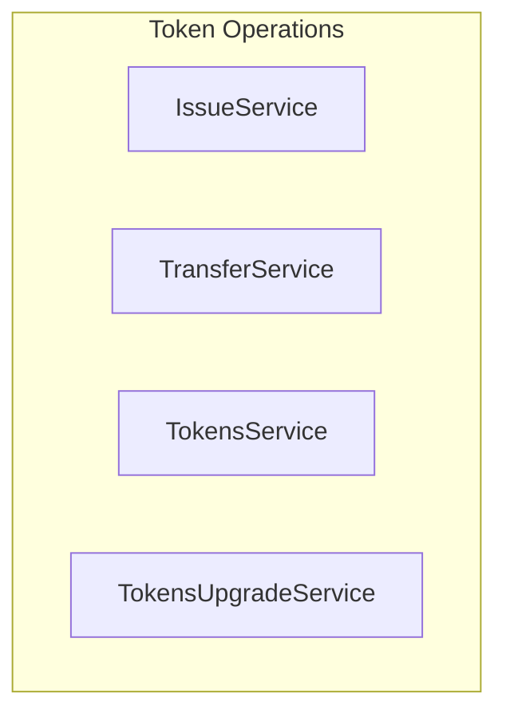
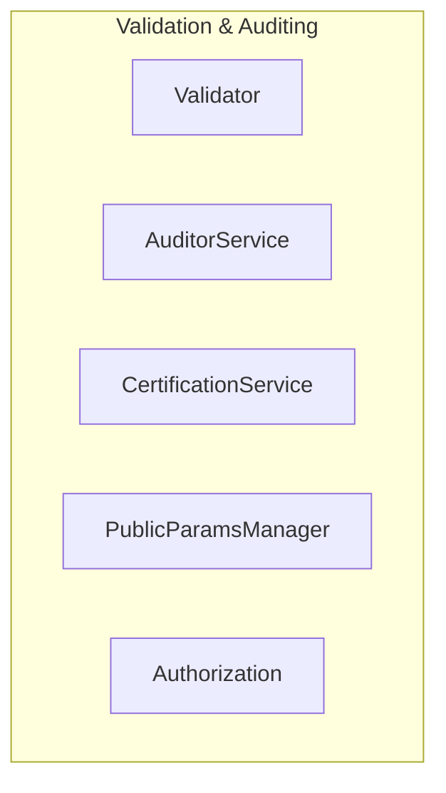
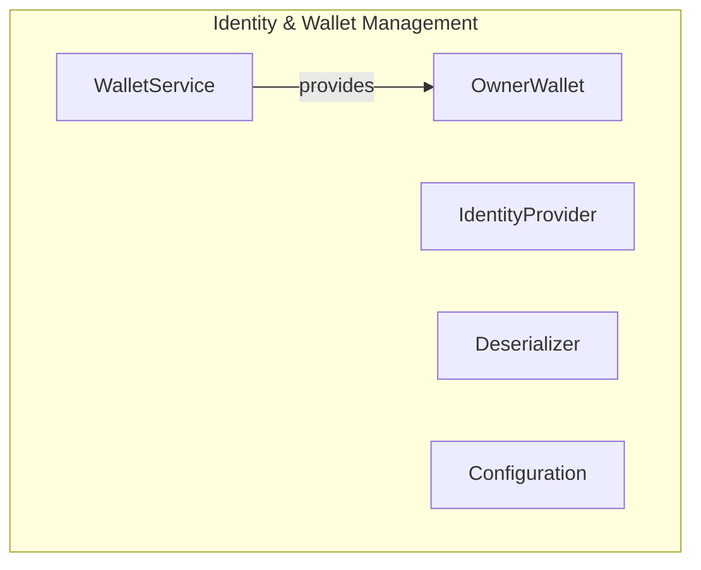
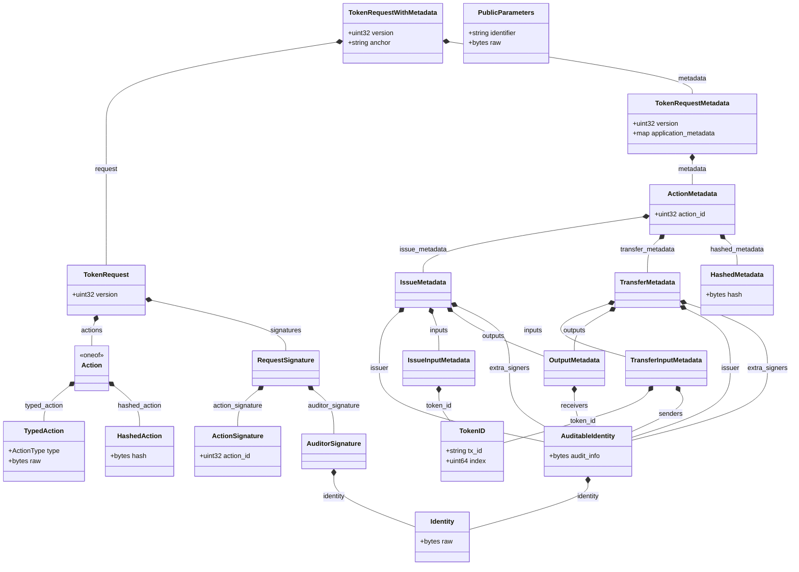

# Driver API

The **Driver API** serves as the interface bridging the generic Token API with specific token implementations. It defines the protocols for token creation, transfer, and management within a given system.

Each driver must implement the `driver.Driver` and `driver.ValidatorDriver` interfaces, fulfilling three primary objectives:
1.  **Public Parameters**: Through `driver.PPReader` (embedded in both), facilitates the retrieval of driver-specific public parameters from bytes.
2.  **Token Management Service (TMS)**: Through `driver.Driver`, provides a mechanism to instantiate a new TMS tailored to the driver.
3.  **Validation**: Through `driver.ValidatorDriver`, provides a mechanism to instantiate a new validator from public parameters.

## Core Architecture

The `Token Management Service` interface, implemented by the driver, functions as the core execution engine for a specific TMS instance (defined by its network, channel, and namespace).


```mermaid
graph TD
    subgraph "Core Architecture"
        Driver -- creates --> TokenManagerService
        TokenManagerService -- "provides access to" --> SpecializedServices["Specialized Services (Issue, Transfer, etc.)"]
        TokenManagerService -- "manages" --> PublicParameters
    end
```

It provides access to several specialized services that handle different aspects of the token lifecycle.

## Token Operations

The lifecycle of a token (issuance, transfer, upgrade) is managed by the following services:


```mermaid
graph TD
    subgraph "Token Operations"
        IssueService
        TransferService
        TokensService
        TokensUpgradeService
    end
```

*   **Issue Service**: Orchestrates the issuance of new tokens. It generates `IssueAction` and `IssueMetadata`, allowing authorized parties to create tokens and assign them to recipients. It also handles the verification and deserialization of issuance actions.
*   **Transfer Service**: Manages the transfer of token ownership. It generates `TransferAction` and `TransferMetadata`, enabling the movement of tokens from one party to another while ensuring transaction integrity. It also handles the verification and deserialization of transfer actions.
*   **Tokens Service**: Provides general token management utilities, such as de-obfuscating token outputs to reveal their details (type, value, owner, format) and extracting recipient identities. It also reports the token formats supported by the driver.
*   **Tokens Upgrade Service**: Manages the token upgrade lifecycle (e.g., from FabToken to ZKAT-DLog). It generates upgrade challenges, produces zero-knowledge proofs for tokens being upgraded, and verifies these proofs.

## Validation & Auditing

The driver provides mechanisms to ensure that token transactions are valid and compliant with the system's rules.


```mermaid
graph TD
    subgraph "Validation & Auditing"
        Validator
        AuditorService
        CertificationService
        PublicParamsManager
        Authorization
    end
```

*   **Validator**: Performs rigorous validation of token transactions. It unmarshals actions from a token request and verifies the request against the ledger state and a provided anchor.
*   **Auditor Service**: Enables auditing capabilities, allowing authorized auditors to inspect token requests and their associated metadata against a provided anchor to ensure compliance.
*   **Certification Service**: Manages token certifications, providing mechanisms for certifying tokens on the ledger and verifying their authenticity.
*   **Public Parameters Manager**: Manages the TMS instance's public parameters, providing access to the parameters themselves, their hash, and facilitating the generation of certifier key pairs.
*   **Authorization**: Checks the relationships between tokens and wallets. It determines if a token belongs to a known owner wallet, if the service has auditor privileges, and verifies if an issuer authorized a specific token.

## Identity & Wallet Management

The management of cryptographic identities and wallets is handled by the following services:


```mermaid
graph TD
    subgraph "Identity & Wallet Management"
        WalletService -- provides --> OwnerWallet
        IdentityProvider
        Deserializer
        Configuration
    end
```

*   **Wallet Service**: Handles the management of different types of wallets (issuer, owner, auditor, certifier). It facilitates wallet lookup, identity registration, and provides access to wallet-specific functionalities like balance calculation and token listing.
*   **Identity Provider**: Acts as a central registry for identities and their cryptographic materials. It manages the registration and retrieval of signature signers and verifiers, audit information, and enrollment IDs.
*   **Deserializer**: Responsible for converting serialized identity data into cryptographic verifiers and extract recipient identities. It also provides matchers for audit information.
*   **Configuration**: Provides access to TMS-specific configuration settings (e.g., paths, identifiers), allowing the services to adapt their behavior based on the environment.

Currently, the Fabric Token SDK offers two reference driver implementations: `FabToken` and `ZKAT-DLog` (Zero-Knowledge Authenticated Token based on Discrete Logarithm).

## Serialization

The Driver API relies on the **Protocol Buffers (Protobuf)** protocol for all serialized data structures. This ensures consistent communication between nodes and the ledger while guaranteeing backward and forward compatibility.

### Public Parameters
Public parameters are wrapped in a generic envelope that carries:
- **Identifier**: A unique string identifying the driver and version (e.g., `zkatdlognogh/v1`).
- **Raw Bytes**: The driver-specific serialization of the parameters, which only the corresponding driver can decode.

### Token Requests
A `TokenRequest` is the primary structure submitted to the ledger. It consists of:
- **Actions**: A list of serialized `IssueAction` or `TransferAction` objects.
- **Signatures**: Digital signatures from the parties authorizing the actions (owners, issuers).
- **Auditing**: A dedicated section for auditor signatures and their identities.
- **Metadata**: (Sent via transient data) Contains cleartext information required by participants and auditors to process the transaction.

### Message Hierarchy

The following diagram illustrates the relationship between the core Protobuf messages defined in `token/driver/protos/v1`:


```mermaid
classDiagram
    direction TB
    class TokenRequestWithMetadata {
        +uint32 version
        +string anchor
    }
    class TokenRequest {
        +uint32 version
    }
    class TokenRequestMetadata {
        +uint32 version
        +map application_metadata
    }
    class Action {
        <<oneof>>
    }
    class TypedAction {
        +ActionType type
        +bytes raw
    }
    class HashedAction {
        +bytes hash
    }
    class ActionMetadata {
        +uint32 action_id
    }
    class IssueMetadata {
    }
    class TransferMetadata {
    }
    class HashedMetadata {
        +bytes hash
    }
    class RequestSignature {
    }
    class ActionSignature {
        +uint32 action_id
    }
    class AuditorSignature {
    }
    class AuditableIdentity {
        +bytes audit_info
    }
    class Identity {
        +bytes raw
    }
    class TokenID {
        +string tx_id
        +uint64 index
    }
    class PublicParameters {
        +string identifier
        +bytes raw
    }

    TokenRequestWithMetadata *-- TokenRequest : request
    TokenRequestWithMetadata *-- TokenRequestMetadata : metadata
    TokenRequest *-- Action : actions
    TokenRequest *-- RequestSignature : signatures
    Action *-- TypedAction : typed_action
    Action *-- HashedAction : hashed_action
    TokenRequestMetadata *-- ActionMetadata : metadata
    ActionMetadata *-- IssueMetadata : issue_metadata
    ActionMetadata *-- TransferMetadata : transfer_metadata
    ActionMetadata *-- HashedMetadata : hashed_metadata
    RequestSignature *-- ActionSignature : action_signature
    RequestSignature *-- AuditorSignature : auditor_signature
    IssueMetadata *-- AuditableIdentity : issuer
    IssueMetadata *-- IssueInputMetadata : inputs
    IssueMetadata *-- OutputMetadata : outputs
    IssueMetadata *-- AuditableIdentity : extra_signers
    TransferMetadata *-- TransferInputMetadata : inputs
    TransferMetadata *-- OutputMetadata : outputs
    TransferMetadata *-- AuditableIdentity : issuer
    TransferMetadata *-- AuditableIdentity : extra_signers
    IssueInputMetadata *-- TokenID : token_id
    TransferInputMetadata *-- TokenID : token_id
    TransferInputMetadata *-- AuditableIdentity : senders
    OutputMetadata *-- AuditableIdentity : receivers
    AuditableIdentity *-- Identity : identity
    AuditorSignature *-- Identity : identity
```

## Protocol V1 

Protocol V1 defines how token requests are transformed into canonical byte representations for signature generation. 
This protocol ensures deterministic, collision-resistant signatures that bind token actions to specific transaction contexts.

### Message-to-Sign Computation

When a token request needs to be signed (by owners, issuers, or auditors), the system computes a canonical message using the `MarshalToMessageToSign` method. This method takes an **anchor** parameter (typically the transaction ID) that uniquely binds the signature to a specific transaction context.

The computation follows these steps:

1. **Action Serialization**: All actions in the token request are serialized in their original order, preserving the sequence of issues and transfers as they appear in the request.

2. **ASN.1 Encoding**: The actions are encoded using a structured ASN.1 format that includes both the action type and data:

```
SignatureMessage ::= SEQUENCE {
  request OCTET STRING,  -- Encoded TokenRequest
  anchor  OCTET STRING   -- Transaction anchor (e.g., TX ID)
}

TokenRequest ::= SEQUENCE {
  actions SEQUENCE OF Action
}

Action ::= SEQUENCE {
  type INTEGER,      -- 0 for ISSUE, 1 for TRANSFER
  data OCTET STRING  -- Serialized action data
}
```

3. **Type Mapping**: Action types from the protobuf enum are mapped to ASN.1 integers:
   - `ACTION_TYPE_ISSUE` (protobuf value 1) → ASN.1 INTEGER 0
   - `ACTION_TYPE_TRANSFER` (protobuf value 2) → ASN.1 INTEGER 1

4. **Anchor Binding**: The anchor (transaction ID) is included in the outer ASN.1 structure, creating a cryptographic binding between the signature and the specific transaction.

### Security Properties

Protocol V1 provides several critical security guarantees:

- **Deterministic Encoding**: The same token request and anchor always produce identical byte representations, ensuring signature verification consistency.
- **Collision Resistance**: The structured ASN.1 format with explicit type tags prevents collision attacks where different requests could produce the same signature message.
- **Order Preservation**: Actions are encoded in their original order, maintaining the semantic meaning of the transaction.
- **Context Binding**: The anchor parameter prevents signature reuse across different transactions.
- **Boundary Separation**: Clear ASN.1 structure boundaries prevent ambiguity in parsing and verification.

### Validation Requirements

The anchor parameter must satisfy these constraints:
- **Non-empty**: Must contain at least one byte
- **Size limit**: Maximum 128 bytes to prevent DoS attacks
- **Uniqueness**: Must be unique per transaction to prevent signature replay

### Implementation Notes

The SDK uses an optimized fast marshaller (`fastMarshalTokenRequestForSigning`) that avoids reflection overhead while maintaining full ASN.1 compatibility.

The version field in `TokenRequest` is included in the signature message, binding the signature to a specific protocol version and ensuring that signatures cannot be replayed across different protocol versions.

## Drivers

The Token SDK comes equipped with two reference drivers:

- [**FabToken**](./drivers/fabtoken.md): A straightforward implementation prioritizing simplicity. It stores token transaction details (type, value, owner) in cleartext on the ledger, using X.509 certificates for identities.
- [**DLOG w/o Graph Hiding (NOGH)**](./drivers/dlogwogh.md): A privacy-preserving driver using Zero-Knowledge Proofs (ZKP) to hide token types and values via Pedersen commitments. It leverages Idemix for owner anonymity while revealing the spending graph.
- [**Extending a Validator Driver**](./drivers/extending_validator.md)

## Observability

All drivers are instrumented with a shared metrics layer that records call counts, durations, and error rates for every driver service method. See [**Driver Metrics**](./drivers/metrics.md) for the approach and the full list of available Prometheus metrics.
