# ZKAT-DLOG (NOGH) Driver Specification

**Driver Implementation**: [`token/core/zkatdlog/nogh/v1`](../../token/core/zkatdlog/nogh/v1)
**Driver Name**: `zkatdlognogh`
**Protocol Version**: `1`
**Date**: 2026-03-25

## Table of Contents
1. [Introduction](#1-introduction)
2. [Mathematical Framework](#2-mathematical-framework)
3. [Architecture Overview](#3-architecture-overview)
4. [Public Parameters](#4-public-parameters)
5. [Identities and Access Control](#5-identities-and-access-control)
6. [Cryptographic Primitives](#6-cryptographic-primitives)
7. [Zero-Knowledge Proofs](#7-zero-knowledge-proofs)
8. [Token Operations](#8-token-operations)
9. [Validation and Auditing](#9-validation-and-auditing)
10. [Serialization and Encoding](#10-serialization-and-encoding)
11. [Local Storage Requirements](#11-local-storage-requirements)
12. [Security and Integrity](#12-security-and-integrity)
13. [Implementation Details](#13-implementation-details)
14. [References](#14-references)

---

## 1. Introduction

The **Zero-Knowledge Authenticated Token based on Discrete Logarithm (ZKAT-DLOG)** driver, specifically the **No Graph Hiding (NOGH)** variant, is a privacy-preserving token implementation for the Fabric Token SDK. It leverages Zero-Knowledge Proofs (ZKP) to hide token types and values while revealing the spending graph.

**Implementation Path**: [`token/core/zkatdlog/nogh/v1`](../../token/core/zkatdlog/nogh/v1)

### 1.1 Design Goals

ZKAT-DLOG (NOGH) provides a balance between privacy and efficiency:

- **Value Privacy**: Token types and quantities are hidden using Pedersen commitments
- **Identity Anonymity**: Token owners use Identity Mixer (Idemix) for anonymity and unlinkability
- **Transparent Graph**: The spending graph is visible (input token IDs are revealed), facilitating efficient double-spending prevention
- **Auditor Empowerment**: Authorized auditors can de-anonymize transactions and inspect cleartext values via authorized metadata

### 1.2 Comparison with FabToken

The ZKAT-DLOG (NOGH) driver provides enhanced privacy compared to the [FabToken driver](./fabtoken.md):

| Feature | FabToken | ZKAT-DLOG (NOGH) |
|---------|----------|------------------|
| **Value Privacy** | ❌ Cleartext | ✅ Hidden (Pedersen Commitments) |
| **Type Privacy** | ❌ Cleartext | ✅ Hidden (Pedersen Commitments) |
| **Owner Privacy** | ❌ X.509 (Visible) | ✅ Idemix Pseudonyms (Anonymous) |
| **Graph Privacy** | ❌ Visible | ❌ Visible (NOGH variant) |
| **Auditor Support** | ✅ Yes | ✅ Yes (with de-anonymization) |
| **Performance** | Fast | Moderate (ZK proof overhead) |
| **Proof Size** | N/A | ~2KB per transfer |
| **Identity Type** | X.509 only | Idemix (owners), X.509 (issuers/auditors) |
| **Upgrade Support** | N/A | ✅ Can spend FabToken in-place |

**When to Use ZKAT-DLOG (NOGH)**:
- Privacy of token values and types is required
- Owner anonymity is important
- Regulatory compliance requires auditing capabilities
- Performance overhead is acceptable

**When to Use FabToken**:
- Maximum performance is critical
- Privacy is not a requirement
- Simpler deployment and debugging is preferred

### 1.3 Security Model

The scheme is secure under **computational assumptions in bilinear groups** in the **random-oracle model**, following the blueprint described in the paper [*Privacy-preserving auditable token payments in a permissioned blockchain system*](https://eprint.iacr.org/2019/1058) by Elli Androulaki et al.

### 1.4 High-Level Workflow

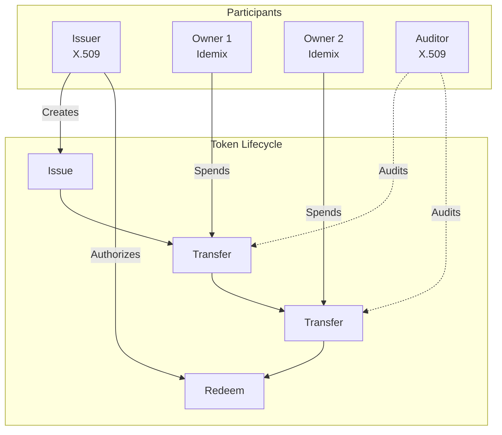

---

## 2. Mathematical Framework

### 2.1 Abstract Algebraic Groups

The protocol is instantiated over a pairing-friendly elliptic curve $\mathcal{C}$ (default: **BLS12-381**).

- **Group $G_1$**: A cyclic group of prime order $q$. Let $g, h, g_0, g_1, g_2$ be generators of $G_1$ such that their discrete logarithms relative to each other are unknown.
- **Group $G_2$**: A cyclic group of prime order $q$.
- **Bilinear Map**: $e: G_1 \times G_2 \to G_T$ is a non-degenerate, computable bilinear map.
- **Scalar Field $\mathbb{Z}_r$**: The field of integers modulo $q$.

**Supported Curves**:
- `BN254` (Barreto-Naehrig) - Faster operations, suitable for development and testing
- `BLS12_381_BBS` (BLS12-381 with BBS+ signatures) - Better security margins, recommended for production

**Note on Curve Variants**: The implementation supports multiple BLS12-381 variants:
- `BLS12_381_BBS`: Standard implementation with BBS+ signatures
- `BLS12_381_BBS_GURVY`: Gurvy library implementation
- `BLS12_381_BBS_GURVY_FAST_RNG`: Optimized variant with faster random number generation (for testing)

For production deployments, use `BLS12_381_BBS`.

### 2.2 Hash Functions

- **Challenge Hash ($H_{FS}$)**: $\{0,1\}^* \to \mathbb{Z}_r$ used for the Fiat-Shamir heuristic to make ZKPs non-interactive.
- **Type Hash ($H_{Type}$)**: $\{0,1\}^* \to \mathbb{Z}_r$ used to map token type strings (e.g., "USD") to the scalar field.
- **Domain Generators**: Default generators $g_0, g_1, g_2$ are derived using hash-to-group $H_{G1}$ on specific domain strings (e.g., `"zkat-dlog.nogh.g0"`).

### 2.3 Generator Derivation

The Pedersen generators are derived deterministically using cryptographically secure random number generation.

**Implementation**: See [`setup.go`](../../token/core/zkatdlog/nogh/v1/setup/setup.go) for the complete generator derivation logic.

The public parameters include three Pedersen generators `[g_0, g_1, g_2]` used for commitment schemes:
- `g_0`: Used for token type commitments
- `g_1`: Used for token value commitments
- `g_2`: Used for blinding factor commitments

### 2.4 Range Proof Systems

**As of commit 586d4f58**, the driver supports **two range proof systems**:

1. **Bulletproofs** (Original implementation)
   - Based on Inner Product Arguments (IPA)
   - Proof size: O(log n) where n is the bit length
   - Verification time: O(n) group operations
   - Implementation: [`crypto/rp/bulletproof/`](../../token/core/zkatdlog/nogh/v1/crypto/rp/bulletproof/)

2. **Compressed Sigma Protocols (CSP)** (New implementation)
   - Based on recursive folding with Fiat-Shamir
   - Proof size: O(log n) where n is the bit length
   - Faster verification through Lagrange interpolation optimizations
   - Implementation: [`crypto/rp/csp/`](../../token/core/zkatdlog/nogh/v1/crypto/rp/csp/)

The proof system is selected via the `ProofType` parameter in `SetupParams`:
- `rp.Bulletproof` - Uses Bulletproof range proofs (default)
- `rp.CSP` - Uses Compressed Sigma Protocol range proofs

**Performance Comparison**: CSP proofs offer improved verification performance through optimized Lagrange interpolation, particularly beneficial for high-throughput scenarios. 
See [benchmark documentation](./benchmark/core/dlognogh/dlognogh.md) for detailed performance metrics.

---

## 3. Architecture Overview

The driver implements the [Driver API](../driverapi.md) through several specialized services following a consistent architectural pattern.

### 3.1 Component Structure

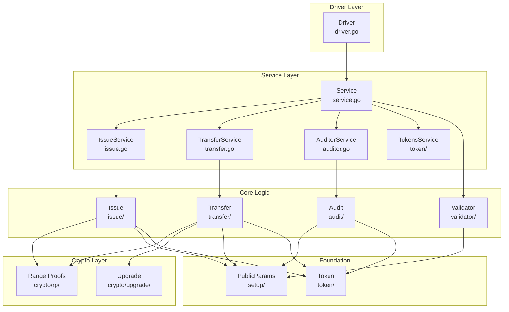

### 3.2 Service Dependencies

The driver leverages several token services (see [@/token/services](../services.md)):

- **[Identity Service](../services/identity.md)**: Manages Idemix and X.509 identities
- **[Network Service](../services/network.md)**: Handles communication with the Fabric network
- **[Storage Service](../services/storage.md)**: Provides persistent storage for tokens and metadata
- **[TTX Service](../services/ttx.md)**: Orchestrates token transaction lifecycle

---

## 4. Public Parameters

### 4.1 Structure

The `PublicParams` (v1) define the cryptographic environment:

```go
type PublicParams struct {
    // DriverName is the name of token driver this public params refer to.
    DriverName driver.TokenDriverName  // "zkatdlognogh"
    // DriverVersion is the version of token driver this public params refer to.
    DriverVersion driver.TokenDriverVersion  // 1
    // Curve is the pairing-friendly elliptic curve used for everything but Idemix.
    Curve mathlib.CurveID
    // PedersenGenerators contains the public parameters for the Pedersen commitment scheme.
    PedersenGenerators []*mathlib.G1  // [g_0, g_1, g_2]
    // RangeProofParams contains the public parameters for the range proof scheme.
    RangeProofParams *RangeProofParams
    // IdemixIssuerPublicKeys contains the idemix issuer public keys
    IdemixIssuerPublicKeys []*IdemixIssuerPublicKey
    // Auditors is a list of the public keys of the auditor(s).
    AuditorIDs []driver.Identity
    // IssuerIDs is a list of public keys of the entities that can issue tokens.
    IssuerIDs []driver.Identity
    // MaxToken is the maximum quantity a token can hold
    MaxToken uint64
    // QuantityPrecision is the precision used to represent quantities
    QuantityPrecision uint64  // 16, 32, or 64 bits
    // ExtraData contains any extra custom data
    ExtraData driver.Extras
}
```

### 4.2 Range Proof Parameters

The driver supports two types of range proof parameters depending on the selected proof system:

#### 4.2.1 Bulletproof Parameters

```go
type RangeProofParams struct {
    LeftGenerators  []*mathlib.G1  // Length = BitLength
    RightGenerators []*mathlib.G1  // Length = BitLength
    P               *mathlib.G1    // Base point for IPA
    Q               *mathlib.G1    // Base point for IPA
    BitLength       uint64         // Arbitrary number between 1 and 64 (included)
    NumberOfRounds  uint64         // log2(BitLength)
}
```

#### 4.2.2 CSP Range Proof Parameters

```go
type CSPRangeProofParams struct {
    LeftGenerators  []*mathlib.G1  // Length = BitLength + 1
    RightGenerators []*mathlib.G1  // Length = BitLength + 1
    BitLength       uint64         // Arbitrary number between 1 and 64 (included)
}
```

**Key Differences**:
- CSP parameters do not require P and Q base points (used only in Bulletproof IPA)
- CSP generators have length `BitLength + 1` (one extra generator for the protocol)
- CSP does not use NumberOfRounds (computed internally as needed)

**Selection**: The appropriate parameter structure is populated based on the `ProofType` specified during setup. Only one set of parameters is included in the serialized `PublicParams`.

**Supported Precisions**: Any number between 1 and 64 is accepted. 
For the CSP-based range proof, since CSP inner product argument is over 2n+4 sized vector, 
bit lengths of 30 or 62 are ideal because it makes 2n+4 a power of 2, i.e, 64 and 128 respectively. 
This avoids performance hit from overflowing to next power of two. 
Sacrificing 2 bits from the range is perhaps worth the performance.
This is ultimately a decision that must be driven by the requirements of the specific use-case.

The precision determines both the maximum token value and the size of the range proofs. 
Higher precision allows larger token values but results in larger proofs and slower verification.

### 4.3 TMS Instantiation

The driver provides a mechanism to instantiate a `TokenManagementService` (TMS) tailored to the network, channel, and namespace:

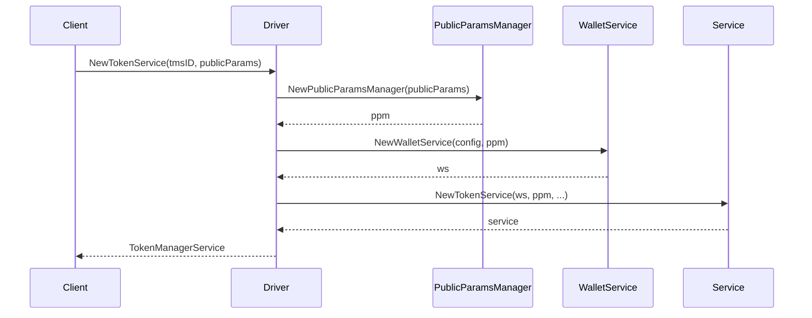

---

## 5. Identities and Access Control

ZKAT-DLOG supports a hybrid identity model managed by the [Identity Service](../services/identity.md).

### 5.1 Idemix Identities (End-Users/Owners)

Idemix provides anonymity through a three-tier structure:

1. **Enrollment Identity**: A long-term identity (e.g., Fabric CA) used to request credentials.
2. **Credential**: A signature $(A, e, v)$ from an Idemix Issuer over the user's secret key $sk$ and attributes.
3. **Pseudonym (Nym)**: An on-ledger representation $N = g^{sk} \cdot h^r$.

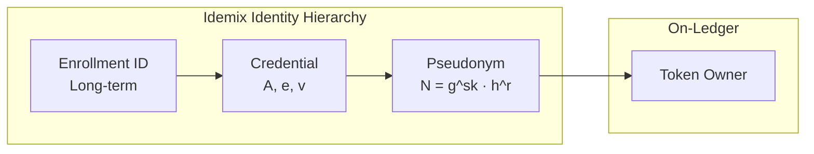

#### 5.1.1 Idemix Formats

ZKAT-DLOG supports two Idemix formats:

- **Standard Idemix**: The `owner` field contains a full Idemix signature.
- **IdemixNym**: The `owner` field contains a small **Nym EID** (commitment to Enrollment ID). See [IdemixNym spec](../services/identity.md#3-idemixnym-idemix-with-pseudonym-based-identity).

#### 5.1.2 Ownership Proof

To spend, the owner provides a **Signature of Knowledge (SoK)** proving they know $sk$ and hold a valid credential without revealing them.

### 5.2 X.509 Identities (Issuers/Auditors)

Issuers and Auditors are identified by standard X.509 certificates.

- **Issuers**: Authorized to create value. Their public keys are listed in `PublicParams.IssuerIDs`.
- **Auditors**: Authorized to inspect transactions via signed audit requests. Their public keys are listed in `PublicParams.AuditorIDs`.

### 5.3 Identity Deserialization

All identities are wrapped in a **[TypedIdentity](../services/identity.md#typedidentity)** (ASN.1 encoded), prefixing the payload with a type label (e.g., `"idemix"`, `"x509"`, `"ms"`, `"htlc"`).

```go
// Identity types supported
const (
    IdemixIdentityType    = "idemix"
    IdemixNymIdentityType = "idemixnym"
    X509IdentityType      = "x509"
    HTLCIdentityType      = "htlc"
    MultisigIdentityType  = "ms"
)
```

---

## 6. Cryptographic Primitives

### 6.1 Pedersen Commitments

A token $(T, V)$ with blinding factor $r \in_R \mathbb{Z}_r$ is committed as:

$$\text{Comm}(T, V; r) = g_0^{H_{Type}(T)} \cdot g_1^V \cdot g_2^r$$

**Implementation**:

```go
// From token/token.go
func commit(vector []*math.Zr, generators []*math.G1, c *math.Curve) (*math.G1, error) {
    com := c.NewG1()
    for i := range vector {
        if vector[i] == nil {
            return nil, ErrNilCommitElement
        }
        com.Add(generators[i].Mul(vector[i]))
    }
    return com, nil
}
```

### 6.2 Commitment to Type

To prove type consistency in transfers without revealing the type:

$$\text{CommType}(T; r_T) = g_0^{H_{Type}(T)} \cdot g_2^{r_T}$$

This allows proving that multiple commitments share the same type without revealing $T$.

### 6.3 Token Structure

```go
// Token represents a ZKAT-DLOG token
type Token struct {
    Owner []byte      // Serialized identity (Idemix or X.509)
    Data  *math.G1    // Pedersen commitment: g_0^H(T) · g_1^V · g_2^r
}

// Metadata contains the opening information
type Metadata struct {
    Type           token.Type  // Token type (e.g., "USD")
    Value          *math.Zr    // Token value
    BlindingFactor *math.Zr    // Blinding factor r
    Issuer         []byte      // Issuer identity (for issue actions)
}
```

---

## 7. Zero-Knowledge Proofs

### 7.1 Type and Sum Proof (`TypeAndSumProof`)

This proof demonstrates that for inputs $\{C_{in,1}, \dots, C_{in,m}\}$ and outputs $\{C_{out,1}, \dots, C_{out,k}\}$:

1. $\forall i, j: \text{Type}(C_{in,i}) = \text{Type}(C_{out,j}) = T$
2. $\sum_{i=1}^m \text{Value}(C_{in,i}) = \sum_{j=1}^k \text{Value}(C_{out,j})$

#### 7.1.1 Prover Steps

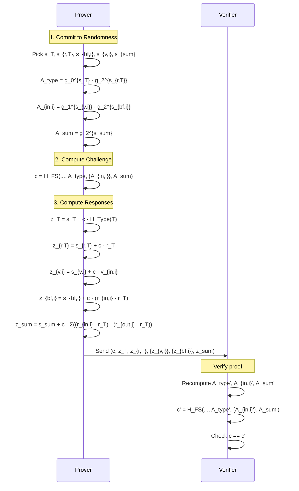

#### 7.1.2 Detailed Protocol

**Prover Steps**:

1. **Commit to Randomness**:
   - Pick $s_T, s_{r,T}, s_{bf,i}, s_{v,i}, s_{sum} \in_R \mathbb{Z}_r$
   - $A_{type} = g_0^{s_T} \cdot g_2^{s_{r,T}}$
   - $A_{in,i} = g_1^{s_{v,i}} \cdot g_2^{s_{bf,i}}$
   - $A_{sum} = g_2^{s_{sum}}$

2. **Challenge**: $c = H_{FS}(\dots, A_{type}, \{A_{in,i}\}, A_{sum})$

3. **Responses**:
   - $z_T = s_T + c \cdot H_{Type}(T)$
   - $z_{r,T} = s_{r,T} + c \cdot r_T$
   - $z_{v,i} = s_{v,i} + c \cdot v_{in,i}$
   - $z_{bf,i} = s_{bf,i} + c \cdot (r_{in,i} - r_T)$
   - $z_{sum} = s_{sum} + c \cdot \sum ( (r_{in,i} - r_T) - (r_{out,j} - r_T) )$

### 7.2 Range Proofs

The driver supports two range proof systems. The choice is made during public parameter setup and affects proof generation and verification.

#### 7.2.1 Bulletproof Range Proofs

Each output $C_{out,j}$ includes a **Bulletproof** showing $V_j \in [0, 2^{64}-1]$. It uses an **Inner Product Argument (IPA)** to achieve $O(\log n)$ proof size.

**Implementation**: [`crypto/rp/bulletproof/`](../../token/core/zkatdlog/nogh/v1/crypto/rp/bulletproof/)

**Bulletproof Structure**:

```go
type RangeProof struct {
    Commitments []*math.G1  // Bit commitments
    A           *math.G1    // Aggregated commitment
    S           *math.G1    // Blinding commitment
    T1          *math.G1    // Polynomial commitment 1
    T2          *math.G1    // Polynomial commitment 2
    Tau         *math.Zr    // Blinding factor
    Mu          *math.Zr    // Blinding factor
    IPAProof    *IPAProof   // Inner product argument
}
```

**Performance**:
- **Proof Size**: $O(\log n)$ where $n$ is the bit length
- **Verification Time**: $O(n)$ group operations
- **Prover Time**: $O(n \log n)$ group operations

#### 7.2.2 Compressed Sigma Protocol (CSP) Range Proofs

**New in commit 586d4f58**: CSP-based range proofs using recursive folding with Fiat-Shamir transformation.

**Implementation**: [`crypto/rp/csp/`](../../token/core/zkatdlog/nogh/v1/crypto/rp/csp/)

**CSP Proof Structure**:

```go
type CSPProof struct {
    Left   []*mathlib.G1  // Cross-commitment MSM(gen_L, wit_R)
    Right  []*mathlib.G1  // Cross-commitment MSM(gen_R, wit_L)
    VLeft  []*mathlib.Zr  // Cross scalar ⟨f_L, wit_R⟩
    VRight []*mathlib.Zr  // Cross scalar ⟨f_R, wit_L⟩
    Curve  *mathlib.Curve
}
```

**Protocol Overview**:

At each of the `NumberOfRounds` folding steps, the prover supplies:
- `Left[i]` = MSM(gen_L, wit_R) — cross-commitment
- `Right[i]` = MSM(gen_R, wit_L) — cross-commitment  
- `VLeft[i]` = ⟨f_L, wit_R⟩ — cross scalar
- `VRight[i]` = ⟨f_R, wit_L⟩ — cross scalar

The verifier reproduces Fiat-Shamir challenges and performs final verification using Lagrange interpolation.

**Performance**:
- **Proof Size**: $O(\log n)$ where $n$ is the bit length (similar to Bulletproofs)
- **Verification Time**: Improved through optimized Lagrange interpolation
- **Prover Time**: Comparable to Bulletproofs with recursive folding

**Key Advantages**:
- Native field arithmetic optimizations for BN254 and BLS12-381 curves
- Batch inverse computation for efficiency
- Optimized Lagrange coefficient calculation
- Reduced verification overhead in high-throughput scenarios

---

## 8. Token Operations

### 8.1 Issue Service

**Implementation**: [`issue.go`](../../token/core/zkatdlog/nogh/v1/issue.go), [`issue/`](../../token/core/zkatdlog/nogh/v1/issue/)

Orchestrates new token creation.

#### 8.1.1 Issue Action Structure

```go
type IssueAction struct {
    Issuer   []byte         // X.509 identity of issuer
    Outputs  []*Token       // New token commitments
    Proof    *IssueProof    // ZKP of validity
    Inputs   []*ActionInput // Optional: tokens to redeem (upgrade)
    Metadata []byte         // Application-specific data
}
```

#### 8.1.2 Issue Workflow

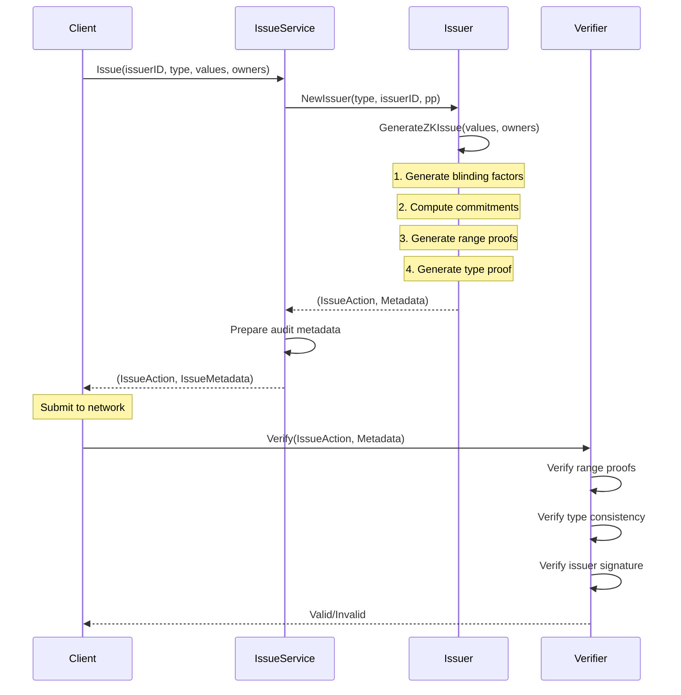

#### 8.1.3 Metadata

**Transient Metadata** (not stored on-ledger):
- Commitment openings $(T, V, r)$ for all outputs
- Identity audit info for owners

**On-Ledger Metadata**:
- Application-specific attributes
- Issuer identity

### 8.2 Transfer Service

**Implementation**: [`transfer.go`](../../token/core/zkatdlog/nogh/v1/transfer.go), [`transfer/`](../../token/core/zkatdlog/nogh/v1/transfer/)

Manages ownership movement.

#### 8.2.1 Transfer Action Structure

```go
type TransferAction struct {
    Inputs   []*ActionInput  // Input token IDs and commitments
    Outputs  []*Token        // New token commitments
    Proof    *TransferProof  // TypeAndSumProof + RangeProofs
    Issuer   []byte          // Optional: for redemption
    Metadata []byte          // Application-specific data
}

type ActionInput struct {
    ID             *token.ID       // (TxID, Index)
    Token          *Token          // Input commitment
    UpgradeWitness *UpgradeWitness // Optional: for FabToken upgrade
}
```

#### 8.2.2 Transfer Workflow

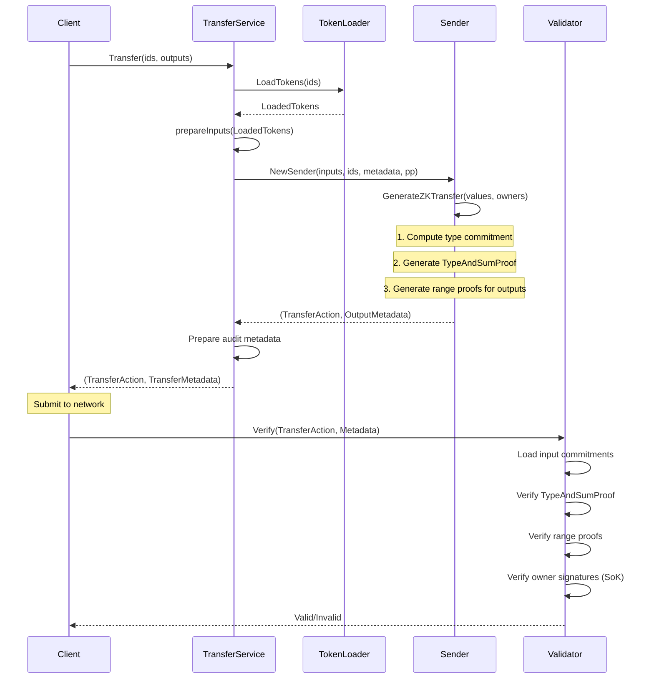

#### 8.2.3 Input Preparation

The transfer service loads tokens from the vault and deserializes them:

```go
func (s *TransferService) prepareInputs(ctx context.Context, loadedTokens []LoadedToken) (PreparedTransferInputs, error) {
    preparedInputs := make([]PreparedTransferInput, len(loadedTokens))
    for i, loadedToken := range loadedTokens {
        tok, tokenMetadata, upgradeWitness, err := s.TokenDeserializer.DeserializeToken(
            ctx, 
            loadedToken.TokenFormat, 
            loadedToken.Token, 
            loadedToken.Metadata,
        )
        if err != nil {
            return nil, errors.Wrapf(err, "failed deserializing token")
        }
        preparedInputs[i] = PreparedTransferInput{
            Token:          tok,
            Metadata:       tokenMetadata,
            Owner:          tok.GetOwner(),
            UpgradeWitness: upgradeWitness,
        }
    }
    return preparedInputs, nil
}
```

### 8.3 Tokens Service

**Implementation**: [`token/tokens.go`](../../token/core/zkatdlog/nogh/v1/token/service.go)

Provides token deserialization and format conversion.

#### 8.3.1 Supported Formats

- **`zkatdlog`**: Native ZKAT-DLOG commitments
- **`fabtoken`**: Cleartext FabToken (for backward compatibility and upgrades)

#### 8.3.2 De-obfuscation

Reveals cleartext via metadata openings:

```go
func (t *Token) ToClear(meta *Metadata, pp *PublicParams) (*token.Token, error) {
    // Recompute commitment
    com, err := commit([]*math.Zr{
        math.Curves[pp.Curve].HashToZr([]byte(meta.Type)),
        meta.Value,
        meta.BlindingFactor,
    }, pp.PedersenGenerators, math.Curves[pp.Curve])
    if err != nil {
        return nil, errors.Wrap(err, "failed to check token data")
    }
    
    // Verify commitment matches
    if !com.Equals(t.Data) {
        return nil, ErrTokenMismatch
    }
    
    return &token.Token{
        Type:     meta.Type,
        Quantity: "0x" + meta.Value.String(),
        Owner:    t.Owner,
    }, nil
}
```

### 8.4 Tokens Upgrade Service

**Implementation**: [`crypto/upgrade/`](../../token/core/zkatdlog/nogh/v1/crypto/upgrade/)

Allows migrating cleartext `FabToken` outputs to privacy-preserving `ZKAT-DLOG` commitments.

#### 8.4.1 Upgrade Workflow

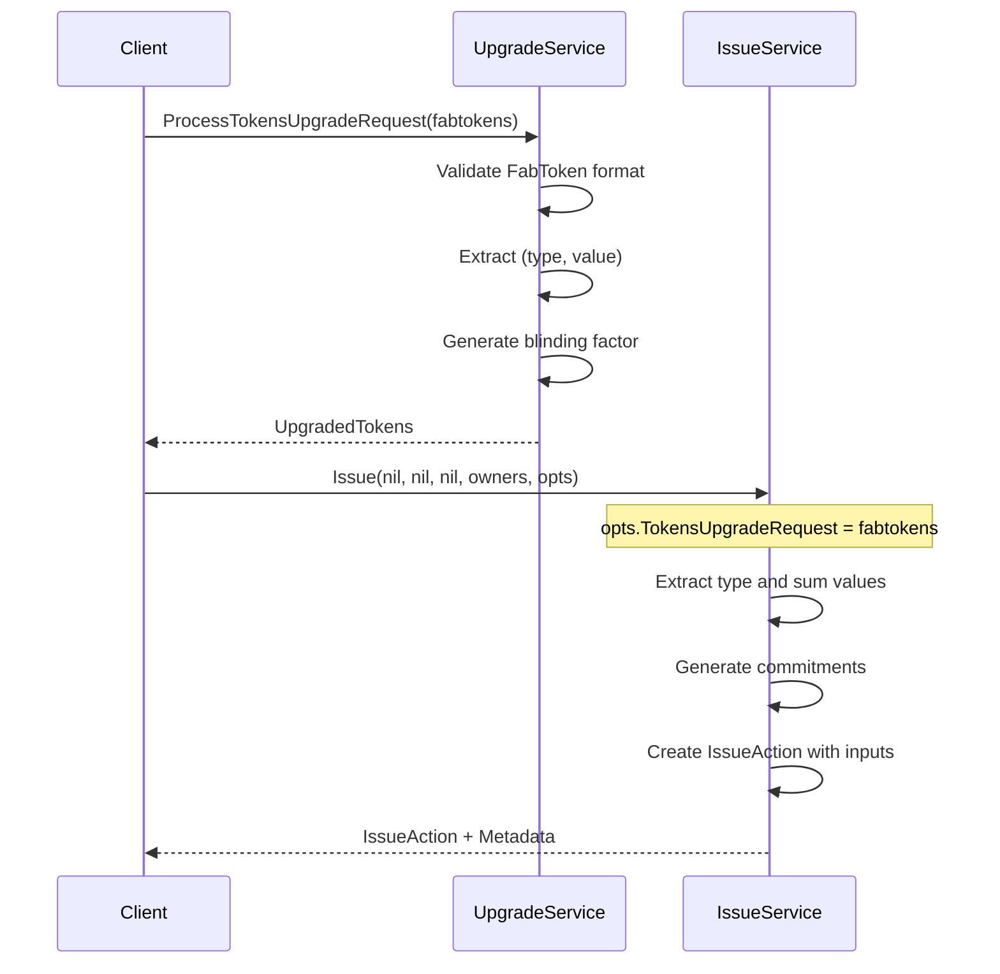

#### 8.4.2 Upgrade Witness

When spending legacy tokens (e.g., FabToken) with the ZKAT-DLOG driver, an **Upgrade Witness** is automatically generated to prove the validity of the conversion. This enables seamless **in-place upgrades** without requiring explicit migration transactions.

**Structure** (defined in [`token/token.go`](../../token/core/zkatdlog/nogh/v1/token/token.go)):

The `TransferActionInputUpgradeWitness` protobuf message contains:
- `output` (fabtoken.Token): The original legacy token in cleartext
- `blinding_factor` (Zr): Blinding factor generated for the Pedersen commitment

**Purpose**:
- **Proves Ownership**: Demonstrates the spender owns the legacy token
- **Validates Conversion**: Shows the commitment correctly represents the legacy token's value and type
- **Enables Compatibility**: Allows the new driver to spend tokens created by older drivers

**How It Works**:
1. When a transfer includes a legacy token input, the driver detects the incompatible format
2. The driver automatically generates a Pedersen commitment from the cleartext token
3. An upgrade witness is created containing the original token and the blinding factor
4. The validator verifies both the legacy token signature and the commitment correctness
5. The transaction proceeds as if the token was always in ZKAT-DLOG format

**Compatibility Criteria**:
- Token format must be in the driver's `SupportedTokenFormats()` list
- Legacy token precision must be ≤ current driver's maximum precision
- Token type and value must be extractable from the legacy format

For more details on upgradability, see the [Upgradability Guide](../upgradability.md).

#### 8.4.3 Burn and Re-issue Protocol

For tokens that cannot be upgraded in-place (e.g., incompatible precision or major protocol changes), the driver supports an atomic "Burn and Re-issue" mechanism:

1. **Challenge Generation**: Owner requests an upgrade challenge from an authorized issuer
2. **Proof Creation**: Owner generates a zero-knowledge proof showing ownership and value consistency
3. **Atomic Transaction**: Issuer verifies the proof and submits a transaction that:
   - Consumes the old tokens (via `IssueAction.inputs`)
   - Issues new tokens with equivalent value (via `IssueAction.outputs`)
   - Maintains supply consistency through cryptographic proofs

**Implementation**: See [`crypto/upgrade/`](../../token/core/zkatdlog/nogh/v1/crypto/upgrade/) for the upgrade service implementation.

---

## 9. Validation and Auditing

The driver provides comprehensive validation and auditing capabilities to ensure transaction integrity and regulatory compliance.

### 9.1 Validator

**Implementation**: [`validator/`](../../token/core/zkatdlog/nogh/v1/validator/)

The validator performs rigorous checks on token transactions before they are committed to the ledger.

#### 9.1.1 Validation Pipeline

The validation process consists of multiple stages:

1. **Deserialization**: Parse actions from the token request
2. **Structural Validation**: Verify action structure and field completeness
3. **Cryptographic Verification**:
   - Verify zero-knowledge proofs (TypeAndSumProof, Bulletproofs)
   - Validate Idemix signatures of knowledge
   - Check commitment correctness
4. **Authorization Checks**:
   - Verify issuer is authorized (for issue actions)
   - Verify auditor signatures (if present)
   - Check owner signatures (for transfer actions)
5. **Balance Verification**: Ensure sum of inputs equals sum of outputs
6. **Double-Spending Prevention**: Check input tokens haven't been spent

**Validation Flow**:

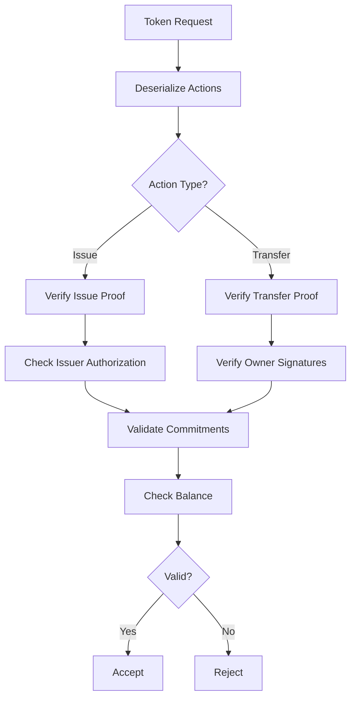

#### 9.1.2 Validator Construction

The validator is instantiated with the public parameters and requires no additional configuration. It operates statelessly, relying only on the ledger state and the public parameters for validation decisions.

For implementation details, see [`validator/validator.go`](../../token/core/zkatdlog/nogh/v1/validator/validator.go).

### 9.2 Auditor Service

**Implementation**: [`audit/`](../../token/core/zkatdlog/nogh/v1/audit/) and [`auditor.go`](../../token/core/zkatdlog/nogh/v1/auditor.go)

The auditor service enables authorized auditors to inspect private transactions and verify compliance without compromising the privacy of non-audited users.

#### 9.2.1 Audit Mechanism

Auditors receive cleartext metadata (via transient data) that includes:
- Token types and values
- Blinding factors
- Owner identities (enrollment IDs)
- Issuer information

The auditor verifies that:
1. Commitments match the cleartext metadata
2. Proofs are valid
3. Balance is preserved
4. All parties are properly authorized

#### 9.2.2 Auditor Validation

The `AuditorCheck` method performs the following:

1. **Deserialize Actions**: Parse the token request into structured actions
2. **Load Input Tokens**: Retrieve the commitments of input tokens from the ledger
3. **Verify Metadata**: Check that cleartext metadata matches the commitments
4. **Validate Proofs**: Verify zero-knowledge proofs using the cleartext values
5. **Check Authorization**: Ensure all participants are properly identified

**Privacy Guarantee**: Only authorized auditors with the correct audit keys can decrypt the metadata. The ledger itself stores only commitments, preserving privacy for all other participants.

For implementation details, see [`auditor.go`](../../token/core/zkatdlog/nogh/v1/auditor.go).
    IS->>IS: Create IssueAction with Inputs
    IS-->>C: (IssueAction, Metadata)
```

---

## 9. Validation and Auditing

### 9.1 Validator

**Implementation**: [`validator/validator.go`](../../token/core/zkatdlog/nogh/v1/validator/validator.go)

Stateless verification of `TokenRequest`.

#### 9.1.1 Validation Pipeline

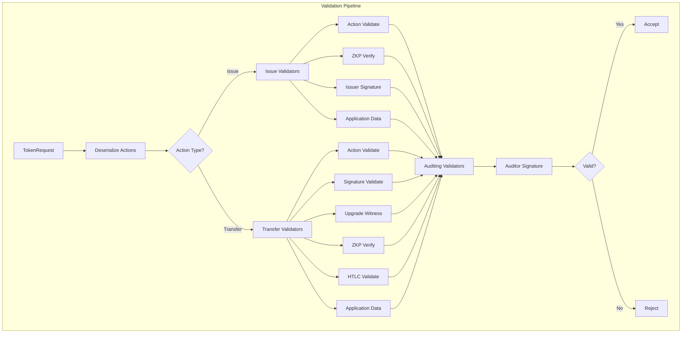

---

## 10. Serialization and Encoding

### 10.1 Wire Format

The protocol uses a two-layer encoding strategy:

- **High-Level**: **Protocol Buffers (v3)** for actions and envelopes
- **Low-Level**: **ASN.1 (DER)** for mathematical elements (Scalars, G1 points)

### 10.2 Mathematical Elements Encoding

#### 10.2.1 Scalar Field Element ($\mathbb{Z}_r$)

- **Format**: Big-endian fixed-length byte array
- **Size**: 32 bytes for BLS12-381, 32 bytes for BN254
- **Encoding**: Direct byte representation of the integer

```go
// From protos-go/utils/utils.go
func ToProtoZr(zr *math.Zr) (*math2.Zr, error) {
    if zr == nil {
        return nil, errors.New("cannot convert nil Zr to proto")
    }
    return &math2.Zr{
        Value: zr.Bytes(),
    }, nil
}

func FromZrProto(zr *math2.Zr) (*math.Zr, error) {
    if zr == nil {
        return nil, errors.New("cannot convert nil proto to Zr")
    }
    return math.Curves[curveID].NewZrFromBytes(zr.Value), nil
}
```

#### 10.2.2 Group Element ($G_1$)

- **Format**: Compressed elliptic curve point
- **Size**: 48 bytes for BLS12-381, 32 bytes for BN254
- **Encoding**: Compressed point representation (x-coordinate + sign bit)

```go
func ToProtoG1(g1 *math.G1) (*math2.G1, error) {
    if g1 == nil {
        return nil, errors.New("cannot convert nil G1 to proto")
    }
    return &math2.G1{
        Value: g1.Bytes(),
    }, nil
}

func FromG1Proto(g1 *math2.G1) (*math.G1, error) {
    if g1 == nil {
        return nil, errors.New("cannot convert nil proto to G1")
    }
    return math.Curves[curveID].NewG1FromBytes(g1.Value), nil
}
```

### 10.3 Token Serialization

#### 10.3.1 Token Structure

```protobuf
message Token {
    bytes owner = 1;  // Serialized identity
    G1 data = 2;      // Pedersen commitment
}
```

#### 10.3.2 Typed Token Wrapper

All tokens are wrapped with a type identifier for proper deserialization:

```go
// From token/services/tokens/core/comm/token.go
const Type = "zkatdlog"

func WrapTokenWithType(raw []byte) ([]byte, error) {
    return proto.Marshal(&TypedToken{
        Type:  Type,
        Token: raw,
    })
}

func UnmarshalTypedToken(bytes []byte) (*TypedToken, error) {
    typed := &TypedToken{}
    if err := proto.Unmarshal(bytes, typed); err != nil {
        return nil, err
    }
    return typed, nil
}
```

### 10.4 Metadata Serialization

#### 10.4.1 Metadata Structure

```protobuf
message TokenMetadata {
    string type = 1;           // Token type (e.g., "USD")
    Zr value = 2;              // Token value
    Zr blinding_factor = 3;    // Blinding factor r
    Identity issuer = 4;       // Issuer identity (for issue)
}
```

#### 10.4.2 Serialization Example

```go
func (m *Metadata) Serialize() ([]byte, error) {
    value, err := utils.ToProtoZr(m.Value)
    if err != nil {
        return nil, errors.Wrapf(err, "failed to serialize metadata")
    }
    blindingFactor, err := utils.ToProtoZr(m.BlindingFactor)
    if err != nil {
        return nil, errors.Wrapf(err, "failed to serialize metadata")
    }
    raw, err := proto.Marshal(&actions.TokenMetadata{
        Type:           string(m.Type),
        Value:          value,
        BlindingFactor: blindingFactor,
        Issuer:         &pp.Identity{Raw: m.Issuer},
    })
    if err != nil {
        return nil, errors.Wrapf(err, "failed serializing token")
    }
    
    return comm.WrapMetadataWithType(raw)
}
```

### 10.5 Action Serialization

#### 10.5.1 Issue Action

```protobuf
message IssueAction {
    bytes issuer = 1;                    // X.509 identity
    repeated Token outputs = 2;          // Output commitments
    IssueProof proof = 3;                // ZKP
    repeated ActionInput inputs = 4;     // Optional: for upgrade
    bytes metadata = 5;                  // Application data
}
```

#### 10.5.2 Transfer Action

```protobuf
message TransferAction {
    repeated ActionInput inputs = 1;     // Input tokens
    repeated Token outputs = 2;          // Output commitments
    TransferProof proof = 3;             // TypeAndSumProof + RangeProofs
    bytes issuer = 4;                    // Optional: for redemption
    bytes metadata = 5;                  // Application data
}

message ActionInput {
    TokenID id = 1;                      // (TxID, Index)
    Token token = 2;                     // Input commitment
    UpgradeWitness upgrade_witness = 3;  // Optional: for upgrade
}
```

### 10.6 Public Parameters Serialization

Public parameters are serialized with a two-layer wrapper:

1. **Inner Layer**: Protocol-specific protobuf
2. **Outer Layer**: Driver identifier wrapper

```go
func (p *PublicParams) Serialize() ([]byte, error) {
    // Serialize inner protobuf
    publicParams := &pp.PublicParameters{
        TokenDriverName:        string(p.DriverName),
        TokenDriverVersion:     uint64(p.DriverVersion),
        CurveId:                &math2.CurveID{Id: uint64(p.Curve)},
        PedersenGenerators:     pg,
        RangeProofParams:       rpp,
        IdemixIssuerPublicKeys: idemixIssuerPublicKeys,
        Auditors:               auditors,
        Issuers:                issuers,
        MaxToken:               p.MaxToken,
        QuantityPrecision:      p.QuantityPrecision,
        ExtraData:              p.ExtraData,
    }
    raw, err := proto.Marshal(publicParams)
    if err != nil {
        return nil, err
    }
    
    // Wrap with driver identifier
    return pp3.Marshal(&pp2.PublicParameters{
        Identifier: string(core.DriverIdentifier(p.DriverName, p.DriverVersion)),
        Raw:        raw,
    })
}
```

### 10.7 Protobuf Message Definitions

The ZKAT-DLOG (NOGH) driver uses Protocol Buffers for all serialized data structures, ensuring consistent communication between nodes and the ledger while guaranteeing backward and forward compatibility. The definitions are located in [`token/core/zkatdlog/nogh/protos/`](../../token/core/zkatdlog/nogh/protos/).

#### 10.7.1 Token Messages ([`noghactions.proto`](../../token/core/zkatdlog/nogh/protos/noghactions.proto))

**Token**: Represents a ZKAT-DLOG token as a Pedersen commitment.
- `owner` (bytes): Serialized identity of the owner (Idemix pseudonym for end-users, X.509 for issuers/auditors)
- `data` (G1): Elliptic curve point representing the Pedersen commitment to token type, value, and blinding factor

**TokenMetadata**: Cleartext token information (sent via transient data, not stored on ledger).
- `type` (string): Token type (e.g., "USD", "EUR")
- `value` (Zr): Token quantity as a scalar field element
- `blinding_factor` (Zr): Random blinding factor used in the commitment
- `issuer` (Identity): Identity of the token issuer

**IssueAction**: Creates new tokens on the ledger.
- `version` (uint64): Protocol version
- `issuer` (Identity): X.509 identity of the authorizing issuer
- `inputs` (repeated IssueActionInput): Optional tokens being redeemed (for upgrade scenarios)
- `outputs` (repeated IssueActionOutput): New token commitments being created
- `proof` (Proof): Zero-knowledge proof of correct issuance
- `metadata` (map<string, bytes>): Application-level metadata

**TransferAction**: Transfers token ownership.
- `version` (uint64): Protocol version
- `inputs` (repeated TransferActionInput): Tokens being spent (includes token ID, commitment, and optional upgrade witness)
- `outputs` (repeated TransferActionOutput): New token commitments being created
- `proof` (Proof): Zero-knowledge proof of balance preservation and ownership
- `issuer` (Identity): Optional issuer identity (required for redemptions)
- `metadata` (map<string, bytes>): Application-level metadata

**TransferActionInputUpgradeWitness**: Enables in-place upgrades from legacy token formats.
- `output` (fabtoken.Token): The original legacy token (e.g., FabToken)
- `blinding_factor` (Zr): Blinding factor generated for the commitment

#### 10.7.2 Public Parameters ([`noghpp.proto`](../../token/core/zkatdlog/nogh/protos/noghpp.proto))

**PublicParameters**: Defines the cryptographic setup and governance rules.
- `token_driver_name` (string): Always `"zkatdlognogh"`
- `token_driver_version` (uint64): Protocol version (currently `1`)
- `curve_id` (CurveID): Pairing-friendly elliptic curve identifier (e.g., BLS12-381, BN254)
- `pedersen_generators` (repeated G1): Generators for Pedersen commitments (g₀, g₁, g₂)
- `range_proof_params` (RangeProofParams): Bulletproof parameters for range proofs
- `idemix_issuer_public_keys` (repeated IdemixIssuerPublicKey): Public keys for Idemix credential verification
- `auditors` (repeated Identity): List of authorized auditor identities (X.509)
- `issuers` (repeated Identity): List of authorized issuer identities (X.509)
- `max_token` (uint64): Maximum token value (2^precision - 1)
- `quantity_precision` (uint64): Bit-precision for token quantities (16, 32, or 64)
- `extra_data` (map<string, bytes>): Extensibility map for custom parameters

**RangeProofParams**: Bulletproof configuration for proving values are in valid range.
- `left_generators` (repeated G1): Left-side generators for inner product argument
- `right_generators` (repeated G1): Right-side generators for inner product argument
- `P` (G1): Generator P for the inner product
- `Q` (G1): Generator Q for the inner product
- `bit_length` (uint64): Number of bits in the range (e.g., 64)
- `number_of_rounds` (uint64): Number of rounds in the protocol (log₂ of bit_length)

#### 10.7.3 Mathematical Elements ([`noghmath.proto`](../../token/core/zkatdlog/nogh/protos/noghmath.proto))

**G1**: Elliptic curve point in group G₁.
- `raw` (bytes): Compressed point serialization (48 bytes for BLS12-381, 32 bytes for BN254)

**Zr**: Scalar field element.
- `raw` (bytes): Big-endian byte representation of the scalar

**CurveID**: Identifier for the elliptic curve.
- `id` (uint64): Numeric curve identifier from the mathlib library

**Serialization Notes**:
- All G₁ elements use compressed point encoding for efficiency
- Scalar field elements (Zr) are serialized as big-endian bytes
- The wire format is designed for forward compatibility: new fields can be added without breaking existing clients

---

## 11. Local Storage Requirements

The driver requires persistent storage for various components, managed by the [Storage Service](../services/storage.md).

### 11.1 Storage Architecture

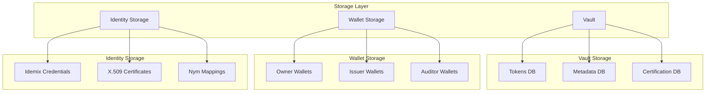

### 11.2 Token Storage

#### 11.2.1 Tokens Database

Stores token commitments and their metadata.

**Schema**:
```
Key: (TxID, Index)
Value: {
    Token: <serialized Token>,
    Metadata: <serialized Metadata>,
    Format: "zkatdlog" | "fabtoken",
    Owner: <identity>,
    Type: <token type>,
    Quantity: <hex string>,
    Status: "unspent" | "spent" | "pending"
}
```

**Indexes**:
- By Owner: `owner -> [(TxID, Index)]`
- By Type: `type -> [(TxID, Index)]`
- By Status: `status -> [(TxID, Index)]`

#### 11.2.2 Query Engine

The vault provides a query engine for efficient token retrieval:

```go
type QueryEngine interface {
    // GetToken retrieves a token by its ID
    GetToken(ctx context.Context, id *token.ID) (*Token, error)
    
    // GetTokens retrieves multiple tokens by their IDs
    GetTokens(ctx context.Context, ids []*token.ID) ([]*Token, error)
    
    // ListUnspentTokens returns all unspent tokens for an owner
    ListUnspentTokens(ctx context.Context, owner driver.Identity) ([]*Token, error)
    
    // ListUnspentTokensByType returns unspent tokens of a specific type
    ListUnspentTokensByType(ctx context.Context, owner driver.Identity, tokenType string) ([]*Token, error)
}
```

### 11.3 Wallet Storage

#### 11.3.1 Owner Wallets

Stores Idemix credentials and pseudonyms.

**Schema**:
```
Key: WalletID
Value: {
    EnrollmentID: <enrollment identity>,
    Credential: <Idemix credential (A, e, v)>,
    SecretKey: <sk>,
    Pseudonyms: [
        {
            Nym: <N = g^sk · h^r>,
            Randomness: <r>,
            EnrollmentIDCommitment: <Nym EID>
        }
    ]
}
```

#### 11.3.2 Issuer Wallets

Stores X.509 certificates and signing keys.

**Schema**:
```
Key: IssuerID
Value: {
    Certificate: <X.509 cert>,
    PrivateKey: <signing key>,
    TokenTypes: [<authorized types>]
}
```

#### 11.3.3 Auditor Wallets

Stores X.509 certificates and audit keys.

**Schema**:
```
Key: AuditorID
Value: {
    Certificate: <X.509 cert>,
    PrivateKey: <signing key>,
    AuditKey: <decryption key for audit info>
}
```

### 11.4 Identity Storage

#### 11.4.1 Idemix Credential Storage

Managed by the [Identity Service](../services/identity.md).

**Schema**:
```
Key: EnrollmentID
Value: {
    IssuerPublicKey: <IPK>,
    Credential: {
        A: <G1 element>,
        e: <Zr element>,
        v: <Zr element>
    },
    Attributes: {
        EnrollmentID: <EID>,
        Role: <role>,
        ...
    }
}
```

#### 11.4.2 Nym Mappings

Maintains the mapping between enrollment IDs and pseudonyms for identity resolution.

**Schema**:
```
Key: NymEID (Nym Enrollment ID Commitment)
Value: {
    EnrollmentID: <EID>,
    Nym: <N = g^sk · h^r>,
    Randomness: <r>
}
```

### 11.5 Certification Storage

Stores certification information for tokens (if certification is enabled).

**Note**: The ZKAT-DLOG (NOGH) driver does **not require** a certification service because the spending graph is visible (input token IDs are revealed). This transparency allows validators to directly verify token lineage and detect double-spending without additional certification proofs.

Certification is primarily useful for drivers with **graph hiding** properties where the spending graph must be proven valid through additional cryptographic attestations. Since NOGH explicitly reveals the graph for efficiency, certification becomes redundant.

If certification is enabled at the TMS level (via the common [Certifier Service](../services/certifier.md)), the storage schema above will be used, but it is not a core requirement for this driver's operation.

**Schema**:
```
Key: (TxID, Index)
Value: {
    Certifier: <certifier identity>,
    Signature: <certification signature>,
    Timestamp: <certification time>
}
```

### 11.6 Storage Size Estimates

For a typical deployment with 1M tokens:

| Component | Size per Entry | Total (1M tokens) |
|-----------|---------------|-------------------|
| Token Commitment | ~100 bytes | ~100 MB |
| Metadata | ~150 bytes | ~150 MB |
| Indexes | ~50 bytes | ~50 MB |
| Wallet Data | ~5 KB per wallet | ~5 MB (1K wallets) |
| **Total** | | **~305 MB** |

---

## 12. Security and Integrity

### 12.1 Soundness

**Inflation Protection**: The binding property of Pedersen commitments and the soundness of the `TypeAndSumProof` ensure that:

$$\sum_{i=1}^m V_{in,i} = \sum_{j=1}^k V_{out,j}$$

No party can create value out of thin air.

**Range Validity**: Bulletproofs ensure that all output values are in the valid range $[0, 2^{64}-1]$, preventing:
- Negative values
- Modular overflows
- "Printing money" attacks

### 12.2 Zero-Knowledge

**Value Privacy**: Observers learn nothing about $T$ or $V$ from the on-ledger data. The Pedersen commitment is computationally hiding under the discrete logarithm assumption.

**Type Privacy**: Token types are hidden through the hash function $H_{Type}$, which maps types to random-looking field elements.

### 12.3 Anonymity and Unlinkability

**Idemix Properties**:
- **Anonymity**: Pseudonyms $N_1, N_2$ cannot be linked to the same enrollment ID by anyone except the auditor
- **Unlinkability**: Multiple transactions by the same user appear unrelated
- **Selective Disclosure**: Users can prove possession of credentials without revealing all attributes

### 12.4 Double-Spending Prevention

**Graph Transparency**: Input token IDs $(TxID, Index)$ are revealed, allowing the ledger to:
- Track token lineage
- Detect double-spending attempts
- Maintain UTXO set efficiently

### 12.5 Auditing Security

**Selective Auditability**: Only authorized auditors can:
- De-anonymize transactions using audit metadata
- Link pseudonyms to enrollment IDs
- Inspect cleartext values

**Audit Trail**: All audit actions are logged and signed, providing:
- Non-repudiation of audit activities
- Compliance with regulatory requirements
- Forensic capabilities

### 12.6 Cryptographic Assumptions

The security of ZKAT-DLOG (NOGH) relies on:

1. **Discrete Logarithm Problem**: In the groups $G_1, G_2$
2. **Bilinear Diffie-Hellman**: For Idemix security
3. **Random Oracle Model**: For Fiat-Shamir heuristic
4. **Pedersen Commitment Binding**: For inflation protection

### 12.7 Attack Resistance

**Quantum Resistance**: The current implementation is **not** quantum-resistant. Post-quantum variants would require:
- Lattice-based commitments
- Post-quantum zero-knowledge proofs
- Quantum-resistant signature schemes

**Side-Channel Resistance**: The implementation includes protections against:
- Timing attacks (constant-time operations)
- Cache attacks (memory access patterns)
- Power analysis (where applicable)


### 12.8 Protocol Versions and Signature Security

#### 12.8.1 Protocol Version Overview

The Token SDK supports multiple protocol versions for token request signatures, providing a migration path for security improvements while maintaining backward compatibility.

**Supported Protocol Versions**:
- **Protocol V1**: Original implementation (legacy)
- **Protocol V2**: Enhanced security implementation (recommended)

#### 12.8.2 Protocol V1 (Legacy)

**Implementation**: [`token/driver/request.go:marshalToMessageToSignV1`](../../token/driver/request.go)

**Signature Message Construction**:
```
SignatureMessage = ASN.1(TokenRequest) || Anchor
```

**Characteristics**:
- Simple concatenation of ASN.1-encoded request and anchor
- No delimiter or length prefix between components
- Maintained for backward compatibility with existing deployments

**Security Limitations**:
- **Boundary Ambiguity**: Lack of delimiter creates potential for hash collision attacks
- **No Input Validation**: Anchor parameter not validated for size or content
- **Binary Data in Logs**: Error messages may expose sensitive data

**Status**: ⚠️ **DEPRECATED** - Use Protocol V2 for new deployments

#### 12.8.3 Protocol V2 (Recommended)

**Implementation**: [`token/driver/request.go:marshalToMessageToSignV2`](../../token/driver/request.go)

**Signature Message Construction**:
```go
type SignatureMessage struct {
    Request []byte  // ASN.1-encoded TokenRequest
    Anchor  []byte  // Transaction anchor/ID
}
SignatureMessage = ASN.1(SignatureMessage)
```

**Security Improvements**:

1. **Structured Format**: Uses ASN.1 structure with explicit field boundaries
   - Prevents boundary ambiguity attacks
   - Ensures unique mapping from (Request, Anchor) to signature message
   - Maintains ASN.1 consistency throughout the protocol

2. **Input Validation with Typed Errors**:
   - Anchor must be non-empty (`ErrAnchorEmpty`)
   - Anchor size limited to `MaxAnchorSize` (128 bytes) to prevent DoS (`ErrAnchorTooLarge`)
   - Unsupported versions rejected with `ErrUnsupportedVersion`
   - Validation occurs before signature generation

3. **Secure Error Handling**:
   - Binary data hex-encoded in error messages
   - Prevents sensitive data exposure in logs
   - Compatible with log aggregation systems

4. **Comprehensive Documentation**:
   - Security properties clearly documented
   - Migration guidance provided
   - Attack scenarios explained

**Security Properties**:
- **Collision Resistance**: Different (Request, Anchor) pairs always produce different signature messages
- **Deterministic**: Same input always produces same output
- **Tamper-Evident**: Any modification to Request or Anchor changes the signature message
- **DoS Protection**: Input validation prevents resource exhaustion attacks

#### 12.8.4 Migration Guide

**For New Deployments**:
- Use Protocol V2 by default
- Configure validators to require minimum version 2
- Benefit from enhanced security properties

**For Existing Deployments**:

1. **Phase 1: Deploy V2 Support**
   ```go
   // Deploy code supporting both V1 and V2
   // V1 requests continue to work
   // V2 requests are accepted
   ```

2. **Phase 2: Monitor Usage**
   ```go
   // V1 usage triggers deprecation warnings
   // Monitor logs for V1 activity
   // Plan migration timeline
   ```

3. **Phase 3: Migrate Applications**
   ```go
   // Update applications to use V2
   // Test thoroughly in staging
   // Roll out gradually
   ```

4. **Phase 4: Enforce V2**
   ```go
   // Configure validators with minimum version 2
   // V1 requests rejected
   // V1 support maintained for historical validation
   ```

**Backward Compatibility**:
- V1 requests continue to validate correctly
- Historical transactions remain valid
- Regression tests ensure V1 compatibility
- No breaking changes to existing deployments

#### 12.8.5 Version Detection

The protocol version is determined by the `TokenRequest` structure:

```go
func (r *TokenRequest) getVersion() int {
    // Currently defaults to V1 for backward compatibility
    // Future: May be determined by request structure or explicit field
    return ProtocolV1
}
```

**Future Enhancements**:
- Explicit version field in `TokenRequest`
- Automatic version negotiation
- Per-network version policies

#### 12.8.6 Security Recommendations

**For Network Operators**:
1. Deploy V2 support as soon as possible
2. Monitor V1 usage via deprecation warnings
3. Plan migration timeline based on network activity
4. Set minimum version to V2 after migration complete
5. Keep V1 support for historical transaction validation

**For Application Developers**:
1. Use V2 for all new token requests
2. Test V2 implementation thoroughly
3. Handle version-specific errors appropriately
4. Document version requirements clearly

**For Auditors**:
1. Verify protocol version in audit logs
2. Flag V1 usage in compliance reports
3. Ensure V2 adoption in security assessments
4. Validate signature message construction

---

## 13. Implementation Details

### 13.1 Error Handling

#### 13.1.1 Error Categories

**Validation Errors**:
```go
var (
    ErrInvalidProof        = errors.New("invalid zero-knowledge proof")
    ErrInvalidCommitment   = errors.New("invalid Pedersen commitment")
    ErrTokenMismatch       = errors.New("token does not match metadata")
    ErrInvalidSignature    = errors.New("invalid signature")
    ErrUnauthorizedIssuer  = errors.New("unauthorized issuer")
    ErrUnauthorizedAuditor = errors.New("unauthorized auditor")
)
```

**Cryptographic Errors**:
```go
var (
    ErrInvalidCurve        = errors.New("invalid or unsupported curve")
    ErrInvalidFieldElement = errors.New("invalid field element")
    ErrInvalidGroupElement = errors.New("invalid group element")
    ErrProofGeneration     = errors.New("proof generation failed")
)
```

#### 13.1.2 Error Recovery

**Graceful Degradation**:
- Fallback to slower verification methods
- Retry with different parameters
- Skip optional optimizations

**Logging and Monitoring**:
- Structured error logging
- Metrics collection
- Performance monitoring

### 13.2 Testing Strategy

#### 13.2.1 Unit Tests

Located in `*_test.go` files throughout the codebase:

- **Cryptographic primitives**: [`crypto/rp/bulletproof_test.go`](../../token/core/zkatdlog/nogh/v1/crypto/rp/bulletproof_test.go)
- **Token operations**: [`issue_test.go`](../../token/core/zkatdlog/nogh/v1/issue_test.go), [`transfer_test.go`](../../token/core/zkatdlog/nogh/v1/transfer_test.go)
- **Validation**: [`validator/validator_test.go`](../../token/core/zkatdlog/nogh/v1/validator/validator_test.go)

#### 13.2.2 Integration Tests

Located in [`integration/token/`](../../integration/token/):

- **End-to-end workflows**: Issue → Transfer → Redeem
- **Multi-party scenarios**: Multiple issuers, auditors, users
- **Network integration**: Fabric network interaction

#### 13.2.3 Regression Tests

Located in [`validator/regression/`](../../token/core/zkatdlog/nogh/v1/validator/regression/):

- **Proof compatibility**: Ensure proofs remain valid across versions
- **Serialization stability**: Maintain wire format compatibility
- **Performance regression**: Track performance changes

#### 13.2.4 Benchmark Tests

Located in [`benchmark/`](../../token/core/zkatdlog/nogh/v1/benchmark/):

- **Performance measurement**: Proof generation and verification times
- **Scalability testing**: Large numbers of inputs/outputs
- **Memory profiling**: Memory usage patterns

For detailed benchmark results and analysis, see the [ZKAT-DLOG Benchmark Documentation](./benchmark/core/dlognogh/dlognogh.md).

### 13.3 Monitoring and Metrics

**Implementation**: [`metrics.go`](../../token/core/zkatdlog/nogh/v1/metrics.go)

#### 13.3.1 Key Metrics

The driver currently implements **2 core performance metrics**:

**Performance Metrics**:
```go
// From metrics.go
type Metrics struct {
    zkIssueDuration    metrics.Histogram  // Duration of ZK issue operations
    zkTransferDuration metrics.Histogram  // Duration of ZK transfer operations
}
```

**Metric Details**:
- `issue_duration`: Histogram tracking time to generate ZK issue proofs
  - Labels: `network`, `channel`, `namespace`
  - Buckets: Exponential from 0 to 1 second (10 buckets)
  
- `transfer_duration`: Histogram tracking time to generate ZK transfer proofs
  - Labels: `network`, `channel`, `namespace`
  - Buckets: Exponential from 0 to 1 second (10 buckets)

**Usage**: Metrics are automatically collected during issue and transfer operations (see [`issue.go:120-126`](../../token/core/zkatdlog/nogh/v1/issue.go) and [`transfer.go:165-173`](../../token/core/zkatdlog/nogh/v1/transfer.go)).

**Note**: Additional business metrics (issuance rate, transfer volume, audit frequency, error rates) can be added by extending the `Metrics` struct and instrumenting the relevant service methods.

#### 13.3.2 Observability

**Tracing**: OpenTelemetry integration for distributed tracing
**Logging**: Structured logging with context
**Alerting**: Prometheus-compatible metrics

---

## 14. References

### 14.1 Academic Papers

- [Privacy-preserving auditable token payments in a permissioned blockchain system](https://eprint.iacr.org/2019/1058) - Elli Androulaki et al.
- [Bulletproofs: Short Proofs for Confidential Transactions and More](https://eprint.iacr.org/2017/1066) - Bünz et al.
- [Anonymous Credentials Light](https://eprint.iacr.org/2013/516) - Fuchsbauer et al.

### 14.2 Technical Specifications

- [Idemix: Identity Mixer Specification](https://hyperledger-fabric.readthedocs.io/en/latest/idemix.html)

### 14.3 Implementation References

- [IBM Mathlib](https://github.com/IBM/mathlib) - Cryptographic library
- [Hyperledger Fabric](https://hyperledger-fabric.readthedocs.io/) - Blockchain platform
- [Protocol Buffers](https://developers.google.com/protocol-buffers) - Serialization format

### 14.4 Related Documentation

- [**Driver API**](../driverapi.md) - Token driver interface specification
- [**Token SDK Overview**](../tokensdk.md) - High-level SDK architecture and concepts
- [**Token API**](../tokenapi.md) - Public API for token operations
- [**Token SDK Usage**](../token_sdk_usage.md) - Practical usage examples
- [**Upgradability Guide**](../upgradability.md) - Token and driver upgrade procedures
- [**Public Parameters Lifecycle**](../public_parameters.md) - PP generation and management
- [**Services Overview**](../services.md) - SDK service architecture
- [**Identity Service**](../services/identity.md) - Identity management service
- [**Storage Service**](../services/storage.md) - Persistent storage service
- [**TTX Service**](../services/ttx.md) - Token transaction orchestration
- [**Network Service**](../services/network.md) - Network communication service
- [**Tokens Service**](../services/tokens.md) - Token format and upgrade service
- [**FabToken Driver**](./fabtoken.md) - Comparison with cleartext driver

### 14.5 Code References

**Core Implementation**:
- **Driver Entry Point**: [`driver/driver.go`](../../token/core/zkatdlog/nogh/v1/driver/driver.go)
- **Service Layer**: [`service.go`](../../token/core/zkatdlog/nogh/v1/service.go)
- **Issue Service**: [`issue.go`](../../token/core/zkatdlog/nogh/v1/issue.go)
- **Transfer Service**: [`transfer.go`](../../token/core/zkatdlog/nogh/v1/transfer.go)
- **Auditor Service**: [`auditor.go`](../../token/core/zkatdlog/nogh/v1/auditor.go)
- **Public Parameters**: [`setup/setup.go`](../../token/core/zkatdlog/nogh/v1/setup/setup.go)
- **Token Management**: [`token/service.go`](../../token/core/zkatdlog/nogh/v1/token/service.go)
- **Metrics**: [`metrics.go`](../../token/core/zkatdlog/nogh/v1/metrics.go)

**Cryptographic Primitives**:
- **Issue Logic**: [`issue/`](../../token/core/zkatdlog/nogh/v1/issue/)
- **Transfer Logic**: [`transfer/`](../../token/core/zkatdlog/nogh/v1/transfer/)
- **Audit Logic**: [`audit/`](../../token/core/zkatdlog/nogh/v1/audit/)
- **Validator**: [`validator/`](../../token/core/zkatdlog/nogh/v1/validator/)
- **Upgrade Service**: [`crypto/upgrade/`](../../token/core/zkatdlog/nogh/v1/crypto/upgrade/)

**Testing**:
- **Unit Tests**: [`issue_test.go`](../../token/core/zkatdlog/nogh/v1/issue_test.go), [`transfer_test.go`](../../token/core/zkatdlog/nogh/v1/transfer_test.go)
- **Benchmarks**: [`benchmark/`](../../token/core/zkatdlog/nogh/v1/benchmark/)
- **Integration Tests**: [`integration/token/fungible/dlog/`](../../integration/token/fungible/dlog/), [`integration/token/nft/dlog/`](../../integration/token/nft/dlog/)

---

## Appendices

### Appendix A: Cryptographic Parameter Recommendations

**For Production Use**:
- **Curve**: BLS12-381 (better security margins)
- **Precision**: 64 bits (sufficient for most applications)
- **Hash Function**: SHA-256 (for Fiat-Shamir)

**For Development/Testing**:
- **Curve**: BN254 (faster operations)
- **Precision**: 32 bits (faster proofs)

### Appendix B: Migration Guide

**From FabToken to ZKAT-DLOG**:
1. Deploy ZKAT-DLOG driver with upgrade support
2. Issue upgrade transactions for existing tokens
3. Gradually migrate user wallets to Idemix
4. Deprecate FabToken driver

**Version Upgrades**:
1. Test compatibility with regression tests
2. Deploy new version alongside old
3. Migrate tokens using upgrade mechanism
4. Remove old version after migration

### Appendix C: Troubleshooting Guide

**Common Issues**:

1. **Proof Verification Failures**:
   - Check public parameter consistency
   - Verify curve compatibility
   - Validate input commitments

2. **Performance Issues**:
   - Enable precomputation tables
   - Increase cache sizes
   - Use parallel verification

3. **Storage Issues**:
   - Monitor disk usage
   - Implement token pruning
   - Optimize database indexes

**Debug Tools**:
- Proof validation utilities
- Commitment verification tools
- Performance profilers

---

*This specification document is maintained by the Fabric Token SDK team. For questions or contributions, please refer to the [CONTRIBUTING.md](../../CONTRIBUTING.md) guidelines.*
