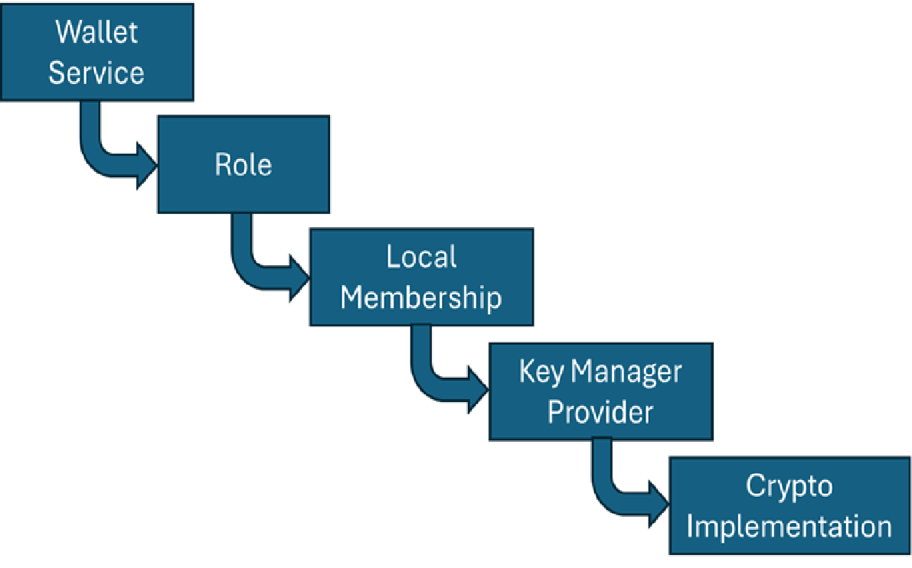

# Education session #3

## Overview of the Token Manager Service

The Token Manager Service is the main entry point of the Token SDK from the perspective of the driver.

It coordinates all operations such as:
- Token issuance
- Transfer
- Redeem

Every operation requires interaction with identities, signatures, and wallets.

```
type ManagementService struct {
	id     TMSID
	tms    driver.TokenManagerService
	logger logging.Logger

	vaultProvider               VaultProvider
	certificationClientProvider CertificationClientProvider
	selectorManagerProvider     SelectorManagerProvider
	signatureService            *SignatureService

	vault                   *Vault
	publicParametersManager *PublicParametersManager
	walletManager           *WalletManager
	validator               *Validator
	auth                    *Authorization
	conf                    *Configuration
	tokensService           *TokensService
}
```


## Public Parameters & Identities

When the issuer wants to issue a token it needs to produce a signature that matches
a public key that is kept in the public parameters.
In another words, to issue a token, alice needs to generate a valid signature. For that she needs to have the secret key that matches the public key of one of the issuers in the public parameters.


```
type PublicParameters interface {
	// TokenDriverName returns the name of the token driver
	TokenDriverName() TokenDriverName
	// TokenDriverVersion return the version of the token driver
	TokenDriverVersion() TokenDriverVersion
	// TokenDataHiding returns true if the token data is hidden
	TokenDataHiding() bool
	// GraphHiding returns true if the token graph is hidden
	GraphHiding() bool
	// MaxTokenValue returns the maximum token value
	MaxTokenValue() uint64
	// CertificationDriver returns the certification driver identifier
	CertificationDriver() string
	// Auditors returns the list of auditors.
	Auditors() []Identity
	// Issuers returns the list of issuers.
	Issuers() []Identity
	// Precision returns the precision used to represent the token value.
	Precision() uint64
	// String returns a readable version of the public parameters
	String() string
	// Serialize returns the serialized version of this public parameters
	Serialize() ([]byte, error)
	// Validate returns true if the public parameters are well-formed
	Validate() error
	// Extras gives access to extra data, if available.
	// Extras always returns an initialized Extras that can be modified.
	Extras() Extras
}
```

The public parameters is an interface and describe the functions that all the drivers should implement.
The public parameters include for example, a list of issuer identities and another list of auditor identities.
Identities are abstract and are represented generically as []byte.
The interpretation of an identity depends on the token driver.

Example identity types include:
- X.509 public key
- Identity Mixer public key
- Custom driver-defined identity format


## Wallet Service and Wallets
### Purpose of the Wallet Service

A wallet is a container for long-term identities and
the wallet service provides access to long-term secret keys needed for signing operations.

If an issuer wants to issue tokens, they must sign under one of the issuer identities published in the public parameters.
Such a secret keys is stored in a wallet.
Wallets are accessed only through the Wallet Service.


```
// WalletService models the wallet service that handles issuer, owner, auditor, and certifier wallets
type WalletService interface {
	// RegisterRecipientIdentity registers the passed recipient identity together with the associated audit information
	RegisterRecipientIdentity(ctx context.Context, data *RecipientData) error

	// GetAuditInfo retrieves the audit information for the passed identity
	GetAuditInfo(ctx context.Context, id Identity) ([]byte, error)

	// GetEnrollmentID extracts the enrollment id from the passed audit information
	GetEnrollmentID(ctx context.Context, identity Identity, auditInfo []byte) (string, error)

	// GetRevocationHandle extracts the revocation handler from the passed audit information
	GetRevocationHandle(ctx context.Context, identity Identity, auditInfo []byte) (string, error)

	// GetEIDAndRH returns both enrollment ID and revocation handle
	GetEIDAndRH(ctx context.Context, identity Identity, auditInfo []byte) (string, string, error)

	// Wallet returns the wallet bound to the passed identity, if any is available
	Wallet(ctx context.Context, identity Identity) Wallet

	// RegisterOwnerIdentity registers an owner long-term identity
	RegisterOwnerIdentity(ctx context.Context, config IdentityConfiguration) error

	// RegisterIssuerIdentity registers an issuer long-term wallet
	RegisterIssuerIdentity(ctx context.Context, config IdentityConfiguration) error

	// OwnerWalletIDs returns the list of owner wallet identifiers
	OwnerWalletIDs(ctx context.Context) ([]string, error)

	// OwnerWallet returns an instance of the OwnerWallet interface bound to the passed id.
	// The id can be: the wallet identifier or a unique id of a view identity belonging to the wallet.
	OwnerWallet(ctx context.Context, id WalletLookupID) (OwnerWallet, error)

	// IssuerWallet returns an instance of the IssuerWallet interface bound to the passed id.
	// The id can be: the wallet identifier or a unique id of a view identity belonging to the wallet.
	IssuerWallet(ctx context.Context, id WalletLookupID) (IssuerWallet, error)

	// AuditorWallet returns an instance of the AuditorWallet interface bound to the passed id.
	// The id can be: the wallet identifier or a unique id of a view identity belonging to the wallet.
	AuditorWallet(ctx context.Context, id WalletLookupID) (AuditorWallet, error)

	// CertifierWallet returns an instance of the CertifierWallet interface bound to the passed id.
	// The id can be: the wallet identifier or a unique id of a view identity belonging to the wallet.
	CertifierWallet(ctx context.Context, id WalletLookupID) (CertifierWallet, error)

	// SpendIDs returns the spend ids for the passed token ids
	SpendIDs(ids ...*token.ID) ([]string, error)
}
```


### Wallet Types (Roles)

The SDK defines specialized wallets based on roles:

|Role |	Purpose |
------|---------|
|Issuer |	Holds secret keys for token issuance |
|Owner |	Holds secret keys for spending/receiving tokens |
|Auditor |	Holds keys for audit operations |
|Certifier |	Additional role (not covered here) |

Each role corresponds to a separate wallet registry.

See also  `token/services/identity/roles.go`:

```
// RoleType is the role of an identity
type RoleType = driver.IdentityRoleType

const (
	// IssuerRole is the role of an issuer
	IssuerRole = driver.IssuerRole
	// AuditorRole is the role of an auditor
	AuditorRole = driver.AuditorRole
	// OwnerRole is the role of an owner
	OwnerRole = driver.OwnerRole
	// CertifierRole is the role of a certifier
	CertifierRole = driver.CertifierRole
)
```


### Multiple Wallets and Keys

A single entity (e.g., Alice) may have multiple wallets, across different roles.

Each wallet holds at least one secret key.

Wallets may contain multiple keys during key rotation.

### Difference from IDAP Wallets

Token SDK wallets are cryptographic key containers.

IDAP wallets are business-level constructs.

There is a 1:1 mapping, but different IDAP wallets may use the same token wallet underneath.


## The Services Layer and Identity Handling

### Identity Service (Wallet Implementation)

The identity service provides the concrete implementation of the wallet service.
See `token/services/identity/wallet/wallet.go`.

It is a heavy component because it may generate keys sometimes on the fly

Must be fast due to being on the critical path.

Uses caches heavily.

------
HERE
------

### Registries
Each role has a registry.
The registry is a lower level giving the wallet services.

See `token/services/identity/wallet/service.go`:
```
type Registry interface {
	WalletIDs(ctx context.Context) ([]string, error)
	RegisterIdentity(ctx context.Context, config driver.IdentityConfiguration) error
	Lookup(ctx context.Context, id driver.WalletLookupID) (driver.Wallet, identity.Info, string, error)
	RegisterWallet(ctx context.Context, id string, wallet driver.Wallet) error
	BindIdentity(ctx context.Context, identity driver.Identity, eID string, wID string, meta any) error
	ContainsIdentity(ctx context.Context, i driver.Identity, id string) bool
	GetIdentityMetadata(ctx context.Context, identity driver.Identity, wID string, meta any) error
}
```

### Wallet Registries
The WalletRegistry manages wallets that have a specific role.

See `token/services/identiry/wallet/db/registry.go`:
```
// WalletRegistry manages wallets whose long-term identities have a given role.
type WalletRegistry struct {
	Logger  logging.Logger
	Role    identity.Role
	Storage idriver.WalletStoreService

	Wallets map[string]driver.Wallet
}
```


```
type localMembership interface {
	DefaultNetworkIdentity() driver.Identity
	IsMe(ctx context.Context, id driver.Identity) bool
	GetIdentityInfo(ctx context.Context, label string, auditInfo []byte) (idriver.IdentityInfo, error)
	GetIdentifier(ctx context.Context, id driver.Identity) (string, error)
	GetDefaultIdentifier() string
	RegisterIdentity(ctx context.Context, config driver.IdentityConfiguration) error
	IDs() ([]string, error)
}
```


```
// Role models a role whose identities are anonymous
type Role struct {
	logger          logging.Logger
	roleID          identity.RoleType
	networkID       string
	localMembership localMembership
	nodeIdentity    driver.Identity
}
```

WalletRegistry - keeps the Role and a list of wallets.
Role - contains the cryptographic knowledge (different roles have different crypto needs). Role contains LocalMembership
LocalMembership - is an interface for crypto functions concerning IDs. They handle a set of KeyManagerProvider
KeyManagerProvider - is responsible of knowing the exact details of the cryptographic signing algorithms

There are 2 implementations for Key Manager Providers:

|Provider|  Purpose |
|---------|-------|
|X.509 Key Manager |	Handles ECDSA keys, certificates |
|Identity Mixer Key Manager | 	Handles Idemix credentials |




### WalletService Implementation
The implementation of the wallet service is in `token/services/identity/wallet/service.go`

## Issuance Flow and Crypto Material
5.1 Which Key Manager Is Used?

Both built-in drivers: `FabToken` and `DLog` require an X.509-based issuer identity.
Thus for issuance:

* The public parameters list the X.509 issuer certificates.

* Wallet must contain the corresponding private key

* Key Manager Provider (X.509) is used


## Walkthrough: Issuance in an Integration Test

A walk through of an integration test (integration/token/fungible/dlog/…).

The integration test uses `IssueCashView`. This view is for tests only and should not be used in production.
In `IssueCashView.Call`, at some point `GetIssuerWallet` is called to gain access to an issuer wallet which is needed for the issuance. 
In `GetIssuerWallet` the first thing is to access the management service (`GetManagementService`), and then from the management server get the wallet manager and the issuer wallet (`tms.WalletManager().IssuerWallet()`).
