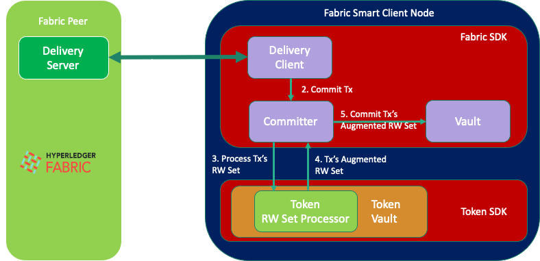

# Services or What you need to build Token-Based Applications on top of Fabric

In this Section, we will see how to leverage the Token API to build a token infrastructure on top of `Fabric`.
This is the most flexible part of the Token SDK stack because new services can be built as needed by the applications.

To build our Fabric token infrastructure, we will need the following building blocks (or services).

- On the Fabric-side, we will define a `Token Namespace` that will contain all information that is needed to make 
  sense of the tokens stored in the namespace. The namespace's endorsement policy depends on the specific use case.
  As a general guideline, we can say it should reflect the majority of the partners in the blockchain consortium.
  Last but not least, a chiancode, the `Token Chaincode`. It is deployed to create the token namespace.
  The token chaincode provides various functionalities to the applications.
  We will explore these functions in more details later.
- On the Client-side, we need
    - A `Token Transaction` concept that let parties agree on the token operations to perform 
      (issue, transfer, redeem, and so on). The Token Transaction wraps a Token Request.
    - A `Token Vault`. A local storage that contains tokens. We will learn exactly which tokens the vault contains
      in the coming sections.
    - A `Token Selector` to pick tokens from the vault and use them in operations like transfer and redeem.
    - `Auditing` to enforce rules on a token transaction before this gets committed. This part is optional.
  
If you to jump ahead and see some examples, have a look ['here'](./../integration/README.md).

Let us continue with the lifecycle of a token transaction. This will give us the possibility to describe
how all the above components play together.

## Token Transaction Lifecycle

The lifecycle of a Token Transaction consists of the following high-level steps:

1. `Assembling the Token Transaction`. In this phase, the business parties decide on the token operations
that must happen atomically. They assemble them in a token transaction by interacting following a business process.
   Under the hood, a token transaction contains a Token Request (defined by the Token API).

2. `Collect Signatures`. Once the Token Transaction is ready, meaning that the Token Request has been formed, 
   one of the business parties, let call it the `leader`, takes the charge of collecting the following signatures:
   - From the issuers of new tokens, if any;
   - From the owners of the tokens spent, if any;
   - From any required auditor, if needed.

3. `Collect Endorsements`. The Token Transaction must be submitted to Fabric. Therefore, it should be converted 
to something Fabric understands: An Endorser Transaction. The underlying process is the following:
   - The leader assembles a Fabric Proposal to invoke the Token Chaincode's  validation function. This function
    takes in input a Token Request (without the Metadata) and does the following:
     - Validates the Token Request;
     - Translates the Token Request into a RWSet.
  
   - The leader sends the Proposal to the endorsers of the Token Chaincode and collects the endorsements.
   - The leader assembles the endorsements in a Fabric Endorser Transaction.
    
4. `Fabric Transaction Distributtion`. The leader distributes the Fabric Transaction, formed at the previous step, 
   to all the parties involved in the transaction formation.

5. `Submit the Token Transaction for Ordering`. At this point, the leader sends the Fabric transaction to the Fabric
Ordering Service. The parties involved in the transaction formation can wait, if they need to, wait for the finality of
   the transaction.
   

Let us see what happens when the Fabric transaction gets committed. 
We would expect to see the tokens created by the transaction appearing in the Vault of the owners.
The following picture shows how this happens: 

In more details:
1. The FSC node listens to the `Delivery Service` events generated by its Fabric peer partner. 
   When the Fabric peer commits our token transaction `Tx`, the FSC node gets informed.
2. The `Delivery Client` informs the `Committer` that `Tx` is available.
3. If `Tx` is deemed valid by Fabric, then the `Committer` further manipulates the RWSet by invoking all registered
   `RWSet Processors` before the RWSet gets committed into the vault. If `Tx` is valid, the transaction gets directly 
   discarded.
4. The Token SDK installs one of these processors, the `Token RW Set Processor`. This processor extracts all the token
   related information and augments the RWSet with additional key-value pairs to speed up the 
   token selection process, among other things.
5. Finally, the RWSet, after processing, is committed to the vault.

Only at this point, the tokens created by the transaction become available inside the Token Vault and can be selected
for a new transactions.

## The Token Namespace and Chaincode

In the previous Section, we have seen that part of the lifecycle of a Token Transaction is the invocation of the 
`Token Chaincode` that is assosiated to the `Token Namespace`.

The `Token Namespace` contains the tokens and any additional information needed to make sense out of them
in a key-value format. Attached to the namespace we have:
- The [`Token Chaincode`](https://github.com/hyperledger-labs/fabric-token-sdk/tree/main/token/services/tcc),
  that exposes functionalities useful to develop token applications, and
- The `Endorsement Policy` that describe the governance of the token chaincode. In other words, who is allowed to
  modify the namespace.

The Token Chaincode must be initialized with some `public parameters`.
The public parameters depends on the specific token driver implementation and can be generated by 
using the utility [`tokengen`](./../cmd/tokengen/README.md).

Once initialized, the token chaincode can provide the following functionalities:
- `Fetch the public parameters`. They must be fetched by each FSC node running the Token SDK stack.
  This is done automatically.
- `Fetch Tokens` is used to retrieve the content of tokens by their ids.
- `Validate and Translate Token Requests`. This is one of the essential steps in the lifecycle of a token transaction,
  as we have seen in the previous section.