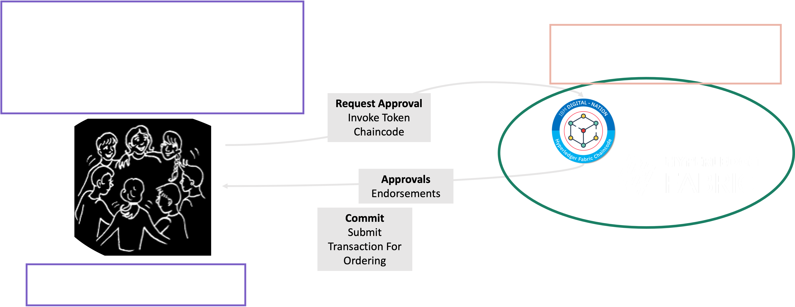
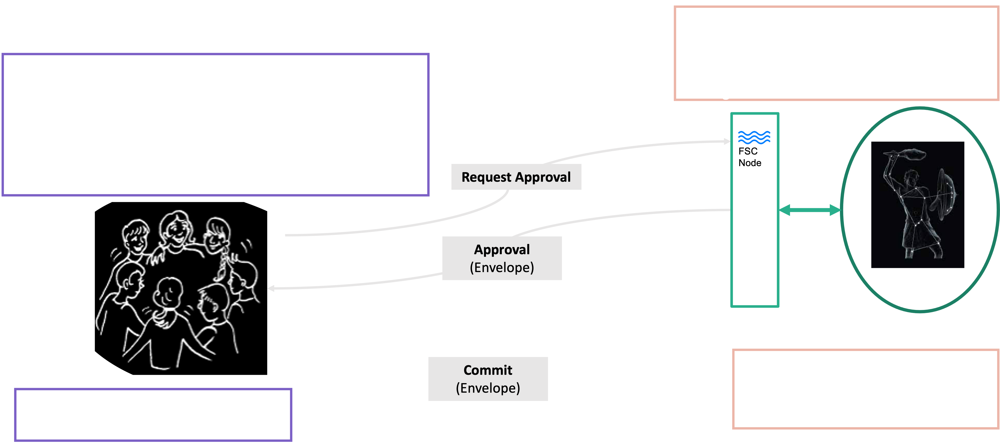

# Services

In this Section, we will see how to leverage the Token API to build a token-based application.
The Token SDK comes with pre-defined services that provide token specific functionality as we will see next. 
Moreover, the Token SDK stack allows to build custom services as needed.

## Token Transaction Service

To assemble token transactions, the Token SDK comes equipped with a dedicated service located in the package `token/services/ttx`.
This service is responsible for assembling the token transaction, managing the transaction lifecycle, and so on.

This service is ledger agnostic, meaning that it can be used to assemble token transactions for Fabric, for Orion, and so on.
This is made possible by the `token/services/network` service. This service abstracts away the complexities of the underlying 
ledger technology.
More on this service in its dedicated section.

The lifecycle of a Token Transaction consists of the following high-level steps:

1. `Assembling the Token Transaction`. In this phase, the business parties decide on the token operations
   that must happen atomically. The parties assemble the operations in a token transaction by following an interactive business process.
   Under the hood, a token transaction contains a Token Request (defined by the Token API).

2. `Collect Endorsements`. Once the Token Transaction is ready, meaning that the Token Request has been formed,
   one of the business parties, let call it the `leader`, takes the charge of the following sub-steps:
   - `Collect the relevant signatures for each action`: The leader contacts the relevant business parties to collect their signatures (endorsements).
     - From the issuers of new tokens, if any;
     - From the owners of the tokens spent, if any;
   - `Request Audit`. The leader sends the token transaction to the auditor that checks it and signs it if all checks pass.
     The auditor sends back the signature to the leader.
   - `Request Approval`. At this point the token transaction can be validated and translated to a format
     understood by the ledger backend. The leader sends the token transaction, stripped from all private data, 
     to the `Approvers` that validate it and translate it.
     The approvers send back the translated token transaction signed. We call these `approvals`.
     The leader attaches to the token transaction the approvals.
   - `Distribute the Approvals`. The leader sends the full token transaction, containing also the approvals, to all involved business parties.

3. `Commit`. The Token Transaction is fully formed and can be committed. The leader sends the token transaction to the ledger backend
   (e.g., in case of Fabric - we send the transaction to the ordering service)) stripping out all private information. 
   The leader, and all other business parties, can now wait for finality if needed. A transaction is final when the ledger backend
   says so and the transaction is committed to the local vault.

## Token Vault Service

The Token Vault service, located in `token/services/vault`, stores the available tokens owned by the wallets a party possess. 
Tokens appear in the vault if an issuer issued them or a third-party transferred some tokens to one of the wallets the party possess.
The vault service is backend agnostic. It uses the network service to get access to the local vault instance of a specific ledger backend. 

## Network Service

The `token/services/network` service is responsible for abstracting away the complexities of the underlying backend technology (e.g., Fabric, Orion, etc.)..
The service uses a driver-based design that let the developers implement new drivers for different ledgers.
Currently, the network service supports Fabric and Orion.

### Fabric Driver

The Fabric driver for the network service is located in the package `token/services/network/fabric`.
This driver assumes that the `Token Chaincode` (located in the package `token/services/network/fabric/tcc`)
is available in the Fabric network. This chaincode provides multiple functionalities that the Fabric driver uses.
Namely:
- `Public Parameters Lifecycle`. The public parameters govern the behaviour of the token chaincode. That is, how
  token requests are processed and translated, who can issue tokens, who must audit before committing the token transaction, etc.
- `Approval`. This is one of the essential steps in the lifecycle of a token transaction,
  as we have seen in the previous section. The Token Chaincode validates the received token request and, if valid, translates 
  it into the Read/Write Set (RW Set) format understood by Fabric.
  Notice that the Token Chaincode can only check the validity of the transaction. Though, double spending can only verified
  at committing time. To do so, the RW Set is generated in a way to trigger [`MVCC`](https://hyperledger-fabric.readthedocs.io/en/release-1.3/arch-deep-dive.html#the-endorsing-peer-simulates-a-transaction-and-produces-an-endorsement-signature) 
  conflicts in case of double spending.
  An approval in this case is just the endorsement over the RW Set.

To commit a token transaction, the Fabric network driver first derives a Fabric transaction with the RW Set 
obtained from the approval phase. Then, this Fabric transaction is sent to the Fabric ordering service.

The following figure illustrates the token transaction lifecycle for Fabric:

Let us explore now what happens when the Fabric transaction gets committed.
We expect to see the tokens created by the transaction appearing in the `Token Vault` of the owners.
The following picture shows how this happens:

In more details:
1. In background, each business party listens to the `Delivery Service` events generated by its Fabric peer partner.
   When the Fabric peer commits a token transaction `Tx`, the FSC node gets informed.
2. The `Delivery Client` informs the `Committer` that `Tx` is available.
3. If `Tx` is deemed valid by Fabric, then the `Committer` further manipulates the RW Set by invoking all registered
   `RW Set Processors` before the RW Set gets committed into the local Token Vault. If `Tx` is invalid, the transaction is
   discarded.
4. The Token SDK installs one of these processors, the `Token RW Set Processor`. This processor extracts all the token
   related information and augments the RW Set with additional information to speed up the token selection process, among other things.
5. Finally, the RW Set, after processing, is committed to the vault.

Only at this point, the tokens created by the transaction become available via the `Token Vault Service` we have discussed above.

### Orion Driver

The Orion driver is similar to the Fabric driver because also Orion manages RW Sets.
Though, in Orion there is not concept of chaincode or stored routines. 
To solve this problem, the Orion driver assumes the existence of a `Custodian` that sits in front of Orion
and handles the `approval` and `commit` steps.  

Here is the pictorial representation of the lifecycle of a token transaction for Orion:

