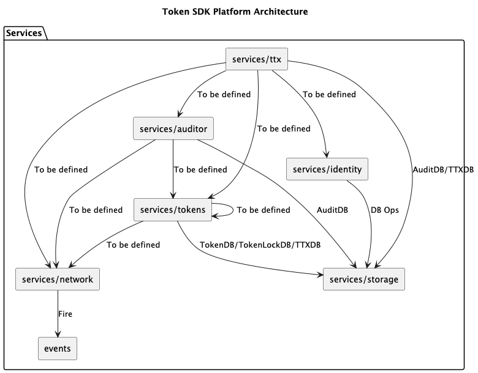
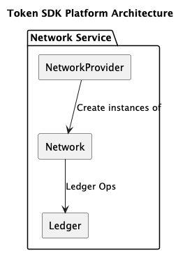
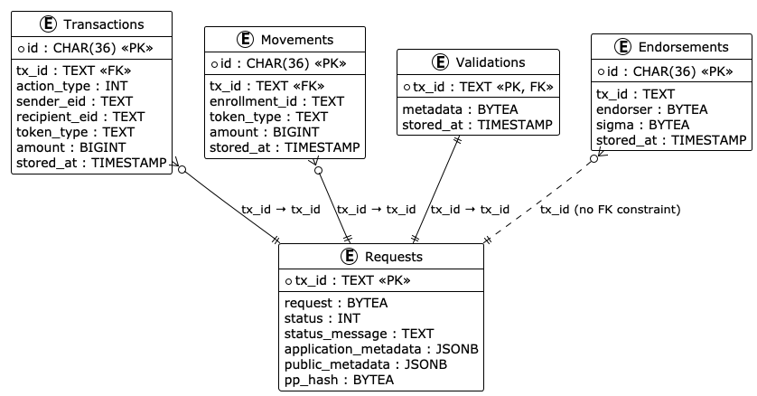
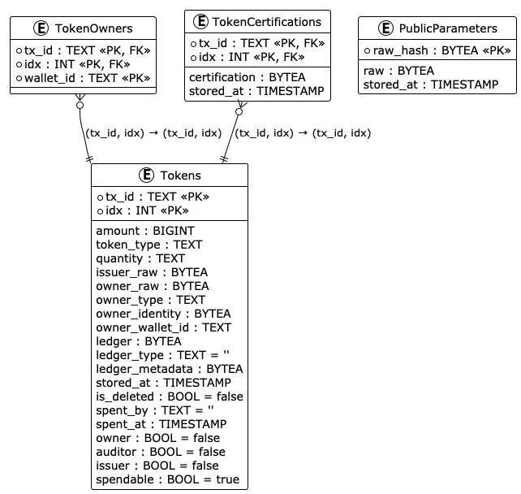
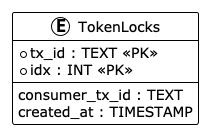
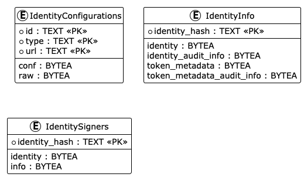
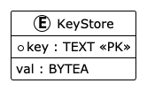

# Services

The services are pre-built functionalities to simplify the use of the Token API.
Some of the services are also used to back the `Drivers`, like the `Identity Service`.

Below is a pictorial representation of the `Services` and their interactions:

We have:
- `services/config`: Holds the configuration of the Token SDK.
- `services/identity`: This is the identity service.
  It is responsible for the management of wallets, long-term identities (X.509 and Idemix), and relative stores.
  It is used to back part of the Token and Driver API.
- `services/ttx`: This is the `token transaction service`.
  It helps developers assemble token requests and ultimately transactions for the backend.
  This package is backend agnostic and relies on the `network service` for backend-specific operations.
- `services/network`: This is the `network service`.
  It offers a unified way to handle different types of networks or backends (e.g., Fabric).
  It abstracts away the complexity of the specific underlying network.
  It is used solely by other services. The drivers should not refer in any way to details of the backend to remain agnostic.
- `services/storage`: This is the `storage service`.
  It contains the storage mechanisms needed by the Token SDK.
  It is used to back part of the Token and Driver API.
- `services/selector`: This is the `token selector service`.
  It is used to select tokens in such a way that the risk of accidental double-spending is minimized.
  Different implementations provide different trade-offs.
  It is used to back part of the Token and Driver API.

## The `services/network` Service

The `network` service is responsible for providing other services with a uniform and predictable interface to the backend (e.g., Fabric).
Internally, the network service is structured similarly to the Token API.
There is a provider of network instances (`Provider`) and network instances (`Network`).

Here is a pictorial representation of the network service:

The Fabric-based network relies on the Fabric Smart Client for its configuration and operations, such as querying chaincodes and broadcasting transactions.

At bootstrap time, the Token SDK goes through the TMS defined in the configuration.
For each TMS, the network provider is asked to return the network instance identified by the `network` and `channel` value of the TMS ID.
If the network provider fails, then the bootstrap of the Token SDK stack fails.
Otherwise, the `Connect` function on the network instance `Network` is called with the desired namespace (taken also from the TMS ID).
The implementation of this function is responsible for establishing a `connection` to the backend to serve the goals of the Token SDK.
In general, the Token SDK needs to know when the public parameters change and when a transaction gets finalized (either as valid or invalid).
The Fabric network implementation, upon calling `Connect`, opens two `Fabric Delivery` streams to receive the committed blocks from the Fabric committer.
- One stream is used to analyze transactions that update the public parameters.
  More specifically, for each transaction in a block, the parser checks if the RW set contains a write whose key is the `setup key`.
  The setup key is set as `\x00seU+0000`. If such a key is found in a valid transaction, then the listener added upon calling `Connect` does the following:
    - It invokes the `Update` function of the TMS provider passing the TMS ID and the byte representation of the new public parameters.
      The function works as follows: if a TMS instance with the passed ID does not exist, it creates one.
      If a TMS with that ID already exists, then:
        - A new instance of TMS is created with the new public parameters.
        - If the previous step succeeds, then the `Done` function on the old TMS instance is invoked to release all allocated resources.
    - If the above step succeeds, then the public parameters are appended to the `PublicParameters` table.
- The other stream is dedicated to transaction finality. Services can add listeners to the `Network` instance to listen for the finality of specific transactions.
  The `ttx` service and the `audit` service add a listener when a transaction has reached the point of being ready to be submitted to the ordering service.
  (For more information, look at the sections dedicated to these services). Both services use the same listener.
  This listener performs the following actions upon notification of the finality of a transaction:
    - If the transaction's status is valid, then the token request's hash contained in the transaction is matched against the hash of the token request stored in the database.
      If they match, then the `Tokens` table is updated by inserting the new tokens and marking the spent tokens as deleted.
      The corresponding token request in the `Requests` table is marked as `Valid` with a change of the status field.
    - If the transaction's status is invalid, then the corresponding token request in the `Requests` table is marked as `Invalid` or `Deleted`.
      In all other cases, an error is returned.

## The `services/storage` Service

FTS utilizes the following layers of abstraction on top of the database layer:
* `Store`: Executes the SQL queries. A `Store` is only used from within a `StoreService` of the same kind.
* `StoreService`: Extends the `Store` (of the same kind) by adding extra functionality (e.g., keeping maps, cache, or combining functionalities of the underlying store). A `StoreService` does not have any other dependency but the `Store`.
* `Service`: Combines `StoreService` and `Service` instances to provide more complete functionality that can be used by the application.
  Each domain has a `Store`, a `StoreService`, and potentially a `Service`.

The Fabric Token SDK utilizes a robust data management system to ensure the secure and reliable tracking of all token-related activities.
This system leverages several stores, each with a specific purpose.

A single backend system is shared by all databases, offering a more streamlined approach for deployments with simpler requirements.
The specific SQL Driver used by the application will ultimately determine the available deployment options.
For the list of options to configure SQL datasources, refer to the [Fabric Smart Client documentation](https://github.com/hyperledger-labs/fabric-smart-client/blob/main/docs/core-fabric.md).
Currently, only `SQLite` and `Postgres` are supported.

### Transaction Store (`ttxdb`)

This critical store serves as the central repository for all transaction records.
It captures every token issuance, transfer, or redemption, providing a complete historical record of token activity within the network.
The `ttxdb.StoreService` store is located under `token/services/ttxdb`. It is accessible via the `ttx.Service`.

Here is the data model:

Tables:
- `Requests`: Contains the list of `Token Requests` assembled so far. The initial status of a token request is `Pending`.
  When finalized by the backend, it gets status `Valid`. If it is rejected by the backend, it gets status `Invalid`.
  Each token request has a unique identifier.
- `Transactions`: Each Token Request may consist of multiple `Actions`. Each action is represented as a transaction and bound to the same token request.
- `Movements`: Once a transaction is finalized by the backend and its status becomes `Valid`, the transaction gets expanded into its constituent `movements`.
  A movement is either:
    - The transfer of tokens from a source to a destination, or
    - An issuance of tokens to a destination, or
    - The transfer of tokens from a source to void (redemption).
- `Endorsements`: Contains the `endorsement acks` received for a given token request.
- `Validations`: If the node is also a validator (or endorser) of token requests, `Validators` stores the result of the validation of each and every processed token request.

### Token Store (`tokendb`)

The `tokendb` acts as the registry for all tokens within the system.
It stores detailed information about each token, including its unique identifier, denomination type (think currency or unique identifier), current ownership, and total quantity in circulation.
By referencing the `tokendb`, developers and network participants can obtain a clear picture of the token landscape.
The `tokendb.StoreService` is used by the `Token Selector` to select the tokens to use in each transaction, and by the `Token Vault Service` to provide its services.
The `tokendb.StoreService` service is located under `token/services/tokendb`. It is accessible via the `tokens.Service`.

Here are the data models:

The tables `Tokens` and `TokenOwners` are populated when the backend signals that a given transaction previously assembled is valid.
The table `TokenCertifications` is not used yet.
The table `PublicParameters` is appended with the public parameters as they get announced by the `network service`.

### Audit Transactions Store (`auditdb`)

For applications requiring enhanced auditability, the `auditdb` provides an additional layer of transparency.
It meticulously stores audit records for transactions that have undergone the auditing process.
This functionality is particularly valuable for scenarios where regulatory compliance or tamper-proof records are essential.
The `auditdb.StoreService` is located under `token/services/auditdb`. It is accessible via the `auditor.Service`.
The data model for this DB is identical to that of the transactions DB.

### Identity Store (`identitydb`), Wallet Store (`walletdb`), and Key Store (`keystore`)

As discussed, a Wallet acts like a digital identity vault, holding a `long-term identity` and any `credentials derived from it`.
This identity can take different forms, such as an X.509 Certificate for signing purposes or an [`Idemix Credential`](https://github.com/IBM/idemix) with its associated pseudonyms.

To keep track of the above information we use the following stores:
- `IdentityDB`: Used to store identity configuration, signer related information, audit information, and so on.

  Here is the data model:

  

  The `IdentityConfigurations` table contains the following fields:
    - ID: A unique label to identify this identity configuration.
    - TYPE: Either "Owner", "Issuer", "Auditor", or "Certifier".
      This table stores information about long-term identities upon which wallets are built.

- `WalletDB`: Used to track the mapping between identities, wallet identifiers, and enrollment IDs.

  Here is the data model:

  

- `Keystore`: Used for key storage.

  Here is the data model:

  

A wallet must refer to an entry in the `IdentityConfigurations` table via its `id` field.
The wallet identifier is indeed set to the value of the `id` field.
Such an entry contains information about the public version of the `long-term` identity (X.509 Certificate or Idemix Credential).
Secrets are either stored in an external `KeyStore` or spread between `IdentityConfigurations` (raw field) and the Token SDK's `Key Store`.

When an identity is derived from a wallet, its info and signer information are stored in the `IdentityInfo` and `IdentitySigners` tables respectively.
Derivation of an identity involves the generation of secrets that are either stored in the Token SDK Key Store or in an external one.
Depending on the implementation, the generation of these secrets can happen on remote storage.

The `IdentityInfo` table also contains identities of external parties.
Imagine the scenario where Alice transfers tokens to Bob. Bob sends Alice the identity Bob wants to use to receive the tokens, and Alice stores this information in the IdentityInfo table.
In this case, there is no signer associated with this identity; Alice knows then that this is not one of her identities.

## The `services/ttx` Package

Let us start with the `services/ttx` package. This is the `token transaction service`.
It helps developers assemble token requests and ultimately transactions for the backend.
This package is backend agnostic and relies on the `network service` for backend-specific operations.
This service leverages the FSC's view framework. Therefore, the package consists of a series of `Views` and support `structs`.

Here is a pictorial representation of the lifecycle of a token transaction with Fabric as the backend.

### Transaction Creation

A new transaction can be built from scratch or deserialized from a byte array.

To instantiate a transaction from scratch, the developer needs:
- The TMS ID (network, channel, namespace) of the TMS for which the transaction needs to be created.
  This means that the system is configured with that TMS and the relative Fabric network is also configured.
  If the TMS ID is not specified, the TMSP returns the default TMS, if available.
  If a TMS instance has not been created yet, it gets created on the fly.
- The `Network` instance from the network service.
  This means that the system is configured with a backend that can be located using the TMS ID.
- If the transaction is anonymous, the network service is asked to return an anonymous identity.
  This identity is just the public part that will appear in the Fabric transaction.
  This anonymous identity is generated by the FSC stack.
  Moreover, the FSC `sig service` can produce valid signatures of any message for this identity.
  The constructor of the transaction then generates:
- A Transaction ID that can be used for both a Fabric transaction and a Token Request as an anchor.
- `NewRequest` is invoked on the TMS, which returns an instance of an empty token request.

When a transaction is created,
it adds a hook to the FSC view context such that if an error occurs, all resources used by the transaction are released (e.g., locked tokens).

### Request Recipient Identities

To both issue and transfer tokens, the initiator of these operations needs to know the recipient identity to assign to the newly created token.
For concreteness, let us imagine the following scenario: Alice wants to transfer a token of type `TOK` and quantity `1` to Bob.
Alice needs to request Bob's recipient identity.
The ttx package offers the initiator view `RequestRecipientIdentityView` and responding view `RespondRequestRecipientIdentityView`.
These views define an interactive protocol at the end of which Alice learns Bob's recipient identity.

The views assume that Alice and Bob already know each other and their FSC stack is configured to enable the opening of an FSC communication session.

Then, `RequestRecipientIdentityView` does the following:
- Prepares a `RecipientRequest` message containing the TMS ID and Wallet ID.
- Opens an FSC communication session to Bob, passing Bob's identifier (as registered in Alice's FSC endpoint service) to the FSC stack.
- Sends the marshalled version of `RecipientRequest`.
- Waits for a message to come back.

By virtue of the FSC view framework, Bob executes `RespondRequestRecipientIdentityView` that does the following:
- Receives the `RecipientRequest` on the default FSC session.
- Validates it by checking that a TMS with the passed ID exists and a wallet with the passed ID exists.
  To do so, the view asks the TMSP to retrieve the requested TMS.
  By using the TMS's WalletManager, the view checks that an owner wallet with the requested ID exists.
  If the TMS or the wallet does not exist, then an error is returned to the initiator.
- Invokes the function `GetRecipientData` on the owner wallet.
  The owner wallet then generates on the fly (or picks from a cache, if available) an instance of `driver.RecipientData`.
  It contains an identity and its audit information. The identity is an Idemix pseudonym. The rest of the fields are empty for the assumed token driver.
  If this operation is successful, a row in the table `IdentityInfo` is added with the content of `driver.RecipientData`.
  Another row in the table `IdentitySigners` is added to signal that this identity belongs to the node that created it.
  Another row is added to the `KeyStore` table with the secret key bound to the `identity` (the Idemix pseudonym).
- Sends `RecipientData` back on the default FSC session.
- Updates the FSC endpoint service by binding `RecipientData.identity` to its own FSC node identity.

Then, `RequestRecipientIdentityView` does the following:
- Reads `RecipientData` from the session.
- Registers it in the `WalletManager`, which checks that the information contained in `RecipientData` is correct and compatible with the public parameters.
  The registration results in a row added to the `IdentityInfo` table.
- Finally, it records that `RecipientData.Identity` belongs to Bob by updating the FSC endpoint service.

### Token Operations

A token request supports two fundamental types of operations: Issue and Transfer.
These are sufficient to perform a redeem and other variants of the fundamental operations.
A transaction helps to assemble these operations. A transaction can contain multiple operations at the same time.
They are either all committed or none.

#### Issue Operation

The transaction has an `Issue` function to assemble an `Issue` action.
These are the requirements:
- A TMS instance for a given ID retrievable from the TMS Provider.
- An issuer wallet retrievable from the TMS's Wallet Manager for a given wallet identifier.
  To have such a wallet, there must be a row in the `IdentityConfigurations` table whose ID matches the wallet identifier and whose type is `Issuer`.
- A token type among those supported (any string works).
- The quantity to put in the issued token.

When invoked, the function invokes the corresponding `Issue` function on the `TokenRequest` (Token API) that does the following:
- Validates the inputs. For instance, the quantity must be <= `MaxTokenValue`.
- Retrieves an Issuer identity from the issuer wallet via a call to `GetIssuerIdentity` for the request type.
  Currently, the same identity is returned no matter the type. The identity returned corresponds to that in a row of the `IdentityInfo` table.
  When creating an issuer wallet, the wallet manager immediately adds a row to the `IdentityInfo` table. The issuer wallet doesn't support pseudonyms.
- Uses the `IssueService` from the Driver API to generate an issue action as per the Token Driver identified by the TMS's public parameters.
- The issue action and its metadata are added to the token request as serialized action and metadata.

### Transfer Operation

The transaction has a `Transfer` function to assemble a `Transfer` action.
These are the requirements:
- A TMS instance for a given ID retrievable from the TMS Provider.
- An owner wallet retrievable from the TMS's Wallet Manager for a given wallet identifier.
  To have such a wallet, there must be a row in the `IdentityConfigurations` table whose ID matches the wallet identifier and whose type is `Owner`.
- A token type among those supported (any string works).
- Pairs of <quantity, recipient identity>. For each pair, a token will be added to the action with the corresponding quantity and recipient identity as owner.

When invoked, the function invokes the corresponding `Transfer` function on the `TokenRequest` (Token API) that does the following:
- Validates the inputs. For instance, the quantities must be <= `MaxTokenValue`.
- Obtains a new `Selector` anchored to the ID of the transaction from the TMS's `SelectorManager` (Driver API).
- Invokes the `Selector`'s `Select` function to choose enough tokens to cover the total amount to transfer from the selected owner wallet.
  When selecting tokens, the selector picks them from the `Tokens` table such that they are spendable (`is_deleted` is false and `is_spendable` is true).
  When a token is picked to be used, the selector tries to acquire a lock over it by inserting a row in the `TokenLocks` table.
  If the insert is successful, then the token is reserved for this selector. If not, the selector tries another token.
- If the selector does not manage to get enough tokens to cover the demand, then an error is returned and all the locked tokens are released. This way, they can be used by other selectors.
- Uses the `TransferService` from the Driver API to generate a transaction action as per the Token Driver identified by the TMS's public parameters.
- The transfer action and its metadata are added to the token request as serialized action and metadata.

**Remark**: A redeem operation is not offered directly by the Token Request (Token API) because it is just a transfer to an `empty` recipient identity.
The transaction contains a `Redeem` function to hide this aspect from the developer.

### Collect Endorsements

Once a transaction has been filled with all the necessary actions, its token request needs to be equipped with a series of signatures.
Namely:
- For each token spent by the transaction, a signature valid under the owner field of that token.
- A signature from one of the issuers if the transaction contains issue actions.
- A signature from one of the auditors if the auditors are set.
- A signature from the endorsers/approvers of the namespace this transaction refers too. (Recall that TMS ID contains a namespace field that matches the namespace in Fabric).

The identities of the valid issuers and auditors are set in the public parameters.
In addition to the above, all the recipients of tokens need to receive the token request to extract from it the metadata required to spend the freshly created tokens.

The `CollectEndorsementsView` is responsible for performing all the above operations.
Let us describe them in more detail. The view takes a transaction as input and does the following:

- For each transfer action, collect the identities that must sign them (the owner of all the tokens spent).
- For each deduplicated identity collected, does the following:
    - If the node owns that identity, then sign the token request directly.
      The TMS's SigService (Token API) is used to check this (the presence of a signer for that identity signals that the node is the issuer itself).
    - If the node does not own that identity, then the view asks for a `remote signature`.
      In this case, the view asks the FSC stack to open a session towards that identity.
      We assume that the node's FSC endpoint service has been instructed about how to locate the node that owns that identity (See `Request Recipient Identities` for an example).
      The node sends a `SignatureRequest` message to the remote party.
      The remote party's FSC view manager is programmed to respond with a view that at some point of its execution must use the `ReceiveTransactionView`.
      This view can be used to receive either the marshalled version of a transaction or a `SignatureRequest` message.
      In both cases, `ReceiveTransactionView` returns a `Transaction`.
      The remote party can inspect the transaction and use the `AcceptView` to respond with the expected signature.
    - The node checks the signature received. If the signature is valid, the node continues; otherwise, it returns an error.
- The same thing is done for each issue action.
- Collect the signature from the auditor. The process is similar to the above. The auditor must use the `AuditApproveView` to approve the token request and send back its signature.
- Collect the endorsement/approval from the Fabric Endorsers of the given namespace (in the TMS ID).
  This operation is delegated to the `network service` that is in charge of dealing with the Fabric process to obtain an endorsement.
  Given the TMS ID, the relative network service is located and the function `RequestApproval` is invoked.
  The result of this operation is an instance of the network struct `Envelope`. This instance is attached to the transaction.
- Store the `transaction records` corresponding to the current version of the token request.
  This operation trigger a series of DB operations that will update the `Transactions DB` and `Tokens DB`.
  Moreover, a finality listener is added to the network service corresponding to the transaction's TMS ID (via a call to `AddFinalityListener`).
  This signals the network to alert when a notification comes about the status of the transaction.
  When the notification comes, the status of the row corresponding to the current token request is updated to `Valid` or `Deleted`.
- (distribution step) For each recipient, the owner of a token, the view opens a session to the node that owns that identity.
  The view send to this node the serialized version of the transaction stripping out from the metadata information that do not belong to that identity.
  Indeed, imagine that Alice sends tokens to Bob and Charlie at the same time. Bob doesn't need to know which tokens Alice is using nor that Charlie has also received something.

The `AcceptView` is invoked inside a responding view for a given business process.
It is used every time a party receives tokens.
When invoking this view, it is expected to invoke `ReceiveTransactionView` first to receive either a transaction or a `SignatureRequest` message.
This view does the following:
- Respond to all the requests of signatures as defined in the token request. Don't forget that the token request must be inspected before calling the AcceptView.
  This means that for each expected `SignatureRequest`, the view checks that it matches one of the expected.
    - Then, via the TMS's `SigService`, it obtains a signer for the identity whose signature is requested.
    - Generates the signature and sends it back via the default session.
- Then, the view calls the `ReceiveTransactionView` to receive the transaction that the initiator sends during the execution of `CollectEndorsementsView` (distribution step).
- Store the `transaction records` corresponding to the current version of the token request.
  This operation trigger a series of DB operations that will update the `Transactions DB` and `Tokens DB`.
  Moreover, a finality listener is added to the network service corresponding to the transaction's TMS ID (via a call to `AddFinalityListener`).
  This signals the network to alert when a notification comes about the status of the transaction.
  When the notification comes, the status of the row corresponding to the current token request is updated to `Valid` or `Deleted`.
- Send back an acknowledgement by signing with the FSC default identity the serialized version of the transaction.

Recall that also a recipient (who does not need to sign the token request) will receive the transaction.
The `AcceptView` handles also this case by managing the case that no SignatureRequest messages are sent.

The `AuditApproveView` is invoked inside a responding view for a given auditing business process.
The auditor is supposed to invoke `ReceiveTransactionView` first to receive the transaction to audit.
The auditor will perform all the required business checks and if no error occurs during the check,
the auditor will invoke the `AuditApproveView`.
The view does the following:
- Store the `transaction records` corresponding to the current version of the token request.
  This operation trigger a series of DB operations that will update the `Audit Transactions DB` and `Tokens DB`.
  Moreover, a finality listener is added to the network service corresponding to the transaction's TMS ID (via a call to `AddFinalityListener`).
  This signals the network to alert when a notification comes about the status of the transaction.
  When the notification comes, the status of the row corresponding to the current token request is updated to `Valid` or `Deleted`.
- Retrieves an Auditor identity from the auditor wallet via a call to `GetAuditorIdentity`.
  Currently, the same identity is returned no matter the type. The identity returned corresponds to that in a row of the `IdentityInfo` table.
  When creating an auditor wallet, the wallet manager immediately adds a row to the `IdentityInfo` table. The auditor wallet doesn't support pseudonyms.
  To have such a wallet, there must be a row in the `IdentityConfigurations` table whose ID matches the wallet identifier and whose type is `Auditor`.

### Ordering a Transaction

Once a transaction gets endorsed via the use of the `CollectEndorsementsView`, then it is ready to be ordered.

The `OrderingView` performs this operation. It takes a transaction as input and does the following:
- Get the network from the `network service` using the transaction's TMS ID.
- Invoke the network's `Broadcast` function that takes in input a network envelope.
  This is translated to a call to the FSC broadcast service for the given Fabric network.

### Finality of a Transaction

If the developers want to know the status of a given transaction, they can either query the Transactions store or invoke the `FinalityView`.
This view takes as input either a transaction or a transaction ID and does the following:
- Check the status of the Request with the given transaction ID in the Transactions DB.
  If the status is either `Valid` or `Invalid`, then the view returns immediately without and with an error respectively.
- Otherwise, the status is `Pending` and the view adds a listener to the Transactions DB to get notified when the request's status changes.
- If a timeout occurs, an error is returned.
- If a notification arrives, an error is returned if the status is `Invalid`; no error if the status is `Valid`.
