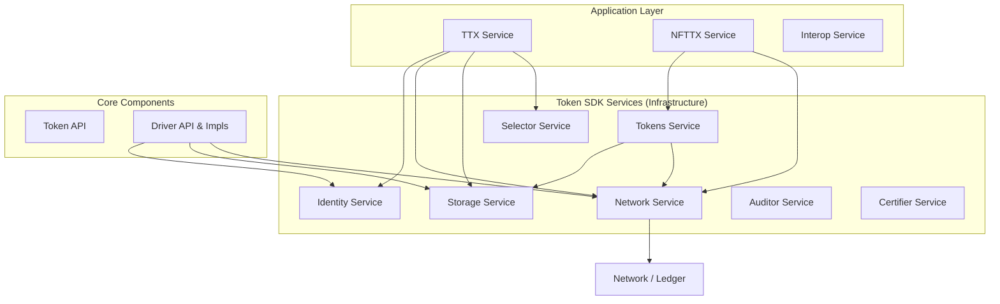

# Services

Services in the Fabric Token SDK provide pre-built, high-level functionality designed to streamline the use of the Token API. These services are organized into two categories: **Application Services**, which orchestrate complex business logic, and **Infrastructure Services**, which provide foundational capabilities used by both Application Services and Token Drivers.

The entire Token SDK utilizes **Fabric Smart Client (FSC)** project-wide facilities for logging, error handling, and monitoring to ensure consistency and reliability across the platform.

## Service Ecosystem

The following diagram illustrates the high-level relationship between the Token SDK layers and the internal services:

```mermaid
graph TD
    subgraph "Application Layer"
        TTX[TTX Service]
        NFTTX[NFTTX Service]
        Interop[Interop Service]
    end

    subgraph "Token SDK Services (Infrastructure)"
        Identity[Identity Service]
        Network[Network Service]
        Storage[Storage Service]
        Tokens[Tokens Service]
        Selector[Selector Service]
        Auditor[Auditor Service]
        Certifier[Certifier Service]
    end

    subgraph "Core Components"
        TokenAPI[Token API]
        Driver[Driver API & Impls]
    end

    TTX --> Identity
    TTX --> Network
    TTX --> Storage
    TTX --> Selector
    
    NFTTX --> Tokens
    NFTTX --> Network

    Tokens --> Storage
    Tokens --> Network
    
    Driver --> Identity
    Driver --> Storage
    Driver --> Network
    
    Network --> DLT[Network / Ledger]
```

## Application Services

Application services provide the primary interface for developers to build tokenized applications.

### Token Transaction (TTX) Service
The [TTX Service](./services/ttx.md) is the central orchestration component. It manages the lifecycle of a token transaction, from request assembly and signing to submission and finality tracking. It is designed to be backend-agnostic, relying on the **Network Service** to bridge the gap to specific DLT platforms.

### NFTTX Service
The [NFTTX Service](./services/nfttx.md) provides specialized support for Non-Fungible Tokens (NFTs). it manages the unique properties and lifecycle requirements of NFTs, ensuring uniqueness and proper metadata handling.

### Interoperability (Interop) Service
The [Interop Service](./services/interop.md) enables cross-chain and cross-network operations, such as Atomic Swaps via Hashed Timelock Contracts (HTLCs). It provides the necessary scripts and validation logic to ensure secure value exchange between different environments.

## Infrastructure Services

Infrastructure services are internal to the SDK and provide the building blocks for token operations.

### Identity Service
The [Identity Service](./services/identity.md) is internal to the Token SDK and is **independent** of the FSC identity service. It handles the management of cryptographic material, signatures, and wallets (supporting both X.509 and Idemix) specifically for token operations. This isolation ensures that token-related identities are managed according to the requirements of the token drivers (e.g., privacy-preserving signatures).

### Network Service
The [Network Service](./services/network.md) acts as a bridge layer. It translates generic token requests into backend-specific formats (such as Fabric or FabricX) and manages communication with the underlying ledger. It is also responsible for tracking transaction finality and triggering listeners when transactions are committed.

### Storage Service
The [Storage Service](./services/storage.md) encapsulates all data persistence mechanisms required by the SDK. It manages specialized databases for different types of information, including:
*   **TTXDB**: Stores transaction history and status.
*   **TokenDB**: Maintains the current state of tokens (UTXOs).
*   **AuditDB**: Used by auditors to track and verify transaction compliance.
*   **WalletDB**: Stores identity and wallet-related metadata.

### Tokens Service
The [Tokens Service](./services/tokens.md) provides advanced operations on tokens that go beyond basic UTXO management. This includes de-obfuscating token metadata for authorized parties and handling token upgrades (e.g., migrating from one driver implementation to another).

### Selector Service
The [Selector Service](./services/selector.md) implements strategic token selection algorithms. It is responsible for selecting the optimal set of UTXOs for a given transaction while mitigating the risk of double-spending by temporarily locking tokens in use.

### Auditor Service
The [Auditor Service](./services/auditor.md) provides tools for oversight and compliance. It allows authorized auditors to inspect transactions, verify public parameters, and ensure that the system adheres to established rules without compromising the privacy of non-audited users.

### Certifier Service
The [Certifier Service](./services/certifier.md) handles the lifecycle of token certifications, which are used in certain driver implementations (like `zkatdlog`) to provide additional proofs of validity or ownership that can be verified off-chain.
