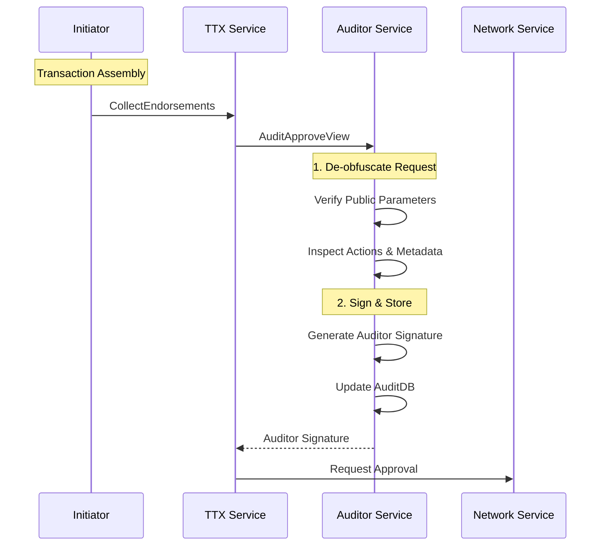

# Auditor Service

The **Auditor Service** (`token/services/auditor`) provides specialized tools and interfaces for nodes acting in an oversight or compliance role. It allows authorized auditors to inspect token transactions, verify the validity of public parameters, and ensure the integrity of the token system without compromising the privacy of non-audited users.

## Core Responsibilities

The Auditor Service is responsible for:
*   **Transaction Inspection**: De-obfuscating and verifying the contents of token requests (Issue and Transfer actions) using the auditor's cryptographic material.
*   **Compliance Verification**: Checking that transactions adhere to system-wide rules (e.g., maximum token values, authorized issuers).
*   **Audit Approval**: Providing the necessary signatures and proofs to authorize a transaction, which are often required by the ledger's validation logic for certain drivers (e.g., `zkatdlog`).
*   **Audit Storage**: Maintaining a separate **AuditDB** to store historical records of audited transactions for reporting and regulatory purposes.

## Interaction with TTX Service

The Auditor Service is typically invoked during the `CollectEndorsements` phase of a token transaction.

## Audit Management

Auditors use specialized wallets (Auditor Wallets) managed by the **Identity Service**. These wallets contain the cryptographic keys necessary to "open" the commitments and proofs found in privacy-preserving token transactions.

The service provides the `AuditApproveView`, which auditors use to respond to incoming audit requests. This view automates the verification and signing process, ensuring that the auditor only approves transactions that are fully compliant with the system's public parameters.
