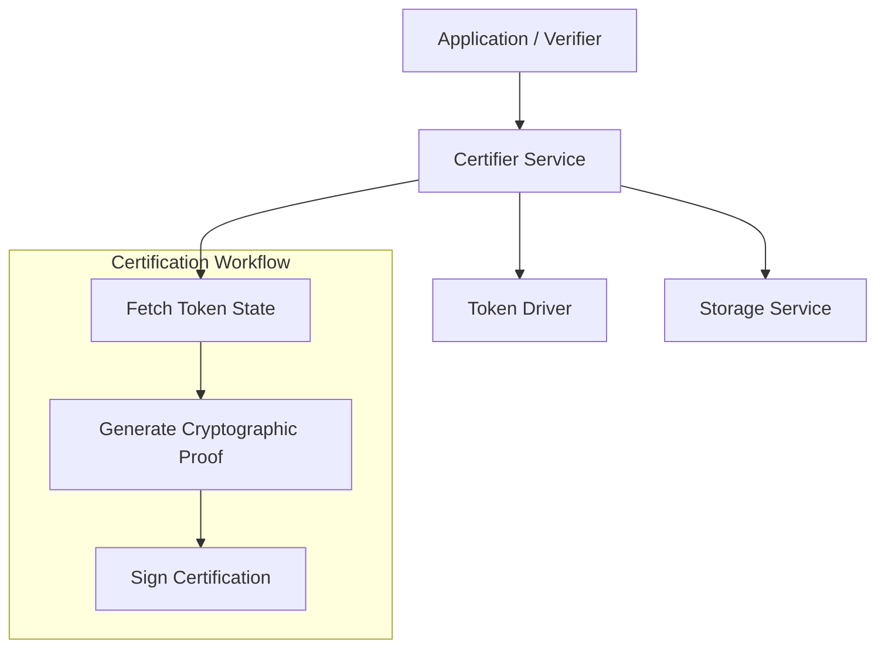

# Certifier Service

The **Certifier Service** (`token/services/certifier`) provides specialized capabilities for generating and managing token certifications. Certifications are cryptographic proofs of the validity or ownership of a token that can be verified by third parties, often off-chain.

## Core Responsibilities

The Certifier Service is responsible for:
*   **Certification Generation**: Creating cryptographic attestations for specific tokens based on the current state of the ledger.
*   **Proof Verification**: Providing mechanisms to verify certifications without requiring a direct connection to the DLT.
*   **Privacy-Preserving Proofs**: Generating proofs (e.g., Zero-Knowledge Proofs) that demonstrate a token's validity while selectively hiding sensitive details like its exact quantity or owner.

## Architecture

The Certifier Service is particularly critical for privacy-preserving drivers like `zkatdlog`.

## Key Capabilities

### Off-Chain Verification
Certifications allow for "lightweight" verification of token state. For example, a user can present a certification to a third party (like an exchange or a merchant) to prove they own a specific token with a certain value, without that third party having to query the DLT directly.

### Role of Certifiers
In some system configurations, specific nodes are designated as **Certifiers**. These nodes are trusted to inspect the ledger and issue certifications. The Certifier Service provides the necessary Views and APIs for these nodes to receive certification requests, verify the requested token's status in their local `TokenDB`, and respond with a signed certification.

### Integration with Drivers
The service leverages the **Driver API** to generate the actual cryptographic proof. Different drivers may implement certifications in different ways (e.g., a simple signature over the token ID for cleartext tokens, or a complex ZKP for privacy-preserving ones).
