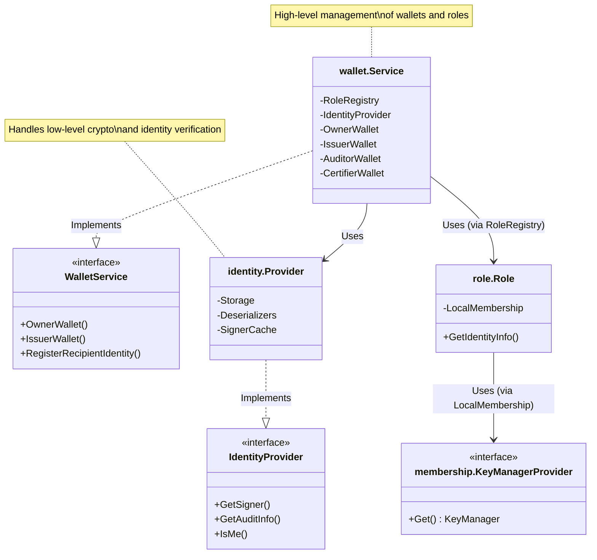

# Identity Service

The **Identity Service** (`token/services/identity`) provides a unified interface for managing identities, signatures, and verification within the Fabric Token SDK. 
It abstracts the underlying cryptographic details, allowing the SDK to support multiple identity types (e.g., X.509, Idemix) and different storage backends seamlessly.

This service is a fundamental component used by token drivers and other services (like the Token Transaction (TTX) service) to handle:
*   **Signatures**: Generating and verifying signatures for transactions.
*   **Identity Resolution**: resolving long-term identities to ephemeral identities and vice-versa.
*   **Auditability**: Managing audit information to reveal the enrollment ID behind an anonymous identity (if allowed).
*   **Role Management**: Handling identities for different roles (Issuer, Auditor, Owner, Certifier).

## Architecture

The Identity Service is designed to implement the **Driver API** interfaces defined in `token/driver/wallet.go`. 
This ensures that the token management system can interact with any identity implementation through a standard set of methods.

### Conceptual Metaphor

To better understand the components, imagine a **Corporate Security Department**:

*   **Identity Service (The Department)**: The entire division responsible for security and access.
*   **Wallet Service (The Keymaster)**: Maintains a registry of all employees (Wallets) and the badges (Keys) they possess. It knows who has access to what.
*   **Identity Provider (The Passport Office)**: Verifies identities. It checks if a badge is authentic and extracts information from it (Project ID, Department ID).
*   **Roles (Job Titles)**: Groups of employees with similar access rights (e.g., "Auditors" have special keys to view records, "Issuers" have keys to create assets).
*   **Key Managers (The Badge Makers)**: The specific machines or protocols used to create the badges (e.g., one machine makes standard plastic cards (X.509), another makes high-tech smart cards (Idemix)).

### Component Mapping

Here is how the service components map to the Driver API:

| Component              | Implements Driver Interface | Description                                           |
|:-----------------------|:----------------------------|:------------------------------------------------------|
| `identity.Provider`    | `driver.IdentityProvider`   | Core identity management & verification.              |
| `wallet.Service`       | `driver.WalletService`      | Registry for all wallets (Owner, Issuer, etc.).       |
| `role.LongTermOwnerWallet`     | `driver.OwnerWallet`        | Long Term Identity-based  Onwer wallet functionality. |
| `role.AnonymousOwnerWallet`     | `driver.OwnerWallet`        | Anonymous Identity-based  Onwer wallet functionality. |
| `role.IssuerWallet`    | `driver.IssuerWallet`       | Issuer wallet functionality.                          |
| `role.AuditorWallet`   | `driver.AuditorWallet`      | Auditor wallet functionality.                         |
| `role.CertifierWallet` | `driver.CertifierWallet`    | Certifier wallet functionality.                       |

### Component Interaction Diagram



### LocalMembership

The `LocalMembership` component (`token/services/identity/membership`) plays a pivotal role in managing local identities for a specific role (e.g., Owner, Issuer).

*   **Binding**: Each instance is bound to a list of **Key Managers**.
*   **Identity Wrapping**: When a Key Manager generates an identity (based on the configuration), `LocalMembership` automatically wraps it using `WrapWithType`. 
    This ensures that the generated identity carries the correct type information required by the system (as defined in `token/services/identity/typed.go`).
*   **Role Implementation**: `LocalMembership` serves as the foundational implementation for `role.Role`. 
    When you interact with a Role to resolve an identity or sign a transaction, you are effectively delegating to the underlying `LocalMembership`.

### Example: Wiring Services

The following example demonstrates how these services are instantiated and wired together, as seen in the ZKATDLog driver:

```go
func (d *Base) NewWalletService(...) (*wallet.Service, error) {
    // 1. Create Identity Provider
    identityProvider := identity.NewProvider(...)

    // 2. Initialize Membership Role Factory
    roleFactory := membership.NewRoleFactory(...)

    // 3. Configure Key Managers (e.g. Idemix and X.509 for Owner role)
    // we have one key manager to handle fabtoken tokens and one for each idemix issuer public key in the public parameters
    kmps := make([]membership.KeyManagerProvider, 0)
    // ... add Idemix Key Manager Providers ...
    kmps = append(kmps, x509.NewKeyManagerProvider(...))

    // 4. Create and Register Roles
    roles := role.NewRoles()
    
    // Owner Role (with anonymous identities)
    ownerRole, err := roleFactory.NewRole(identity.OwnerRole, true, nil, kmps...)
    roles.Register(identity.OwnerRole, ownerRole)
    
    // Issuer Role (no anonymous identities)
    issuerRole, err := roleFactory.NewRole(identity.IssuerRole, false, pp.Issuers(), x509.NewKeyManagerProvider(...))
    roles.Register(identity.IssuerRole, issuerRole)
    
    // ... Register Auditor and Certifier roles ...

    // 5. Create Wallet Service with the registered roles
    return wallet.NewService(
        logger,
        identityProvider,
        deserializer,
        // Convert the roles registry into the format expected by the wallet service
        wallet.Convert(roles.Registries(...)),
    ), nil
}
```

## Identity Types

The Identity Service leverages a wrapper called **TypedIdentity** to support various identity schemes uniformly. 
This allows the SDK to be extensible and capable of handling different cryptographic requirements.

### TypedIdentity

`TypedIdentity` (defined in `token/services/identity/typed.go`) acts as a generic container. 
It wraps the raw identity bytes with a type label, enabling the system to verify deserializers and process signatures correctly without hardcoding implementation details.
*   **Structure**: Contains a `Type` (string) and the `Identity` (raw bytes).

### Default Key Managers

The identity service includes two primary implementations for concrete identities:

#### 1. X.509
Standard PKIX identities.
*   **Transparency**: Verification reveals the identity of the signer.
*   **Usage**: Ideal for infrastructure components (nodes, services) or scenarios where anonymity is not required.
*   **Implementation**: `token/services/identity/x509`.

#### 2. Idemix (Identity Mixer)
Advanced identity encryption based on Zero-Knowledge Proofs (ZKP).
*   **Anonymity**: Users can prove they hold a valid credential without revealing their actual identity.
*   **Unlinkability**: Different transactions from the same user appear uncorrelated.
*   **Auditability**: Includes "audit info" facilitating regulatory compliance by allowing authorized auditors to reveal the identity.
*   **Implementation**: `token/services/identity/idemix`.

### Other Identity Types

The architecture supports specialized identity types for complex use cases:

#### Multisig
Located in `token/services/identity/multisig`.
*   **Concept**: An identity that wraps multiple sub-identities.
*   **Usage**: Useful for requiring multiple signatures or representing a group of parties.
*   **Auditability**: Aggregates audit information for all underlying identities.

#### HTLC (Hashed Time Lock Contract)
Located in `token/services/identity/interop/htlc`.
*   **Concept**: A script-based identity used primarily for interoperability mechanisms like atomic swaps.
*   **Structure**: Encapsulates a **Sender** identity, a **Recipient** identity, hash lock information, and a timeout.
*   **Behavior**: Validation involves satisfying the script conditions (e.g., providing the hash preimage).
