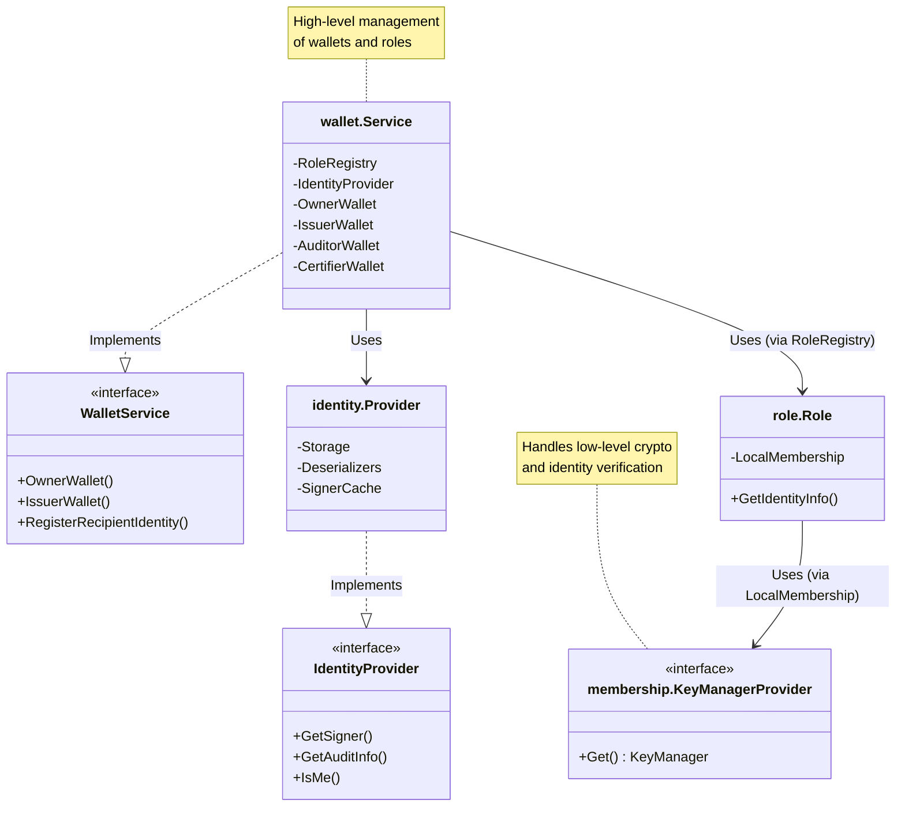

# Identity Service

The **Identity Service** (`token/services/identity`) is an **internal infrastructure service** of the Fabric Token SDK. It provides a unified interface for managing identities, signatures, and verification, operating **independently** of the core Fabric Smart Client (FSC) identity service. 

This independence ensures that token-related cryptographic material (such as Idemix pseudonyms or X.509 certificates used for token ownership) is managed according to the specific privacy and security requirements of the Token Drivers, regardless of the underlying DLT platform.

## Overview

The Identity Service abstracts the complexity of different cryptographic schemes, allowing the SDK to support multiple identity types (e.g., X.509, Idemix) and different storage backends seamlessly. 

It is a fundamental component used by token drivers and application services (like the TTX service) to handle:
*   **Signature Management**: Generating and verifying signatures for token requests.
*   **Identity Resolution**: Resolving long-term identities to ephemeral pseudonyms and vice-versa.
*   **Auditability**: Managing audit information to reveal the enrollment ID behind an anonymous identity (when authorized).
*   **Wallet Management**: Handling identities for different roles such as Issuer, Auditor, Owner, and Certifier.

## Architecture

The Identity Service implements the **Driver API** interfaces defined in `token/driver/wallet.go`. This ensures that the Token Management System (TMS) can interact with any identity implementation through a standard set of methods.

### Component Mapping

The following table shows how the internal components map to the Driver API interfaces:

| Component              | Implements Driver Interface | Description                                           |
|:-----------------------|:----------------------------|:------------------------------------------------------|
| `identity.Provider`    | `driver.IdentityProvider`   | Core identity management & verification.              |
| `wallet.Service`       | `driver.WalletService`      | Registry for all wallets (Owner, Issuer, etc.).       |
| `role.LongTermOwnerWallet` | `driver.OwnerWallet`      | Long-Term Identity-based Owner wallet functionality.  |
| `role.AnonymousOwnerWallet` | `driver.OwnerWallet`     | Anonymous Identity-based Owner wallet functionality.  |
| `role.IssuerWallet`    | `driver.IssuerWallet`       | Issuer wallet functionality.                          |
| `role.AuditorWallet`   | `driver.AuditorWallet`      | Auditor wallet functionality.                         |
| `role.CertifierWallet` | `driver.CertifierWallet`    | Certifier wallet functionality.                       |

### Component Interaction


```mermaid
classDiagram
    direction TB
%% Driver Interfaces
    class IdentityProvider {
        <<interface>>
        +GetSigner()
        +GetAuditInfo()
        +IsMe()
    }
    class WalletService {
        <<interface>>
        +OwnerWallet()
        +IssuerWallet()
        +RegisterRecipientIdentity()
    }

%% Concrete Implementations
    class identity_Provider["identity.Provider"] {
        -Storage
        -Deserializers
        -SignerCache
    }
    class wallet_Service["wallet.Service"] {
        -RoleRegistry
        -IdentityProvider
        -OwnerWallet
        -IssuerWallet
        -AuditorWallet
        -CertifierWallet
    }
    class role_Role["role.Role"] {
        -LocalMembership
        +GetIdentityInfo()
    }
    class membership_KeyManagerProvider["membership.KeyManagerProvider"] {
        <<interface>>
        +Get() KeyManager
    }

    identity_Provider ..|> IdentityProvider : Implements
    wallet_Service ..|> WalletService : Implements
    wallet_Service --> identity_Provider : Uses
    wallet_Service --> role_Role : Uses (via RoleRegistry)
    role_Role --> membership_KeyManagerProvider : Uses (via LocalMembership)

    note for membership_KeyManagerProvider "Handles low-level crypto<br/>and identity verification"
    note for wallet_Service "High-level management<br/>of wallets and roles"
```

### LocalMembership

The `LocalMembership` component (`token/services/identity/membership`) plays a pivotal role in managing local identities for a specific role (e.g., Owner, Issuer).

*   **Binding**: Each instance is bound to a list of **Key Managers**.
*   **Identity Wrapping**: When a Key Manager generates an identity (based on the configuration), `LocalMembership` automatically wraps it using `WrapWithType`. 
    This ensures that the generated identity carries the correct type information required by the system (as defined in `token/services/identity/typed.go`).
*   **Role Implementation**: `LocalMembership` serves as the foundational implementation for `role.Role`. 
    When you interact with a Role to resolve an identity or sign a transaction, you are effectively delegating to the underlying `LocalMembership`.

### Example: Wiring Services

The following example demonstrates how these services are instantiated and wired together, as seen in the ZKATDLog driver:

```go
func (d *Base) NewWalletService(...) (*wallet.Service, error) {
    // 1. Create Identity Provider
    identityProvider := identity.NewProvider(...)

    // 2. Initialize Membership Role Factory
    roleFactory := membership.NewRoleFactory(...)

    // 3. Configure Key Managers (e.g. Idemix and X.509 for Owner role)
    // we have one key manager to handle fabtoken tokens and one for each idemix issuer public key in the public parameters
    kmps := make([]membership.KeyManagerProvider, 0)
    // ... add Idemix Key Manager Providers ...
    kmps = append(kmps, x509.NewKeyManagerProvider(...))

    // 4. Create and Register Roles
    roles := role.NewRoles()
    
    // Owner Role (with anonymous identities)
    ownerRole, err := roleFactory.NewRole(identity.OwnerRole, true, nil, kmps...)
    roles.Register(identity.OwnerRole, ownerRole)
    
    // Issuer Role (no anonymous identities)
    issuerRole, err := roleFactory.NewRole(identity.IssuerRole, false, pp.Issuers(), x509.NewKeyManagerProvider(...))
    roles.Register(identity.IssuerRole, issuerRole)
    
    // ... Register Auditor and Certifier roles ...

    // 5. Create Wallet Service with the registered roles
    return wallet.NewService(
        logger,
        identityProvider,
        deserializer,
        // Convert the roles registry into the format expected by the wallet service
        wallet.Convert(roles.Registries(...)),
    ), nil
}
```

## Identity Types

The Identity Service leverages a wrapper called **TypedIdentity** to support various identity schemes uniformly. 
This allows the SDK to be extensible and capable of handling different cryptographic requirements.

### TypedIdentity

`TypedIdentity` (defined in `token/services/identity/typed.go`) acts as a generic container. 
It wraps the raw identity bytes with a type label, enabling the system to verify deserializers and process signatures correctly without hardcoding implementation details.

*   **Encoding**: ASN.1 encoded `SEQUENCE`.
*   **Structure**:
    - `Type` (string): The identifier of the identity scheme (e.g., `"x509"`, `"idemix"`).
    - `Identity` (bytes): The raw payload of the identity, specific to the key manager.

### Default Key Managers

The identity service includes two primary implementations for concrete identities:

#### 1. X.509
Standard PKIX identities.
*   **Identity (Payload)**: A standard X.509 certificate.
*   **Audit Info**: JSON-encoded `AuditInfo` structure containing the Enrollment ID and Revocation Handle.
    - `EID` (string): The enrollment identifier.
    - `RH` (bytes): The revocation handle.
*   **Encoding**:
    - `TypedIdentity` payload: Raw X.509 certificate bytes.
    - Audit Info: JSON.
*   **Usage**: Ideal for infrastructure components (nodes, services) or scenarios where anonymity is not required.
*   **Implementation**: `token/services/identity/x509`.

#### 2. Idemix (Identity Mixer)
Advanced identity encryption based on Zero-Knowledge Proofs (ZKP).
*   **Identity (Payload)**: A **full Idemix signature** acting as a commitment to the user's attributes. It is encoded as a Protobuf `SerializedIdemixIdentity` message.
    - `NymPublicKey` (bytes): The pseudonym public key ($N = g^{sk} \cdot h^r$).
    - `Proof` (bytes): A zero-knowledge proof of credential possession and nym derivation.
    - `Schema` (string): The version of the credential schema.
*   **Audit Info**: JSON-encoded `AuditInfo` structure.
    - `EidNymAuditData`: Cryptographic data required to de-anonymize the Enrollment ID.
    - `RhNymAuditData`: Cryptographic data required to de-anonymize the Revocation Handle.
    - `Attributes` (array of bytes): The cleartext values of the attributes (e.g., EID at index 2, RH at index 3).
    - `Schema` (string): The credential schema version.
*   **Encoding**:
    - `TypedIdentity` payload: Protobuf.
    - Audit Info: JSON.
*   **Anonymity**: Users can prove they hold a valid credential without revealing their actual identity.
*   **Unlinkability**: Different transactions from the same user appear uncorrelated.
*   **Auditability**: Authorized auditors can reveal the Enrollment ID using the audit info.
*   **Signature Format**: Signatures are **nym signatures** (pseudonym-based) that do not carry attributes, providing unlinkability between transactions.
*   **Implementation**: `token/services/identity/idemix`.

#### 3. IdemixNym (Idemix with Pseudonym-based Identity)
An extension of Idemix that uses a **commitment to the Enrollment ID (EID)** as the identity instead of the full Idemix signature.
*   **Identity (Payload)**: A small **Nym EID** (a cryptographic commitment to the enrollment ID, $g^{sk} \cdot h^{r_{eid}}$).
*   **Audit Info**: JSON-encoded structure that extends the standard Idemix `AuditInfo`.
    - Includes all fields from Idemix `AuditInfo`.
    - `IdemixSignature` (bytes): The full Idemix signature that would have been the identity in the standard Idemix manager.
*   **Encoding**:
    - `TypedIdentity` payload: Raw bytes of the nym.
    - Audit Info: JSON.
*   **Signature Packaging**: Signatures are wrapped in an ASN.1 `SEQUENCE` containing:
    - `Creator` (bytes): The full Idemix signature (enabling verification against the IPK).
    - `Signature` (bytes): The actual pseudonym signature bytes.
*   **Enhanced Privacy**: The identity itself is a pseudonym (nym) rather than the full Idemix signature with attributes.
*   **Reduced Identity Size**: The nym EID is significantly smaller than a full Idemix signature, reducing storage and transmission overhead.
*   **Backward Compatible Auditability**: Maintains full auditability through the audit info, which contains both the nym proof and the original Idemix signature.
*   **Implementation**: `token/services/identity/idemixnym`.

**Key Differences from Standard Idemix:**

| Aspect | Idemix | IdemixNym |
|:-------|:-------|:----------|
| **Identity (Token Owner)** | Full Idemix signature with attributes | Nym EID (commitment to enrollment ID) |
| **Identity Payload Encoding** | Protobuf | Raw bytes |
| **Audit Info Encoding** | JSON | JSON (extended) |
| **Signature Encoding** | Raw bytes | ASN.1 (Creator + Signature) |
| **Identity Size** | Large (~several KB) | Small (~32-64 bytes) |
| **Storage Overhead** | High | Low |

### Other Identity Types

The architecture supports specialized identity types for complex use cases:

#### Multisig
Located in `token/services/identity/multisig`.
*   **Concept**: An identity that wraps multiple sub-identities.
*   **Identity (Payload)**: An ASN.1 encoded `MultiIdentity` sequence.
    - `Identities` (array of `TypedIdentity` bytes): The constituent identities.
*   **Audit Info**: JSON-encoded `AuditInfo` structure.
    - `IdentityAuditInfos` (array of `IdentityAuditInfo`): A list of audit information blobs for each constituent identity.
*   **Encoding**:
    - `TypedIdentity` payload: ASN.1.
    - Audit Info: JSON.
*   **Usage**: Useful for requiring multiple signatures or representing a group of parties.
*   **Auditability**: Aggregates audit information for all underlying identities.

#### PolicyIdentity (Boolean-Expression-Governed Ownership)
Located in `token/services/identity/boolpolicy`.
*   **Concept**: An identity whose ownership is governed by a boolean expression over a set of component identities, enabling OR-style (any one signer suffices) and AND-style (all signers required) multi-party control without a fixed M-of-N scheme.
*   **Policy Expression Syntax**: A string using `$N` slot references and the operators `AND`, `OR`, and parentheses:
    - `$0 OR $1` — either component identity 0 or 1 can satisfy ownership alone.
    - `$0 AND $1` — both component identity 0 and 1 must sign.
    - `($0 OR $1) AND $2` — one of the first two parties plus the third must sign.
*   **Identity (Payload)**: An ASN.1-encoded `PolicyIdentity` sequence:
    - `policy` (UTF8String): the boolean expression, e.g. `"$0 OR $1"`.
    - `identities` (SEQUENCE OF OCTET STRING): ordered list of raw component identity bytes; `$N` indexes into this list.
*   **Audit Info**: JSON-encoded `AuditInfo` structure.
    - `IdentityAuditInfos` (array of `IdentityAuditInfo`): per-component audit info blobs in the same order as `identities`.
*   **Encoding**:
    - `TypedIdentity` payload: ASN.1 DER.
    - Audit Info: JSON.
*   **Signature Representation**: An ASN.1 `PolicySignature` (`SEQUENCE OF OCTET STRING`) where each slot corresponds to one component identity. A slot may be nil/empty when that component does not need to sign (valid for OR branches).
*   **Implementation**: `token/services/identity/boolpolicy`.

#### HTLC (Hashed Time Lock Contract)
Located in `token/services/identity/interop/htlc`.
*   **Concept**: A script-based identity used primarily for interoperability mechanisms like atomic swaps.
*   **Identity (Payload)**: A JSON-encoded `Script` structure defining the swap conditions.
    - `Sender` (bytes): The wrapped identity of the sender.
    - `Recipient` (bytes): The wrapped identity of the recipient.
    - `Deadline` (uint64): The timeout period.
    - `HashInfo`: Information about the hash lock.
*   **Audit Info**: A JSON-encoded `ScriptInfo` structure.
    - `Sender` (bytes): The audit info for the sender's identity.
    - `Recipient` (bytes): The audit info for the recipient's identity.
*   **Encoding**:
    - `TypedIdentity` payload: JSON.
    - Audit Info: JSON.
*   **Behavior**: Validation involves satisfying the script conditions (e.g., providing the hash preimage).

## Extending the Identity Service

The Identity Service is designed to be extensible through the driver interfaces
defined in the token SDK. Custom identity implementations can be provided by
implementing the required identity and wallet interfaces.

Typical extension scenarios include:
- Supporting a new identity type by implementing a custom `KeyManager`
- Customizing signature generation or verification logic within a `KeyManager`
- Providing a custom `KeyManagerProvider` to plug new identity mechanisms into `LocalMembership`

### Step-by-Step Guide: Introducing a New Identity Type

The steps below describe how to add a new composite identity type end-to-end, based on the pattern used for **PolicyIdentity** (`token/services/identity/boolpolicy`).

#### Step 1 — Reserve a type tag

Add a new constant to `token/driver/wallet.go` alongside the existing tags:

```go
const (
    // ...existing tags...
    MyNewIdentityType       IdentityType = 7
    MyNewIdentityTypeString              = "mynew"
)
```

The integer must be unique across all registered identity types.

#### Step 2 — Define the wire format

Create a package (e.g. `token/services/identity/mynew/`) and define the identity struct. Use ASN.1 DER for structured binary data (as PolicyIdentity does) or JSON for human-readable payloads (as HTLC does):

```go
type MyNewIdentity struct {
    SomeField string `asn1:"utf8"`
    Parts     [][]byte
}

func (m *MyNewIdentity) Serialize() ([]byte, error) { return asn1.Marshal(*m) }
func (m *MyNewIdentity) Deserialize(raw []byte) error {
    _, err := asn1.Unmarshal(raw, m)
    return err
}
```

Expose `Wrap` / `Unwrap` helpers (see `boolpolicy.WrapPolicyIdentity` / `boolpolicy.Unwrap`) that embed the serialized struct inside a `TypedIdentity` envelope with the new type tag.

#### Step 3 — Implement signature verification

Add a `Verifier` that accepts the new signature format and a `Deserializer` that reconstructs a `Verifier` from raw identity bytes.  Register the deserializer via `des.AddTypedVerifierDeserializer(mynew.MyNewIdentityType, ...)` in each driver's `NewTokenService` (see `token/core/fabtoken/v1/driver/driver.go` and the zkatdlog equivalent).

#### Step 4 — Define the signature format

Define a struct for the signature produced over the token request (analogous to `PolicySignature` in `boolpolicy/sig.go`). Include ASN.1 or JSON encoding helpers and a `JoinSignatures` function if multiple parties contribute partial signatures.

#### Step 5 — Implement the `Authorization` checker

Create an `EscrowAuth` struct (see `token/services/ttx/boolpolicy/auth.go`) that implements the `Authorization` interface:

```go
type EscrowAuth struct{ WalletService driver.WalletService }
func (a *EscrowAuth) AmIAnAuditor() bool                                  { return false }
func (a *EscrowAuth) IsMine(ctx context.Context, tok *token.Token) (string, []string, bool) { ... }
func (a *EscrowAuth) Issued(_ context.Context, _ driver.Identity, _ *token.Token) bool { return false }
func (a *EscrowAuth) OwnerType(raw []byte) (driver.IdentityType, []byte, error)        { ... }
```

Register it in **both** driver files inside `NewAuthorizationMultiplexer`:

```go
// token/core/fabtoken/v1/driver/driver.go  (and the zkatdlog equivalent)
authorization := common.NewAuthorizationMultiplexer(
    common.NewTMSAuthorization(...),
    htlc.NewScriptAuth(ws),
    multisig.NewEscrowAuth(ws),
    boolpolicy.NewEscrowAuth(ws),
    mynew.NewEscrowAuth(ws),   // ← add here
)
```

#### Step 6 — Add a wallet wrapper

Create an `OwnerWallet` wrapper (see `token/services/ttx/boolpolicy/wallet.go`) that filters the unspent token list to tokens whose owner is the new identity type, and exposes domain-specific helpers (e.g. `VerifyApprover`).

#### Step 7 — Wire the recipient-negotiation protocol

If the new identity requires interactive negotiation between parties to assemble the composite identity before a transfer, add a `RequestMyNewIdentity` function following the pattern of `ttx.RequestPolicyIdentity` (`token/services/ttx/recipients.go`).  The function sends a typed request, each counterparty responds with its component data, and the initiator assembles the final composite identity.

#### Step 8 — Add integration views

Create initiator and responder views in the integration layer (e.g. `integration/token/fungible/views/mynew.go`) following the pattern in `boolpolicy.go`:

- **Lock view** — transfers tokens to a recipient with the new composite identity.
- **Spend view** — spends those tokens, optionally with restricted signer sets.
- **Balance view** — queries the policy-owned token balance (modelled on `PolicyOwnedBalanceView`).
- **Responder views** — ACK and endorse spend requests for AND-style policies.

Register all view factories and responders in the integration SDK (`integration/token/fungible/sdk/party/sdk.go`).

#### Step 9 — Add tests

- **Unit tests** for the verifier (`sig_test.go` pattern) and for `EscrowAuth.IsMine` (`auth_test.go` pattern).
- **Integration tests** in `integration/token/fungible/tests.go` + the relevant `dlog_test.go` `Describe` block, following `TestPolicyOR` / `TestPolicyAND`.

#### Summary checklist

| # | What | Where |
|:--|:-----|:------|
| 1 | Reserve type tag | `token/driver/wallet.go` |
| 2 | Wire format + Wrap/Unwrap | `token/services/identity/mynew/` |
| 3 | Verifier + Deserializer | same package; register in both drivers |
| 4 | Signature format + JoinSignatures | same package |
| 5 | EscrowAuth + register in drivers | `token/services/ttx/mynew/auth.go` |
| 6 | OwnerWallet wrapper | `token/services/ttx/mynew/wallet.go` |
| 7 | Recipient-negotiation protocol | `token/services/ttx/recipients.go` |
| 8 | Integration views + SDK registration | `integration/token/fungible/views/mynew.go` |
| 9 | Unit + integration tests | alongside each new file |
