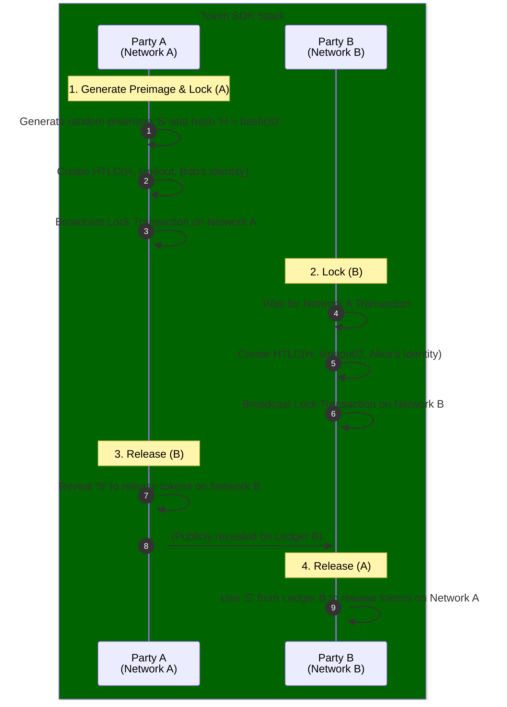

# Interoperability (Interop) Service

The **Interoperability (Interop) Service** (`token/services/interop`) enables cross-chain and cross-network token operations within the Fabric Token SDK. Its primary focus is on implementing secure value exchange mechanisms like **Atomic Swaps** through **Hashed Timelock Contracts (HTLCs)**.

## Core Responsibilities

The Interop Service is responsible for:
*   **Atomic Swap Orchestration**: Managing the multi-step protocol required for two parties to exchange tokens on different networks.
*   **HTLC Implementation**: Providing the necessary scripts, validation logic, and transaction structures to lock and release tokens based on a hash preimage and a time-out.
*   **Cross-Network Identity Mapping**: Facilitating the mapping of identities across different DLT environments to ensure that the correct parties can release locked tokens.

## HTLC Lifecycle

The service implements a standardized HTLC lifecycle to ensure secure, trustless exchanges.

## Key Capabilities

### Hashed Timelock Contracts (HTLCs)
The service provides the `htlc` sub-package, which includes:
*   **Script Generation**: Building the specific scripts (e.g., Fabric chaincode or FabricX script) that implement the HTLC logic.
*   **HTLC Deserialization**: Correctly parsing and verifying HTLC scripts from the ledger.
*   **Signature Verification**: Ensuring that the party releasing the tokens provides a valid signature *and* the correct hash preimage.

### Cross-Network Finality
The Interop Service coordinates with the **Network Service** across multiple DLT instances. It monitors the finality of "Lock" transactions on one network before initiating corresponding "Lock" transactions on another, ensuring that the atomic swap protocol can proceed safely.

### Interop Wallets
The service integrates with the **Identity Service** to handle specialized interop identities that can be used to generate and verify HTLC-based proofs of ownership.
