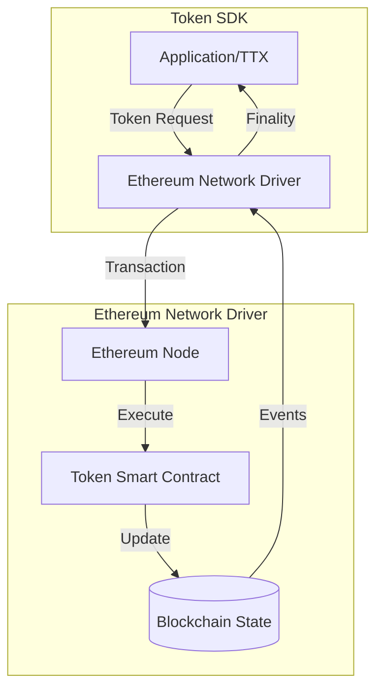
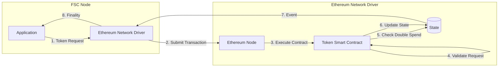
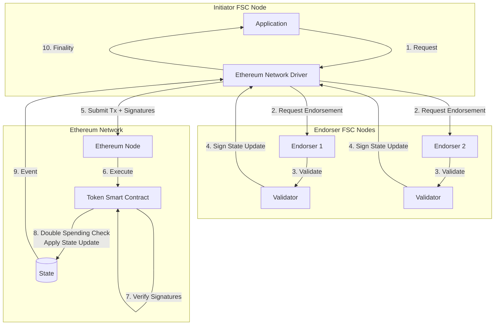
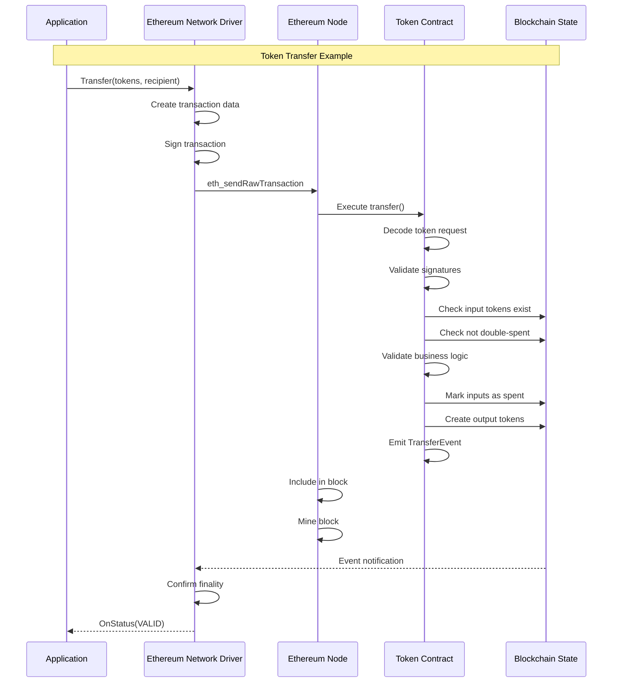
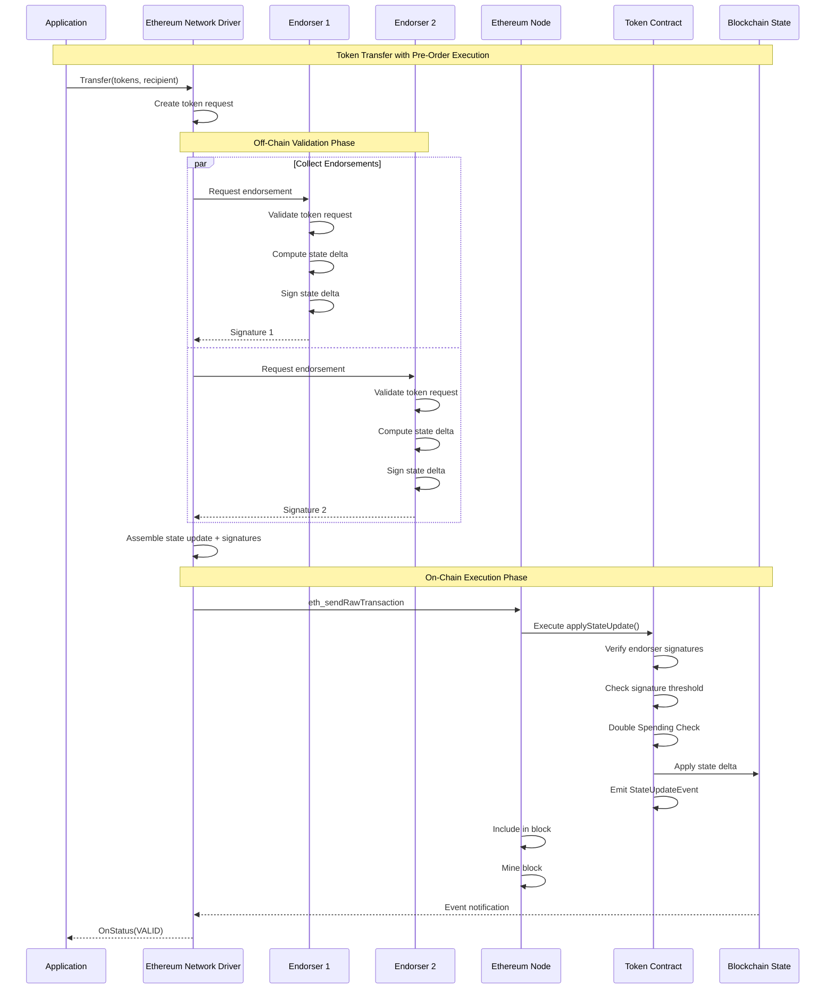

# Network Service - Ethereum Implementation Guide

This guide describes how to implement a Network Service driver for Ethereum-based networks. 
The Fabric Token SDK's driver architecture enables integration with Ethereum and EVM-compatible blockchains through two distinct approaches, each with different trade-offs.

## Overview

Ethereum integration requires adapting the Token SDK's transaction model to Ethereum's account-based ledger and smart contract execution environment. Unlike Fabric's channel-based architecture, Ethereum uses a global state model with smart contracts for business logic execution.



## Implementation Approaches

The SDK supports two architectural approaches for Ethereum integration, each suited to different requirements:

### Approach 1: Smart Contract Validation

The smart contract performs full validation logic, similar to Fabric's token chaincode model.

**Architecture:**


**Characteristics:**
- Smart contract validates token requests on-chain
- Contract maintains list of unspent tokens, or serial numbers depending on the privacy guarantees. 
- Contract performs double-spending checks
- All validation logic executed in EVM

### Approach 2: Pre-Order Execution with FSC Endorsers

FSC nodes perform validation off-chain and endorse state updates, similar to FabricX model.

**Architecture:**


**Characteristics:**
- FSC nodes validate token requests off-chain
- Endorsers sign state updates (deltas)
- Smart contract verifies endorser signatures
- Smart contract checks double-spending and then applies pre-validated state updates
- Reduced on-chain computation

## Approach Comparison

| Aspect | Approach 1: Smart Contract Validation | Approach 2: Pre-Order Execution |
|--------|--------------------------------------|--------------------------------|
| **Validation Location** | On-chain (in smart contract) | Off-chain (in FSC nodes) |
| **Gas Costs** | Higher (full validation on-chain) | Lower (only signature verification) |
| **Complexity** | Simpler (single-tier) | More complex (two-tier) |
| **Flexibility** | Limited by EVM constraints | High (validation in Go) |
| **Endorsement** | Not required | Required from FSC endorsers |
| **Best For** | Simple deployments, public tokens | Complex validation, privacy needs |

## Driver Interface Implementation

Both approaches must implement the [`driver.Network`](../../token/services/network/driver/network.go) interface:

```go
type EthereumNetwork struct {
    client      EthereumClient
    contract    TokenContract
    chainID     *big.Int
    
    // Approach 2 specific
    endorsers   []Endorser  // Only for Approach 2
}

// Core interface methods
func (n *EthereumNetwork) Name() string
func (n *EthereumNetwork) Channel() string
func (n *EthereumNetwork) Broadcast(ctx context.Context, blob interface{}) error
func (n *EthereumNetwork) RequestApproval(...) (driver.Envelope, error)
func (n *EthereumNetwork) ComputeTxID(id *driver.TxID) string
func (n *EthereumNetwork) FetchPublicParameters(namespace string) ([]byte, error)
func (n *EthereumNetwork) AddFinalityListener(...) error
```

## Approach 1: Smart Contract Validation

### Transaction Flow



### Smart Contract Interface

```solidity
// Conceptual interface - not production code
interface ITokenContract {
    // Process a token request
    function processRequest(
        bytes calldata tokenRequest,
        bytes[] calldata signatures
    ) external returns (bool);
    
    // Query functions
    function getToken(bytes32 tokenId) external view returns (bytes memory);
    function isSpent(bytes32 tokenId) external view returns (bool);
    function getPublicParameters() external view returns (bytes memory);
    
    // Events
    event TokenRequest(bytes32 indexed txId, bool success);
    event TokenCreated(bytes32 indexed tokenId, address owner);
    event TokenSpent(bytes32 indexed tokenId);
}
```

### Smart Contract Responsibilities

1. **Request Validation**
   - Decode token request from calldata
   - Apply token validation following the public parameters

2. **State Management**
   - Maintain mapping of token IDs to token data
   - Track spent tokens (double-spend prevention)
   - Store public parameters

3. **Business Logic**
   - Enforce token issuance rules
   - Validate transfer conditions
   - Handle redemption logic

4. **Event Emission**
   - Emit events for finality tracking
   - Provide queryable transaction history

### Driver Implementation Considerations

**Transaction Construction:**
```go
func (n *EthereumNetwork) RequestApproval(
    ctx view.Context,
    tms *token.ManagementService,
    requestRaw []byte,
    signer view.Identity,
    txID driver.TxID,
) (driver.Envelope, error) {
    // 1. Encode token request for contract call
    data := encodeContractCall("processRequest", requestRaw)
    
    // 2. Create Ethereum transaction
    tx := types.NewTransaction(
        nonce,
        contractAddress,
        value,
        gasLimit,
        gasPrice,
        data,
    )
    
    // 3. Sign transaction
    signedTx, err := types.SignTx(tx, signer, chainID)
    
    // 4. Return as envelope
    return &EthereumEnvelope{tx: signedTx}, nil
}
```

**Finality Tracking:**
```go
func (n *EthereumNetwork) AddFinalityListener(
    namespace string,
    txID string,
    listener driver.FinalityListener,
) error {
    // Subscribe to contract events
    eventChan := make(chan *TokenRequestEvent)
    sub, err := n.contract.WatchTokenRequest(eventChan, txID)
    
    // Monitor for finality
    go func() {
        event := <-eventChan
        status := driver.Valid
        if !event.Success {
            status = driver.Invalid
        }
        listener.OnStatus(ctx, txID, status, "", nil)
    }()
    
    return nil
}
```

## Approach 2: Pre-Order Execution

### Transaction Flow



### Smart Contract Interface

```solidity
// Conceptual interface - not production code
interface ITokenContractWithEndorsement {
    // Apply a pre-validated state update
    function applyStateUpdate(
        bytes32 stateRoot,
        bytes calldata stateDelta,
        bytes[] calldata endorserSignatures
    ) external returns (bool);
    
    // Endorser management
    function addEndorser(address endorser) external;
    function removeEndorser(address endorser) external;
    function setThreshold(uint256 threshold) external;
    
    // Query functions
    function getToken(bytes32 tokenId) external view returns (bytes memory);
    function isSpent(bytes32 tokenId) external view returns (bool);
    function getEndorsers() external view returns (address[] memory);
    
    // Events
    event StateUpdate(bytes32 indexed stateRoot, bool success);
    event EndorserAdded(address indexed endorser);
    event EndorserRemoved(address indexed endorser);
}
```

### Smart Contract Responsibilities

1. **Signature Verification**
   - Verify endorser signatures on state delta
   - Check signature threshold is met
   - Validate endorser authorization

2. **State Application**
   - Apply pre-validated state delta
   - Update token mappings
   - Update spent token markers (double spending check)

3. **Endorser Management**
   - Maintain list of authorized endorsers
   - Enforce endorsement policies
   - Support dynamic endorser updates

### FSC Endorser Implementation

**Endorser Service:**
```go
type EthereumEndorserService struct {
    validator    TokenValidator
    signer       crypto.Signer
    stateManager StateManager
}

func (e *EthereumEndorserService) Endorse(
    ctx context.Context,
    request []byte,
) (*Endorsement, error) {
    // 1. Validate token request
    if err := e.validator.Validate(request); err != nil {
        return nil, err
    }
    
    // 2. Compute state delta
    delta, err := e.stateManager.ComputeDelta(request)
    if err != nil {
        return nil, err
    }
    
    // 3. Sign state delta
    signature, err := e.signer.Sign(delta)
    if err != nil {
        return nil, err
    }
    
    return &Endorsement{
        Delta:     delta,
        Signature: signature,
    }, nil
}
```

**Driver Implementation:**
```go
func (n *EthereumNetwork) RequestApproval(
    ctx view.Context,
    tms *token.ManagementService,
    requestRaw []byte,
    signer view.Identity,
    txID driver.TxID,
) (driver.Envelope, error) {
    // 1. Collect endorsements from FSC nodes
    endorsements := make([]*Endorsement, 0)
    for _, endorser := range n.endorsers {
        endorsement, err := endorser.Endorse(ctx, requestRaw)
        if err != nil {
            return nil, err
        }
        endorsements = append(endorsements, endorsement)
    }
    
    // 2. Aggregate state deltas (should be identical)
    stateDelta := endorsements[0].Delta
    
    // 3. Collect signatures
    signatures := make([][]byte, len(endorsements))
    for i, e := range endorsements {
        signatures[i] = e.Signature
    }
    
    // 4. Create Ethereum transaction
    data := encodeContractCall(
        "applyStateUpdate",
        stateRoot,
        stateDelta,
        signatures,
    )
    
    tx := types.NewTransaction(nonce, contractAddress, value, gasLimit, gasPrice, data)
    signedTx, err := types.SignTx(tx, signer, chainID)
    
    return &EthereumEnvelope{tx: signedTx}, nil
}
```

## Trade-offs Summary

**Choose Approach 1 (Smart Contract Validation) when:**
- Simplicity is preferred over gas optimization
- Full on-chain validation is required for compliance
- Endorser infrastructure is not available
- Token logic is relatively simple

**Choose Approach 2 (Pre-Order Execution) when:**
- Gas costs are a primary concern
- Complex validation logic is needed
- Privacy is important (less data on-chain)
- FSC endorser infrastructure is available
- Flexibility in validation logic is required

## See Also

- [Network Service Overview](./network.md) - Generic network service concepts
- [Fabric Implementation](./network-fabric.md) - Chaincode-based validation
- [FabricX Implementation](./network-fabricx.md) - FSC endorser model
- [Driver Interface](../../token/services/network/driver/network.go) - Network driver interface
- [Token SDK Architecture](../tokensdk.md) - Overall system design