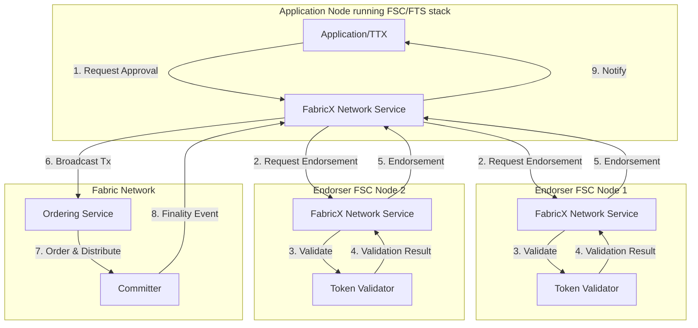
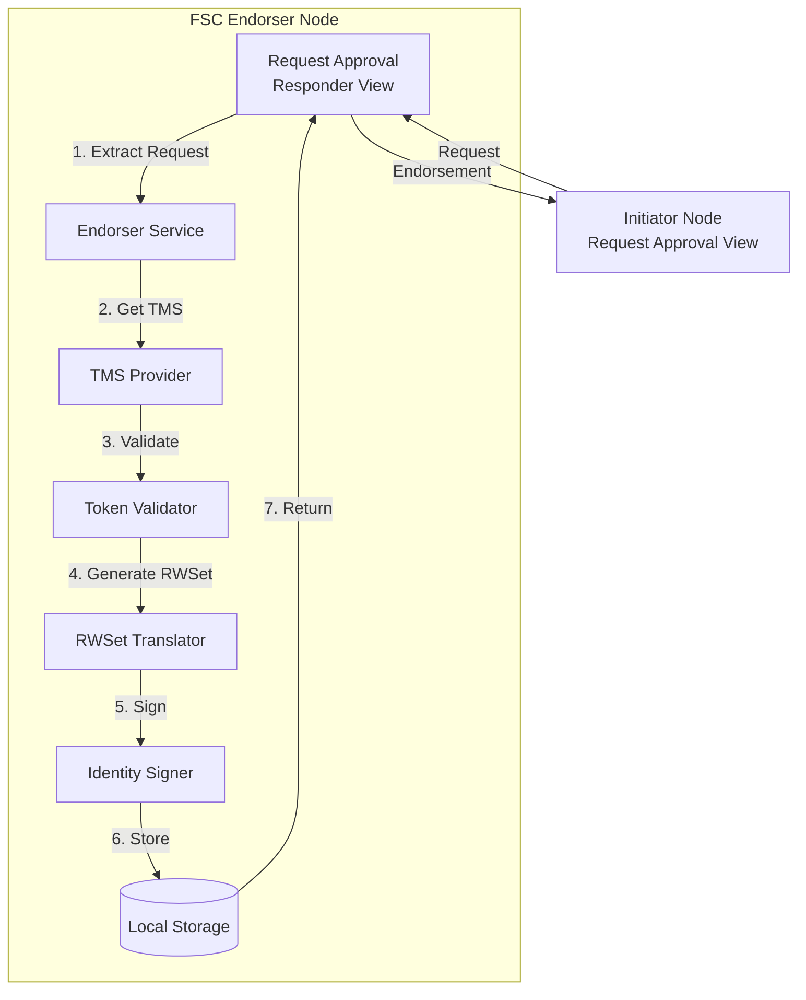
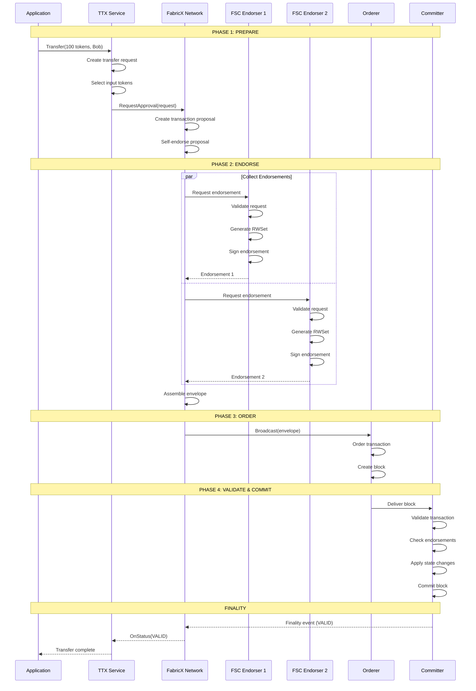
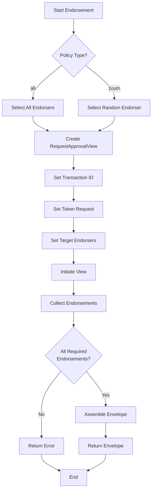
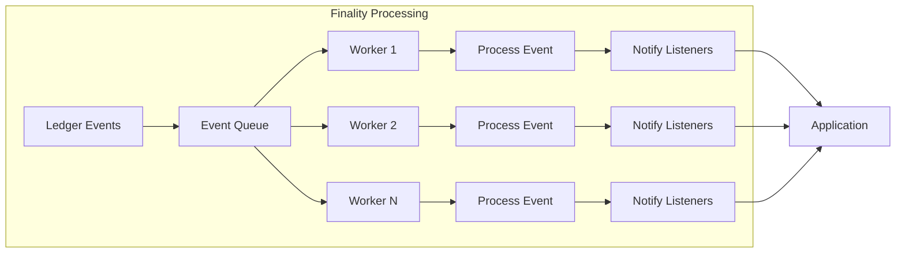
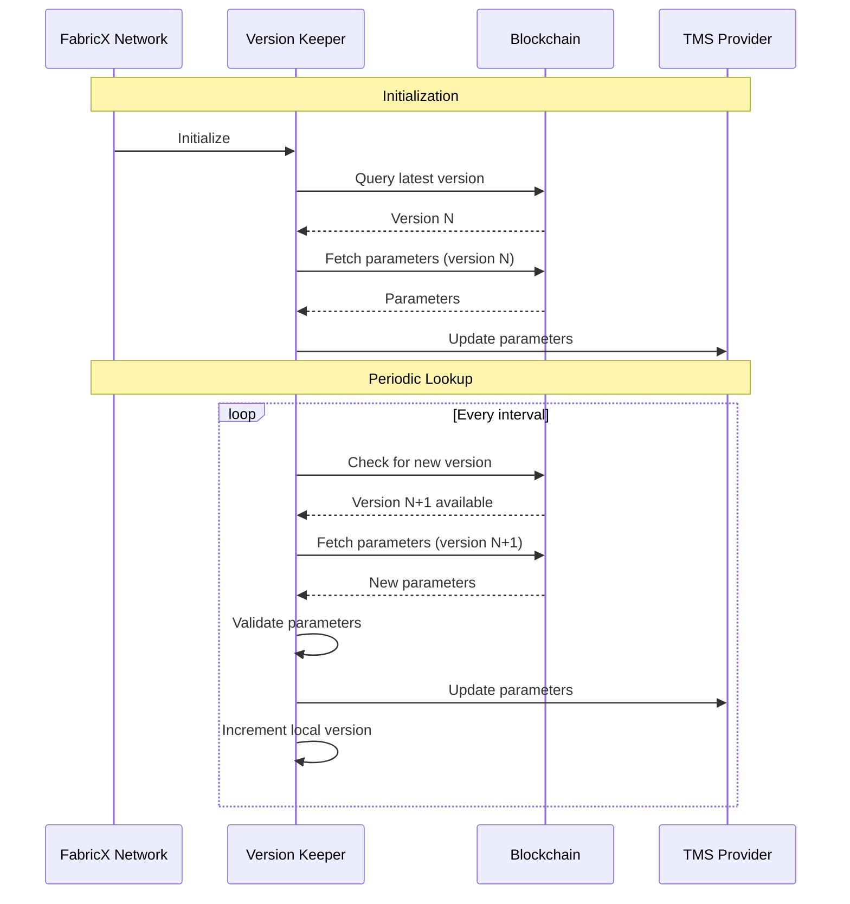
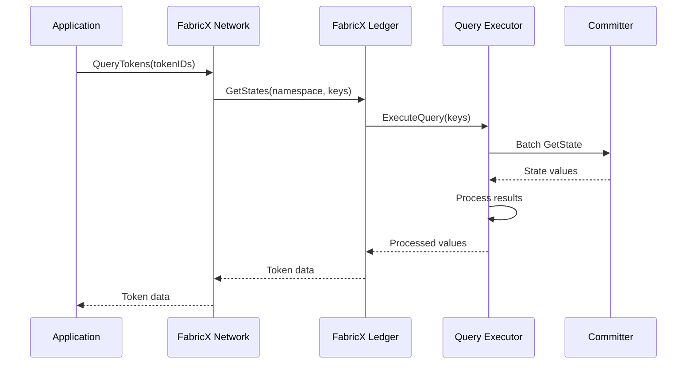

# Network Service - FabricX Implementation

The FabricX network implementation ([`fabricx.Network`](../../token/services/network/fabricx/network.go)) is an optimized variant of Hyperledger Fabric where **FSC (Fabric Smart Client) nodes act as endorsers**, eliminating the need for traditional chaincode deployment on peers. This architecture provides higher performance and more flexible endorsement policies.

## Architecture Overview

Unlike traditional Fabric, FabricX uses FSC nodes as endorsers instead of relying on chaincode running on Fabric peers. This fundamental architectural difference enables more efficient transaction processing and greater flexibility in endorsement logic.



### Key Architectural Differences from Fabric

| Aspect | Traditional Fabric | FabricX                          |
|--------|-------------------|----------------------------------|
| **Endorsers** | Fabric peers with chaincode | FSC nodes with validation logic  |
| **Chaincode** | Required on all peers | Not required                     |
| **Endorsement Protocol** | Fabric proposal/response | FSC view-based protocol          |
| **Flexibility** | Limited by chaincode | Highly flexible orchestration    |
| **Performance** | Chaincode execution overhead | Direct validation, lower latency |

## FSC Node as Endorser

In FabricX, FSC nodes take on the role of endorsers, performing validation and signing operations that would traditionally be done by chaincode on Fabric peers.

### Endorser Node Architecture



### Endorser Configuration

FSC nodes must be configured to act as endorsers:

```yaml
# Endorser node configuration
token:
  tms:
    my-fabricx-tms:
      network: fabricx-network
      channel: my-channel
      namespace: my-namespace
      
# Mark this node as an endorser
services:
  network:
    fabric:
      fsc_endorsement:
        endorser: true  # This node will endorse transactions
```

### Initiator Configuration

Initiator nodes must know which FSC nodes to contact for endorsement:

```yaml
# Initiator node configuration
services:
  network:
    fabric:
      fsc_endorsement:
        endorsers:
          - endorser1.example.com  # FSC endorser node 1
          - endorser2.example.com  # FSC endorser node 2
        policy:
          type: all  # "all" or "1outn"
```

## Transaction Flow Example

Here's a complete end-to-end flow for a token transfer:



## FSC Endorsement Service

The FSC Endorsement Service ([`fsc.EndorsementService`](../../token/services/network/fabric/endorsement/fsc/service.go)) manages the endorsement process for FabricX.

### Endorsement Policies

FabricX supports flexible endorsement policies:

#### All Policy
Requires endorsements from all configured endorsers:

```yaml
services:
  network:
    fabric:
      fsc_endorsement:
        policy:
          type: all
        endorsers:
          - endorser1.example.com
          - endorser2.example.com
          - endorser3.example.com
```

All three endorsers must sign the transaction.

#### 1-out-of-N Policy
Requires endorsement from any one of the configured endorsers:

```yaml
services:
  network:
    fabric:
      fsc_endorsement:
        policy:
          type: 1outn
        endorsers:
          - endorser1.example.com
          - endorser2.example.com
          - endorser3.example.com
```

Only one endorser (randomly selected) will be contacted.

### Endorsement Flow



## Finality Processing

FabricX uses asynchronous finality processing with an event queue for high performance.

### Async Event Queue Architecture



### Finality Configuration

```yaml
token:
  finality:
    type: notification  # FabricX uses notification mode
    notification:
      workers: 10       # Number of parallel workers
      queueSize: 1000   # Event queue capacity
```

## Public Parameters Management

FabricX employs a `VersionKeeper` for managing public parameters lifecycle:



### Version Keeper Configuration

```yaml
token:
  fabricx:
    lookup:
      permanent:
        interval: 1m      # Periodic check interval
      once:
        deadline: 5m      # Startup lookup deadline
        interval: 2s      # Startup check interval
```

## State Queries

FabricX provides an optimized ledger implementation with advanced query capabilities.

### Query Executor

The FabricX ledger uses a specialized query executor ([`qe.QueryStatesExecutor`](../../token/services/network/fabricx/qe/)) for efficient state access:



## Performance Optimizations

### 1. Parallel Endorsement Collection

FabricX collects endorsements in parallel, reducing latency:

```go
// Simplified parallel endorsement
err := endorserService.CollectEndorsements(
    ctx, 
    tx, 
    2*time.Minute,  // Timeout
    endorsers...     // All endorsers contacted in parallel
)
```

### 2. Async Finality Processing

Event queue decouples finality processing from the main event loop:

- **Non-blocking**: Main loop continues processing new events
- **Parallel Workers**: Multiple workers process events concurrently
- **Buffered Queue**: Handles bursts of finality events

### 3. Optimized State Queries

FabricX ledger implementation provides:

- **Batch Queries**: Multiple keys fetched in single operation
- **Efficient Serialization**: Optimized data encoding/decoding
- **Direct State Access**: Bypasses chaincode invocation overhead

## Configuration Examples

### Complete FabricX Configuration

```yaml
# FSC Network Configuration
fsc:
  networks:
    fabricx-network:
      default: true
      driver: fabricx
      # Fabric network connection details
      
# Token SDK Configuration
token:
  enabled: true
   # Finality Configuration
  finality:
     type: notification
     notification:
        workers: 10
        queueSize: 1000

   # FabricX-specific Configuration
  fabricx:
     lookup:
        permanent:
           interval: 1m
        once:
           deadline: 5m
           interval: 2s

  # Token Management System
  tms:
    my-fabricx-tms:
      network: fabricx-network
      channel: my-channel
      namespace: my-namespace      
      # FSC Endorsement Configuration, per TMS
      services:
        network:
          fabric:
            fsc_endorsement:
              # For endorser nodes
              endorser: true
              
              # For initiator nodes
              endorsers:
                - endorser1.example.com
                - endorser2.example.com
              policy:
                type: all  # or "1outn"
```

## Comparison: Fabric vs FabricX

| Feature | Fabric | FabricX |
|---------|--------|---------|
| **Endorsers** | Fabric peers | FSC nodes |
| **Chaincode** | Required | Not required |
| **Endorsement Latency** | Higher (chaincode execution) | Lower (direct validation) |
| **Flexibility** | Limited by chaincode | Highly flexible |
| **Deployment** | Complex (chaincode lifecycle) | Simpler (FSC configuration) |
| **Scalability** | Limited by peer capacity | Better horizontal scaling |
| **Use Case** | Standard Fabric deployments | High-performance scenarios |

## See Also

- [Network Service Overview](./network.md) - Generic network service concepts
- [Fabric Implementation](./network-fabric.md) - Traditional chaincode-based approach
- [FSC Endorsement Service](../../token/services/network/fabric/endorsement/fsc/) - Implementation details
- [TTX Service](./ttx.md) - Token transaction orchestration
- [Public Parameters](../public_parameters.md) - Cryptographic setup management