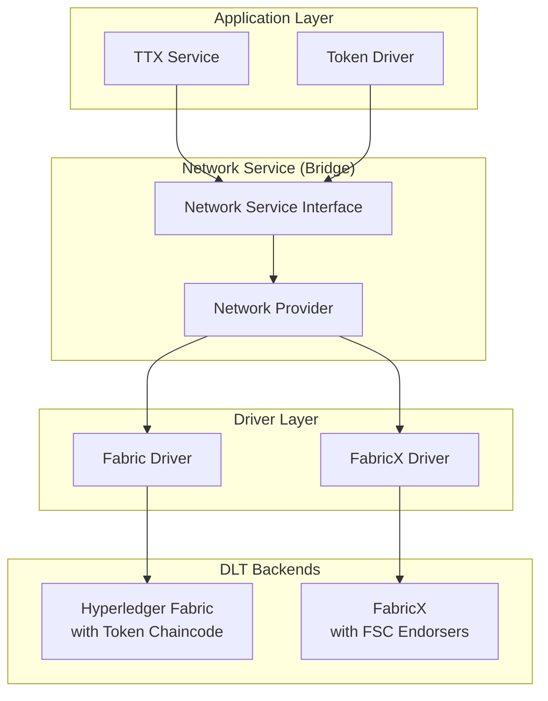
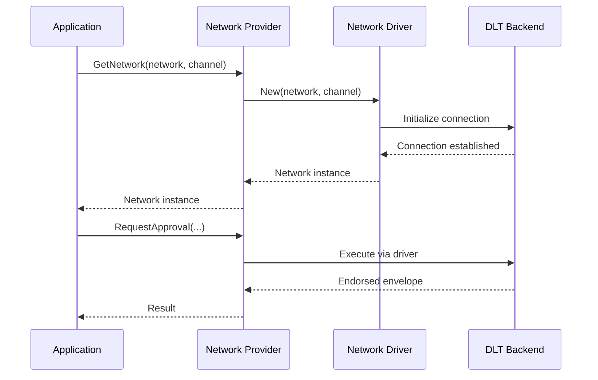

# Network Service

The **Network Service** ([`token/services/network`](../../token/services/network/network.go)) is the **bridge layer** of the Fabric Token SDK. It provides a consistent, backend-agnostic interface that translates generic token operations into the specific formats and protocols required by the underlying Distributed Ledger Technology (DLT), such as Hyperledger Fabric or FabricX.

## Overview

The Network Service abstracts the complexities of different ledger implementations, allowing Application Services (like TTX) and Token Drivers to remain agnostic of the specific network backend. This abstraction enables the SDK to support multiple DLT platforms through a pluggable driver architecture.



## Driver-Based Architecture

The Network Service uses a **driver pattern** to enable pluggable backend implementations. This design separates the interface from the implementation, allowing the SDK to support different DLT platforms without changing application code.

### Core Components

1. **Network Interface** ([`driver.Network`](../../token/services/network/driver/network.go))
   - Defines the contract that all network implementations must fulfill
   - Provides methods for transaction submission, endorsement, and state queries
   - Ensures consistent behavior across different backends

2. **Driver Interface** ([`driver.Driver`](../../token/services/network/driver/driver.go))
   - Factory interface for creating network instances
   - Single method: `New(network, channel string) (Network, error)`
   - Enables runtime selection of the appropriate backend

3. **Network Provider** ([`Provider`](../../token/services/network/network.go))
   - Manages multiple network instances
   - Registers and coordinates available drivers
   - Provides lazy initialization and caching of network connections

### How It Works



**Key Benefits:**
- **Pluggability**: New backends can be added by implementing the driver interface
- **Consistency**: Applications use the same API regardless of the underlying DLT
- **Flexibility**: Different networks can use different drivers within the same application
- **Testability**: Drivers can be mocked for testing without real network connections

## Core Responsibilities

The Network Service is responsible for several critical functions:

### 1. Request Translation
Translating high-level token requests (e.g., "Transfer 10 tokens from A to B") into ledger-specific transaction envelopes. Each driver implementation handles the specifics of its target platform.

### 2. Transaction Submission
Broadcasting endorsed transaction envelopes to the network's ordering service via [`Broadcast`](../../token/services/network/network.go).

### 3. Finality Tracking
Monitoring the ledger for transaction commitment. It provides a listener-based API ([`FinalityListener`](../../token/services/network/network.go)) that notifies the SDK when a transaction is validated or invalidated.

### 4. Public Parameters Discovery
Acting as the primary fetcher for the system's [Public Parameters](../public_parameters.md). It monitors the ledger for updates and ensures the SDK is synchronized with the latest cryptographic material.

### 5. Ledger Querying
Providing a [`Ledger`](../../token/services/network/network.go) interface to retrieve the current state of tokens and other relevant ledger data.

## Network Interface

The [`driver.Network`](../../token/services/network/driver/network.go) interface defines the following key methods:

- **`Name() string`** - Returns the network identifier
- **`Channel() string`** - Returns the channel/partition name
- **`Broadcast(ctx, blob) error`** - Submits transactions to ordering service
- **`RequestApproval(...) (Envelope, error)`** - Requests transaction endorsement
- **`NewEnvelope() Envelope`** - Creates a new transaction envelope
- **`ComputeTxID(*TxID) string`** - Calculates transaction identifiers
- **`FetchPublicParameters(namespace) ([]byte, error)`** - Retrieves public parameters
- **`QueryTokens(...) ([][]byte, error)`** - Queries token state
- **`AreTokensSpent(...) ([]bool, error)`** - Checks token spent status
- **`AddFinalityListener(...) error`** - Registers finality notifications
- **`Ledger() (Ledger, error)`** - Provides ledger access

## Available Implementations

The SDK currently provides network driver implementations for the following platforms:

### Hyperledger Fabric
Traditional Fabric network with token chaincode deployed on peers for endorsement and validation.

**Documentation**: [Network Service - Fabric Implementation](./network-fabric.md)

**Key Features**:
- Token chaincode handles endorsement logic
- Supports both delivery and notification finality modes
- Integrates with Fabric's endorsement policies
- Uses Fabric peers for transaction validation

### FabricX
Optimized Fabric variant where FSC nodes act as endorsers, eliminating the need for traditional chaincode.

**Documentation**: [Network Service - FabricX Implementation](./network-fabricx.md)

**Key Features**:
- FSC nodes replace traditional peer endorsers
- View-based endorsement protocol
- Async finality processing with event queues
- Optimized for high-performance scenarios

### Ethereum (Implementation Guide)
Guide for implementing a network driver for Ethereum and EVM-compatible blockchains.

**Documentation**: [Network Service - Ethereum Implementation Guide](./network-ethereum.md)

**Approaches**:
- **Smart Contract Validation**: Full validation logic in smart contract (similar to Fabric)
- **Pre-Order Execution**: FSC endorsers with on-chain signature verification (similar to FabricX)

**Key Considerations**:
- Account-based ledger model vs UTXO
- Gas cost optimization strategies
- Finality based on consensus mechanism (PoW/PoS)
- Smart contract design patterns

## Configuration

Each Token Management Service (TMS) must be mapped to a network and channel:

```yaml
token:
  tms:
    my-tms-id:
      network: my-network-name  # Matches fsc.networks configuration
      channel: my-channel-name
      namespace: my-chaincode-id
```

The Network Service uses this configuration to:
1. Select the appropriate driver for the network
2. Initialize the connection to the specified channel
3. Configure namespace-specific settings

## Driver Registration

Drivers are registered during system initialization:

```go
// Example: Registering a network driver
networkProvider := network.NewProvider(configService)
networkProvider.RegisterDriver(fabricDriver)
networkProvider.RegisterDriver(fabricxDriver)
```

The provider automatically selects the appropriate driver based on the network configuration when `GetNetwork()` is called.

## See Also

- [Fabric Implementation Details](./network-fabric.md) - Chaincode-based endorsement
- [FabricX Implementation Details](./network-fabricx.md) - FSC node endorsement
- [Public Parameters](../public_parameters.md) - Cryptographic setup management
- [TTX Service](./ttx.md) - Token transaction orchestration
- [Token SDK Architecture](../tokensdk.md) - Overall system design
