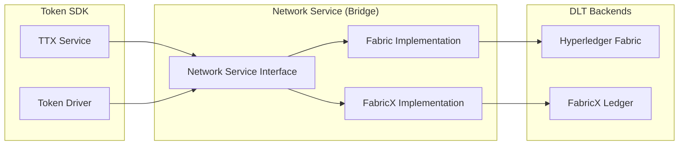

# Network Service

The **Network Service** (`token/services/network`) is the **bridge layer** of the Fabric Token SDK. It provides a consistent, backend-agnostic interface that translates generic token operations into the specific formats and protocols required by the underlying Distributed Ledger Technology (DLT), such as Hyperledger Fabric or FabricX.

## The Bridge Architecture

The Network Service abstracts the complexities of the ledger, allowing Application Services (like TTX) and Token Drivers to remain agnostic of the specific network implementation.



## Core Responsibilities

The Network Service is responsible for several critical functions:

*   **Request Translation**: Translating high-level token requests (e.g., "Transfer 10 tokens from A to B") into ledger-specific transaction envelopes.
*   **Transaction Submission**: Broadcasting endorsed transaction envelopes to the network's ordering service via [Broadcast](../../token/services/network/network.go).
*   **Finality Tracking**: Monitoring the ledger for transaction commitment. It provides a listener-based API ([FinalityListener](../../token/services/network/network.go)) that notifies the SDK when a transaction is validated or invalidated.
*   **Public Parameters Discovery**: Acting as the primary fetcher for the system's [Public Parameters](../public_parameters.md). It monitors the ledger for updates and ensures the SDK is synchronized with the latest cryptographic material.
*   **Ledger Querying**: Providing a [Ledger](../../token/services/network/network.go) interface to retrieve the current state of tokens and other relevant ledger data.

---

## Hyperledger Fabric Implementation

The Fabric-based network implementation ([fabric.Network](../../token/services/network/fabric/network.go)) utilizes the Fabric Smart Client (FSC) to interact with the underlying Hyperledger Fabric network. It leverages FSC's configuration, transaction management, and communication layers.

### Lifecycle and Bootstrap
During bootstrap, the system initializes a `Network` instance for each configured TMS. The `Connect` function registers listeners for **Public Parameters** updates and sets up the endorsement infrastructure.

### Public Parameters Monitoring
The Fabric implementation monitors the ledger for updates to a specific "setup key". It uses a `setupListener` that triggers whenever a valid transaction writes to this key. When an update is detected:
1.  The **TMS Provider** is updated with the new parameters.
2.  The new public parameters are persisted in the local **Tokens Database**.

### Finality Management
The Fabric implementation supports two primary modes for monitoring transaction finality:
-   **Delivery Mode (`delivery`)**: Establishes a block delivery stream from the peer. It supports **Parallel Processing** of blocks and transactions to improve throughput.
-   **Notification Mode (`notification`)**: Relies on asynchronous event notifications from the underlying network service.

### Fabric Configuration Example
```yaml
token:
  enabled: true
  tms:
    my-fabric-tms:
      network: fabric-network-name # Matches fsc.networks configuration
      channel: my-channel
      namespace: my-chaincode-id
  finality:
    type: delivery # "delivery" or "notification"
    committer:
      maxRetries: 3
      retryWaitDuration: 5s
    delivery:
      mapperParallelism: 10
      blockProcessParallelism: 10
      lruSize: 30
      listenerTimeout: 10s
```

---

## FabricX Implementation

The [fabricx.Network](../../token/services/network/fabricx/network.go) implementation is optimized for high-performance environments and introduces specialized behaviors for the FabricX network.

### Async Finality Processing
FabricX handles finality notifications asynchronously using an internal `EventQueue`. This decoupled architecture ensures that the main network event loop remains non-blocking even when processing a high volume of finality notifications.

### Robust Transaction Submission
The submission process in FabricX involves precise transaction ID calculation and ASN1 marshaling of namespaces to meet the specific requirements of the FabricX ledger. It includes retry logic for transient connectivity issues (e.g., `io.EOF` during cold-starts).

### Public Parameters Versioning
FabricX employs a `VersionKeeper` to manage the lifecycle of public parameters, supporting atomic version increments and ledger-based discovery of the latest cryptographic setup.

### FabricX Configuration Example
```yaml
token:
  enabled: true
  tms:
    my-fabricx-tms:
      network: fabricx-network-name
      channel: my-channel
      namespace: my-namespace
  finality:
    type: notification # FabricX defaults to notification
    notification:
      workers: 10
      queueSize: 1000
  fabricx:
    lookup:
      permanent:
        interval: 1m
      once:
        deadline: 5m
        interval: 2s
```

---

## TMS General Configuration

Each Token Management Service must be mapped to a network and channel in the global `token` section.

```yaml
token:
  tms:
    network-alpha:
      network: alpha-net
      channel: main-ch
      namespace: token-space
    network-beta:
      network: beta-net
      channel: side-ch
      namespace: token-space
```
