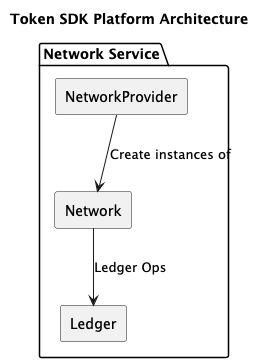

# The Network Service

The `network` service, located under `token/services/network`, provides other services with a consistent and predictable interface to the backend (e.g., Fabric).
Internally, the network service mirrors the structure of the Token API, consisting of a `Provider` of network instances and the `Network` instances themselves.

The network service architecture is depicted below:



## Overview

The Network Service is a critical component of the Fabric Token SDK that abstracts the complexities of the underlying Distributed Ledger Technology (DLT). It serves several key purposes:

- **Unified Interface**: Regardless of the backend (Fabric, Fabric-X, etc.), it provides a common set of APIs for transaction management and ledger interaction.
- **Transaction Lifecycle Management**: Handles the submission (broadcasting) of transactions and provides mechanisms to wait for their finality (commitment and validity).
- **Ledger Querying (QE)**: Allows services to retrieve the current state of tokens and other ledger entries through a specialized Query Engine.
- **Public Parameters (PP) Management**: Monitors the ledger for updates to the system's public parameters and ensures the SDK is always using the latest version to maintain cryptographic integrity.
- **Identity & Membership**: Interfaces with the local Membership Service Provider (MSP) to provide identities for signing and transaction creation.

The service uses a **Driver-based architecture**, allowing for different implementations to be plugged in based on the specific requirements and features of the target network.

## Fabric 

The Fabric-based network implementation utilizes the Fabric Smart Client (FSC) to interact with the underlying Hyperledger Fabric network. It leverages FSC's configuration, transaction management, and communication layers to provide a robust backend for the Token SDK.

### Lifecycle and Bootstrap
During the Token SDK bootstrap process, the system initializes a `Network` instance for each TMS (Token Management Service) defined in the configuration. The mapping is determined by the `network` and `channel` fields in the TMS identifier. If the specified network cannot be initialized (e.g., due to missing FSC configuration for that network), the bootstrap process will fail.

Upon successful initialization, the `Connect` function is invoked for the target namespace. This step is crucial as it:
- Registers listeners for **Public Parameters** updates.
- Initializes the **Endorsement Service** for the specific namespace.
- Sets up the **Finality** and **Lookup** managers.

### Public Parameters Monitoring
The Fabric driver monitors the ledger for updates to a specific "setup key" (usually `\x00seU+0000`). It uses a `PermanentLookupListener` that triggers whenever a valid transaction writes to this key. When an update is detected:
1. The **TMS Provider** is updated with the new parameters. If a TMS instance already exists, it is replaced by a new one initialized with the updated cryptographic material, and the old instance is gracefully decommissioned.
2. The new public parameters are persisted in the local **Tokens Database** to ensure consistency across restarts.

### Finality Management
The Fabric driver supports two primary modes for monitoring transaction finality, configurable via `token.finality.type`:

- **Delivery Mode (`delivery`)**: This is the default mode for Fabric. It establishes a dedicated block delivery stream from the peer. The driver parses incoming blocks, processes read-write sets, and notifies registered listeners when a specific transaction ID is committed and validated. It includes advanced features like:
    - **Parallel Processing**: Blocks and transactions can be processed in parallel to improve throughput.
    - **LRU Caching**: Uses a Least Recently Used cache to track recently processed blocks and prevent redundant work.
- **Notification Mode (`notification`)**: In this mode, the driver relies on event notifications from the underlying network service rather than pulling the entire block stream.

Regardless of the mode, the `ttx` and `audit` services utilize these listeners to update the local token vault and request status (e.g., marking a request as `Valid` or `Invalid`) once a transaction reaches finality on the ledger.

## FabricX

The `fabricx` driver is a specialized implementation designed for the Fabric-X network. It shares the same overall goals as the standard Fabric driver but introduces several implementation-specific optimizations and behaviors.

### Async Finality Processing
FabricX handles transaction finality notifications asynchronously using an internal `EventQueue`. This queue is serviced by a pool of workers (by default, 10 workers with a queue size of 1000). This decoupled architecture ensures that the main network event loop remains non-blocking even when processing a high volume of finality notifications or performing complex transaction checks.

### Robust Transaction Submission
The transaction submission process in FabricX involves a multi-step preparation phase:
1. **Transaction ID Calculation**: Computes a unique ID based on a nonce and the creator's identity.
2. **Namespace Marshaling**: Uses ASN1 marshaling for the target namespace (`TxNamespace`) before signing. This ensures the transaction structure meets the specific requirements of the Fabric-X MSP and ledger.
3. **Broadcasting & Confirmation**: Once signed, the transaction is broadcast to the network. The broadcaster includes retry logic specifically for `io.EOF` errors, which often occur during network startup or transient connectivity issues.

### Public Parameters Versioning
Unlike the standard Fabric driver, FabricX employs a `VersionKeeper` to manage the lifecycle of public parameters.
- **Initialization**: The first time public parameters are updated, the version is initialized (the counter does not increment).
- **Updates**: Subsequent updates to the public parameters increment an atomic version counter.
- **Setup**: The TMS deployment process writes both the raw public parameters and their SHA256 hash to the ledger using specific setup keys defined by the translator.

### Query Engine (QE) and Token Detection
The Query Engine in FabricX is responsible for retrieving the state of tokens from the ledger. For non-graph-hiding drivers, it determines if a token is spent by checking for the absence of its key in the ledger (a `nil` raw value). It supports batch retrieval of states to minimize network round-trips.

### Finality Retries
During the initial connection phase, FabricX implements a specific retry strategy for retrieving finality information. If block 0 is not yet committed (a common scenario during network cold-starts), the driver will retry the operation (up to 5 times with a 2-second delay) to ensure a stable connection is established.

## Configuration

The Network Service and its drivers can be fine-tuned through the application configuration. Below are the key configuration parameters and examples for both Fabric and FabricX.

### TMS Configuration
Each Token Management Service must be mapped to a network and channel.

```yaml
token:
  enabled: true
  tms:
    my-tms-id:
      network: fabric-network-name # Matches fsc.networks configuration
      channel: my-channel
      namespace: my-chaincode-id
```

### Fabric Finality Configuration
These settings control the behavior of the Fabric driver's finality manager.

```yaml
token:
  finality:
    # Mode: "delivery" (default) or "notification"
    type: delivery
    committer:
      maxRetries: 3
      retryWaitDuration: 5s
    delivery:
      # Number of parallel workers for mapping transactions
      mapperParallelism: 10
      # Number of parallel workers for processing blocks
      blockProcessParallelism: 10
      # Size of the LRU cache for block tracking
      lruSize: 30
      # Wait duration before timing out a delivery listener
      listenerTimeout: 10s
```

### FabricX Specific Configuration
FabricX introduces additional settings for its asynchronous event queue and lookup service.

```yaml
token:
  finality:
    # FabricX defaults to "notification" mode
    type: notification
    notification:
      # Number of worker goroutines for the async queue
      workers: 10
      # Size of the event buffer
      queueSize: 1000

  fabricx:
    lookup:
      permanent:
        # Polling interval for permanent lookups (e.g., public params)
        interval: 1m
      once:
        # Max time allowed for a one-time lookup
        deadline: 5m
        # Polling interval for one-time lookups
        interval: 2s
```

