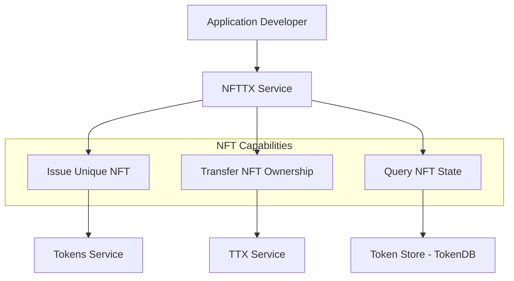

# NFTTX Service

The **NFTTX Service** (`token/services/nfttx`) provides specialized support for **Non-Fungible Tokens (NFTs)**. It extends the core token transaction capabilities to handle the unique properties and lifecycle requirements of NFTs, such as guaranteed uniqueness and rich metadata handling.

## Core Responsibilities

The NFTTX Service is responsible for:
*   **NFT Transaction Orchestration**: Managing the assembly and signing of transactions specifically involving NFTs.
*   **Uniqueness Enforcement**: Providing mechanisms to ensure that each NFT created has a globally unique identifier within its namespace.
*   **Metadata Management**: Handling the storage and retrieval of rich metadata associated with an NFT, which can include URIs, attributes, and ownership history.
*   **Querying NFTs**: Providing specialized APIs to query the current owner and state of specific NFTs.

## Interaction with Token SDK Layers

The NFTTX Service is an **Application Service** that leverages the core Token API and other infrastructure services.

## Key Capabilities

### Guaranteed Uniqueness
Unlike fungible tokens, each NFT must be unique. The NFTTX Service often utilizes a specific `UniqueID` attribute in the token request. The service ensures that this identifier is correctly generated (e.g., using a UUID or a content-based hash) and validated by the token driver to prevent duplicates on the ledger.

### Rich Metadata
NFTs often carry extensive metadata (e.g., links to digital artwork, serial numbers, or physical asset descriptions). The NFTTX Service provides standardized ways to include this metadata in the token request's metadata fields, ensuring it is properly signed and (if required by the driver) obfuscated on the ledger.

### NFT Wallets
The service integrates with the **Identity Service** to manage specialized NFT wallets. These wallets are optimized for tracking ownership of distinct assets rather than aggregate balances, making it easy for applications to display a user's collection of NFTs.
