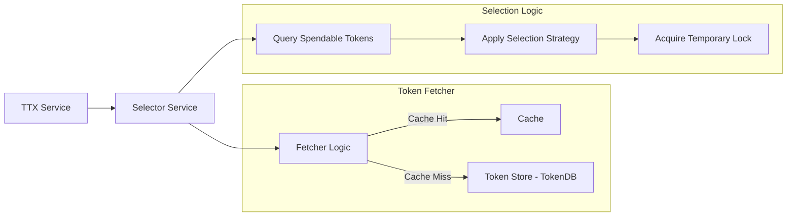

# Selector Service

The **Selector Service** (`token/services/selector`) implements strategic token selection algorithms to ensure that the Fabric Token SDK can efficiently and correctly select the best set of unspent tokens (UTXOs) for any given transaction.

## Core Responsibilities

The Selector Service is responsible for:
*   **UTXO Selection**: Finding a set of spendable tokens that cover the total quantity required for a transfer operation.
*   **Double-Spending Mitigation**: Temporarily locking selected tokens during the transaction assembly phase to prevent multiple concurrent transactions from attempting to spend the same tokens.
*   **Selection Strategy Implementation**: Providing different algorithms (e.g., First-In-First-Out, smallest-first) to optimize for transaction size, cost, or privacy.

## Interaction with TTX and Storage

The Selector Service bridges the gap between the high-level **TTX Service** and the internal **TokenDB**.



**How the components interact:**
- **Selector Service**: Creates a selector instance per transaction and orchestrates the Selection Logic steps
- **Query Spendable Tokens**: Selector calls the Fetcher to retrieve available tokens
- **Fetcher Logic**: Checks cache first (fast path), queries Token Store - TokenDB on cache miss (slow path)
- **Apply Selection Strategy**: Selector picks optimal tokens (e.g., smallest-first to minimize transaction size)
- **Acquire Temporary Lock**: Selector locks each selected token in storage to prevent concurrent selection

## Key Components

### Selector Manager
The `SelectorManager` is the entry point for obtaining a `Selector` instance anchored to a specific transaction. It ensures that the selection process is consistent and tied to the lifecycle of a single token request.

### Token Selection Strategy
The service supports various strategies for picking tokens (see "Strategy" box in diagram above). A common strategy is to pick the smallest number of tokens that cover the requested amount to minimize the transaction size and the associated verification overhead on the ledger.

**How it works in the flow (see "Selection Logic" subgraph in diagram):**
1. **TTX Request**: TTX Service requests token selection for a transfer operation
2. **Query Spendable Tokens**: Selector queries via Fetcher (Cache Hit → fast path, Cache Miss → Token Store - TokenDB)
3. **Apply Selection Strategy**: Algorithm picks optimal tokens based on configured strategy (e.g., smallest-first)
4. **Acquire Temporary Lock**: Selected tokens are locked in TokenLocks table to prevent double-spending

### Locking Mechanism
To prevent double-spending *before* the transaction is committed to the ledger, the Selector Service uses a local `TokenLocks` table in the **Storage Service** (see "TokenLocks" box in diagram above).

**Lock lifecycle:**
1.  **Lock Acquisition**: When a token is selected by the Strategy, the service attempts to insert a record in the `TokenLocks` table.
2.  **Concurrency Control**: If another concurrent process has already locked that token, the insertion fails, and the selector picks a different token.
3.  **Lock Release**: Locks are released either when the transaction reaches finality (success/failure) or when a timeout occurs, ensuring that tokens do not remain permanently inaccessible due to crashed or abandoned transactions.

## Token Fetcher and Cache

The selector uses a **Token Fetcher** to retrieve available tokens from the database. The fetcher uses a **Ristretto LRU cache** to improve performance by caching token queries (keyed by wallet+currency).

**Flow**: `Selector.Select()` → `Fetcher.UnspentTokensIteratorBy(wallet, currency)` → `Token Iterator`

**How it works:**
1. Selector requests tokens from Fetcher for a specific wallet and currency
2. Fetcher checks its cache (keyed by wallet+currency)
3. If cache is fresh, returns cached tokens immediately (fast path)
4. If cache is stale, queries database and updates cache
5. Selector iterates through tokens, attempting to lock each one
6. If insufficient tokens, selector requests fresh data and retries

**Adaptive refresh strategy** with two triggers:
- **Time-based**: Refreshes when data is older than `fetcherCacheRefresh`
- **Query-based**: Refreshes after `fetcherCacheMaxQueries` queries to prevent serving stale data in high-throughput scenarios

## Configuration

Configure the selector service in your `core.yaml`:

```yaml
token:
  selector:
    driver: sherdlock                    # Selection strategy (default: sherdlock)
    numRetries: 3                        # Retry attempts for token selection (default: 3)
    retryInterval: 5s                    # Wait time between retries (default: 5s)
    leaseExpiry: 3m                      # Lock expiration time (default: 3m)
    leaseCleanupTickPeriod: 1m           # Lock cleanup interval (default: 1m)
    fetcherCacheSize: 1000               # Cache size in entries (default: 0 = use fetcher default)
    fetcherCacheRefresh: 30s             # Cache refresh interval (default: 0 = use fetcher default)
    fetcherCacheMaxQueries: 100          # Max queries before cache refresh (default: 0 = use fetcher default)
```

### Cache Configuration

The fetcher cache improves performance by caching token queries:

- **fetcherCacheSize**: Maximum number of cached query results. Set to 0 to use the fetcher's default size.
- **fetcherCacheRefresh**: Time interval after which cached data is considered stale and refreshed. Set to 0 to use the fetcher's default interval.
- **fetcherCacheMaxQueries**: Maximum number of queries before forcing a cache refresh. Set to 0 to use the fetcher's default limit.

**Example**: With `fetcherCacheSize: 1000`, `fetcherCacheRefresh: 30s`, and `fetcherCacheMaxQueries: 100`, the cache stores up to 1000 query results, refreshes data every 30 seconds, and forces a refresh after 100 queries.
