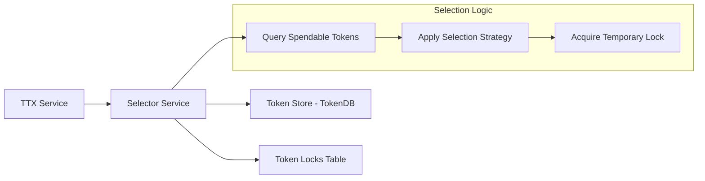

# Selector Service

The **Selector Service** (`token/services/selector`) implements strategic token selection algorithms to ensure that the Fabric Token SDK can efficiently and correctly select the best set of unspent tokens (UTXOs) for any given transaction.

## Core Responsibilities

The Selector Service is responsible for:
*   **UTXO Selection**: Finding a set of spendable tokens that cover the total quantity required for a transfer operation.
*   **Double-Spending Mitigation**: Temporarily locking selected tokens during the transaction assembly phase to prevent multiple concurrent transactions from attempting to spend the same tokens.
*   **Selection Strategy Implementation**: Providing different algorithms (e.g., First-In-First-Out, smallest-first) to optimize for transaction size, cost, or privacy.

## Interaction with TTX and Storage

The Selector Service bridges the gap between the high-level **TTX Service** and the internal **TokenDB**.

## Key Components

### Selector Manager
The `SelectorManager` is the entry point for obtaining a `Selector` instance anchored to a specific transaction. It ensures that the selection process is consistent and tied to the lifecycle of a single token request.

### Token Selection Strategy
The service supports various strategies for picking tokens. A common strategy is to pick the smallest number of tokens that cover the requested amount to minimize the transaction size and the associated verification overhead on the ledger.

### Locking Mechanism
To prevent double-spending *before* the transaction is committed to the ledger, the Selector Service uses a local `TokenLocks` table in the **Storage Service**. 
1.  **Lock Acquisition**: When a token is selected, the service attempts to insert a record in the `TokenLocks` table. 
2.  **Concurrency Control**: If another concurrent process has already locked that token, the insertion fails, and the selector picks a different token.
3.  **Lock Release**: Locks are released either when the transaction reaches finality (success/failure) or when a timeout occurs, ensuring that tokens do not remain permanently inaccessible due to crashed or abandoned transactions.
