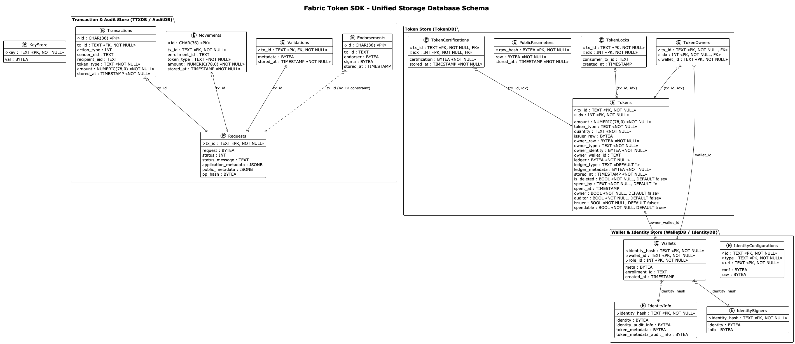

# Storage Service

The **Storage Service** (`token/services/storage`) encapsulates all data persistence mechanisms required by the Fabric Token SDK. It provides a robust, SQL-based management system to ensure that token states, transaction history, and cryptographic identities are securely tracked and retrievable.

## Architecture

The storage layer is built on a provider-based architecture that supports multiple SQL backends, primarily **SQLite** (for local development and edge nodes) and **PostgreSQL** (for production-grade scalability).

## Schema Description

The Fabric Token SDK storage is organized into logical databases, each serving a specific role in the transaction lifecycle and identity management.

### Amount Storage Strategy

**All token amounts** across the storage layer are stored as `NUMERIC(78, 0)` in the database, supporting arbitrary precision integers up to 78 digits. This design choice enables:
- Representation of token amounts exceeding the uint64 maximum value (2^64-1 ≈ 1.8×10^19)
- Support for tokens with high precision or extremely large supply
- Consistent handling of amounts across all tables (Tokens, Transactions, Movements)

The SDK uses Go's `*big.Int` type throughout the codebase to handle these large values, with automatic conversion between database NUMERIC values and in-memory big.Int representations via the `BigInt` scanner type.

### Transaction & Audit Store (TTXDB / AuditDB)
These tables track the lifecycle of token requests from assembly to finality. `AuditDB` uses the same schema but is isolated for compliance reporting.

*   **Requests**: Tracks high-level token request state. Contains marshaled requests, current status (Pending, Confirmed, Deleted, Orphan), and application/public metadata.
*   **Transactions**: Records individual actions (Issue, Transfer, Redeem) within a request, including sender/recipient IDs and amounts (stored as `NUMERIC(78, 0)`).
*   **Movements**: Aggregates net value changes per enrollment ID (amounts stored as `NUMERIC(78, 0)`). Used to efficiently calculate balances and history.
*   **Validations**: Stores cryptographic validation metadata produced during the request verification phase.
*   **Endorsements**: Collects digital signatures from participants and auditors required for transaction finality.

### Token Store (TokenDB)
This store serves as the authoritative registry for all tokens (UTXOs) known to the node.

*   **Tokens**: The core UTXO registry. Stores token identifiers, amounts, types, ownership info, and ledger-specific state.
    *   **Amount Storage**: Token amounts are stored as `NUMERIC(78, 0)` in the database, supporting arbitrary precision integers up to 78 digits. This enables representation of token amounts that exceed the uint64 maximum value (2^64-1 ≈ 1.8×10^19). The SDK uses Go's `*big.Int` type throughout the codebase to handle these large values, with automatic conversion between database NUMERIC values and in-memory big.Int representations.
*   **TokenOwners**: A mapping table linking specific tokens to wallet identifiers for fast lookups.
*   **PublicParameters**: A cache for the network's cryptographic public parameters and their hashes.
*   **TokenCertifications**: Stores third-party certifications for tokens, often required by privacy-preserving drivers.
*   **TokenLocks**: Manages short-lived pessimistic locks on tokens to prevent double-spending during transaction assembly.
*   **TokenSKICleanups**: Tracks keystore cleanup operations for deleted tokens. Records when cryptographic keys were removed from the keystore and which instance performed the cleanup, preventing reprocessing and enabling audit trails in multi-instance deployments.

### Wallet & Identity Store (WalletDB / IdentityDB)
Manages the cryptographic identities and logical wallet groupings used by the node.

*   **Wallets**: Maps user identities to logical wallets and specific roles (e.g., Owner, Auditor).
*   **IdentityConfigurations**: Persists long-term configuration data for various identity types (e.g., Idemix, X.509).
*   **IdentityInfo**: Stores sensitive identity-related data, including audit information and PII required for transaction processing.
*   **IdentitySigners**: Tracks which identities have locally available signing keys and their associated metadata.

### Generic Store
*   **KeyStore**: A secure, generic key-value store used for persisting various cryptographic materials and small sensitive states.

## Internal Databases

The SDK partitions its data into several specialized databases to maintain a clean separation of concerns.

### Transaction Store (TTXDB)
The `ttxdb` serves as the central repository for the lifecycle of token requests. It is used by the **TTX Service** to track:
*   **Requests**: The assembly status of token requests (Pending, Valid, Invalid).
*   **Transactions**: The individual actions (Issue, Transfer) within a request.
*   **Movements**: The flow of value (source to destination) once a transaction is finalized.
*   **Endorsements**: Signatures and acknowledgments received from participants and auditors.

### Token Store (TokenDB)
The `tokendb` is the registry for the current state of all tokens (UTXOs) known to the node. It is used by the **Selector Service** and **Vault Service** to:
*   **Tokens**: Track unique identifiers, types, quantities, and current owners.
*   **Token Locks**: Manage temporary locks on tokens during transaction assembly to prevent double-spending.
*   **Public Parameters**: Store the cryptographic public parameters discovered via the Network Service.

### Audit Transactions Store (AuditDB)
For nodes acting in an **Auditor** role, the `auditdb` provides a specialized repository for audit-related records. While its schema is identical to `ttxdb`, it is isolated to ensure that auditing activities do not interfere with standard transaction processing and to support enhanced compliance reporting.

### Wallet and Identity Store (WalletDB)
The `walletdb` and associated stores (IdentityDB, KeyStore) manage the cryptographic identities used by the node. They track:
*   **Identity Configurations**: Long-term configurations for different roles (Owner, Issuer, Auditor).
*   **Wallets**: The mapping between human-readable wallet identifiers and cryptographic identities.
*   **Signer Information**: Metadata indicating which identities have locally available signing keys.
*   **Recipient Data**: Identities of external parties (e.g., counterparties in a transfer) discovered during interactive protocols.

## Data Persistence Strategy

The Storage Service follows a "Finality-Driven" update strategy. While transactions are being assembled, they are stored in a `Pending` state. 
The `TokenDB` and `Movements` tables are typically updated only when the **Network Service** confirms that a transaction has reached finality on the ledger. 
This ensures that the local view of the "Token Landscape" always reflects the ground truth of the distributed ledger.

## Transaction Recovery Service

The Storage Service includes a **Transaction Recovery Service** that provides the core recovery mechanism for handling pending transactions that may have lost their finality listeners due to node restarts, network interruptions, or other failures.

For detailed documentation on the recovery service architecture, configuration, and usage, see [**Transaction Recovery Service**](storage/recovery.md).

### Architecture

The recovery service is instantiated by the **Network Service** (both Fabric and FabricX implementations) and operates on either the `TTXDB` (for regular transactions) or `AuditDB` (for auditor nodes). 
It provides a generic recovery mechanism that is independent of the specific network backend.

### Recovery Manager

The recovery manager runs in the background and periodically scans for pending transactions that are eligible for recovery. 
It uses a distributed locking mechanism (PostgreSQL advisory locks) to ensure only one replica in a multi-instance deployment performs recovery at a time.

**Key Features:**
- **Backend-Agnostic**: The recovery service is part of the storage layer and works with any network backend (Fabric, FabricX)
- **Database-Driven**: Operates on `TTXDB` for regular nodes and `AuditDB` for auditor nodes
- **Multi-Database Support**:
  - **PostgreSQL**: Recommended for production multi-instance deployments. Uses advisory locks for distributed coordination and leader election
  - **SQLite**: Supported for single-node deployments and development. Handles node restarts gracefully but is not designed for multi-replica scenarios
- **Configurable Behavior**: Recovery parameters can be tuned via configuration (see [Configuration](../configuration.md), Section `Optional: token.tms.<name>.services.network.fabric.recovery`)

### Recovery Process

The recovery service follows this workflow:

1. **Scan Phase**: The recovery manager periodically scans the transaction database for pending transactions older than the configured TTL. The claim query reads only the minimum projection needed (`tx_id`, `stored_at`) and returns a lightweight `RecoveryClaim` for each row, avoiding the cost of materialising the full transaction record on every sweep.
2. **Claim Phase**: Eligible transactions are claimed by the current instance using a lease mechanism. On PostgreSQL this is an atomic `UPDATE ... RETURNING`; SQLite uses a non-atomic but functionally equivalent permissive claim.
3. **Recovery Phase**: For each claimed transaction, the recovery handler:
   - Queries the network for the transaction's current status
   - Based on the status (Valid, Invalid, NotFound, or Busy), applies the appropriate finality logic
   - For valid transactions, verifies the token request hash and commits to the local database
   - For invalid transactions, marks them as `Deleted`
   - For transactions whose status keeps returning `NotFound` past the configured `notFoundGracePeriod`, marks them as `Orphan`. This indicates the transaction never reached the ledger (e.g. broadcast failure, mempool drop) and prevents long-stuck rows from blocking the head of the recovery queue, while keeping them distinguishable from ledger-rejected transactions that are marked `Deleted`.
   - For busy (pending) transactions, returns an error and the transaction remains eligible for future recovery
4. **Lease Management**: Claimed transactions are leased to the instance for a configured duration to prevent stuck transactions from blocking recovery

### Integration with Network Service

The Network Service (Fabric and FabricX implementations) instantiates the recovery service during initialization:
- Creates a recovery manager with the appropriate transaction database (TTXDB or AuditDB)
- Configures the recovery handler with network-specific transaction status query capabilities
- Starts the background recovery process

This design ensures that recovery is handled consistently across different network backends while maintaining the separation of concerns between storage and network layers.

### Database Backend Considerations

The recovery service supports both PostgreSQL and SQLite backends, with different characteristics:

**PostgreSQL (Recommended for Production):**
- **Multi-Instance Support**: Uses advisory locks for distributed coordination
- **Leader Election**: Only one replica performs recovery sweeps at a time
- **High Availability**: Multiple replicas can share the same database
- **Scalability**: Handles high transaction volumes efficiently

**SQLite (Development & Single-Node Deployments):**
- **Single-Node Only**: Designed for scenarios where only one node accesses the database
- **Node Restart Support**: Handles node restarts gracefully by recovering pending transactions on startup
- **Simplicity**: No distributed coordination overhead
- **Limitations**: Not suitable for multi-replica deployments as SQLite does not support the advisory lock mechanism used for leader election

**Important**: When using SQLite, ensure that only one node instance accesses the database file. Running multiple replicas with SQLite will result in undefined behavior and potential data corruption.

### Configuration

Recovery behavior is controlled by the `token.tms.<name>.services.network.fabric.recovery` configuration section. 

## Keystore Cleanup Service

The Storage Service includes a **Keystore Cleanup Service** that provides automatic deletion of cryptographic keys from the keystore for tokens that have been deleted (spent, expired, or invalidated). This ensures that the keystore doesn't accumulate stale keys indefinitely, improving security and reducing storage overhead.

For detailed documentation on the cleanup service architecture, configuration, and usage, see [**Keystore Cleanup Service**](storage/keystore_cleanup.md).

### Architecture

The cleanup service operates on the token database and keystore, scanning for deleted tokens that are eligible for key cleanup. It uses a distributed locking mechanism (PostgreSQL advisory locks) to ensure only one replica in a multi-instance deployment performs cleanup at a time.

### Cleanup Manager

The cleanup manager runs in the background and periodically scans for deleted tokens whose cryptographic keys can be safely removed from the keystore.

**Key Features:**
- **Automatic Key Deletion**: Removes keys for deleted tokens after a configurable TTL period
- **SKI Derivation**: Derives Subject Key Identifiers (SKIs) from owner identities to locate keys
- **Multi-Database Support**:
  - **PostgreSQL**: Recommended for production multi-instance deployments. Uses advisory locks for distributed coordination and leader election
  - **SQLite**: Supported for single-node deployments and development. Handles node restarts gracefully but is not designed for multi-replica scenarios
- **Configurable Behavior**: Cleanup parameters can be tuned via configuration (see [Configuration](../configuration.md))

### Cleanup Process

The cleanup service follows this workflow:

1. **Leadership Acquisition**: The cleanup manager acquires an advisory lock to become the leader
2. **Scan Phase**: Scans the token database for deleted tokens older than the configured TTL (default: 24 hours) that haven't had their keys cleaned
3. **SKI Derivation**: For each eligible token, derives SKIs from the owner identity
4. **Key Deletion**: Deletes the derived keys from the keystore using parallel workers
5. **Tracking**: Marks tokens as cleaned in the database to prevent reprocessing

### Database Backend Considerations

The cleanup service supports both PostgreSQL and SQLite backends, with different characteristics:

**PostgreSQL:**
- **Multi-Instance Support**: Uses advisory locks for distributed coordination
- **Leader Election**: Only one replica performs cleanup sweeps at a time
- **High Availability**: Multiple replicas can share the same database

**SQLite:**
- **Single-Node Only**: Suitable for development and single-node deployments
- **Node Restart Support**: Cleanup resumes automatically after restart
- **No Multi-Replica Support**: Lacks advisory lock mechanism for leader election

### Configuration

Cleanup behavior is controlled by the configuration section. See the [Configuration Guide](../configuration.md) for detailed parameter descriptions and tuning recommendations.

See the [Configuration Guide](../configuration.md), Section `Optional: token.tms.<name>.services.network.fabric.recovery`, for detailed parameter descriptions and tuning recommendations.
