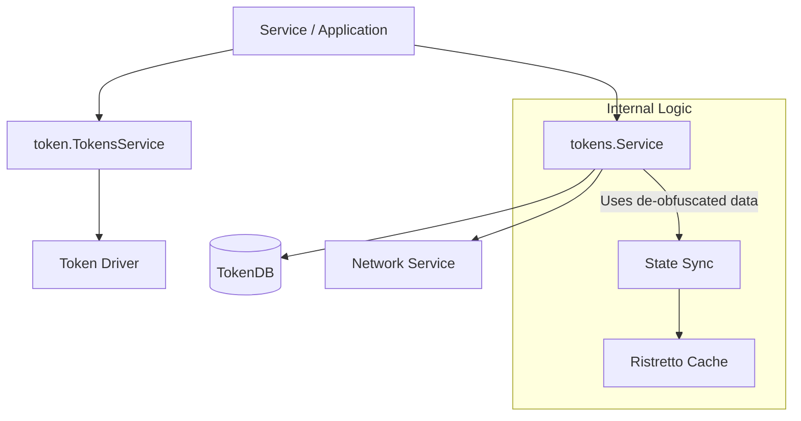

# Tokens Service

The **Tokens Service** provides advanced operations on tokens that extend beyond basic UTXO management. There are two primary layers: a high-level API for cryptographic de-obfuscation and an internal service for managing local state synchronization.

## Internal Service (`token/services/tokens`)

The internal [Service](../../token/services/tokens/tokens.go) is responsible for managing the local representation and lifecycle of tokens. It bridges the gap between ledger-level UTXOs and application-level wallet state.

### Core Responsibilities
*   **State Management**: Updating the local `TokenDB` to reflect the ledger's state (marking tokens as spendable, pending, or deleted). See [storage.go](../../token/services/tokens/storage.go).
*   **Typed Token Support**: Providing a unified way to handle multiple cryptographic token formats (e.g., cleartext vs. commitments) simultaneously via the [TypedToken](../../token/services/tokens/typed.go) structure.
*   **Lifecycle Monitoring**: Notifying local listeners (via `events.Publisher`) when tokens are added or removed.
*   **Consistency**: Identifying and removing stale unspent tokens by cross-referencing local storage with the ledger via the [Network Service](../../token/services/network/network.go) (see `PruneInvalidUnspentTokens`).

## Token Representations

The SDK supports multiple cryptographic representations simultaneously using Type IDs:

| Representation | Location | Type ID | Description |
| :--- | :--- | :--- | :--- |
| **Fabtoken** | [core/fabtoken](../../token/services/tokens/core/fabtoken/token.go) | `1` | **Cleartext**: Tokens where type, value, and owner are directly visible. |
| **Comm** | [core/comm](../../token/services/tokens/core/comm/token.go) | `2` | **Commitment**: Uses Pedersen commitments (`math.G1`) to hide details while maintaining provability. |

## De-obfuscation and High-Level API

While the internal service *manages* de-obfuscated state, the actual cryptographic "unscrambling" is handled by the [TokensService](../../token/tokens.go) interface (which wraps the underlying driver).

### The De-obfuscation Flow
Privacy-preserving drivers like `zkatdlog` hide token details on the ledger. To reveal them, the `Deobfuscate` method is used:
1.  **Input**: Obfuscated [TokenOutput](../../token/driver/tokens.go) and [TokenOutputMetadata](../../token/driver/tokens.go).
2.  **Process**: The driver uses the provided metadata (e.g., blinding factors, audit info) to recover the [token.Token](../../token/token/token.go) (Type and Quantity).
3.  **Output**: Cleartext token details, issuer identity, and recipient list.

This is critical for:
*   **Auditors**: Verifying transaction compliance without owning the tokens.
*   **Recipients**: Extracting the value of received tokens to update their local wallets.

## Implementation Details

*   **Management**: The [ServiceManager](../../token/services/tokens/manager.go) uses `lazy.Provider` for on-demand initialization per TMS.
*   **Caching**: A Ristretto-based `RequestsCache` stores pending requests and pre-extracted actions to optimize performance during transaction commitment.
*   **Storage**: Wraps the local `tokendb` implementation for persistent UTXO tracking.

