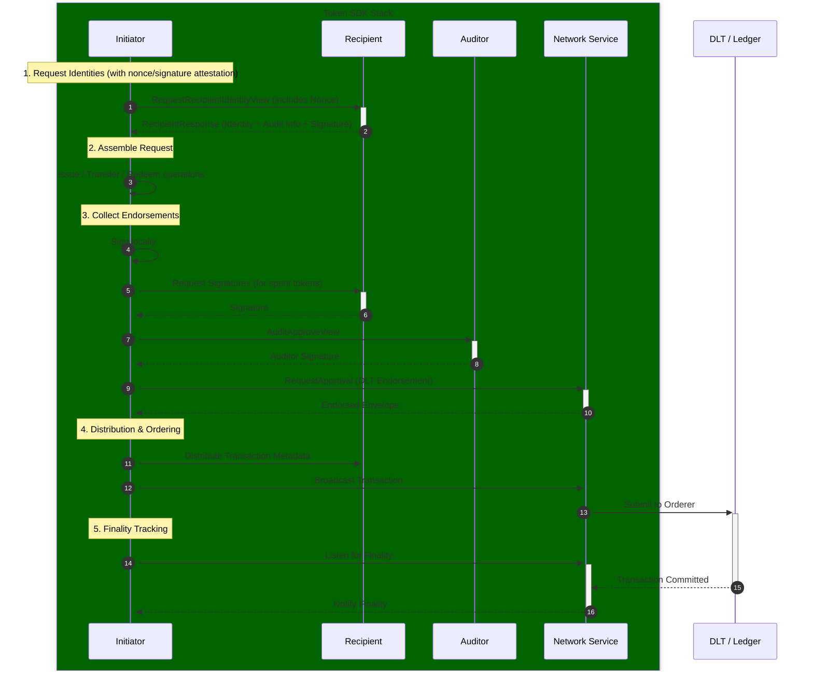
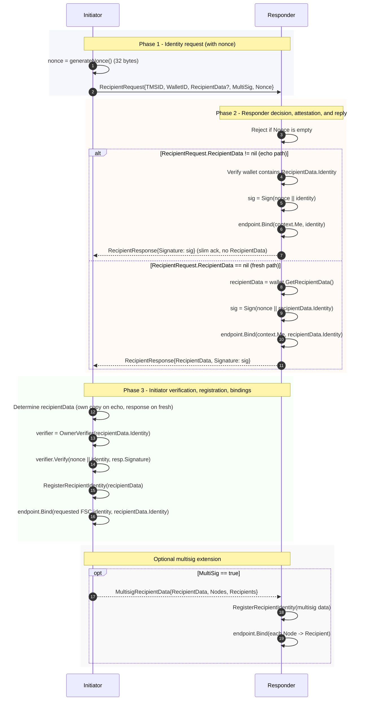
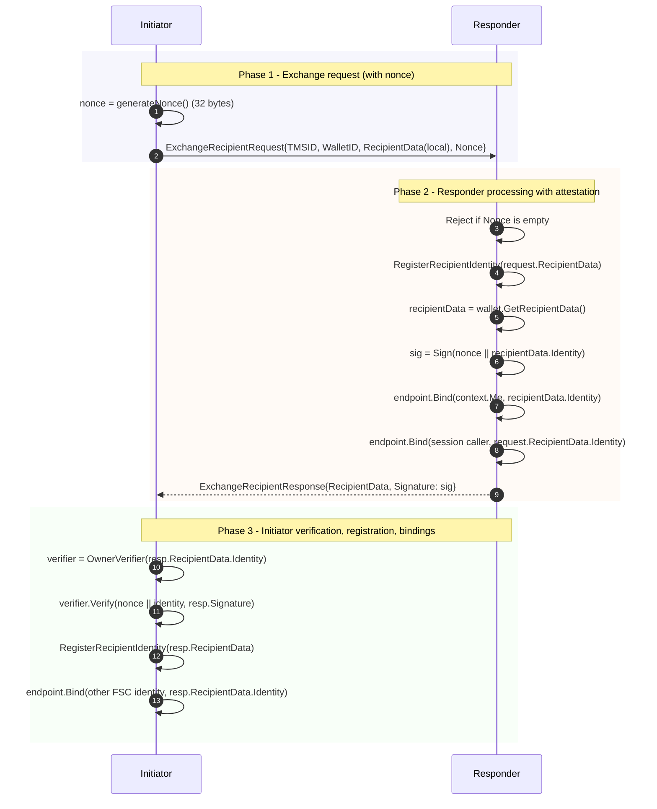
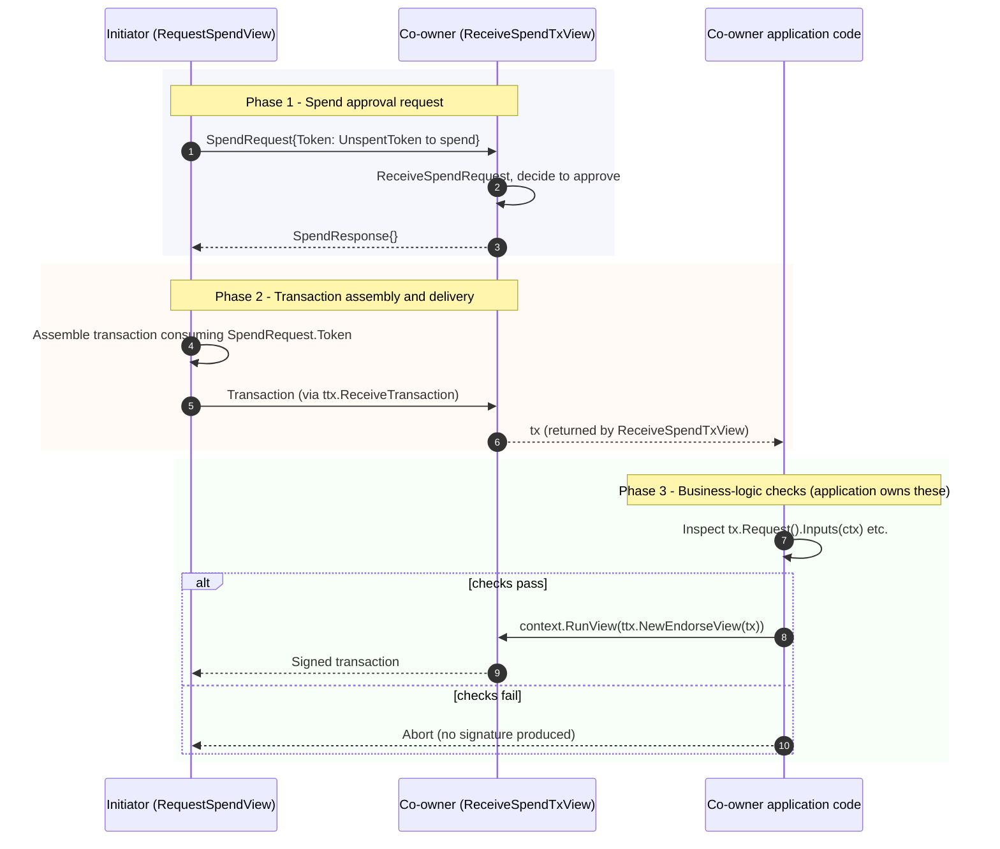
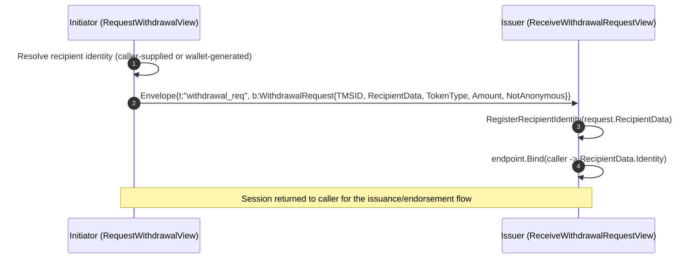
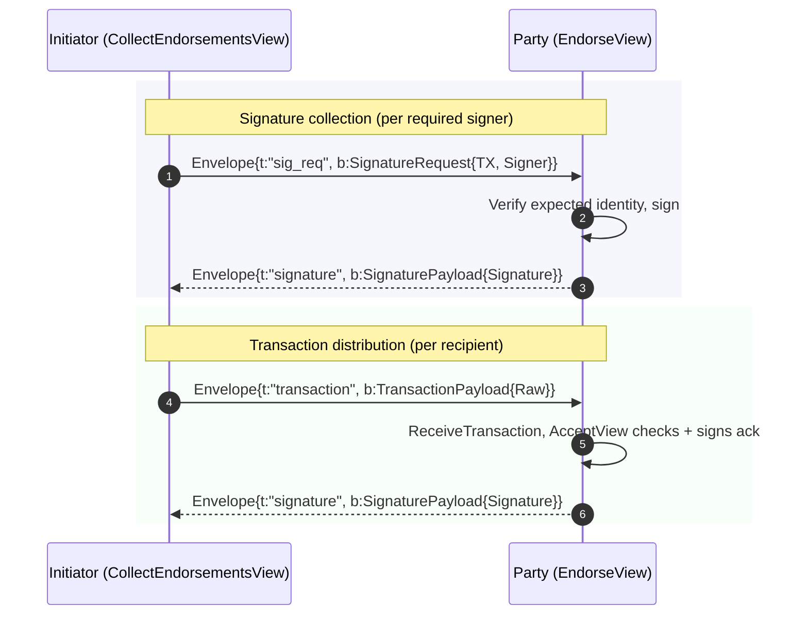
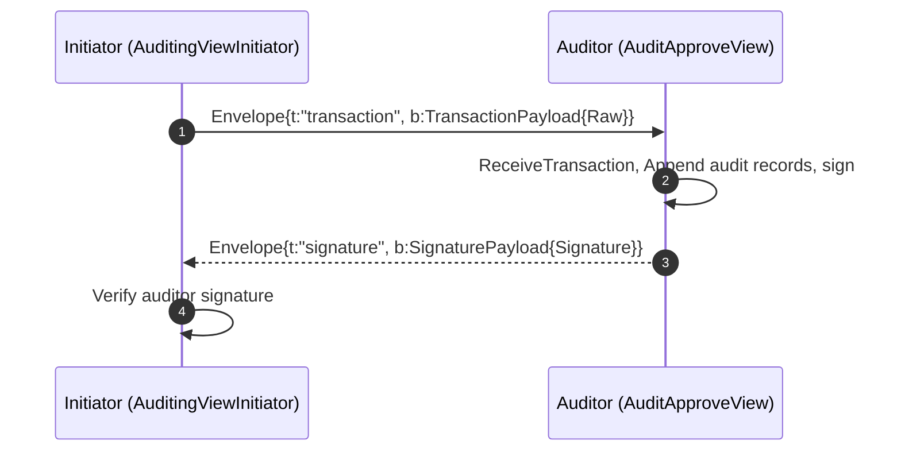

# Token Transaction (TTX) Service

The **Token Transaction (TTX) Service** is the primary orchestration component of the Fabric Token SDK. it provides a high-level API and a set of [Fabric Smart Client (FSC)](https://github.com/hyperledger-labs/fabric-smart-client) Views to help developers assemble, sign, and commit token transactions in a backend-agnostic manner.

The TTX service is designed with a **dependency injection pattern** (located in `token/services/ttx/dep`), which decouples the transaction orchestration logic from the underlying infrastructure providers like the Network Service, TMS Provider, and Storage Service.

## Transaction Lifecycle

The lifecycle of a token transaction typically involves the following stages, coordinated by the TTX service:



## Transaction Creation

Transactions are instantiated via the `ttx.NewTransaction` function. A transaction is anchored to a specific **Token Management System (TMS) ID**, which defines the network, channel, and namespace for the transaction.

When a transaction is created, it:
*   Initializes a new `token.Request` via the TMS.
*   Assigns a unique Transaction ID.
*   Registers a cleanup hook in the FSC view context to ensure resources (like locked tokens) are released if the transaction fails.

## Identity Management

To issue or transfer tokens, the initiator must acquire the recipient's identity. The TTX service provides interactive protocols for this purpose.

### Requesting Recipient Identities
The `RequestRecipientIdentityView` allows an initiator to request a fresh recipient identity from a counterparty. This process ensures that:
*   The recipient generates a fresh pseudonym (e.g., an Idemix pseudonym) to preserve privacy.
*   The initiator receives the necessary audit information to verify the identity's validity against the TMS public parameters.
*   Both parties update their local `IdentityInfo` stores to map the new identity to the correct FSC node.

### Recipient Protocol Flows (`recipients.go`)

The recipient identity protocols are implemented in `token/services/ttx/recipients.go`. The diagrams below document the on-wire messages exchanged by the initiator and responder views.
`RecipientData` can carry `Identity`, `AuditInfo`, `TokenMetadata`, and `TokenMetadataAuditInfo`.

Wire messages use JSON sessions (`token/services/utils/json/session`); the diagrams name the Go types being sent or received.

**Response paths.** In `RespondRequestRecipientIdentityView`, after the wallet lookup:

- If `recipientRequest.RecipientData != nil`, the responder checks `OwnerWallet.Contains` for `RecipientData.Identity`, then sends a **slim acknowledgement** (`RecipientResponse` with no `RecipientData`, only a `Signature`) back on the session (echo path). The initiator already holds the full `RecipientData` and uses its own copy.
- If `recipientRequest.RecipientData == nil`, the responder calls `OwnerWallet.GetRecipientData` and sends a full `RecipientResponse` carrying the wallet-produced `RecipientData` plus a `Signature` (fresh path).

**Nonce / Signature Binding.** Every `RecipientRequest` (and `ExchangeRecipientRequest`) carries a 32-byte cryptographic nonce generated by the initiator. The responder signs `nonce || recipientIdentity` with the private key corresponding to the returned identity (obtained via `tms.SigService().GetSigner`). The initiator verifies this signature using `tms.SigService().OwnerVerifier` **before** registering the identity. This prevents identity-spoofing attacks where a compromised session could substitute a different party's identity bytes.

**Multisig.** When `RecipientRequest.MultiSig` is true, the initiator may send an additional `MultisigRecipientData` after the first exchange; the responder registers identities and updates bindings as in code. Each individual component identity is already attested through nonce/signature binding during the single-recipient phase.

#### `RequestRecipientIdentityView` / `RespondRequestRecipientIdentityView`



#### `ExchangeRecipientIdentitiesView` / `RespondExchangeRecipientIdentitiesView`



### PolicyIdentity — Boolean-Expression-Governed Ownership

The TTX service supports **PolicyIdentity** owners: tokens whose spending requires satisfying a boolean expression over a set of component identities.  This enables richer access-control than simple multisig (M-of-N) — for example, an OR clause where any single co-owner may spend unilaterally, or complex nested expressions.

#### Creating a PolicyIdentity

Call `RequestPolicyIdentity` (in `token/services/ttx/recipients.go`) to negotiate a composite identity from all co-owners before building the transfer:

```go
recipient, err := bptx.RequestRecipientIdentity(ctx, "$0 OR $1",
    []view.Identity{bobFSCIdentity, charlieFSCIdentity},
    token.WithTMSIDPointer(tmsID),
)
```

Each co-owner's node responds with its component identity; the SDK assembles the `PolicyIdentity` envelope automatically.

#### Policy Expression Syntax

| Expression | Meaning |
|:-----------|:--------|
| `$0 OR $1` | Either component 0 **or** component 1 can spend alone. |
| `$0 AND $1` | Both component 0 **and** component 1 must sign. |
| `($0 OR $1) AND $2` | One of the first two parties plus party 2 must sign. |

`$N` is a zero-based index into the ordered component identity list supplied when creating the token.

#### Spending — OR Policy

For an OR policy the initiator alone can satisfy the policy.  Pass `WithPolicySigners` to restrict signature collection to only the signing party's slot; the remaining slots are left nil (which is valid for OR branches):

```go
_, err = context.RunView(ttx.NewCollectEndorsementsView(tx,
    ttx.WithPolicySigners(myComponentIdentity),
))
```

#### Spending — AND Policy

For an AND policy all co-owners must endorse.  Use `RequestSpendView` (in `token/services/ttx/boolpolicy/spend.go`) to notify co-owners before assembling the transaction, then collect endorsements from all components without restriction:

```go
_, err = context.RunView(bptx.NewRequestSpendView(unspentToken, serviceOpts...))
// ... build tx ...
_, err = context.RunView(ttx.NewCollectEndorsementsView(tx))
```

Co-owners run `ReceiveSpendTxView` (via `ReceiveSpendTx`) on their side, which ACKs the spend request and returns the assembled transaction *without* endorsing it. The application then inspects the transaction (e.g. confirming it consumes the expected token and does not include other tokens owned by this node) and explicitly calls `ttx.NewEndorseView(tx)` to sign once those checks pass.

#### Spend Coordination Wire Flow

The same coordination protocol is implemented in `token/services/ttx/multisig/spend.go` (for AND multisig) and in `token/services/ttx/boolpolicy/spend.go` (for AND policies). Both follow the shape below; the responder must verify that the assembled transaction actually consumes the token referenced by the `SpendRequest` it approved.



The split between Phase 2 (library receives the tx) and Phase 3 (application inspects + endorses) is deliberate: the library does not assume a single check policy. Two checks worth running in most deployments — and easy to express with `tx.Request().Inputs(ctx)` — are (a) the tx consumes the token named in the `SpendRequest`, and (b) the tx does not consume any other token owned by this node (see `extractRequiredSigners` in `endorse.go` for the ownership-check pattern). Without these, a co-owner who reviews and approves a spend for token `T_a` could be made to sign a transaction consuming a different token `T_b` co-owned by the same group.

#### Wallet and Authorization

The `boolpolicy.OwnerWallet` (in `token/services/ttx/boolpolicy/wallet.go`) wraps a standard owner wallet and filters the token list to policy-type tokens.  `VerifyApprover` can be used to assert that a given identity is one of the named component identities before allowing a spend.

The `EscrowAuth` struct (in `token/services/ttx/boolpolicy/auth.go`) implements the `Authorization` interface: `IsMine` returns true if any component identity of the policy token belongs to one of the node's owner wallets.

## Interactive Protocol Versioning

Every interactive protocol message in `ttx` is wrapped in a versioned envelope defined in `token/services/utils/json/session/envelope.go`. The envelope is what each initiator/responder pair actually exchanges; the per-flow payload structs ride inside the `Body` field.

```go
type Envelope struct {
    Version uint32          `json:"v"`   // monotonic protocol version (mandatory)
    Type    string          `json:"t"`   // message-type discriminator (mandatory)
    Body    json.RawMessage `json:"b"`   // the actual payload
}
```

Views send with `SendTyped(s, ctx, payload, TypeXxx)` / `SendEnvelopeOnSession(...)` and receive with `ReceiveTyped(s, TypeXxx, &dst)` (and the `WithTimeout` variants). These helpers handle envelope wrapping, version/type validation, and metrics in one call so view code stays focused on the payload.

### Message Types

The message-type discriminators live with the service that uses them — the ttx constants in `token/services/ttx/protocol_messages.go`, and the HTLC interop one in `token/services/interop/htlc/distribute.go` — not in the generic `session` package.

| Constant | Value | Used by |
|----------|-------|---------|
| `TypeRecipientRequest` / `TypeRecipientResponse` | `recipient_req` / `recipient_resp` | `recipients.go` request flow |
| `TypeExchangeRecipientRequest` / `TypeExchangeRecipientResp` | `exchange_req` / `exchange_resp` | `recipients.go` exchange flow |
| `TypeMultisigRecipientData` / `TypePolicyRecipientData` | `multisig_data` / `policy_data` | recipient follow-ups for multisig / policy identities |
| `TypeWithdrawalRequest` | `withdrawal_req` | `withdrawal.go` |
| `TypeUpgradeAgreement` / `TypeUpgradeRequest` | `upgrade_agree` / `upgrade_req` | `upgrade.go` |
| `TypeSpendRequest` / `TypeSpendResponse` | `spend_req` / `spend_resp` | `multisig/spend.go`, `boolpolicy/spend.go` |
| `TypeSignatureRequest` / `TypeSignature` | `sig_req` / `signature` | `collectendorsements.go`, `endorse.go`, `accept.go`, `auditor.go` |
| `TypeTransaction` / `TypeTransactionResponse` | `transaction` / `tx_resp` | tx distribution in `collectendorsements.go`, `auditor.go`, `collectactions.go`, `receivetx.go` |
| `TypeActions` / `TypeActionTransfer` | `actions` / `action_transfer` | `collectactions.go` |
| `TypeHTLCTerms` (htlc pkg) | `htlc_terms` | `interop/htlc/distribute.go` |

Two reusable payload structs back the byte-oriented flows: `TransactionPayload{Raw []byte}` carries a serialized transaction, and `SignaturePayload{Signature []byte}` carries a signature.

### Strict Mode and Errors

Receivers reject any envelope whose `Version` differs from `CurrentVersion`, or whose `Type` is missing or does not match the expected type — there is no silent fallback to a legacy shape. Failures surface as the sentinel errors in `envelope.go`:

- `ErrMissingVersion` — `Version` is zero / absent
- `ErrVersionMismatch` (also returned as `*VersionError` with `Expected`/`Received`) — version differs from `CurrentVersion`
- `ErrTypeMismatch` — received `Type` ≠ expected
- `ErrInvalidEnvelope` — payload did not parse as an envelope

All satisfy `errors.Is`. `VersionCompatibility` / `IsCompatible(local, remote)` declare which versions interoperate (v1 ↔ v1 only).

### Metrics

`EnvelopeMetrics` (in `metrics.go`) records per-type sent/received counters, an error counter, and a body-size histogram. It is registered once per process from the metrics provider obtained via FSC `platform/view/services/metrics#GetProvider`, resolved lazily by the session constructors (`JSON`, `NewFromSession`, …) and read by the typed send/receive helpers. A node with no metrics provider simply runs with metrics disabled.

## Withdrawal Flow

The withdrawal protocol (`withdrawal.go`) lets a wallet ask an issuer to mint tokens to a freshly generated recipient identity. Single-shot: the initiator sends a `WithdrawalRequest`; the issuer registers the recipient identity and returns the session for the subsequent issuance flow.



## Token Upgrade Flow

The upgrade protocol (`upgrade.go`) exchanges old-format tokens for new-format ones over two round-trips: an agreement that establishes a fresh challenge, then a request carrying the proof.

```mermaid
sequenceDiagram
    autonumber
    participant I as Initiator (UpgradeTokensInitiatorView)
    participant Iss as Issuer (UpgradeTokensResponderView)

    I->>Iss: Envelope{t:"upgrade_agree", b:UpgradeTokensAgreement{}}
    Iss->>Iss: NewUpgradeChallenge, set TMSID
    Iss-->>I: Envelope{t:"upgrade_agree", b:UpgradeTokensAgreement{Challenge, TMSID}}
    I->>I: GenUpgradeProof(challenge, tokens); resolve recipient identity
    I->>Iss: Envelope{t:"upgrade_req", b:UpgradeTokensRequest{ID, TMSID, RecipientData, Tokens, Proof}}
    Iss->>Iss: Verify request.ID == challenge, verify TMS matches
    Note over I,Iss: Responder continues with issuance; session returned to caller
```

The responder checks `request.ID` byte-for-byte against the challenge it issued, so a stale or substituted request is rejected before any proof verification.

## Endorsement and Signature Collection

`CollectEndorsementsView` (`collectendorsements.go`) gathers the signatures that make a transaction valid, then distributes the assembled transaction. Two message exchanges are involved, both enveloped:



`EndorseView` (`endorse.go`) is the responder for the signature-request leg; `AcceptView` (`accept.go`) responds to the transaction-distribution leg with a signed acknowledgement. `ReceiveTransactionView` (`receivetx.go`) unwraps the envelope and accepts `TypeTransaction`, `TypeTransactionResponse`, or `TypeSignatureRequest`.

## Auditor Approval Flow

`AuditingViewInitiator` (`auditor.go`) sends the assembled transaction to the auditor and waits for the auditor's signature; `AuditApproveView` audits, signs, and returns it.



## Collect Actions Flow

`collectActionsView` (`collectactions.go`) drives a transfer where the action originates with a remote party: it ships the transaction and the requested actions, and receives the assembled transaction back.

```mermaid
sequenceDiagram
    autonumber
    participant I as Initiator (collectActionsView)
    participant R as Responder (receiveActionsView / collectActionsResponderView)

    I->>R: Envelope{t:"transaction", b:TransactionPayload{Raw}}
    I->>R: Envelope{t:"actions", b:Actions}
    I->>R: Envelope{t:"action_transfer", b:ActionTransfer}
    R->>R: Receive transaction, actions, action; assemble
    R-->>I: Envelope{t:"tx_resp", b:TransactionPayload{Raw}}
```

## Token Operations

The TTX service supports three primary operations through the `TokenRequest` API:

### Issue
Allows authorized issuers to create new tokens. The service:
1.  Retrieves the issuer's identity from the internal **Identity Service**.
2.  Generates an "Issue Action" using the driver-specific logic.
3.  Adds the action and its metadata to the transaction request.

### Transfer
Enables the transfer of token ownership. The service:
1.  Uses the **Selector Service** to pick spendable tokens (UTXOs) that cover the requested amount.
2.  Locks the selected tokens in the local `TokenLocks` table to prevent double-spending.
3.  Generates a "Transfer Action" that consumes the selected tokens and creates new ones for the recipients.

### Redeem
A specialized transfer where the recipient is "hidden" or "empty," effectively removing the tokens from circulation on the ledger.

Redeem supports an enhanced flow where an issuer signature is required as part of transfer validation:
1. Add the redeem action with `tx.Redeem(...)`.
2. If the issuer endpoint cannot be resolved automatically, pass `ttx.WithFSCIssuerIdentity(...)` so the initiator can contact the issuer for endorsement.
3. Optionally pass `ttx.WithIssuerPublicParamsPublicKey(...)` to pin which issuer public-parameters signing key must authorize the redeem.
4. Run `CollectEndorsementsView` to collect owner, auditor (if configured), and issuer signatures.

## Collecting Endorsements

The `CollectEndorsementsView` is responsible for gathering all signatures required to make a transaction valid:
*   **Owner Signatures**: For every token spent, the service requests a signature from the node that owns the corresponding identity.
*   **Issuer Signatures**: For transactions involving token issuance and enhanced redeem flows that require issuer authorization.
*   **Auditor Signatures**: If the TMS is configured with an auditor, the transaction must be approved via the `AuditApproveView`.
*   **Network Endorsements**: The service delegates to the **Network Service** to obtain backend-specific endorsements (e.g., Fabric chaincode endorsements).

## Distribution and Ordering

Once fully endorsed, the transaction metadata is distributed to all recipients so they can track and spend their new tokens. The initiator then uses the `OrderingView` to broadcast the transaction envelope to the network's ordering service.

## Finality and Discovery

The `FinalityView` allows applications to wait for a transaction to be committed to the ledger. Internally, the SDK's **Network Service** listens for ledger events. When a transaction reaches finality, the Network Service notifies the SDK, which then updates the local `Transactions DB` and `Tokens DB` to reflect the new state.

### Transaction Recovery

The SDK includes an automatic recovery mechanism to handle pending transactions that may have lost their finality listeners due to node restarts, network interruptions, or other failures. 
The recovery service is part of the **Storage Service** and is instantiated by the **Network Service** to recover transactions from either `TTXDB` (for regular transactions) or `AuditDB` (for auditor nodes).

For detailed information about the recovery mechanism, see:
- [Storage Service - Transaction Recovery](storage.md#transaction-recovery-service)
- [Configuration Guide - Recovery Parameters](../configuration.md), Section `Optional: token.tms.<name>.services.network.fabric.recovery`
