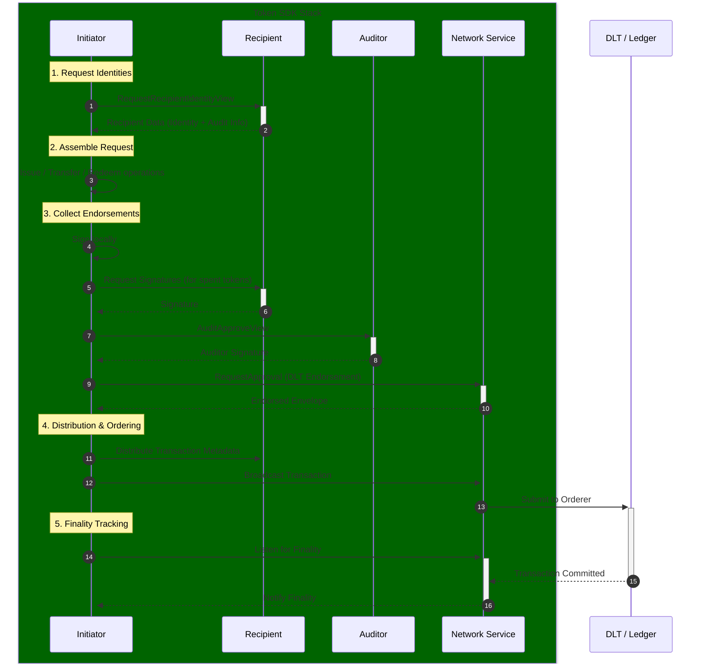
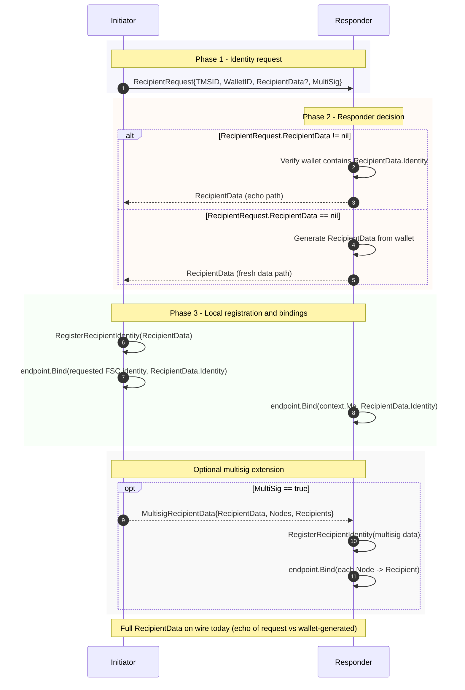
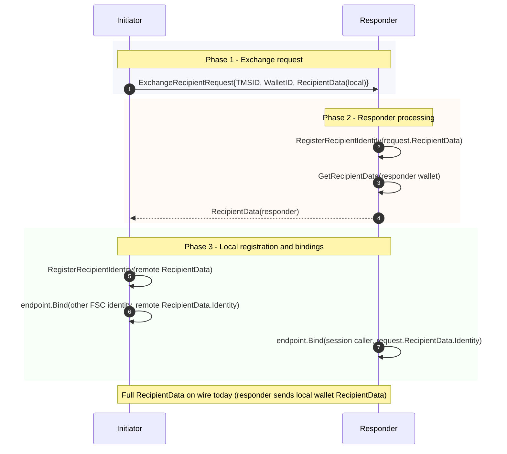

# Token Transaction (TTX) Service

The **Token Transaction (TTX) Service** is the primary orchestration component of the Fabric Token SDK. it provides a high-level API and a set of [Fabric Smart Client (FSC)](https://github.com/hyperledger-labs/fabric-smart-client) Views to help developers assemble, sign, and commit token transactions in a backend-agnostic manner.

The TTX service is designed with a **dependency injection pattern** (located in `token/services/ttx/dep`), which decouples the transaction orchestration logic from the underlying infrastructure providers like the Network Service, TMS Provider, and Storage Service.

## Transaction Lifecycle

The lifecycle of a token transaction typically involves the following stages, coordinated by the TTX service:

## Transaction Creation

Transactions are instantiated via the `ttx.NewTransaction` function. A transaction is anchored to a specific **Token Management System (TMS) ID**, which defines the network, channel, and namespace for the transaction.

When a transaction is created, it:
*   Initializes a new `token.Request` via the TMS.
*   Assigns a unique Transaction ID.
*   Registers a cleanup hook in the FSC view context to ensure resources (like locked tokens) are released if the transaction fails.

## Identity Management

To issue or transfer tokens, the initiator must acquire the recipient's identity. The TTX service provides interactive protocols for this purpose.

### Requesting Recipient Identities
The `RequestRecipientIdentityView` allows an initiator to request a fresh recipient identity from a counterparty. This process ensures that:
*   The recipient generates a fresh pseudonym (e.g., an Idemix pseudonym) to preserve privacy.
*   The initiator receives the necessary audit information to verify the identity's validity against the TMS public parameters.
*   Both parties update their local `IdentityInfo` stores to map the new identity to the correct FSC node.

### Recipient Protocol Flows (`recipients.go`)

The recipient identity protocols are implemented in `token/services/ttx/recipients.go`. The diagrams below document the on-wire messages exchanged by the initiator and responder views.
`RecipientData` can carry `Identity`, `AuditInfo`, `TokenMetadata`, and `TokenMetadataAuditInfo`.

Wire messages use JSON sessions (`token/services/utils/json/session`); the diagrams name the Go types being sent or received.

**Response paths (today).** In `RespondRequestRecipientIdentityView`, after the wallet lookup:

- If `recipientRequest.RecipientData != nil`, the responder checks `OwnerWallet.Contains` for `RecipientData.Identity`, then sends **the same** `RecipientData` value back on the session (echo path). The responder does **not** substitute wallet-held `AuditInfo` / metadata into that payload; what goes on the wire is the initiator-supplied structure (after the contains check).
- If `recipientRequest.RecipientData == nil`, the responder calls `OwnerWallet.GetRecipientData` and sends that **wallet-produced** `RecipientData` (fresh path).

In both cases the initiator receives a full `RecipientData` over the wire. The initiator then calls `WalletManager.RegisterRecipientIdentity` with that payload and updates the endpoint resolver. **Protocol hardening** may replace full-object responses with a minimal acknowledgement (or another minimal wire type) so the responder does not ship an entire `RecipientData` when a slimmer response suffices; that is a separate code change from this documentation.

**Multisig.** When `RecipientRequest.MultiSig` is true, the initiator may send an additional `MultisigRecipientData` after the first exchange; the responder registers identities and updates bindings as in code.

#### `RequestRecipientIdentityView` / `RespondRequestRecipientIdentityView`

#### `ExchangeRecipientIdentitiesView` / `RespondExchangeRecipientIdentitiesView`

## Token Operations

The TTX service supports three primary operations through the `TokenRequest` API:

### Issue
Allows authorized issuers to create new tokens. The service:
1.  Retrieves the issuer's identity from the internal **Identity Service**.
2.  Generates an "Issue Action" using the driver-specific logic.
3.  Adds the action and its metadata to the transaction request.

### Transfer
Enables the transfer of token ownership. The service:
1.  Uses the **Selector Service** to pick spendable tokens (UTXOs) that cover the requested amount.
2.  Locks the selected tokens in the local `TokenLocks` table to prevent double-spending.
3.  Generates a "Transfer Action" that consumes the selected tokens and creates new ones for the recipients.

### Redeem
A specialized transfer where the recipient is "hidden" or "empty," effectively removing the tokens from circulation on the ledger.

## Collecting Endorsements

The `CollectEndorsementsView` is responsible for gathering all signatures required to make a transaction valid:
*   **Owner Signatures**: For every token spent, the service requests a signature from the node that owns the corresponding identity.
*   **Issuer Signatures**: For transactions involving token issuance.
*   **Auditor Signatures**: If the TMS is configured with an auditor, the transaction must be approved via the `AuditApproveView`.
*   **Network Endorsements**: The service delegates to the **Network Service** to obtain backend-specific endorsements (e.g., Fabric chaincode endorsements).

## Distribution and Ordering

Once fully endorsed, the transaction metadata is distributed to all recipients so they can track and spend their new tokens. The initiator then uses the `OrderingView` to broadcast the transaction envelope to the network's ordering service.

## Finality and Discovery

The `FinalityView` allows applications to wait for a transaction to be committed to the ledger. Internally, the SDK's **Network Service** listens for ledger events. When a transaction reaches finality, the Network Service notifies the SDK, which then updates the local `Transactions DB` and `Tokens DB` to reflect the new state.

### Transaction Recovery

The SDK includes an automatic recovery mechanism to handle pending transactions that may have lost their finality listeners due to node restarts, network interruptions, or other failures. 
The recovery service is part of the **Storage Service** and is instantiated by the **Network Service** to recover transactions from either `TTXDB` (for regular transactions) or `AuditDB` (for auditor nodes).

For detailed information about the recovery mechanism, see:
- [Storage Service - Transaction Recovery](storage.md#transaction-recovery-service)
- [Configuration Guide - Recovery Parameters](../configuration.md), Section `Optional: token.tms.<name>.services.network.fabric.recovery`
