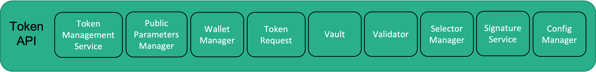
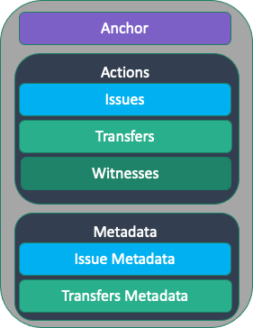
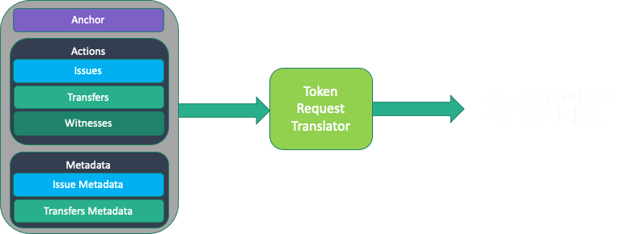

# Token API

The `Token API` offers a useful abstraction to deal with tokens in an implementation and blockchain independent way.

Let us start with defining the tokens that the Token SDK handles.
A token consists of the following triplet:
- `Owner`: The owner of the token; Each driver implementation can interpreter this field as needed. It can be a public-key, a script,
  anything the underlying specific driver supports.
- `Type`: The *denomination* of the token;
  This is a string whose value can be application specific. Examples are:
  The denomination of a digital currency or unique identifiers.
- `Quantity`: The amount stored by this token. It is a positive number, larger or equal to zero, 
  encoded as a string containing a number in base 16. The string starts with the prefix `0x`.

These tokens are `fungible` with the respect to the same type. 
In particular, tokens with the same denomination can be merged and split, if not otherwise forbidden.

It looks like that the above definition allows the developers to define non-fungible tokens as well.
A non-fungible token is a token whose quantity is `1` and whose type is `unique`. 
If uniqueness is guaranteed, then such a token is by all means a non-fungible token.
Drivers are free to implement additional semantics for non-fungible tokens.

A token can be spent only by the `rightful owner`. This concept is implementation dependant. For example,
if the `Owner` field contains a public-key, then a valid signature under that public key must be presented to spend the token.
If the `Owner` field contains a script, then an input that satisfies the script must be presented to spend the token.

The Token SDK supports the following basic operations:
- The `Issue` operation creates new tokens. `Issuers` are in charge of issuing new tokens. Depending on the driver
  implementation, an issuing policy can be used to identify the authorized issuers for a given type. 
- The `Transfer` operation transfers the ownership of a given token. A transfer operation must refer to tokens of the same
type.
- The `Redeem` operation deletes tokens. Depending on the driver implementation, either the rightful owner or special
parties, called `redeemers`, can invoke this operation.

A `Token Request` aggregates token operations that must be performed atomically.

Let us now focus on the building blocks the `Token API` consists of:

- `Token Management Service`: The Token Management Service (TMS, for short) is the entry point of the Token SDK
  and gives access to the other building blocks.
  The tuple `(network, channel, namespace, public parameters)` uniquely identifies a TMS, where:
   - `network` is the identifier of the network of reference;
   - `channel` is the channel inside the network, if available;
   - `namespace` is the namespace inside the channel that stores the tokens.
   - `public parameters` contain all information needed to operate the specific token infrastructure.

- `Public Parameters Manager`: Each TMS is associated to some public parameters that contain all information needed
  to operate the token infrastructure.
  Even though, parts of the public parameters are driver-specific, we can identify the following common information:
    - `MaxTokenValue`: It is the maximum quantity that a token can contain
    - `TokenDataHiding`: When true it means that the content of the tokens is hidden
    - `GraphHiding`:  When true it means that the tokens are untraceable

  The Public Parameters Manager offers API to manage the public parameters. Here are some examples:
    - Access the public parameters;
    - Manipulate the public parameters (Set an Auditor, Add an Issuer, and so on...);

- `Wallet Manager`: A Wallet consists of a long-term identity and all its derivation (if any).
  Examples of long-term identities are:
    - An `X509 Certificate` for an ECDSA signing public-key
    - An `Idemix Credential`. In this case, the wallet will contain also all pseudonyms derived from the credential.
  
  However, it is always the specific driver that dictates what a long-term identity is.

  All operations that require a signature refer to wallets to identify the signing and verification keys.
  There are wallets for `Token Issuers`, `Owners`, and `Auditors`.
  Depending on the nature of the wallet additional information can be extracted like:
    - An Issuer Wallet gives access to the list of issued tokens;
    - A Token Owner Wallet gives access to the list of owned unspent tokens;

  The Wallet Manager offers API to manage wallets.
- `Token Request`: The Token Request is a container of token actions (issue, transfer, and redeem) that must be
  performed atomically.
  The Token Request offers API to add actions or inspect actions already present in the container.
  More information in Section [Token Request](#token-request).

- `Validator`: The validator is the component that sets the validation rules for a Token Request. The rules depend on the
  type of tokens supported (fungible, non-fungible, and so on), and on the specific driver implementation.
  A Validator validates Token Requests with the respect to:
    - A given Anchor (e.g., Fabric TxID), and
    - The Ledger. Notice that, in certain implementations, the ledger might not be needed.

  Even though, certain validation rules are driver specific, we can identify the following general validation rules.
  A token request should:
    - Well-formed, and
    - Satisfies the constraints of the payment system. Namely:
        - Only the `rightful owner` can transfer a token,
        - No token can be created out of the blue,
        - Audited(able)
        - Etc. (Each implementation can enforce additional requirements, if needed)
  
## Token Request

Let us spend a few more words on the `Token Request` that is the core of the Token API.
The Token Request is a `container` of token actions (issue, transfer, and redeem) that must be performed atomically.
Looking ahead, parties interacting to assemble a token transaction are, under the hood, assembling a `Token Request` that it is
later marshalled into the format required by the target Blockchain.

This is the anatomy of a Token Request:

It consists of three parts:
- `Anchor`: It is used to bind the Actions to a given Transaction. In Fabric, the anchor is the Transaction ID.
- `Actions`: It is a collection of `Token Action`:
    - `Issues`, to create new Tokens;
    - `Transfers`, to manipulate Tokens (e.g., transfer ownership or redeem)

  The actions in the collection are independent. An action cannot spend tokens created by another action in the same Token Request.
  In addition, actions comes with a set of `Witnesses` to verify the `right to spend` or the `right to issue` a given token

- `Metadata`: It is a collection of `Token Metadata`, one entry for each Token Action.
  Parties, assembling a token request, exchange metadata that contain secret information used by
  the parties to check the content of the token actions. This is particularly relevant when using ZK-based drivers.
  Notice that, the ledger does not store any metadata.

Looking ahead: As we mentioned earlier, a Token Request is itself agnostic to the details of the specific Blockchain.
Indeed, a Token Request must be translated to the Transaction format of the target Blockchain to become meaningful.
A service called `Token Request Translator` translates the token requests.
The `Token Request Translator` does not belong to the Token API. It is offered as a service on top of the `Token API`
because it is blockchain dependant. 

Here is a pictorial representation of the translation process. 

In Fabric, it is the `Token Chaincode` that performs validation and translations of token requests.
In the section dedicated to [`What you need to build Token-Based Applications on top of Fabric`](./services.md), 
we will learn more about this process.
