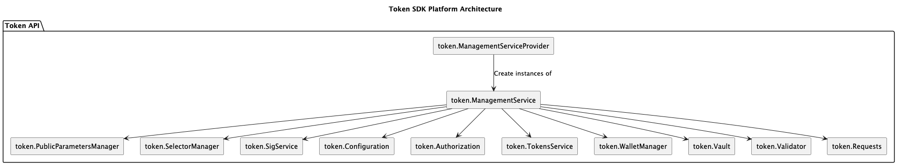

# Token API

The Token API provides a powerful and versatile way to manage tokens across different implementations and backends.
It acts as an abstraction layer, simplifying token interaction for developers.

Below is a pictorial representation of the `Token API`:

This API handles tokens defined by a three-part structure:

* **Owner:** This identifies the token's rightful owner. Driver implementations can interpret this field based on their specific needs. It could represent a public key, a script, or anything the underlying driver supports.
* **Type:** Think of this as the token's denomination, a string value specific to your application. Examples include digital currency denominations or unique identifiers.
* **Quantity:** This represents the amount stored by the token. It's always a non-negative number encoded as a string in base 16, prefixed with "0x".

Tokens of the same type are considered **fungible**.
This means they can be merged or split (unless restricted), similar to how interchangeable units of currency behave.
However, the API also allows for the creation of **non-fungible tokens**.
These unique tokens have a quantity of 1 and a unique type.
Drivers can further enhance non-fungible token functionality with additional features.

Spending a token requires authorization from the rightful owner.
This process depends on the Driver implementation.
For instance, if the Owner field holds a public key, a valid signature using that key is necessary.
Script-based tokens require an input that satisfies the script's conditions.

The Token API empowers developers with essential operations:

* **Issue:** Creates new tokens. The designated issuers, determined by driver-specific issuing policies, control this operation.
* **Transfer:** Shifts ownership of a token. Transfers can only occur between tokens of the same type.
* **Redeem:** Deletes tokens. Depending on the driver, either the owner or designated redeemers can perform this action.

**Token Requests** bundle these operations, ensuring they are executed atomically, meaning all operations succeed or fail together.

## Token Management Service and Provider

The Token Management Service (TMS, for short) acts as the central hub for the Token SDK.
It provides access to all the other APIs within the SDK.

A TMS is uniquely identified by a four-part address:

1. **Network:** This identifies the underlying network or backend system.
2. **Channel (Optional):** This specifies the channel within the network. If not applicable, it remains empty.
3. **Namespace:** This defines the specific namespace within the channel where tokens are stored.
4. **Public Parameters:** This section holds all the crucial information needed to operate the particular token infrastructure.

Every Token Management Service (TMS) is linked to a set of public parameters.
This information holds the key to operating the token infrastructure effectively.

Each TMS must be defined in the configuration.
When accessing the first time a TMS, its data structure are created and kept in memory ready to be used.

Instances of the Token Management Service are created by a provider, the `Token Management Service Provider` (TMSP, for short).

## Public Parameters Manager

The public parameters are holds by the Public Parameters Manager.

While some parameters are specific to different drivers, some common details are included:
* **Driver Name:** A string uniquely identifying the driver.
* **Driver Version:** The version of the driver.
* **Precision:** This dictates the level of detail used to represent the amount stored in a token.
* **MaxTokenValue:** This sets a limit on the maximum quantity a single token can hold.
* **Token Data Hiding:** When enabled (true), the content of the tokens is obscured.
* **Graph Hiding:** With this set to true, tokens become untraceable within the system.
* **Auditors:** This list identifies authorized auditors for the token system.
* **Issuer:** This list identifies authorized issuers for the token system.

A TMS can be created only upon presenting concrete public parameters.
When the `Token Management Service Provider` is requested to create a new TMS, the TMSP inspects the public parameters.
Depending on the `Driver Name` and `Driver Version`, a matching implementation of the `Driver API` is selected, if available.
Available `Driver API` implementations must be burned inside the Go executable.
The drivers are registered via the FSC's dependency injection framework and provided to the TMSP as a dependency.

## Wallet Manager

A Wallet acts like a digital identity vault, holding a long-term identity (think of it as a main key) and any credentials derived from it.
This identity can take different forms, such as an X509 Certificate for signing purposes or an [`Idemix Credential`](https://github.com/IBM/idemix) with its associated pseudonyms.
Ultimately, the specific driver you're using determines what constitutes a valid long-term identity.

Wallets play a crucial role in signing and verifying operations.
Whenever a signature is needed, the system looks to the appropriate wallet within the Wallet Manager to locate the necessary keys.
This manager keeps track of wallets for different roles like Issuers, Owners, and Auditors.
Notably, Certifiers aren't supported because this driver doesn't handle a specific privacy feature called Graph Hiding.

Depending on the type of wallet, you can extract additional information.
For instance, an Issuer Wallet lets you see a list of issued tokens, while an Owner Wallet shows you their unspent tokens.

The `Wallet Manager` serves as the central hub for managing all these wallets.

## Building a Token Transaction

Imagine a `Token Request` as a blueprint for a secure financial transaction.
It groups together different actions like issuing new tokens, transferring ownership, or redeeming existing ones.
These actions must happen all at once, ensuring everything goes smoothly.

The `Token Request` offers a toolbox for developers to easily add or review the actions included in this blueprint.

Here's a breakdown of its key components:

* **Anchor:** This acts like a reference point, tying the actions to a specific transaction within the system. In Hyperledger Fabric, the anchor corresponds to the transaction ID.
* **Actions:** This is the heart of the blueprint, containing a set of specific token operations:
    * **Issue:** Creates brand new tokens.
    * **Transfer:** Manages existing tokens, allowing ownership changes or redemption.

These actions within the request are independent. One action cannot utilize tokens created by another action within the same request. Additionally, each action comes with witnesses, which are essentially verifications. These witnesses confirm the "right to spend" or "right to issue" a particular token. In simpler scenarios, witnesses might be signatures from token owners or issuers.
* **Metadata:** This serves as a secure communication channel between involved parties. It holds secret information that allows them to verify the details of the token actions. This is especially important when using privacy-focused drivers based on Zero-Knowledge proofs. Importantly, the ledger itself doesn't store this metadata.

Behind the scenes, when parties collaborate to create a token transaction, they're essentially building a `Token Request`.
This request is then translated into a format that the specific ledger system (like Hyperledger Fabric) understands.
Remember, a `Token Request` itself is independent of the underlying ledger.
To be processed, it needs a translation service called the `Token Request Translator`.
This translator converts the request into the transaction format specific to the chosen ledger backend.
Since this translation depends on the ledger being used, the `Token Request Translator` is a separate service on top of the core `Token API`.

In Fabric, a special component called the `Token Chaincode` is responsible for validating and translating these token requests.
This components runs the `Validator` to check the validity of token requests against given public parameters.
Validation can also be performed by network nodes running the Token SDK and equipped with the proper endorsement keys.

The Token SDK provides a handy service, the `ttx service`, to streamline working with token requests as transactions.
This service takes care of the entire process, from creation to completion.

Both the Token API and the Driver API contains a struct describing a token request.
The one provided by the Token API encapsulates the one provided by the Driver API.
IT offers higher level functions that internally perform all the necessary calls to the Driver API's token request.

## Validator

The Validator acts as the guardian of token requests, ensuring they adhere to specific rules.
These rules vary depending on the types of tokens supported (fungible or non-fungible) and the chosen driver implementation.

The validator meticulously examines each token request against two key aspects:

- The provided anchor (think of it as a reference point, like a transaction ID in Fabric).
- The target ledger (though some implementations might not require the ledger itself).

While specific validation rules can differ based on the driver, some general principles hold true. A valid token request should:

- Be structurally sound (well-formed).
- Align with the constraints of the payment system. This means:
    - Only authorized owners can transfer tokens.
    - Tokens can't be conjured out of thin air (they must be issued properly).
    - The system should be auditable (transactions can be traced and verified).
- Additional requirements can be enforced by individual implementations as needed.

The implementation of Driver API's `Validator` contains the specific checks performed by that driver.
Further details are postponed to the sections about the Driver API.

## Token Vault

Token Vault is your central hub for everything token-related.
It works seamlessly across different systems, offering a comprehensive toolkit to understand your token holdings.

With Token Vault, you can:

* **Gain instant insights:** See all your tokens in one place, check their status, and get detailed information about each one.
* **Track transactions:** Easily query if a transaction is pending or confirm ownership of a specific token.
* **Explore unspent tokens:** Utilize iterators to discover tokens you haven't used yet.
* **List all tokens:** Get a complete overview of all your tokens or those issued on the network.
* **Dive deeper:** Retrieve specific details about tokens and their outputs. (For certain systems) You can even find out who deleted a token, if applicable.

The `Token Vault` is built on top of the `Transactions DB` `Audit Transactions DB` and `Tokens DB`.

## Token Selector Manager

The Token SDK empowers developers to select specific tokens from the vault for transactions using the `token.Selector` function.
This selector acts like a refined filter, allowing you to specify conditions like token type, amount, and even ownership.
To safeguard against double-spending, any chosen token is automatically locked until the transaction's fate is sealed – be it commitment, rejection, timeout, or manual unlock.
This ensures developers leverage the appropriate tokens while eliminating double-spending woes.

## Signature Service

The `token.SignatureService` acts as your gateway to secure transactions.
It provides access to both signature verifiers and signers, all seamlessly linked to identities retrieved from the Wallet Manager.

## Config Manager

This component grants you access to the TMS's configuration, giving you full control over its behavior.
