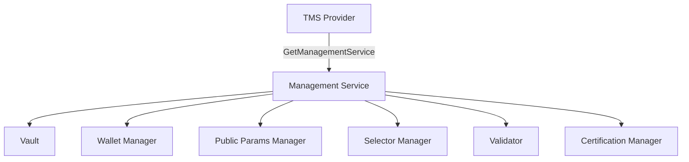
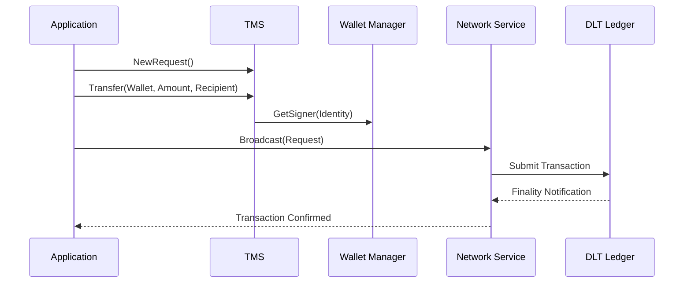

# Token API

The **Token API** (`token/`) provides a powerful and versatile abstraction for managing digital tokens across various distributed ledger backends. It decouples application logic from the underlying cryptographic and consensus mechanisms, allowing developers to build sophisticated token-based applications that are both portable and privacy-preserving.

## The Token Data Model

The SDK defines a token as a discrete unit of value with a three-part structure:

*   **Owner**: A byte slice (`[]byte`) representing the entity with the right to spend the token. Driver implementations interpret this field based on their specific technology (e.g., an X.509 certificate, an Idemix pseudonym, or a script).
*   **Type**: A case-sensitive string (`token.Type`) representing the token's denomination or category (e.g., "USD", "Gold", "Diamond_ID").
*   **Quantity**: A base-16 string (`0x`-prefixed) representing the amount. The SDK uses a configurable **Precision** to handle fractional values consistently across drivers.

Tokens are uniquely identified by a `token.ID`, which consists of the **Transaction ID** that created it and its **Index** within that transaction's outputs.

### Fungibility and NFTs
*   **Fungible Tokens**: Multiple tokens of the same `Type` can be merged or split during a transfer, provided the total quantity is preserved.
*   **Non-Fungible Tokens (NFTs)**: Unique tokens typically characterized by a quantity of 1 and a unique `Type` or metadata.

## Token Management Service (TMS)

The [ManagementService](../token/tms.go) (TMS) is the primary entry point for the Token API. It orchestrates all token-related operations for a specific "space" on the ledger.

### TMS Identification
A TMS is uniquely identified by a [TMSID](../token/driver/tms.go):
1.  **Network**: The identifier of the underlying DLT (e.g., "fabric").
2.  **Channel**: The partition or channel within the network.
3.  **Namespace**: The specific smart contract or chaincode managing the tokens.

```mermaid
graph TD
    TMSP[TMS Provider] -->|GetManagementService| TMS[Management Service]
    TMS --> Vault[Vault]
    TMS --> WM[Wallet Manager]
    TMS --> PPM[Public Params Manager]
    TMS --> Selector[Selector Manager]
    TMS --> Validator[Validator]
    TMS --> Certification[Certification Manager]
```

## Public Parameters Manager

The [PublicParametersManager](../token/publicparams.go) holds the cryptographic setup required to operate a specific token system. These parameters are often referred to as the "Trust Anchor" and include:
*   **Driver Identity**: The name and version of the active token driver (e.g., `fabtoken`, `zkatdlog`).
*   **System Constraints**: Maximum token value, supported precision, and privacy levels (e.g., hiding amounts or owners).
*   **Role Definitions**: Authorized identities for Issuers and Auditors.

## Wallet Manager

The [WalletManager](../token/wallet.go) manages the digital identities used to interact with tokens. It categorizes identities into specialized roles:

*   **Owner Wallet**: Manages identities that can receive, hold, and transfer tokens. It provides methods to list unspent tokens and check balances.
*   **Issuer Wallet**: Manages identities authorized to mint new tokens.
*   **Auditor Wallet**: Manages identities capable of viewing and verifying private transaction details without being a participant.
*   **Certifier Wallet**: Used in specific drivers to provide an additional layer of transaction validation or "certification".

## Token Requests and Transactions

A [Request](../token/request.go) is a ledger-agnostic blueprint for a token transaction. It bundles multiple actions into a single atomic unit.

### Core Actions
*   **Issue**: Minting new tokens into the system.
*   **Transfer**: Reassigning ownership of existing tokens (includes **Redeem** by transferring to a null owner).

### The Request Lifecycle
1.  **Assemble**: Add actions to the `Request` using a TMS.
2.  **Sign**: Generate witnesses (signatures or ZK proofs) using the appropriate Wallets.
3.  **Translate**: The [Network Service](./services/network.md) converts the request into a ledger-specific format (e.g., a Fabric RWSet).
4.  **Commit**: The transaction is submitted to the network and monitored for finality.

```mermaid
sequenceDiagram
    participant App as Application
    participant TMS as TMS
    participant WM as Wallet Manager
    participant NS as Network Service
    participant Ledger as DLT Ledger

    App->>TMS: NewRequest()
    App->>TMS: Transfer(Wallet, Amount, Recipient)
    TMS->>WM: GetSigner(Identity)
    App->>NS: Broadcast(Request)
    NS->>Ledger: Submit Transaction
    Ledger-->>NS: Finality Notification
    NS-->>App: Transaction Confirmed
```

## Token Vault and Selector

The SDK provides sophisticated tools for managing the local state of tokens:

*   **Token Vault**: A specialized query engine ([Vault](../token/vault.go)) that tracks the status of tokens (Unspent, Spent, Pending) and provides historical insights into transaction outcomes.
*   **Token Selector**: A smart selection engine ([Selector](../token/selector.go)) that identifies the optimal set of unspent tokens to satisfy a transfer request. It automatically **locks** tokens to prevent double-spending in highly concurrent environments.

## Validator

The [Validator](../token/validator.go) is the guardian of the token system. It is responsible for verifying that a `Token Request` adheres to all system rules before it is committed to the ledger. This includes:
*   **Integrity**: Ensuring the sum of inputs equals the sum of outputs.
*   **Authorization**: Verifying that all inputs are signed by their rightful owners.
*   **Policy**: Enforcing issuer and auditor constraints defined in the Public Parameters.

In privacy-preserving drivers, the Validator performs complex Zero-Knowledge proof verification to ensure transaction validity without revealing sensitive data.
