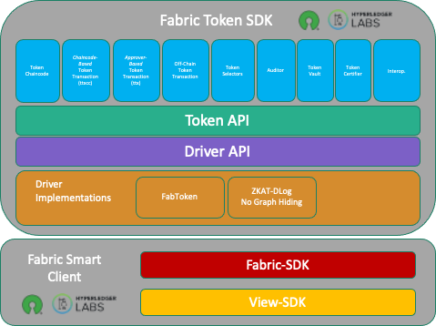

# The Fabric Token SDK

<!-- START doctoc generated TOC please keep comment here to allow auto update -->
<!-- DON'T EDIT THIS SECTION, INSTEAD RE-RUN doctoc TO UPDATE -->
**Table of Contents** 

- [Introduction](#introduction)
- [Consumer Interaction Model](#consumer-interaction-model)
- [Requirements and Use Cases](#requirements-and-use-cases)
- [Prerequisites, Dependencies, Dependents, and Incompatibilities](#prerequisites-dependencies-dependents-and-incompatibilities)
- [Terminology and Glossary](#terminology-and-glossary)
- [Architecture, Interfaces, and Impact](#architecture-interfaces-and-impact)
- [Developer Experience](#developer-experience)
- [Command Line Interface (CLI)](#command-line-interface-cli)
- [Performance, Scalability, and Resource Consumption](#performance-scalability-and-resource-consumption)
- [Serviceability, Logging and Troubleshooting](#serviceability-logging-and-troubleshooting)
- [Monitoring, Metrics and Events](#monitoring-metrics-and-events)
- [High Availability and Disaster Recovery](#high-availability-and-disaster-recovery)
- [Build, Packaging and Deployment](#build-packaging-and-deployment)
- [Platform Support](#platform-support)
- [Testing](#testing)

<!-- END doctoc generated TOC please keep comment here to allow auto update -->

## Introduction

The Fabric Token SDK (FTS) provides a suite of APIs and services designed for the development of token-based decentralized applications on Hyperledger Fabric and other distributed ledger platforms.

Key features include:
*   **UTXO Model**: Utilizes the Unspent Transaction Output model for accurate and secure token tracking.
*   **Wallet Management**: Manages cryptographic material and tracks ownership of unspent outputs.
*   **Privacy Flexibility**: Supports a spectrum of privacy requirements, ranging from full transparency to Zero-Knowledge Proofs (ZKP) for transaction obfuscation.
*   **Extensible Architecture**: Enables the creation of custom services atop the core API to address specific business logic.

The Fabric Token SDK stack comprises the following architectural layers:
*   **Services**: High-level functionalities, such as transaction assembly and token selection.
*   **Token API**: An abstraction layer that facilitates token interaction across diverse backend systems.
*   **Driver API**: An interface that translates generic token operations into backend-specific implementations.
*   **Drivers**: Implementations that define token representations, operations, and validation rules for specific ledgers.

The SDK leverages the **Fabric Smart Client** stack for secure workflow orchestration, storage, and event management.

Developers are empowered with the following capabilities:

* **Tokenization Made Easy:** Create tokens representing any type of asset, be it physical or digital.
* **Privacy by Design:** Select the appropriate privacy level for your specific use case, without modifying your application logic.
* **Peer-to-Peer Transactions:** Orchestrate token transfers directly between users, streamlining the process.
* **Atomic Swaps:** Facilitate secure exchanges of different tokens without relying on intermediaries.
* **Transaction Auditing:** Review transactions before they are finalized, ensuring accuracy and compliance.
* **Interoperability:** Connect with token systems on other blockchain networks, fostering broader ecosystems.
* **Seamless Integration:** Add a token layer to existing applications, regardless of platform, with minimal effort.

## Consumer Interaction Model

The Token SDK APIs are consumed by developers to perform various token-related operations.
Developers must decide how to configure the Token SDK to achieve their intended goals.
Additionally, they are responsible for defining the initial content of the datasource used by the Token SDK.

## Requirements and Use Cases

The SDK is designed for token-based applications that require:
- **Privacy**: Support for varying levels of transaction privacy.
- **Backend Agnosticism**: The ability to operate across different underlying distributed ledger technologies.

## Prerequisites, Dependencies, Dependents, and Incompatibilities

The SDK leverages the following related projects:
- [`Fabric Smart Client (FSC)`](https://github.com/hyperledger-labs/fabric-smart-client): For complex workflow orchestration, secure storage, and event listening.
- [`Idemix`](https://github.com/IBM/idemix): For anonymous credentials.
- [`Mathlib`](https://github.com/IBM/mathlib): For elliptic curve math operations.

A system administrator in charge of a Token-SDK-based application is responsible for preparing:

- **Configuration**: FTS needs to be configured according to the specific use case.
  FTS uses the FSC's config service to access its configuration.
  An example of such a configuration can be found [`here`](./core-token.md).
- **Data storage**: FTS requires an SQL data source to store information relevant to its functioning.
- **HSM**: Required when Hardware Security Modules are used to store secret keys.
- **External Key Store**: Required if using an external key management system.

In some configurations, FTS might run in a stateless container (volume-less).
Other prerequisites are inherited directly from the Fabric Smart Client.

## Terminology and Glossary

- For an introduction to the concepts of Database, Persistence, Driver, and Store, read [this documentation](https://github.com/hyperledger-labs/fabric-smart-client/blob/main/docs/platform/view/db-driver.md).
- **FSC**: Fabric Smart Client.
- **FTS**: Fabric Token SDK.
- **Issuer**: A role authorized to create (issue) new tokens.
- **Auditor**: A role responsible for overseeing token requests and ensuring proper use and compliance.
- **Certifier**: A role that verifies the existence and legitimacy of specific tokens, used in drivers supporting Token Identity Hiding.
- **Owner**: A role that holds tokens and can transfer or redeem them.
- **FabToken**: A simplified driver implementation that stores token transaction details openly on the ledger without privacy.
- **ZKATDLog**: A privacy-focused driver implementation (Zero-Knowledge Authenticated Token DLog) using Zero-Knowledge Proofs.
- **Public Parameters**: Global configuration settings for the token infrastructure, such as driver version, precision, and max token value.
- **Selector**: A service used to select tokens for transactions, aiming to minimize the risk of accidental double-spending.
- **Token Management Service (TMS)**: The central hub of the Token SDK, providing access to services like Identity, Issue, Transfer, and more.
- **Token Request**: A collection of token operations (issue, transfer, redeem) to be executed atomically.
- **Token Transaction**: A transaction that wraps a Token Request for submission to the backend ledger.
- **Validator**: A component that validates token requests against public parameters and limits.
- **Wallet**: A digital vault that stores a long-term identity and derived credentials, used for signing and verifying operations.
- **Key Store (`keystore`)**: Stores cryptographic keys used by the system.

## Architecture, Interfaces, and Impact

The FTS stack is illustrated in the following diagram:

The architecture consists of the following layers:

* [`Token API`](./tokenapi.md): Provides a common abstraction for interacting with tokens across different backends.
* [`Driver API`](./driverapi.md): The underlying API upon which the `Token API` is built. The Driver API is instantiated in a `Driver`.
* [`Drivers`](./driverapi.md): A `Driver` implements the `Driver API` and defines token representation, operations, and validation rules.
* [`Services`](./services.md): Pre-built functionalities, such as assembling transactions and selecting unspent tokens, built on top of `Token API`

## Developer Experience

Developers primarily interact with the Token API and the services to build their token-based applications.
Driver developers, on the other hand, implement the Driver API.

## Command Line Interface (CLI)

FTS comes equipped with `tokengen`, a utility for generating Fabric Token SDK material.
It is provided as a means of preconfiguring public parameters, token chaincode, and other necessary artifacts.

For a complete list of available commands, see the [`tokengen documentation`](./../cmd/tokengen/README.md).

## Performance, Scalability, and Resource Consumption

The Token SDK handles the entire lifecycle of token transactions.
Different parts of the Token SDK run on different network nodes with distinct roles.
Careful orchestration of their interactions guarantees that a token transaction is successfully processed.

## Serviceability, Logging and Troubleshooting

The Token SDK uses the logging infrastructure offered by the Fabric Smart Client. Applications should rely on the standard Fabric Smart Client logging mechanisms for consistency.

## Monitoring, Metrics and Events

The Token SDK adopts the monitoring infrastructure provided by the [`Fabric Smart Client`](https://github.com/hyperledger-labs/fabric-smart-client/blob/main/docs/platform/view/monitoring.md).

We use the following two methods to monitor application performance:
* **Metrics**: Provide an overview of overall system performance using aggregated results (e.g., total requests, requests per second, current state of a variable, average duration, percentile of duration).
* **Traces**: Help analyze single requests by breaking down their lifecycles into smaller components.

## High Availability and Disaster Recovery

The Fabric Token SDK's design allows multiple replica nodes to be attached to the same shared datasource.
If a conflict arises, only one replica will succeed.
Replica nodes can be attached to the shared datasource on-demand.
In this way, the new replica becomes aware of the current status of all transactions and tokens processed so far.

## Build, Packaging and Deployment

The Token SDK is typically embedded as a dependency in a third-party application.

## Platform Support

The Token SDK is written in Go. Therefore, any platform supporting Go can run it.
We require at least **Go 1.24**.

Certain components might require CGO (e.g., HSM support).

## Testing

The Token SDK comes equipped with unit and integration tests.
Similar to the Fabric Smart Client, the Token SDK adopts the philosophy: [`Write tests. Not too many. Mostly integration.`](https://kentcdodds.com/blog/write-tests)