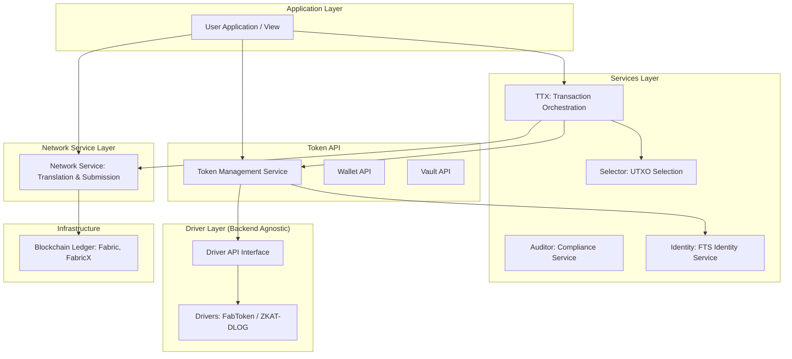
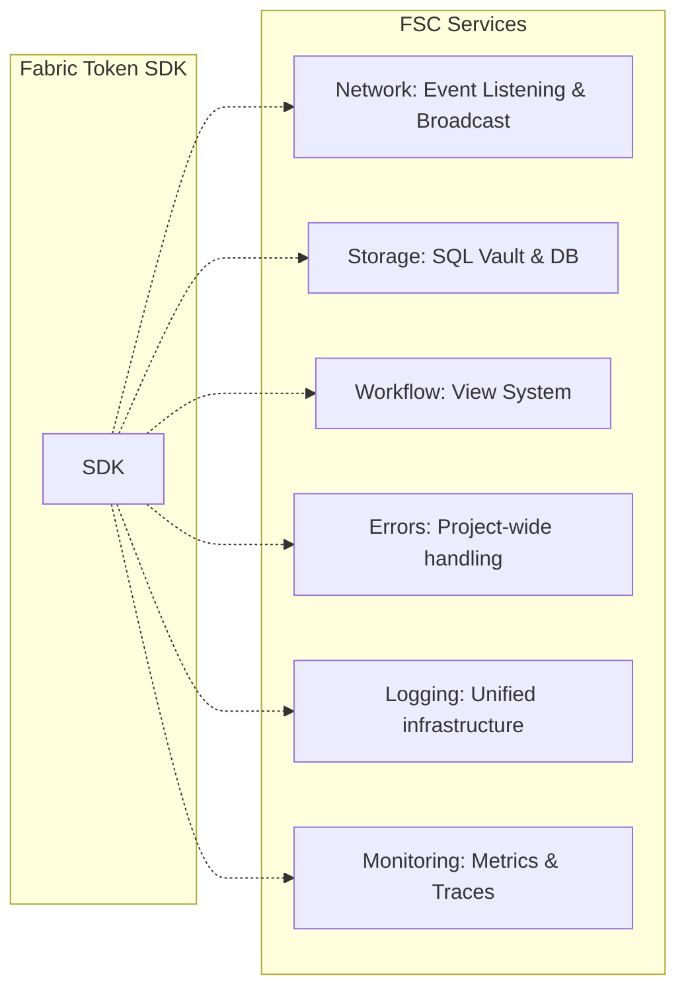
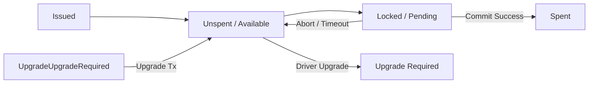

# The Fabric Token SDK

The Fabric Token SDK (FTS) is a comprehensive framework for building token-based decentralized applications. It provides a modular, extensible, and privacy-preserving architecture that abstracts the complexities of the underlying blockchain platform.

---

## Key Concepts & Terminology

- **UTXO (Unspent Transaction Output)**: The fundamental data model where a token is an output of a transaction that has not yet been spent.
- **TMS (Token Management Service)**: The central hub of the Token SDK, providing access to wallets, vault, and selection services for a specific `(Network, Channel, Namespace)`.
- **Token Request**: A collection of token operations (Actions) and signatures bundled into an atomic transaction for the ledger.
- **Action**: An individual operation within a request, such as `Issue` (creating new tokens) or `Transfer` (spending existing tokens).
- **Token Request Metadata**: Private data (e.g., blinding factors, audit information) required by participants and auditors to process privacy-preserving tokens.
- **Anchor**: A unique reference (e.g., Fabric Transaction ID) that binds a Token Request to a specific ledger event.
- **Public Parameters**: The global cryptographic configuration (e.g., curves, generators, authorized issuers) that governs a TMS instance.
- **Vault**: The local node's storage for unspent tokens, transaction history, and associated metadata.
- **Selector**: A service that identifies and locks available UTXOs to prevent double-spending in concurrent local transactions.
- **Wallet**: A digital container for cryptographic identities (X.509 or Idemix) and the tokens they own.
- **Pedersen Commitment**: A cryptographic structure used by privacy drivers to hide token values and types while enabling zero-knowledge proofs of balance.
- **Idemix (Identity Mixer)**: An anonymous credential system used to provide owner anonymity and transaction unlinkability.
- **NOGH (No Graph Hiding)**: A ZKAT-DLOG variant that hides token values and types but reveals the spending graph for optimized performance.
- **TCC (Token Chaincode)**: A Fabric component responsible for validating Token Requests and persisting Public Parameters.
- **In-place Upgrade**: A mechanism allowing newer drivers to spend legacy token formats directly without an explicit migration transaction.
- **Burn and Re-issue**: A protocol for major token migrations that involves consuming old tokens and creating new ones in a single atomic transaction.

---

## Architectural Layers

The Token SDK is organized into a vertical stack of layers, each providing a specific level of abstraction. A key design principle is the isolation of the **Network Service** to handle backend-specific complexities, allowing drivers to remain entirely ledger-agnostic.

```mermaid
graph TD
    subgraph "Application Layer"
        UserApp[User Application / View]
    end

    subgraph "Services Layer"
        TTX[TTX: Transaction Orchestration]
        Selector[Selector: UTXO Selection]
        Auditor[Auditor: Compliance Service]
        Identity[Identity: FTS Identity Service]
    end

    subgraph "Token API"
        TMS[Token Management Service]
        WalletAPI[Wallet API]
        VaultAPI[Vault API]
    end

    subgraph "Driver Layer (Backend Agnostic)"
        DriverAPI[Driver API Interface]
        Drivers[Drivers: FabToken / ZKAT-DLOG]
    end

    subgraph "Network Service Layer"
        NetService[Network Service: Translation & Submission]
    end

    subgraph "Infrastructure"
        DLT[Blockchain Ledger: Fabric, FabricX]
    end

    UserApp --> TTX
    UserApp --> TMS
    UserApp --> NetService
    
    TTX --> Selector
    TTX --> TMS
    TTX --> NetService
    
    TMS --> DriverAPI
    TMS --> Identity
    DriverAPI --> Drivers
    
    NetService --> DLT
```

### Key Components
- **Services Layer**: High-level libraries for common patterns. `TTX` handles multi-party flows. The **Identity Service** is internal to the Token SDK and manages cryptographic materials, signatures, and identity resolution independently of the underlying platform.
- **Token API**: The primary developer entry point. The `ManagementService` (TMS) acts as a gateway to all token functionalities for a specific namespace.
- **Driver Layer**: This layer is **backend-agnostic**. Drivers (like FabToken or ZKAT-DLOG) focus exclusively on token logic, cryptographic proofs, and data structures without any awareness of the underlying network (Fabric, FabricX, etc.).
- **Network Service Layer**: The "bridge" between the SDK and the blockchain. It handles the translation of token requests into the format understood by the specific backend and manages communication (broadcasting, finality listening).

---

## Integration with Fabric Smart Client (FSC)

The Token SDK is built atop the **Fabric Smart Client**, leveraging its foundational platform services for workflow orchestration and infrastructure. Notably, the SDK manages its own identities and does not rely on the FSC identity service. However, the entire SDK consistently uses FSC's cross-cutting facilities for error handling, logging, and system monitoring.

```mermaid
graph LR
    subgraph FTS [Fabric Token SDK]
        FTSCore[SDK]
    end

    subgraph FSC Services
        Network[Network: Event Listening & Broadcast]
        Storage[Storage: SQL Vault & DB]
        Workflow[Workflow: View System]
        Errors[Errors: Project-wide handling]
        Logging[Logging: Unified infrastructure]
        Monitoring[Monitoring: Metrics & Traces]
    end

    FTSCore -.-> Network
    FTSCore -.-> Storage
    FTSCore -.-> Workflow
    FTSCore -.-> Errors
    FTSCore -.-> Logging
    FTSCore -.-> Monitoring
```

- **Workflow**: All token operations are orchestrated within FSC **Views**.
- **Network**: The SDK uses the FSC Network Service to listen for ledger events (e.g., Public Parameter updates or transaction finality).
- **Storage**: Tokens and transaction metadata are stored in the FSC-managed local database.
- **Error Handling**: The SDK utilizes FSC's specialized error packages to provide consistent and descriptive error reporting across all layers.
- **Logging**: The project relies on FSC's logging infrastructure for unified output, level control, and context-aware logs.
- **Monitoring**: Integrated project-wide with FSC's metrics (Prometheus) and tracing (OpenTelemetry) providers.

---

## Token Lifecycle

The lifecycle of a token (UTXO) is governed by state transitions from creation to consumption.

```mermaid
graph LR
    Issued[Issued] --> Unspent[Unspent / Available]
    Unspent --> Locked[Locked / Pending]
    Locked -->|Commit Success| Spent[Spent]
    Locked -->|Abort / Timeout| Unspent
    Unspent -->|Driver Upgrade| UpgradeRequired[Upgrade Required]
    UpgradeUpgradeRequired -->|Upgrade Tx| Unspent
```

1.  **Issuance**: An authorized issuer creates a new token output on the ledger. See [Issuance Details](services/ttx.md#issue-operation).
2.  **Discovery**: The Token SDK registers a listener to the **Network Service** to learn when transactions assembled by the node (and therefore registered in the local Transaction DB) are confirmed or rejected on the ledger. Upon notification, the SDK updates the local [Token Store](services/storage.md#token-store-tokendb) to make the tokens available in the [Vault](tokenapi.md#token-vault).
3.  **Selection & Locking**: When an owner wants to spend tokens, the [Selector](tokenapi.md#token-selector-manager) picks available UTXOs and **locks** them locally to prevent double-spending. See [Transfer Operation](services/ttx.md#transfer-operation).
4.  **Spending (Assembly & Signing)**: The initiator assembles a [Token Request](tokenapi.md#building-a-token-transaction) and collects the necessary signatures. See [Collecting Endorsements](services/ttx.md#collect-endorsements).
5.  **Commitment & Finality**: The transaction is submitted to the [Ordering Service](services/ttx.md#ordering-a-transaction). The [Network Service](services/network.md#finality-management) monitors its status until it reaches [Finality](services/ttx.md#finality-of-a-transaction).
6.  **Upgradability**: If the network transitions to a new driver version, existing tokens may be marked as "Upgrade Required" until a migration transaction is performed. See [Upgradability Guide](upgradability.md).

---

## Developer Experience

- **High-Level API**: Developers typically use the `ManagementService` and `TTX` views to build applications.
- **Testing**: The SDK includes the **Network Orchestrator (NWO)** for spinning up full Fabric networks in integration tests.
- **CLI**: The `tokengen` tool is used to generate cryptographic material, chaincode packages, and public parameters. See [tokengen documentation](../cmd/tokengen/README.md).

---

## Operation & Maintenance

- **High Availability**: Multiple FSC nodes can share the same SQL backend. The SDK's locking mechanism and state synchronization ensure consistency across replicas.
- **Monitoring**: Integrated with FSC's metrics (Prometheus) and tracing (OpenTelemetry) for performance analysis.
- **Upgradability**: Supports atomic "Burn and Re-issue" and in-place upgrades for protocol evolution. See [Upgradability Guide](./upgradability.md).

---

## Platform Support

- **Language**: Go 1.24+
- **Backends**: Hyperledger Fabric, FabricX.
- **Cryptography**: Supports standard ECDSA and privacy-preserving Idemix/BBS+ curves.
