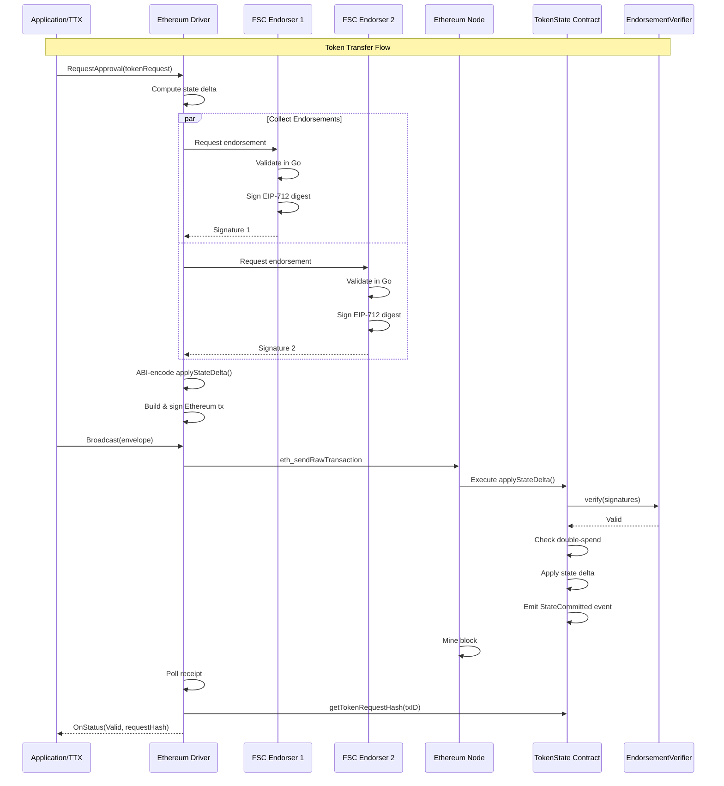
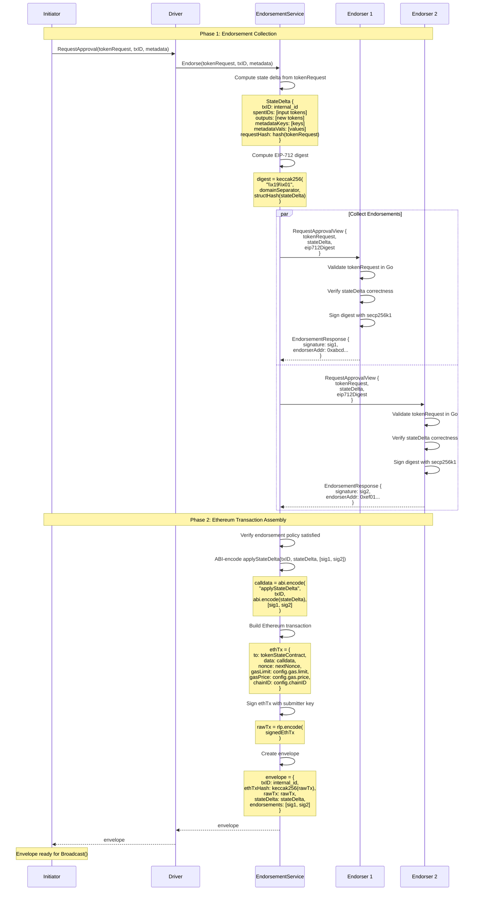

# Ethereum Network Driver Design Document

## 1. Executive Summary

This document specifies the design and implementation of an Ethereum/EVM network driver for the Hyperledger Fabric Token SDK. The driver implements **Approach 2** (Pre-Order Execution with FSC Endorsers) from the existing network-ethereum.md documentation, enabling token operations on Ethereum networks while preserving the SDK's off-chain validation model.

### Key Design Decisions

- **Validation Model**: Off-chain validation in Go within FSC nodes, on-chain signature verification and state application
- **Token Support**: Both fabtoken and zkatdlog drivers supported from v1
- **Identity**: secp256k1 keys for EIP-712 endorsement signatures, configured under TMS network services path
- **Signature Envelope**: EIP-712 for endorser signatures with domain separation by chainID and contract address
- **Contract Architecture**: Two-contract split (EndorsementVerifier + TokenState) for separation of concerns
- **Backend**: EVMClient interface abstraction (fabric-x-evm used for NWO test network bootstrapping)
- **Token Storage**: Each TMS uses a single TokenState contract; all tokens (fabtoken and zkatdlog) stored in one contract
- **Transaction ID**: Deterministic internal ID using `keccak256(nonce || creator || chainID || contractAddr)`
- **Contract Deployment**: Contracts deployed externally via deployment tools; driver reads addresses from configuration
- **StateDelta Translator**: Dedicated translator component analogous to RWSet translator, consuming validated token actions to produce deterministic state transitions
- **Spent ID Encoding**: Unified spent tracking using `keccak256` with domain separators (`SERIAL_NUMBER` prefix) to prevent collisions between token IDs and serial numbers
- **Metadata Keys**: Deterministic hashing using `keccak256(namespace || key)` to prevent cross-TMS collisions
- **Public Parameters**: StateDelta includes `publicParamsHash` for endorser verification of parameter consistency
- **Finality Tracking**: Hybrid architecture combining receipt polling, indexed log queries, reorg detection, and status caching for efficiency
- **Error Handling**: Typed errors with consistent wrapping patterns, recovery strategies, and retry logic for transient failures
- **Endorser Discovery**: Dynamic endorser registry via contract queries for runtime flexibility
- **Configuration Validation**: Comprehensive validation with sensible defaults for production readiness

### Out of Scope for v1

- Cross-chain interoperability
- Contract upgradeability
- Advanced gas estimation (basic heuristic provided)
- Full recovery mechanisms (basic recovery included, advanced features deferred to v2)
- Batch operations (single transaction per state delta in v1)
- State delta compression

### Design Review Status

**Last Review**: 2026-05-13  
**Status**: Comprehensive gap analysis completed with critical enhancements integrated  
**Review Document**: See `eth_network_driver_design_review.md` for detailed gap analysis and recommendations  
**Critical Updates**: StateDelta translator interface, finality architecture clarification, error taxonomy, security considerations

---

## 2. Architecture Overview

### 2.0 Token Driver Support

The Ethereum network driver supports both token driver types from v1:

**fabtoken (Cleartext Tokens)**:
- Token amounts and types are visible on-chain
- Simpler validation logic
- Lower computational overhead
- Suitable for use cases where privacy is not required

**zkatdlog (Privacy-Preserving Tokens)**:
- Token amounts hidden using zero-knowledge proofs
- Requires cryptographic validation of ZK proofs
- Higher computational overhead
- Suitable for privacy-sensitive applications

The driver abstracts the token-specific logic through the existing driver interface. Token validation remains off-chain in Go (within FSC/TTX flows), while the on-chain contracts handle signature verification and state application regardless of token type.

### 2.1 High-Level Flow



### 2.2 Component Architecture

```
token/services/network/ethereum/
├── driver.go              # Driver registration
├── network.go             # Network interface implementation
├── ledger.go              # Ledger interface implementation
├── envelope.go            # Ethereum transaction envelope
├── client.go              # JSON-RPC client abstraction
├── eip712.go              # EIP-712 signing utilities
├── config.go              # Configuration structures
├── endorsement/
│   └── esp.go             # Endorsement service provider
├── finality/
│   └── poller.go          # Receipt polling for finality
└── contract/
    └── abi.go             # Contract ABI encoding/decoding
```

---

## 3. Smart Contracts

### 3.1 Contract Architecture

Two separate contracts provide separation of concerns and enable endorser policy updates without redeploying token state:

1. **EndorsementVerifier**: Manages authorized endorsers and verifies signatures
2. **TokenState**: Stores token data and delegates signature verification

**Deployment Model**: Contracts are deployed externally using deployment tools (e.g., Foundry, Hardhat) before the driver starts. The driver reads contract addresses from configuration under `token.tms.<tms-id>.services.network.ethereum.*`.

**Token Storage Model**: Each TMS refers to a single TokenState contract. All tokens managed by that TMS are stored in this one contract, regardless of token type (fabtoken or zkatdlog). The contract address is specified in the configuration:

```yaml
token:
  tms:
    mytms:
      namespace: token
      services:
        network:
          ethereum:
            contracts:
              tokenState: 0x1234...           # Single TokenState for this TMS
              endorsementVerifier: 0x5678...  # EndorsementVerifier contract
```

Multiple TMS instances can be configured, each with its own TokenState contract if needed for organizational separation.

### 3.2 EndorsementVerifier Contract

**Purpose**: Centralized signature verification and endorser management.

**Interface**:
```solidity
interface IEndorsementVerifier {
    // Verify endorser signatures on a state delta
    function verify(
        bytes32 domainSeparator,
        bytes32 structHash,
        bytes[] calldata signatures
    ) external view returns (bool);
    
    // Endorser management (admin only)
    function addEndorser(address endorser) external;
    function removeEndorser(address endorser) external;
    function setThreshold(uint256 threshold) external;
    
    // Query functions
    function isEndorser(address addr) external view returns (bool);
    function getEndorsers() external view returns (address[] memory);
    function getThreshold() external view returns (uint256);
    
    // Events
    event EndorserAdded(address indexed endorser);
    event EndorserRemoved(address indexed endorser);
    event ThresholdChanged(uint256 oldThreshold, uint256 newThreshold);
}
```

**Storage**:
```solidity
mapping(address => bool) endorsers;
address[] endorserList;
uint256 threshold;
address admin;
```

**Signature Verification Logic**:
1. Recover signer address from each signature using `ecrecover`
2. Verify each recovered address is in the endorser set
3. Check that number of valid signatures meets threshold
4. Return true if all checks pass

### 3.3 TokenState Contract

**Purpose**: Store token state and apply endorsed state updates.

**Interface**:
```solidity
interface ITokenState {
    // Apply an endorsed state delta
    function applyStateDelta(
        bytes32 txID,
        bytes calldata stateDelta,
        bytes[] calldata signatures
    ) external returns (bool);
    
    // Query functions
    function getToken(bytes32 tokenID) external view returns (bytes memory);
    function isSpent(bytes32 tokenID) external view returns (bool);
    function areTokensSpent(bytes32[] calldata tokenIDs) external view returns (bool[] memory);
    function getPublicParameters() external view returns (bytes memory);
    function getTransferMetadata(bytes32 metadataKey) external view returns (bytes memory);
    function getTokenRequestHash(bytes32 txID) external view returns (bytes32);
    
    // Admin functions
    function setPublicParameters(bytes calldata params) external;
    function setEndorsementVerifier(address verifier) external;
    
    // Events
    event StateCommitted(bytes32 indexed txID, bool success, string message);
    event PublicParametersUpdated(bytes32 indexed paramsHash);
}
```

**Storage**:
```solidity
// Token state
mapping(bytes32 => bytes) tokens;           // tokenID => serialized token
mapping(bytes32 => bool) spent;             // tokenID => spent flag
mapping(bytes32 => bytes32) tokenRequestHash; // txID => request hash

// Metadata
mapping(bytes32 => bytes) transferMetadata; // metadataKey => value

// Configuration
bytes publicParameters;
address endorsementVerifier;
address admin;
```

**State Delta Structure**:
```solidity
struct StateDelta {
    bytes32 txID;              // Transaction ID
    bytes32[] spentIDs;        // Token IDs to mark as spent
    OutputToken[] outputs;     // New tokens to create
    bytes32[] metadataKeys;    // Metadata keys to store
    bytes[] metadataVals;      // Metadata values
    bytes32 requestHash;       // Hash of original token request
}

struct OutputToken {
    bytes32 tokenID;           // Computed token ID
    bytes tokenData;           // Serialized token
}
```

**applyStateDelta Logic**:
1. Verify transaction ID is unique (not already processed)
2. Compute EIP-712 digest of state delta
3. Call EndorsementVerifier.verify() with digest and signatures
4. If verification fails, revert with "Invalid signatures"
5. Check all spentIDs are not already spent (double-spend check)
6. If double-spend detected, revert with "Double spend detected"
7. Mark all spentIDs as spent
8. Store all output tokens
9. Store all metadata key-value pairs
10. Store token request hash
11. Emit StateCommitted event with success=true

### 3.4 Token ID Mapping

The SDK uses composite string keys internally: `\x00token\x00<txID>\x00<index>`

**Ethereum Mapping**:
```solidity
function computeTokenID(bytes32 txID, uint256 index) internal pure returns (bytes32) {
    return keccak256(abi.encode(txID, index));
}
```

This provides:
- Deterministic mapping from SDK token IDs to Ethereum bytes32
- Cheap computation (single keccak256)
- Collision resistance
- No storage overhead

---

## 4. EIP-712 Signature Envelope

### 4.1 Domain Separator

```solidity
EIP712Domain {
    name: "FabricTokenSDK",
    version: "1",
    chainId: <chain ID>,
    verifyingContract: <TokenState contract address>
}
```

**Properties**:
- Binds signatures to specific chain (prevents replay across chains)
- Binds signatures to specific contract (prevents replay across contracts)
- Standard EIP-712 format (wallet compatibility)

### 4.2 StateDelta Type Hash

```solidity
StateDelta(
    bytes32 txID,
    bytes32[] spentIDs,
    OutputToken[] outputs,
    bytes32[] metadataKeys,
    bytes[] metadataVals,
    bytes32 requestHash
)

OutputToken(
    bytes32 tokenID,
    bytes tokenData
)
```

### 4.3 Signature Generation (Endorser Side)

```go
func (e *Endorser) SignStateDelta(delta *StateDelta) ([]byte, error) {
    // 1. Compute domain separator
    domainSeparator := computeDomainSeparator(
        "FabricTokenSDK",
        "1",
        e.chainID,
        e.contractAddress,
    )
    
    // 2. Compute struct hash
    structHash := computeStateDeltaHash(delta)
    
    // 3. Compute EIP-712 digest
    digest := keccak256(
        "\x19\x01",
        domainSeparator,
        structHash,
    )
    
    // 4. Sign with secp256k1
    signature, err := e.signer.Sign(digest)
    if err != nil {
        return nil, err
    }
    
    return signature, nil
}
```

### 4.4 Signature Verification (Contract Side)

```solidity
function verifySignature(
    bytes32 domainSeparator,
    bytes32 structHash,
    bytes memory signature
) internal pure returns (address) {
    bytes32 digest = keccak256(
        abi.encodePacked(
            "\x19\x01",
            domainSeparator,
            structHash
        )
    );
    
    return ecrecover(digest, v, r, s);
}
```

---

## 5. Driver Interface Implementation

### 5.1 Token Request to StateDelta Translation

For Ethereum, the translation step must follow the same architectural role that `RequestApprovalResponderView` plays for Fabric endorsement. In Fabric, the responder validates the token request, unmarshals it into token actions, and invokes the translator in `token/services/network/common/rws/translator` to materialize an RWSet. For Ethereum, we need the same pattern, but the backend artifact is a `StateDelta` instead of a Fabric RWSet.

The important design point is: **the Ethereum path must not invent an ad-hoc token-request mapper**. It should reuse the validated token actions returned by the validator and pass them through a dedicated translator component, analogous to the current RWSet translator.

#### StateDelta Translator Interface

The translator must implement the following interface to ensure consistency with the RWSet translator pattern:

```go
// Translator translates validated token actions into Ethereum state deltas
// This interface matches the pattern used in Fabric's RequestApprovalResponderView
type Translator interface {
    // Write processes a token action and accumulates state changes
    Write(ctx context.Context, action any) error
    
    // AddPublicParamsDependency records dependency on public parameters
    AddPublicParamsDependency() error
    
    // CommitTokenRequest stores the token request hash
    CommitTokenRequest(raw []byte, storeHash bool) ([]byte, error)
}
```

**Note**: The translator interface is intentionally minimal, matching the Fabric pattern used in `RequestApprovalResponderView`. The StateDelta is extracted through the concrete implementation (e.g., a `StateDelta()` method on the struct), not through the interface. Additional methods like `QueryTokens`, `AreTokensSpent`, etc. are internal implementation details.

#### Translator Implementation Structure

```go
type Translator struct {
    // Transaction context
    TxID          string
    Namespace     string
    ChainID       *big.Int
    ContractAddr  common.Address
    
    // State accumulation
    SpentIDs      [][32]byte
    Outputs       []OutputToken
    MetadataKeys  [][32]byte
    MetadataVals  [][]byte
    
    // Counters and hashes
    counter           uint64
    publicParamsHash  [32]byte
    tokenRequestHash  [32]byte
    
    // Dependencies
    ledger       Ledger
    client       EVMClient
}
```

#### Translation Flow Aligned with `RequestApprovalResponderView`

The flow should be:

1. Receive the token request and TMS context
2. Validate the proposal/request
3. Invoke `Validator().UnmarshallAndVerifyWithMetadata(...)`
4. Obtain:
   - `actions []any`
   - `meta map[string][]byte`
5. Feed the resulting actions to a new **StateDelta translator**
6. Produce a deterministic `StateDelta`
7. Hash/sign that `StateDelta` using EIP-712

**Critical Design Requirement**: The StateDelta translator MUST be a separate, well-defined component that mirrors the RWSet translator's role but targets EVM state transitions instead of Fabric RWSets. This ensures:
- Consistent validation semantics across backends
- Reuse of existing token action interfaces
- Clear separation between token logic and backend serialization

This mirrors the current Fabric responder flow:

```go
actions, meta, err := validator.UnmarshallAndVerifyWithMetadata(
    ctx,
    ledger,
    token.RequestAnchor(anchor),
    requestRaw,
)
```

followed by:

```go
for _, action := range actions {
    if err := w.Write(ctx, action); err != nil {
        return err
    }
}
```

In Ethereum, `w` is not an RWSet writer. It is a `StateDelta` writer/translator.

#### New Translator Abstraction

The current translator package is RWSet-oriented because it emits Fabric reads/writes and read-dependencies. For Ethereum we need a sibling abstraction that follows the same minimal interface pattern used in Fabric's `RequestApprovalResponderView`:

```go
// Translator translates validated token actions into Ethereum state deltas
type Translator interface {
    // Write processes a token action and accumulates state changes
    Write(ctx context.Context, action any) error
    
    // AddPublicParamsDependency records dependency on public parameters
    AddPublicParamsDependency() error
    
    // CommitTokenRequest stores the token request hash
    CommitTokenRequest(raw []byte, storeHash bool) ([]byte, error)
}
```

**Key Responsibilities**:
- Consume validated token actions (IssueAction, TransferAction, SetupAction)
- Build deterministic StateDelta structures internally
- Maintain transaction-scoped state (output counter, spent IDs)
- Handle both graph-revealing and graph-hiding flows
- Ensure metadata keys are deterministically hashed
- Track public parameters dependencies

**Implementation Note**: The translator will need an additional method to extract the final StateDelta, but this is an implementation detail, not part of the core interface. The pattern matches Fabric's RWSet translator where the RWSet is extracted separately.

A possible package layout is:

```text
token/services/network/ethereum/statedelta/
```

The key requirement is that this translator is **action-driven**, not RWSet-driven, and follows the same minimal interface pattern as the Fabric translator.

#### StateDelta Translator Responsibilities

Like the RWSet translator, the StateDelta translator must process three action categories:

- `SetupAction`
- `IssueAction`
- `TransferAction`

and translate them into a `StateDelta` with fields such as:

```solidity
struct StateDelta {
    bytes32 txID;
    bytes32[] spentIDs;
    OutputToken[] outputs;
    bytes32[] metadataKeys;
    bytes[] metadataVals;
    bytes32 requestHash;
    bytes publicParamsHash;
}
```

The translator should maintain internal state similarly to the RWSet translator:

- transaction identifier
- output counter
- spent identifiers accumulated so far
- output entries accumulated so far
- metadata entries accumulated so far
- public-parameter dependency/hash
- token request hash

Conceptually:

```go
type Translator struct {
    TxID            string
    SpentIDs        []string
    Outputs         []OutputToken
    MetadataKeys    [][]byte
    MetadataVals    [][]byte
    counter         uint64
    publicParamsHash []byte
    tokenRequestHash []byte
}
```

#### Action-to-StateDelta Mapping

**SetupAction**
- does not create spent IDs or outputs
- records the public parameters payload/hash that the transaction depends on
- if setup is represented on-chain, it becomes a dedicated setup/update call or a `StateDelta` carrying only public-parameter updates

**IssueAction**
- adds newly created outputs to `StateDelta.outputs`
- records issue metadata into `metadataKeys` / `metadataVals`
- if the token action is graph-hiding, preserves the serialized output as opaque bytes
- does not mark existing tokens as spent unless the issue action explicitly consumes inputs

**TransferAction**
- adds all consumed inputs to `StateDelta.spentIDs`
- adds all non-redeem outputs to `StateDelta.outputs`
- records transfer metadata into `metadataKeys` / `metadataVals`
- for graph-hiding actions, serial numbers are not RWSet keys anymore; instead, they must be represented as entries in `spentIDs` or in a dedicated serial-number section of the delta, depending on the contract model

#### Graph-Revealing vs Graph-Hiding

This is where the Ethereum translator differs most from the RWSet translator.

In the current RWSet translator:

- graph-revealing flows delete output keys and serial-number keys
- graph-hiding flows add input serial-number keys and check their non-existence

For Ethereum, there is no RWSet. Therefore:

- **graph-revealing** actions translate spent inputs into deterministic spent token identifiers in `spentIDs`
- **graph-hiding** actions translate consumed serial numbers into the `spentIDs` domain as first-class spent markers

In other words, `StateDelta.spentIDs` must be the canonical on-chain representation of “already consumed” objects, whether they correspond to:
- visible token output IDs, or
- graph-hiding serial numbers

The contract then enforces uniqueness/non-reuse by checking that each `spentID` has not been recorded before.


**Spent ID Encoding Specification**:

To prevent collisions between token IDs and serial numbers, use domain-separated hashing:

```go
// For graph-revealing flows: token IDs become spent markers
func ComputeTokenSpentID(txID string, index uint64) [32]byte {
    // Direct encoding without domain separator since txID is already unique
    return keccak256(abi.encode(txID, index))
}

// For graph-hiding flows: serial numbers become spent markers
func ComputeSerialNumberSpentID(serialNumber string) [32]byte {
    // Use domain separator to prevent collisions with token IDs
    return keccak256([]byte("SERIAL_NUMBER"), []byte(serialNumber))
}
```

**Critical Design Point**: The domain separator `"SERIAL_NUMBER"` ensures that even if a serial number value happens to match a token ID encoding, they will produce different spent IDs. This prevents any possibility of collision between the two spent tracking mechanisms.


#### Token Identifiers and Output Creation

The translator must preserve the same deterministic output allocation logic used today by the RWSet translator:

- outputs are assigned in transaction order
- output index is derived from the translator-local counter
- token identifiers are deterministically derived from `(txID, outputIndex)`

For Ethereum, these identifiers are then encoded into the contract-native format, for example:

```go
func ComputeOutputID(txID string, index uint64) []byte {
    return keccak256(abi.encode(txID, index))
}
```

The serialized output bytes should come directly from the token action methods already used by the RWSet translator:

- `IssueAction.GetSerializedOutputs()`
- `TransferAction.SerializeOutputAt(i)`

This is important because it keeps the backend-specific translator independent from token-driver-specific serialization details.


**Metadata Key Hashing Specification**:

To ensure deterministic and collision-free metadata storage, use namespace-scoped hashing:

```go
// HashMetadataKey creates a deterministic hash for metadata keys
// Includes namespace to prevent cross-TMS collisions
func HashMetadataKey(namespace string, key string) [32]byte {
    return keccak256([]byte(namespace), []byte(key))
}
```

**Rationale**: Including the namespace in the hash prevents metadata key collisions between different TMS instances that might use the same metadata key names. This is critical when multiple TMS instances share infrastructure or when metadata keys are generic (e.g., "recipient", "amount").


**Public Parameters Dependency Specification**:

The StateDelta must include a public parameters hash to ensure all endorsers validate against the same cryptographic parameters:

```go
// In StateDelta structure
type StateDelta struct {
    bytes32 txID;
    bytes32[] spentIDs;
    OutputToken[] outputs;
    bytes32[] metadataKeys;
    bytes[] metadataVals;
    bytes32 requestHash;
    bytes32 publicParamsHash;  // Hash of public parameters used for validation
}

// Computing the hash
func ComputePublicParamsHash(publicParams []byte) [32]byte {
    return keccak256(publicParams)
}

// Endorser verification
func (e *Endorser) VerifyPublicParams(stateDelta *StateDelta) error {
    localHash := ComputePublicParamsHash(e.publicParams)
    if localHash != stateDelta.publicParamsHash {
        return errors.New("Public parameters mismatch: endorser has different parameters")
    }
    return nil
}
```

**Critical Requirement**: All endorsers MUST verify that their local public parameters hash matches the `publicParamsHash` in the StateDelta before signing. This prevents endorsement of transactions validated against outdated or incorrect parameters.


#### Metadata Translation

The translator must also reuse the action metadata already exposed by the validated actions:

- `IssueAction.GetMetadata()`
- `TransferAction.GetMetadata()`

Unlike Fabric RWSet translation, where metadata is written under derived keys, Ethereum translation should turn each metadata entry into a deterministic `(key, value)` pair in the `StateDelta`.

Conceptually:

```go
for key, value := range action.GetMetadata() {
    delta.MetadataKeys = append(delta.MetadataKeys, HashMetadataKey(key))
    delta.MetadataVals = append(delta.MetadataVals, value)
}
```

The hashing/encoding rule must be deterministic and shared by:
- initiator
- endorsers
- contract ABI encoder / decoder

#### Request Hash and Public Parameter Dependency

The Fabric responder currently commits the token request hash and adds a dependency on public parameters through the RWSet translator. The Ethereum translator must preserve both semantics:

- `CommitTokenRequest(...)` becomes computation/storage of the token request hash into the `StateDelta`
- `AddPublicParamsDependency()` becomes embedding the public parameter hash/version into the delta or envelope so endorsers sign against the exact public parameters used during validation

Therefore the translator should expose logic equivalent to:

```go
func (t *Translator) CommitTokenRequest(raw []byte, storeHash bool) ([]byte, error)
func (t *Translator) AddPublicParamsDependency() error
```

but instead of generating RWSet reads/writes, it updates the in-memory `StateDelta` to carry:
- `requestHash`
- `publicParamsHash` (or equivalent dependency field)

#### Integration in the Ethereum Request Approval Responder

The Ethereum responder should conceptually mirror Fabric's `translate(...)` method:

```go
func (r *RequestApprovalResponderView) translate(ctx context.Context, request *Request) error {
    w, err := r.getTranslator(request.Anchor, request.TMSID.Namespace)
    if err != nil {
        return err
    }

    for _, action := range request.Actions {
        if err := w.Write(ctx, action); err != nil {
            return err
        }
    }

    if err := w.AddPublicParamsDependency(); err != nil {
        return err
    }

    _, err = w.CommitTokenRequest(request.Meta[common.TokenRequestToSign], true)
    if err != nil {
        return err
    }

    request.StateDelta, err = w.StateDelta()
    return err
}
```

This is the correct design anchor for Ethereum: same responder pattern, same validator output, different translator target.

#### Why a Dedicated StateDelta Translator is Required

The current `token/services/network/common/rws/translator` is tightly coupled to Fabric concepts:

- `RWSet`
- `SetState`
- `GetState`
- `DeleteState`
- existence/version dependencies over keys

Those abstractions do not match EVM execution. Reusing that package directly would leak Fabric semantics into the Ethereum driver.

Instead, the Ethereum design should introduce a dedicated translator that:

- consumes the same validated token actions
- preserves the same transaction semantics
- emits a backend-neutral or EVM-ready `StateDelta`
- avoids any dependency on Fabric RWSet structures

This keeps the architecture aligned across drivers while respecting backend differences.

### 5.2 Network Interface Methods

The driver implements all methods from `token/services/network/driver/network.go`. Key implementations are detailed below.

#### Name() and Channel()
```go
func (n *Network) Name() string {
    return n.config.NetworkName
}

func (n *Network) Channel() string {
    return "" // Ethereum has no channel concept
}
```

#### ComputeTxID()
```go
func (n *Network) ComputeTxID(id *driver.TxID) string {
    // Compute deterministic internal ID
    data := append(id.Nonce, id.Creator...)
    data = append(data, n.chainID.Bytes()...)
    data = append(data, n.config.GetDefaultContractAddress().Bytes()...)
    
    hash := keccak256(data)
    return hex.EncodeToString(hash)
}
```

**Rationale**: The Ethereum tx hash only exists after signing. We need a deterministic ID before signing for the SDK's transaction lifecycle. The contract stores this internal ID and rejects duplicates.

#### RequestApproval()

The endorsement flow follows the FabricX pattern, collecting EIP-712 signatures from endorsers before assembling the final Ethereum transaction.

**Flow Diagram**:



**Message Structures**:

**1. RequestApprovalView (Initiator → Endorsers)**:
```go
type RequestApprovalView struct {
    TokenRequest []byte      // Serialized token request
    StateDelta   StateDelta  // Computed state delta
    EIP712Digest [32]byte    // EIP-712 digest to sign
    TxID         string      // Internal transaction ID
}
```

**2. EndorsementResponse (Endorsers → Initiator)**:
```go
type EndorsementResponse struct {
    Signature     []byte          // secp256k1 signature (65 bytes: r, s, v)
    EndorserAddr  common.Address  // Ethereum address of endorser
    Error         error           // Error if endorsement failed
}
```

**3. Envelope (Returned to Application)**:
```go
type Envelope struct {
    TxID          string          // Internal transaction ID
    EthTxHash     common.Hash     // Ethereum transaction hash
    RawTx         []byte          // RLP-encoded signed Ethereum transaction
    StateDelta    StateDelta      // State delta for reference
    Endorsements  [][]byte        // Collected endorser signatures
}
```

**Implementation**:

```go
func (n *Network) RequestApproval(
    context view.Context,
    tms *token.ManagementService,
    requestRaw []byte,
    signer view.Identity,
    txID driver.TxID,
    metadata driver.TransientMap,
) (driver.Envelope, error) {
    endorsementService, err := n.endorsementServiceProvider.Get(tms.ID())
    if err != nil {
        return nil, errors.Wrapf(err, "failed to get endorsement service")
    }
    
    return endorsementService.Endorse(context, requestRaw, signer, txID, metadata)
}
```

**Key Points**:

1. **State Delta Computation**: Done once by initiator, shared with all endorsers for consistency
2. **EIP-712 Digest**: Pre-computed and sent to endorsers to ensure all sign the same digest
3. **Endorser Validation**: Each endorser independently validates the token request in Go before signing
4. **Signature Collection**: Initiator collects signatures in parallel from all endorsers
5. **Policy Verification**: Initiator verifies endorsement policy is satisfied before proceeding
6. **Ethereum Transaction**: Built after endorsements collected, includes all signatures in calldata
7. **Envelope**: Contains both the raw Ethereum transaction and metadata for tracking

#### Remaining `Network` Interface Methods

To fully cover `token/services/network/driver/network.go`, the Ethereum driver must also specify the following methods.

#### Normalize()
`Normalize()` fills missing `token.ServiceOptions` values using the TMS-scoped Ethereum configuration. In particular it:
- sets the network to `ethereum` if omitted
- forces `channel` to the empty string
- resolves the namespace/TMS-scoped contract configuration
- injects defaults for finality and gas settings when not explicitly provided

```go
func (n *Network) Normalize(opt *token.ServiceOptions) (*token.ServiceOptions, error) {
    if opt == nil {
        opt = &token.ServiceOptions{}
    }
    if len(opt.Network) == 0 {
        opt.Network = n.Name()
    }
    opt.Channel = ""
    return opt, nil
}
```

#### Connect()
`Connect(ns string)` initializes namespace-specific services for the current TMS. For Ethereum this does not open a Fabric-style channel connection; instead it validates that:
- the configured `tokenState` contract is present for the TMS
- the JSON-RPC client is reachable
- the chain ID matches configuration
- namespace-scoped helper services (ledger accessor, finality tracker, metadata lookup) are ready

It returns service options needed by upper layers, similarly to other drivers.

```go
func (n *Network) Connect(ns string) ([]token.ServiceOption, error) {
    if err := n.checkNamespace(ns); err != nil {
        return nil, err
    }
    if err := n.client.Ping(n.ctx); err != nil {
        return nil, err
    }
    return []token.ServiceOption{
        token.WithNetwork(n.Name()),
        token.WithChannel(""),
        token.WithNamespace(ns),
    }, nil
}
```

#### Broadcast()
`Broadcast()` submits the envelope produced by `RequestApproval()` to Ethereum. The expected blob is the Ethereum envelope carrying the raw signed transaction. The method:
- validates the blob type
- extracts the raw transaction bytes
- invokes `eth_sendRawTransaction`
- stores the returned Ethereum transaction hash in the envelope/finality tracker
- starts or registers finality tracking for the internal txID

```go
func (n *Network) Broadcast(ctx context.Context, blob interface{}) error {
    env, ok := blob.(*Envelope)
    if !ok {
        return errors.Errorf("invalid blob type [%T]", blob)
    }

    txHash, err := n.client.SendRawTransaction(ctx, env.RawTx)
    if err != nil {
        return err
    }
    env.EthTxHash = txHash
    return n.finalityTracker.Track(env.TxID, txHash)
}
```

#### NewEnvelope()
`NewEnvelope()` returns an empty Ethereum-specific envelope instance. This allows generic SDK code to allocate a backend envelope before unmarshalling or population.

```go
func (n *Network) NewEnvelope() driver.Envelope {
    return &Envelope{}
}
```

The Ethereum envelope must at least carry:
- internal txID
- Ethereum tx hash
- raw signed transaction bytes
- serialized StateDelta or equivalent payload reference
- collected endorsements/signatures

#### FetchPublicParameters()
`FetchPublicParameters(namespace string)` retrieves the latest public parameters from the TMS TokenState contract using `eth_call` and contract ABI decoding.

```go
func (n *Network) FetchPublicParameters(namespace string) ([]byte, error) {
    contractAddr, err := n.contractAddress(namespace)
    if err != nil {
        return nil, err
    }
    callData := abiEncode("getPublicParameters")
    return n.client.Call(context.Background(), contractAddr, callData)
}
```

For v1, this must work for both fabtoken and zkatdlog public parameters, treated as opaque bytes by the network layer.

#### QueryTokens()
`QueryTokens()` reads token bytes from the TokenState contract for the given token IDs. The driver converts SDK token identifiers into the on-chain identifier format and queries the contract using read-only calls.

```go
func (n *Network) QueryTokens(ctx context.Context, namespace string, IDs []*token.ID) ([][]byte, error) {
    contractAddr, err := n.contractAddress(namespace)
    if err != nil {
        return nil, err
    }

    res := make([][]byte, 0, len(IDs))
    for _, id := range IDs {
        tokenID := ComputeOutputID(id.TxId, id.Index)
        raw, err := n.client.Call(ctx, contractAddr, abiEncode("getToken", tokenID))
        if err != nil {
            return nil, err
        }
        res = append(res, abiDecodeBytes(raw))
    }
    return res, nil
}
```

#### AreTokensSpent()
`AreTokensSpent()` checks whether the passed tokens have already been consumed. For graph-revealing flows it checks token IDs; for graph-hiding flows it checks the corresponding serial numbers or spent markers passed in `meta`.

```go
func (n *Network) AreTokensSpent(ctx context.Context, namespace string, tokenIDs []*token.ID, meta []string) ([]bool, error) {
    contractAddr, err := n.contractAddress(namespace)
    if err != nil {
        return nil, err
    }

    spentIDs := make([][32]byte, 0, len(tokenIDs))
    if len(meta) != 0 {
        for _, id := range meta {
            spentIDs = append(spentIDs, HashSpentMarker(id))
        }
    } else {
        for _, id := range tokenIDs {
            spentIDs = append(spentIDs, ComputeOutputID(id.TxId, id.Index))
        }
    }

    raw, err := n.client.Call(ctx, contractAddr, abiEncode("areTokensSpent", spentIDs))
    if err != nil {
        return nil, err
    }
    return abiDecodeBoolArray(raw), nil
}
```

This aligns the Network interface with the StateDelta translator design: spent checks are performed against the same canonical spent identifiers used in `StateDelta.spentIDs`.

#### LocalMembership()
`LocalMembership()` returns the local Ethereum-aware membership service. This service is responsible for:
- resolving the node's configured endorser identity
- resolving the submitter identity
- exposing signer/verifier services needed by endorsement and transaction assembly

Because Ethereum does not have MSP/channel membership semantics, this component is TMS-local and configuration-driven.

```go
func (n *Network) LocalMembership() driver.LocalMembership {
    return n.localMembership
}
```

#### AddFinalityListener()
`AddFinalityListener()` is implemented by the receipt poller described in Section 6. It must:
- immediately resolve the listener if the transaction is already final
- otherwise register the listener under the internal txID
- notify exactly once

**FabricX reuse assessment**:
- **Reuse as-is**: the `OnlyOnceListener` pattern can be reused directly because it is backend-agnostic and already matches the `driver.FinalityListener` contract.
- **Reuse with adaptation**: the asynchronous event-queue pattern from `token/services/network/fabricx/finality/queue` is also reusable for Ethereum to decouple receipt polling from listener notification, retries, and backpressure handling.
- **Do not reuse directly**: `NSFinalityListener`, `NSListenerManager`, `TxCheck`, and `ListenerEvent` from FabricX are tied to FabricX-specific dependencies (`finalityx.ListenerManager`, `queryservice.QueryService`, RWSet key translation, vault state access). Ethereum has no underlying push-based committer or vault query service, so these pieces need Ethereum-specific replacements.

For Ethereum, the equivalent design should therefore be:
- keep the `OnlyOnceListener` wrapper
- optionally reuse the generic worker queue package unchanged
- replace `TxCheck` with a receipt-based status checker
- replace `ListenerEvent` with an EVM-specific event that queries receipts/logs and, on success, fetches the token request hash from `TokenState`
- replace `NSListenerManager` with an Ethereum listener manager driven by poller ticks rather than FabricX notifications

#### GetTransactionStatus()
`GetTransactionStatus()` is also implemented by the finality subsystem. It must:
- resolve the Ethereum tx hash associated with the internal txID
- inspect the receipt and current block height
- report `Valid`, `Invalid`, or `Unknown`
- return the token request hash stored in the TokenState contract when available

A transaction is:
- `Unknown` if no receipt exists yet or confirmation depth is not met
- `Valid` if receipt status is success and confirmation depth is satisfied
- `Invalid` if receipt status is reverted/failed or the corresponding contract event indicates rejection

**Anchor-to-receipt resolution for recipients**:
The token request anchor is the internal txID returned by `ComputeTxID()`. Therefore, if Bob receives a token request and later asks for finality using that anchor, the driver must be able to resolve:

`anchor/internal txID -> Ethereum tx hash -> transaction receipt`

Alice and Bob must **not** be assumed to share any off-chain storage. Therefore, the resolution mechanism must be derivable from the network itself.

For the current design, the best fit is to make the on-chain event keyed by `txID` the discovery point. The `TokenState` contract already emits:

```solidity
event StateCommitted(bytes32 indexed txID, bool success, string message);
```

That indexed event must become the canonical bridge from the anchor to the Ethereum transaction hash. Under this model:

- `Broadcast()` submits the transaction normally and may cache the Ethereum tx hash locally, but correctness must not depend on that cache
- `GetTransactionStatus(namespace, txID)` first searches logs for `StateCommitted` emitted by the configured `TokenState` contract with indexed topic `txID`
- once a matching log is found, the driver extracts the corresponding Ethereum tx hash from the log entry
- the driver then calls `eth_getTransactionReceipt(txHash)`
- if the receipt is successful and sufficiently confirmed, the driver calls `getTokenRequestHash(txID)` on `TokenState`
- if no matching event is found yet, the status is `Unknown`

Conceptually:

```go
type Log struct {
    Address common.Address
    Topics  []common.Hash
    Data    []byte
    TxHash  common.Hash
    BlockNumber uint64
}

type EVMClient interface {
    // ...
    GetLogs(ctx context.Context, q LogFilter) ([]Log, error)
    GetTransactionReceipt(ctx context.Context, txHash string) (*Receipt, error)
}

type LogFilter struct {
    Address    string
    FromBlock  uint64
    ToBlock    uint64
    Topics     [][]common.Hash
}
```

This keeps the anchor equal to `ComputeTxID()` while allowing any party, including Bob, to resolve finality from chain data alone.

**GetTransactionStatus resolution flow**:
`GetTransactionStatus(namespace, txID)` should behave as follows:

```go
func (n *Network) GetTransactionStatus(ctx context.Context, namespace, txID string) (int, []byte, string, error) {
    contractAddr, err := n.contractAddress(namespace)
    if err != nil {
        return 0, nil, "", err
    }

    logs, err := n.client.GetLogs(ctx, LogFilter{
        Address: contractAddr,
        Topics: [][]common.Hash{
            {StateCommittedEventID},
            {HashTxID(txID)},
        },
    })
    if err != nil {
        return 0, nil, "", err
    }
    if len(logs) == 0 {
        return driver.Unknown, nil, "", nil
    }

    txHash := logs[len(logs)-1].TxHash.String()
    receipt, err := n.client.GetTransactionReceipt(ctx, txHash)
    if err != nil {
        return 0, nil, "", err
    }

    // confirmation-depth and status evaluation omitted
    tokenRequestHash, err := n.getTokenRequestHash(ctx, contractAddr, txID)
    if err != nil {
        return 0, nil, "", err
    }

    return driver.Valid, tokenRequestHash, "", nil
}
```

**FabricX reuse assessment**:
- The **control flow** of `TxCheck.Process()` is reusable at the design level: first check current status, then enrich valid results with the token request hash, then notify the listener.
- The **implementation** is not reusable because FabricX reads status from `QueryService.GetTransactionStatus(txID)` and reads the token request hash through RWSet-derived keys and `GetState(...)`.
- Ethereum must replace that with:
  - indexed log lookup by `txID`
  - `eth_getTransactionReceipt`
  - block-depth confirmation check
  - optional event/log inspection for revert reason or contract-side validation message
  - `eth_call` to `getTokenRequestHash(txID)` on the configured `TokenState` contract

So the Ethereum driver should deliberately mirror the FabricX state machine, but not import the FabricX `TxCheck` type itself.

#### LookupTransferMetadataKey()
`LookupTransferMetadataKey()` reads transfer metadata from the TokenState contract. It replaces Fabric ledger scans with repeated `eth_call` queries until the value is found or the timeout expires.

**FabricX reuse assessment**:
- There is **no direct reusable lookup implementation** in the FabricX finality package for Ethereum metadata lookup.
- What is reusable is only the broader pattern of retrying asynchronous observation work through the generic event queue.
- The FabricX key-translation logic must **not** be reused because it derives Fabric RWSet/vault keys (`GetTransferMetadataSubKey`, prefixes, token request keys), while Ethereum metadata is retrieved through contract-defined key hashing and ABI calls.

```go
func (n *Network) LookupTransferMetadataKey(namespace string, key string, timeout time.Duration) ([]byte, error) {
    deadline := time.Now().Add(timeout)
    hashedKey := HashMetadataKey(key)

    for time.Now().Before(deadline) {
        raw, err := n.client.Call(
            context.Background(),
            n.mustContractAddress(namespace),
            abiEncode("getTransferMetadata", hashedKey),
        )
        if err == nil {
            value := abiDecodeBytes(raw)
            if len(value) != 0 {
                return value, nil
            }
        }
        time.Sleep(500 * time.Millisecond)
    }
    return nil, errors.Errorf("metadata key [%s] not found before timeout", key)
}
```

#### Ledger()
`Ledger()` returns an Ethereum-backed ledger adapter implementing the SDK `Ledger` interface. This adapter is responsible for wrapping:
- public-parameter queries
- token reads
- spent checks
- metadata lookup

```go
func (n *Network) Ledger() (driver.Ledger, error) {
    return NewLedger(n.client, n.config, n.abiCodec), nil
}
```

The ledger adapter should remain read-oriented. State transitions are executed through `RequestApproval()` plus `Broadcast()`, not through direct ledger mutation APIs.

---

## 6. Finality Tracking

### 6.1 Finality Architecture Overview

Unlike Fabric's push-based finality, Ethereum requires a hybrid approach combining receipt polling with indexed log queries for efficient transaction status tracking.

**Architecture Components**:

```
┌─────────────────────────────────────────────────────────────┐
│                     Application Layer                        │
│                  (AddFinalityListener)                       │
└────────────────────────┬────────────────────────────────────┘
                         │
                         ▼
┌─────────────────────────────────────────────────────────────┐
│              FinalityListenerManager                         │
│  - Immediate status check (via indexed logs)                │
│  - Register for future updates if Unknown                   │
│  - OnlyOnceListener wrapper for exactly-once notification   │
└────────────────────────┬────────────────────────────────────┘
                         │
                         ▼
┌─────────────────────────────────────────────────────────────┐
│                  Receipt Poller                              │
│  - Periodic polling (configurable interval)                 │
│  - Indexed log queries by txID                              │
│  - Confirmation depth tracking                              │
│  - Reorg detection and recovery                             │
│  - Status caching for efficiency                            │
└────────────────────────┬────────────────────────────────────┘
                         │
                         ▼
┌─────────────────────────────────────────────────────────────┐
│                  Event Queue (Optional)                      │
│  - Async notification delivery                              │
│  - Retry with exponential backoff                           │
│  - Decouples polling from listener notification             │
└─────────────────────────────────────────────────────────────┘
```

**Configuration**:
```yaml
ethereum:
  finality:
    pollInterval: 2s        # How often to check for receipts
    confirmationDepth: 12   # Blocks to wait (1 for devnet, 12+ for mainnet)
    timeout: 5m             # Max time to wait for finality
    cacheTTL: 1h           # How long to cache finalized status
    enableReorgDetection: true  # Enable chain reorganization detection
```

### 6.2 Receipt Polling with Reorg Detection

**Poller Implementation**:
```go
type FinalityPoller struct {
    client              EVMClient
    pollInterval        time.Duration
    confirmationDepth   uint64
    pendingListeners    map[string][]driver.FinalityListener
    namespaceContracts  map[string]common.Address
    mu                  sync.RWMutex
    stopCh              chan struct{}
}

func (p *FinalityPoller) AddListener(namespace string, txID string, listener driver.FinalityListener) error {
    // Check if already finalized
    status, requestHash, message, err := p.getTransactionStatus(namespace, txID)
    if err == nil && status != driver.Unknown {
        // Already finalized, notify immediately
        listener.OnStatus(context.Background(), txID, status, message, requestHash)
        return nil
    }
    
    // Add to pending with OnlyOnceListener wrapper
    p.mu.Lock()
    defer p.mu.Unlock()
    
    wrappedListener := &OnlyOnceListener{
        delegate: listener,
        once:     &sync.Once{},
    }
    
    p.pendingListeners[txID] = append(p.pendingListeners[txID], wrappedListener)
    return nil
}
```

**OnlyOnceListener Pattern** (borrowed from FabricX):
```go
type OnlyOnceListener struct {
    delegate driver.FinalityListener
    once     *sync.Once
}

func (l *OnlyOnceListener) OnStatus(ctx context.Context, txID string, status int, message string, tokenRequestHash []byte) {
    l.once.Do(func() {
        l.delegate.OnStatus(ctx, txID, status, message, tokenRequestHash)
    })
}

func (l *OnlyOnceListener) OnError(ctx context.Context, txID string, err error) {
    l.once.Do(func() {
        l.delegate.OnError(ctx, txID, err)
    })
}
```

This prevents duplicate notifications when both immediate check and poller fire.

---

## 7. Identity and Signing

### 7.1 secp256k1 Integration

**Endorser Identity**:
- Uses secp256k1 keys for signing EIP-712 digests
- Ethereum address derived from public key: `keccak256(pubkey)[12:]`
- Address registered in EndorsementVerifier contract
- Integration implemented directly in token-sdk network driver (no FSC extension needed)

**Identity Configuration**:

Configuration follows the pattern `token.tms.<tms-id>.services.network.ethereum.*` similar to Fabric's configuration structure:

```yaml
token:
  tms:
    mytms:
      network: ethereum
      channel: ""
      namespace: token
      driver: fabtoken  # or dlog for zkatdlog
      services:
        network:
          ethereum:
            # Endorser identity configuration
            endorser:
              enabled: true              # Flag indicating this node is an endorser
              keystore: /path/to/keystore
              address: 0x1234...         # Ethereum address for this endorser
            # Transaction submitter configuration
            submitter:
              keystore: /path/to/submitter/keystore
              address: 0x5678...         # Address that pays gas fees
```

**Endorser Flag**: The `endorser.enabled` flag indicates whether this node acts as an endorser. When `true`, the node will:
- Load the endorser secp256k1 key from the specified keystore
- Register itself to respond to endorsement requests
- Sign state deltas with EIP-712 signatures

**Signer Implementation**:
```go
type Secp256k1Signer struct {
    privateKey *ecdsa.PrivateKey
}

func (s *Secp256k1Signer) Sign(digest []byte) ([]byte, error) {
    signature, err := crypto.Sign(digest, s.privateKey)
    if err != nil {
        return nil, err
    }
    
    // Adjust V value for Ethereum compatibility
    signature[64] += 27
    
    return signature, nil
}

func (s *Secp256k1Signer) Address() common.Address {
    pubKey := s.privateKey.Public().(*ecdsa.PublicKey)
    return crypto.PubkeyToAddress(*pubKey)
}
```

### 7.2 Transaction Submitter

**Role**: Signs and submits Ethereum transactions, pays gas fees.

**Can be**:
- Same key as endorser (simpler setup)
- Separate key (better separation of concerns)

**Nonce Management**:
- Driver maintains nonce counter per submitter address
- Increments after each successful broadcast
- Resets on node restart (queries current nonce from network)

```go
type NonceManager struct {
    client  EVMClient
    address common.Address
    nonce   uint64
    mu      sync.Mutex
}

func (nm *NonceManager) GetNextNonce(ctx context.Context) (uint64, error) {
    nm.mu.Lock()
    defer nm.mu.Unlock()
    
    if nm.nonce == 0 {
        // First call, query from network
        nonce, err := nm.client.PendingNonceAt(ctx, nm.address)
        if err != nil {
            return 0, err
        }
        nm.nonce = nonce
    }
    
    current := nm.nonce
    nm.nonce++
    return current, nil
}
```

---

## 8. Backend Abstraction

### 8.1 EVMClient Interface

```go
type EVMClient interface {
    // Transaction operations
    SendRawTransaction(ctx context.Context, rawTx []byte) (string, error)
    GetTransactionReceipt(ctx context.Context, txHash string) (*Receipt, error)
    
    // State queries
    Call(ctx context.Context, contractAddr string, data []byte) ([]byte, error)
    
    // Network info
    ChainID(ctx context.Context) (*big.Int, error)
    BlockNumber(ctx context.Context) (uint64, error)
    PendingNonceAt(ctx context.Context, account common.Address) (uint64, error)
}

type Receipt struct {
    TxHash      string
    BlockNumber uint64
    Status      uint64  // 1 = success, 0 = failure
    Logs        []Log
}

type Log struct {
    Address common.Address
    Topics  []common.Hash
    Data    []byte
}
```

### 8.2 JSON-RPC Implementation

The driver uses a custom JSON-RPC client implementation to avoid direct dependency on go-ethereum (due to license constraints):

```go
type JSONRPCClient struct {
    endpoint string
    client   *http.Client
}

func (c *JSONRPCClient) SendRawTransaction(ctx context.Context, rawTx []byte) (string, error) {
    params := []interface{}{
        "0x" + hex.EncodeToString(rawTx),
    }
    
    var result string
    err := c.call(ctx, "eth_sendRawTransaction", params, &result)
    return result, err
}

func (c *JSONRPCClient) GetTransactionReceipt(ctx context.Context, txHash string) (*Receipt, error) {
    params := []interface{}{txHash}
    
    var result *Receipt
    err := c.call(ctx, "eth_getTransactionReceipt", params, &result)
    return result, err
}

func (c *JSONRPCClient) Call(ctx context.Context, contractAddr string, data []byte) ([]byte, error) {
    params := []interface{}{
        map[string]string{
            "to":   contractAddr,
            "data": "0x" + hex.EncodeToString(data),
        },
        "latest",
    }
    
    var result string
    err := c.call(ctx, "eth_call", params, &result)
    if err != nil {
        return nil, err
    }
    
    return hex.DecodeString(strings.TrimPrefix(result, "0x"))
}
```

**No go-ethereum dependency**: All types (Address, Hash, Receipt, etc.) are defined locally using only the standard library. This avoids license compatibility issues with go-ethereum's LGPL license.

### 8.3 fabric-x-evm Integration

**Usage Context**: fabric-x-evm is used by the Network Orchestrator (NWO) for bootstrapping test networks during integration testing. The driver itself does not depend on fabric-x-evm.

**Integration Pattern**:
```go
// integration/nwo/token/ethereum/topology.go
// NWO uses fabric-x-evm to start local EVM network
func (t *EthereumTopology) StartEVMNetwork() error {
    // Use fabric-x-evm to bootstrap local network
    evmNetwork := fabricxevm.New(t.config)
    return evmNetwork.Start()
}
```

The driver communicates with any EVM network (including fabric-x-evm) through the standard EVMClient interface using JSON-RPC.

---

## 9. Configuration

### 9.1 Network Configuration

Configuration is organized under the TMS services path following the pattern established by Fabric and FabricX drivers:

```yaml
token:
  tms:
    mytms:
      network: ethereum
      channel: ""  # Always empty for Ethereum
      namespace: token
      services:
        network:
          ethereum:
            # Network connection
            endpoint: https://mainnet.infura.io/v3/YOUR-PROJECT-ID
            chainID: 1
            
            # Contract addresses for this TMS
            contracts:
              tokenState: 0x1234567890123456789012345678901234567890
              endorsementVerifier: 0x2345678901234567890123456789012345678901
            
            # Finality configuration
            finality:
              pollInterval: 2s
              confirmationDepth: 12
              timeout: 5m
            
            # Gas configuration
            gas:
              limit: 500000
              price: 20000000000  # 20 gwei
            
            # Endorser identity (if this node is an endorser)
            endorser:
              enabled: true
              keystore: /path/to/endorser/keystore
              address: 0xabcd...
            
            # Transaction submitter identity
            submitter:
              keystore: /path/to/submitter/keystore
              address: 0xef01...
            
            # Endorsement policy
            endorsement:
              # List of all endorser addresses in the network
              endorsers:
                - 0xabcd...
                - 0xef01...
              policy: all  # or "1outn"
              threshold: 2
```

**Configuration Path Pattern**: `token.tms.<tms-id>.services.network.ethereum.*`

This follows the same pattern as:
- Fabric: `token.tms.<tms-id>.services.network.fabric.*`
- FabricX: `token.tms.<tms-id>.services.network.fabricx.*`

### 9.2 Configuration Structure

```go
type Config struct {
    // Network connection
    Endpoint    string
    ChainID     *big.Int
    
    // Contract addresses for this TMS
    Contracts   ContractsConfig
    
    // Finality settings
    Finality    FinalityConfig
    
    // Gas settings
    Gas         GasConfig
    
    // Endorser identity (if this node is an endorser)
    Endorser    *EndorserConfig
    
    // Transaction submitter identity
    Submitter   SubmitterConfig
    
    // Endorsement policy
    Endorsement EndorsementConfig
}

type ContractsConfig struct {
    TokenState          common.Address  // Single TokenState contract for this TMS
    EndorsementVerifier common.Address  // EndorsementVerifier contract
}

type FinalityConfig struct {
    PollInterval      time.Duration
    ConfirmationDepth uint64
    Timeout           time.Duration
}

type GasConfig struct {
    Limit uint64
    Price *big.Int
}

type EndorserConfig struct {
    Enabled   bool
    Keystore  string
    Address   common.Address
}

type SubmitterConfig struct {
    Keystore  string
    Address   common.Address
}

type EndorsementConfig struct {
    Endorsers []common.Address  // All endorser addresses in the network
    Policy    string            // "all" or "1outn"
    Threshold int
}
```

**Configuration Loading**:

```go
func LoadConfig(tms *token.ManagementService) (*Config, error) {
    config := &Config{}
    
    // Load from token.tms.<tms-id>.services.network.ethereum.*
    configKey := "services.network.ethereum"
    
    if err := tms.Configuration().UnmarshalKey(configKey, config); err != nil {
        return nil, errors.Wrapf(err, "failed to unmarshal ethereum config")
    }
    
    return config, nil
}
```

---

## 10. Testing Strategy

### 10.1 Unit Tests

**Location**: Alongside implementation (`*_test.go`)

**Coverage**:
- EIP-712 digest computation
- Token ID mapping
- ABI encoding/decoding
- Nonce management
- Configuration parsing
- Finality poller state machine

**Mocking**:
```go
type MockEVMClient struct {
    mock.Mock
}

func (m *MockEVMClient) SendRawTransaction(ctx context.Context, rawTx []byte) (string, error) {
    args := m.Called(ctx, rawTx)
    return args.String(0), args.Error(1)
}

// Test example
func TestBroadcast(t *testing.T) {
    client := new(MockEVMClient)
    client.On("SendRawTransaction", mock.Anything, mock.Anything).
        Return("0xabcd...", nil)
    
    network := NewNetwork(client, ...)
    err := network.Broadcast(context.Background(), envelope)
    
    assert.NoError(t, err)
    client.AssertExpectations(t)
}
```

### 10.2 Integration Tests

**Test Environment**: fabric-x-evm or Anvil (Foundry's local Ethereum node)

**Why fabric-x-evm/Anvil**:
- Single binary, no go-ethereum dependency
- Deterministic behavior
- Fast block times
- Easy to reset state
- Supports all standard JSON-RPC methods
- fabric-x-evm provides additional integration with FSC infrastructure

**NWO Integration**:

The Network Orchestrator (NWO) uses fabric-x-evm to bootstrap local EVM networks for testing. NWO handles:
1. Starting the EVM network (fabric-x-evm)
2. Deploying contracts using external deployment tools (Foundry's forge)
3. Configuring FSC nodes with contract addresses
4. Setting up endorser identities

The driver itself communicates with the network through the standard EVMClient interface:

```go
// integration/nwo/token/ethereum/topology.go
type EthereumTopology struct {
    AnvilPath       string
    AnvilPort       int
    Contracts       map[string]string  // namespace -> deployed address
    Endorsers       []string
}

func (t *EthereumTopology) Setup() error {
    // 1. Start Anvil
    cmd := exec.Command(t.AnvilPath, "--port", strconv.Itoa(t.AnvilPort))
    if err := cmd.Start(); err != nil {
        return err
    }
    
    // 2. Deploy contracts
    for namespace := range t.Contracts {
        addr, err := t.deployContracts(namespace)
        if err != nil {
            return err
        }
        t.Contracts[namespace] = addr
    }
    
    // 3. Configure endorsers
    for _, endorser := range t.Endorsers {
        if err := t.configureEndorser(endorser); err != nil {
            return err
        }
    }
    
    return nil
}

func (t *EthereumTopology) deployContracts(namespace string) (string, error) {
    // Deploy EndorsementVerifier
    verifierAddr, err := t.deployContract("EndorsementVerifier")
    if err != nil {
        return "", err
    }
    
    // Deploy TokenState with verifier address
    tokenStateAddr, err := t.deployContract("TokenState", verifierAddr)
    if err != nil {
        return "", err
    }
    
    return tokenStateAddr, nil
}
```

**Test Cases**:

```go
// integration/token/ethereum/ethereum_test.go
var _ = Describe("Ethereum Network Driver", func() {
    var (
        network *nwo.Network
        alice   *nwo.Node
        bob     *nwo.Node
    )
    
    BeforeEach(func() {
        network = nwo.NewEthereumNetwork()
        alice = network.AddNode("alice", nwo.WithEndorser())
        bob = network.AddNode("bob")
        network.Start()
    })
    
    AfterEach(func() {
        network.Cleanup()
    })
    
    It("should issue tokens", func() {
        // Issue tokens to Alice
        tx := alice.IssueTokens("100", "USD")
        Expect(tx).To(BeValid())
        
        // Verify tokens exist
        tokens := alice.ListTokens()
        Expect(tokens).To(HaveLen(1))
        Expect(tokens[0].Quantity).To(Equal("100"))
    })
    
    It("should transfer tokens", func() {
        // Setup: Alice has tokens
        alice.IssueTokens("100", "USD")
        
        // Transfer to Bob
        tx := alice.TransferTokens(bob, "50", "USD")
        Expect(tx).To(BeValid())
        
        // Verify balances
        Expect(alice.Balance("USD")).To(Equal("50"))
        Expect(bob.Balance("USD")).To(Equal("50"))
    })
    
    It("should reject double-spend", func() {
        // Setup: Alice has tokens
        alice.IssueTokens("100", "USD")
        
        // First transfer succeeds
        tx1 := alice.TransferTokens(bob, "100", "USD")
        Expect(tx1).To(BeValid())
        
        // Second transfer with same inputs fails
        tx2 := alice.TransferTokens(bob, "100", "USD")
        Expect(tx2).To(BeInvalid())
        Expect(tx2.Message).To(ContainSubstring("Double spend"))
    })
    
    It("should reject insufficient signatures", func() {
        // Configure network to require 2 endorsers
        network.SetEndorsementPolicy("all", 2)
        
        // Only 1 endorser available
        network.RemoveEndorser("endorser2")
        
        // Transfer should fail
        tx := alice.TransferTokens(bob, "50", "USD")
        Expect(tx).To(BeInvalid())
        Expect(tx.Message).To(ContainSubstring("Invalid signatures"))
    })
    
    It("should handle finality timeout", func() {
        // Stop Anvil to prevent mining
        network.StopMining()
        
        // Transfer should timeout
        tx := alice.TransferTokens(bob, "50", "USD")
        Expect(tx).To(BeUnknown())
    })
})
```

---

## 11. Metrics and Monitoring

### 11.1 Metrics to Expose

Following the SDK's existing metrics patterns:

```go
type Metrics struct {
    // Transaction metrics
    TransactionSubmitted    prometheus.Counter
    TransactionConfirmed    prometheus.Counter
    TransactionFailed       prometheus.Counter
    TransactionLatency      prometheus.Histogram
    
    // Endorsement metrics
    EndorsementRequested    prometheus.Counter
    EndorsementReceived     prometheus.Counter
    EndorsementFailed       prometheus.Counter
    EndorsementLatency      prometheus.Histogram
    
    // Finality metrics
    FinalityListenerAdded   prometheus.Counter
    FinalityNotified        prometheus.Counter
    FinalityPolls           prometheus.Counter
    FinalityLatency         prometheus.Histogram
    ReorgDetected           prometheus.Counter
    StatusCacheHits         prometheus.Counter
    StatusCacheMisses       prometheus.Counter
    
    // Contract interaction metrics
    ContractCallSuccess     prometheus.Counter
    ContractCallFailure     prometheus.Counter
    ContractCallLatency     prometheus.Histogram
    
    // Gas metrics
    GasUsed                 prometheus.Histogram
    GasPrice                prometheus.Gauge
    
    // Error metrics
    NonceConflicts          prometheus.Counter
    NetworkErrors           prometheus.Counter
    DoubleSpendAttempts     prometheus.Counter
}
```

### 11.2 Alerting Thresholds

```yaml
alerts:
  - name: HighTransactionFailureRate
    condition: transaction_failed_total / transaction_submitted_total > 0.1
    duration: 5m
    severity: warning
    
  - name: EndorsementTimeout
    condition: endorsement_failed_total{reason="timeout"} > 10
    duration: 5m
    severity: critical
    
  - name: FinalityDelayed
    condition: finality_latency_seconds > 300
    duration: 10m
    severity: warning
    
  - name: NonceConflict
    condition: rate(nonce_conflict_total[5m]) > 1
    duration: 5m
    severity: warning
    
  - name: ReorgDetected
    condition: reorg_detected_total > 0
    duration: 1m
    severity: warning
```

### 11.2 Logging

Use existing SDK logger with structured fields:

```go
logger.Debugf("broadcasting transaction [txID=%s, ethTxHash=%s]", txID, ethTxHash)
logger.Infof("transaction confirmed [txID=%s, block=%d, confirmations=%d]", txID, blockNum, confirmations)
logger.Warnf("endorsement failed [txID=%s, endorser=%s, error=%v]", txID, endorserID, err)
logger.Errorf("contract call failed [contract=%s, method=%s, error=%v]", contractAddr, method, err)
```

---

## 12. Error Handling

### 12.1 Error Taxonomy

The driver defines typed errors for different failure modes:

```go
// Error types for Ethereum network driver
var (
    // Transaction errors
    ErrInsufficientEndorsements = errors.New("insufficient endorsements")
    ErrInvalidSignature        = errors.New("invalid endorser signature")
    ErrDoubleSpend             = errors.New("double spend detected")
    ErrInvalidStateDelta       = errors.New("invalid state delta")
    
    // Network errors
    ErrNetworkUnavailable      = errors.New("network unavailable")
    ErrContractNotFound        = errors.New("contract not found")
    ErrInsufficientGas         = errors.New("insufficient gas")
    ErrNonceConflict           = errors.New("nonce conflict")
    
    // Finality errors
    ErrTransactionReverted     = errors.New("transaction reverted")
    ErrFinalityTimeout         = errors.New("finality timeout")
    ErrReorgDetected           = errors.New("chain reorganization detected")
    
    // Configuration errors
    ErrInvalidConfiguration    = errors.New("invalid configuration")
    ErrMissingContract         = errors.New("missing contract address")
    ErrInvalidEndorserKey      = errors.New("invalid endorser key")
)

// Error classification helpers
func IsRetryable(err error) bool {
    return errors.Is(err, ErrNetworkUnavailable) ||
           errors.Is(err, ErrNonceConflict) ||
           errors.Is(err, ErrFinalityTimeout)
}

func IsTransient(err error) bool {
    return errors.Is(err, ErrNetworkUnavailable) ||
           errors.Is(err, ErrInsufficientGas)
}

func IsPermanent(err error) bool {
    return errors.Is(err, ErrDoubleSpend) ||
           errors.Is(err, ErrInvalidSignature) ||
           errors.Is(err, ErrInvalidStateDelta)
}
```

### 12.2 Recovery Strategies

| Error Type | Recovery Strategy | Retry | User Action Required |
|------------|------------------|-------|---------------------|
| Insufficient Endorsements | Collect more signatures | No | Yes - contact endorsers |
| Invalid Signature | Reject transaction | No | Yes - fix endorser config |
| Double Spend | Reject transaction | No | Yes - transaction invalid |
| Network Unavailable | Exponential backoff retry | Yes (3x) | No |
| Insufficient Gas | Increase gas limit | No | Yes - adjust config |
| Nonce Conflict | Refresh nonce and retry | Yes (1x) | No |
| Transaction Reverted | Check revert reason | No | Yes - fix transaction |
| Finality Timeout | Continue polling | Yes | No |
| Reorg Detected | Re-verify transaction | Yes | No |

### 12.3 Nonce Recovery

```go
func (nm *NonceManager) RecoverNonce(ctx context.Context) error {
    nm.mu.Lock()
    defer nm.mu.Unlock()
    
    // Query current nonce from network
    networkNonce, err := nm.client.PendingNonceAt(ctx, nm.address)
    if err != nil {
        return errors.Wrap(err, "failed to query network nonce")
    }
    
    // Check for nonce gap
    if networkNonce > nm.nonce {
        logger.Warnf("Nonce gap detected: local=%d, network=%d", 
            nm.nonce, networkNonce)
        nm.nonce = networkNonce
    } else if networkNonce < nm.nonce {
        logger.Warnf("Local nonce ahead of network: local=%d, network=%d", 
            nm.nonce, networkNonce)
        // Keep local nonce - transactions may be pending
    }
    
    return nil
}
```

---

## 13. Security Considerations

### 13.1 Threat Model

**Threat 1: Endorser Key Compromise**
- **Risk**: Attacker could sign malicious state deltas
- **Mitigation**: HSM key storage, key rotation, threshold signatures, monitoring

**Threat 2: Replay Attacks**
- **Risk**: Reuse of valid signatures on different chains
- **Mitigation**: EIP-712 domain separator includes chainID and contract address

**Threat 3: Front-Running**
- **Risk**: Attacker observes pending transaction and submits competing transaction
- **Mitigation**: Private transaction pools, transaction ordering guarantees, monitoring

**Threat 4: Double-Spend via Reorg**
- **Risk**: Transaction confirmed then reverted in reorg
- **Mitigation**: Configurable confirmation depth, reorg detection, re-verification

**Threat 5: Denial of Service**
- **Risk**: Attacker floods network with invalid transactions
- **Mitigation**: Rate limiting, gas requirements, validation before endorsement

**Threat 6: Smart Contract Vulnerabilities**
- **Risk**: Bugs in contracts could be exploited
- **Mitigation**: Comprehensive testing, security audits, formal verification, emergency pause

### 13.2 Access Control

```solidity
// Access control for contract admin operations
contract TokenState {
    address public admin;
    
    modifier onlyAdmin() {
        require(msg.sender == admin, "Only admin");
        _;
    }
    
    function setPublicParameters(bytes calldata params) external onlyAdmin {
        // ...
    }
    
    function setEndorsementVerifier(address verifier) external onlyAdmin {
        // ...
    }
    
    function transferAdmin(address newAdmin) external onlyAdmin {
        require(newAdmin != address(0), "Invalid address");
        admin = newAdmin;
    }
}
```

---

## 14. Implementation Phases

### Phase 1: Driver Scaffold (Week 1-2)
- [ ] Package structure setup
- [ ] Driver registration
- [ ] Configuration loading and validation
- [ ] JSON-RPC client implementation
- [ ] Error taxonomy definition
- [ ] Basic unit tests

### Phase 2: Core Transaction Flow (Week 3-4)
- [ ] Envelope implementation
- [ ] ComputeTxID logic
- [ ] Broadcast implementation
- [ ] Nonce management with recovery
- [ ] Basic integration test with Anvil

### Phase 3: StateDelta Translator (Week 5-6)
- [ ] Translator interface implementation
- [ ] Action processing logic (Setup, Issue, Transfer)
- [ ] Graph-hiding support
- [ ] Metadata handling
- [ ] Public parameters dependency
- [ ] Unit tests for translator

### Phase 4: EIP-712 and Endorsement (Week 7-8)
- [ ] EIP-712 utilities
- [ ] secp256k1 signer integration
- [ ] Endorsement service provider
- [ ] Endorser responder view
- [ ] RequestApproval flow
- [ ] Unit tests for signing

### Phase 5: Smart Contracts (Week 9-10)
- [ ] EndorsementVerifier contract
- [ ] TokenState contract
- [ ] Contract deployment scripts
- [ ] ABI encoding/decoding utilities
- [ ] Contract unit tests (Solidity)
- [ ] Security audit preparation

### Phase 6: Finality and Queries (Week 11-12)
- [ ] Finality poller implementation
- [ ] Reorg detection
- [ ] Status caching
- [ ] AddFinalityListener
- [ ] GetTransactionStatus
- [ ] QueryTokens
- [ ] AreTokensSpent
- [ ] FetchPublicParameters
- [ ] Integration tests for finality